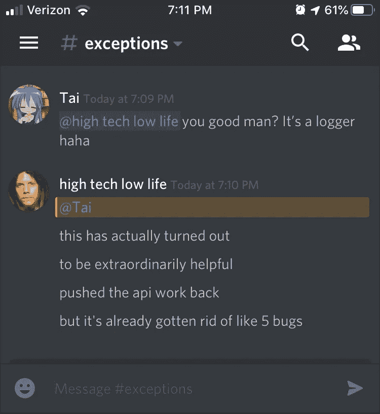
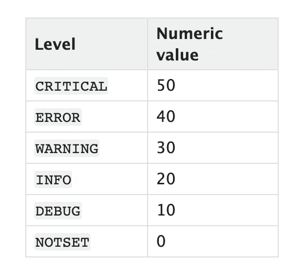

# 启动 Python 日志记录

> 原文：<https://betterprogramming.pub/power-up-your-python-logging-6dd3ed38f322>

## 使用 Python 的内置日志工具，从初学者到专业人员的指南



调试大型应用程序很糟糕。特别是当你有一个 bug 在生产中显示出来，但是在开发环境中却无法重现。使用 Python 的内置日志工具可以更容易地找到这些问题。

本指南旨在帮助新手理解 Python 的日志模块。天知道当我第一次开始的时候我很困惑。最终，我们将拥有一个能够将错误抛出到不和谐通道的工作日志记录器。

这个问题的代码可以在 [civicsoft/ieddit](https://github.com/civicsoft/ieddit/tree/master/app/utilities/log_utils) GitHub 资源库中找到。

# 日志记录的快速概述

在我们开始日志记录之前，有一点需要注意:下面的日志记录器和处理程序都使用我们所说的[级别](https://docs.python.org/3/library/logging.html#logging-levels)。这是如何处理事情的等级制度。

例如，当我们将一个处理程序设置为`DEBUG`级别时，它将接收调试语句和它上面的所有级别。这些级别用于根据数据的重要性过滤数据。



# 记录器

一个[日志记录器](https://docs.python.org/3/library/logging.html#logger-objects)仅仅是日志记录对象的一个命名实例。所有的记录器在你的程序中都是“全局”的。这是一个看起来像什么的例子。

我们在`app.py`中定义了一个名为`app`的记录器。

```
# ieddit/app.pyimport logging
logger = logging.getLogger("app")
```

现在，如果我们愿意，我们可以放入另一个文件，并访问我们之前创建的那个 logger 实例。

这是它看起来的样子:

```
# ieddit/utils.pyimport logging
logger = logging.getLogger("app")
```

现在`utils.py`可以访问同一个记录器实例了！这意味着我们可以在需要记录器之前声明我们想要的所有记录器，稍后我们将看到这一点。

这里要注意的是:最佳实践是使用`__name__`属性来命名记录器，如下所示:`logging.getLogger(__name__)`。这样，每个文件都有自己唯一的记录器名称。

Logger 的核心工作是将`[LogRecords](https://docs.python.org/3/library/logging.html#logrecord-objects)`发送给不同的处理程序。`LogRecords`记录他们被呼叫时发生的事情的细节。

```
logger.info("Emitting Info LogRecord")
logger.error("Emitting Error LogRecord")
```

上面是一个发出事件的例子。发出的事件附带一个级别。这让记录器知道`LogRecord`有多紧急。

上面代码的问题是，我们没有告诉记录器这些记录应该放在哪里。这就是处理程序介入的地方。

# 经理人

[处理程序](https://docs.python.org/3/library/logging.html#handler-objects)控制`LogRecords`的去向。处理程序是可以附加到记录器实例的独立对象。

```
logger = logging.getLogger(__name__)
fileHandle = logging.FileHandler('ieddit.log')
logger.addHandler(fileHandle)
```

上面的代码告诉记录器，任何时候一个`LogRecord`被创建，它应该被发送到文件`ieddit.log`。现在的问题是`ieddit.log`将被一吨原木塞满。

设置处理程序应该管理的级别有助于我们过滤日志。

```
logger = logging.getLogger(__name__)
fileHandle = logging.FileHandler('ieddit.log')
fileHandle.setLevel(logging.WARNING)
logger.addHandler(fileHandle)logger.info("This won't show in ieddit.log")
logger.error("This will show.")
```

以上是我们如何使用级别来过滤日志。使用本节开头的图表，我们可以看到`ERROR`高于`WARNING`，因此将对其进行处理。信息低于警告，因此处理程序将忽略该记录。

有几种类型的处理程序可以使用。完整列表见[处理程序文档](https://docs.python.org/3/library/logging.handlers.html#module-logging.handlers)。

`StreamHandler`将输出发送到控制台。文件处理程序将信息发送到输出文件。最动态的处理程序是`QueueHandler`和`QueueListener`，但更多的是在后面。

# 格式化程序

只有一个消息说:“有一个错误”是没有帮助的。这就是格式化程序的用武之地。当处理程序处理日志记录时，格式化程序依赖于处理程序。

他们可以添加附加信息，如地点、内容、原因、时间和方式。

```
logger = logging.getLogger("__main__")
consoleHandle = logging.StreamHandler()
consoleHandle.setLevel(logging.INFO)# Setup the formatter
formatter = logging.Formatter('*%(asctime)s* - *%(name)s* - *%(levelname)s* - *%(message)s*')
consoleHandle.setFormatter(formatter)logger.addHandler(consoleHandle)logger.info("Message")>>> 2019-10-25 00:01:42,283 - __main__ - INFO - Message
```

上面是创建的控制台中的输出。

格式化程序插入时间、记录器名称、记录级别和消息。注意这里我们手动输入`__main__`，但是如果你使用`__name__`，它将是这里的模块名称。

# 从上到下

这是我们目前所知道的关于伐木的情况。

首先，我们创建一个可以在任何地方通过名字访问的记录器。该记录器创建具有相关级别的日志记录。这些记录由一个或多个关联的处理程序处理。如果存在格式化程序，处理程序将相应地格式化输出。

# 队列处理程序和队列监听程序

现在真正有趣的事情开始了。任何时候你把`logger.info(“message”)`放入你的代码，你的程序必须等待它完成。

如果只是简单地输出到控制台，这不是什么大问题，对吗？

如果您将日志发送到数据库，等待记录创建可能需要一些时间。然后，每次创建日志记录时，您的程序都需要暂停。

这就是`QueueHandler`和`QueueListener`出现的地方。`QueueHandler`将消息放入独立线程的队列中。然后，`QueueListener`介入，将日志记录发送给所有其他处理程序。

这样，您的程序就不必停下来等待日志记录的创建。

在这里，我会把你指向[Rob black burn 的](https://github.com/rob-blackbourn)文章， [*如何用 dictConfig*](https://medium.com/@rob.blackbourn/how-to-use-python-logging-queuehandler-with-dictconfig-1e8b1284e27a) 使用 Python 日志 QueueHandler。为了节省篇幅，我将告诉您阅读他的文章，然后回到这里看看如何在我们的自定义记录器中使用它。

将他文章中的代码添加到一个名为`logging_util.py`的文件中。

```
# run.py
import logging_util
import logging
from queue import Queue# Initialize Logger
logger = logging.getLogger(__name__)
logger.setLevel(logging.WARNING)fileHandle = logging.FileHandler('ieddit.log')
queueHandle = logging_util.QueueListenerHandler(
                                     queue=Queue(-1), 
                                     handlers=[fileHandle])logger.warning("Ack!")
```

在上面的示例中，数据将像这样流动:

```
Warning Log Record Created
   |
   V
Log record added to QueueHandler on separate thread
 -> Main program is no longer blocked
   |
   V
QueueListener picks up the log and hands it to the other handlers for processing
   |
   V
Other handlers format the message and output appropriately
```

如果队列处理程序没有到位，程序将不得不等到结束才能继续。如果您在等待 HTTP 调用解析，这将耗费宝贵的时间。

# 自定义不一致处理程序

现在我们可以进入一些更有趣的东西。Ieddit.com 有一个不和谐的服务器。由于网站的设置方式，只有创建者可以访问网站发布的错误日志。

唯一合乎逻辑的补救办法是将错误输出到一个不协调的通道。这就是我们所做的。这需要一些设置。参见 [discord-webhook 的](https://pypi.org/project/discord-webhook/)文档进行配置。

上面的代码创建了一个扩展了`logging.Handler`类的类。当它被初始化时，它根据配置文件设置它的 webhook URL。然后，当一个记录被发出时，它被转发到 Discord。

# 使用文件初始化记录器

最后要做的是创建一个文件来初始化我们所有的记录器。在需要它们之前创建它们可以让我们避免重复代码。我们可以在一个地方创建和连接所有的记录器。

```
# Logger Config.yaml
version: 1
objects:
  queue:
    class: queue.Queue
    maxsize: 1000
formatters:
  simple:
    format: '%(asctime)s - %(levelname)s - %(name)s - %(message)s'handlers:
  discord:
    class: utilities.log_utils.logger_util.DiscordHandler
    level: ERROR
    formatter: simple
  queue_listener:
    class: utilities.log_utils.logger_util.QueueListenerHandler
    handlers:
      - cfg://handlers.console
      - cfg://handlers.file
      - cfg://handlers.discord
    queue: cfg://objects.queueloggers:
  __main__:
    level: WARNING
    handlers:
      - queue_listener
    propagate: false
  ieddit:
    level: WARNING
    handlers:
      - queue_listener
    propagate: false
```

下面是一个示例配置文件的样子。注意，对于类之类的东西，我们使用定义好的模块名。

接下来，我们可以使用一个`logger_init.py`文件来获取所有这些组件并生成日志程序。

```
# logger_init.py
import os
import config# Setup For Logging Init
import yaml
import logging
import utilities.log_utils.logger_util# Pull in Logging Config
with open('logger_config.yaml', 'r') as stream:
  try:
    logging_config = yaml.load(stream, Loader=yaml.SafeLoader)
  except yaml.YAMLError as exc:
    print("Error Loading Logger Config")
    pass# Load Logging configs
logging.config.dictConfig(logging_config)
```

用这段相当短的代码，我们可以初始化所有我们想要的记录器和处理程序。

然后，为了使用它们，我们只需要将`logger_init.py`导入到我们的顶层文件中。然后，在所有其他的函数中，我们导入`logging`并设置我们的记录器！

```
# run.py
import logging
import logger_init # Only call at the top file in import logginglogger = logging.getLogger("__main__")logger.warning("Woohoo I am Logging!")
```

要查看这段代码的运行情况，请查看 ieddit.com 的 [GitHub](https://github.com/civicsoft/ieddit/tree/master/app/utilities/log_utils) 页面，在这里可以使用所有的示例。

感谢您的阅读，请继续关注更多 Python 和编程内容。再次特别感谢 Rob Blackbourn 允许我在这篇文章中使用他的代码。