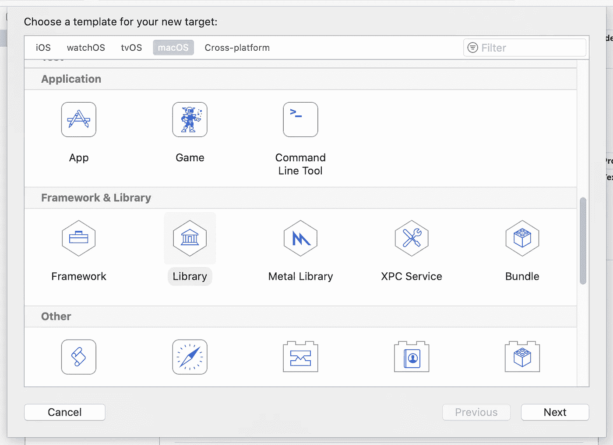
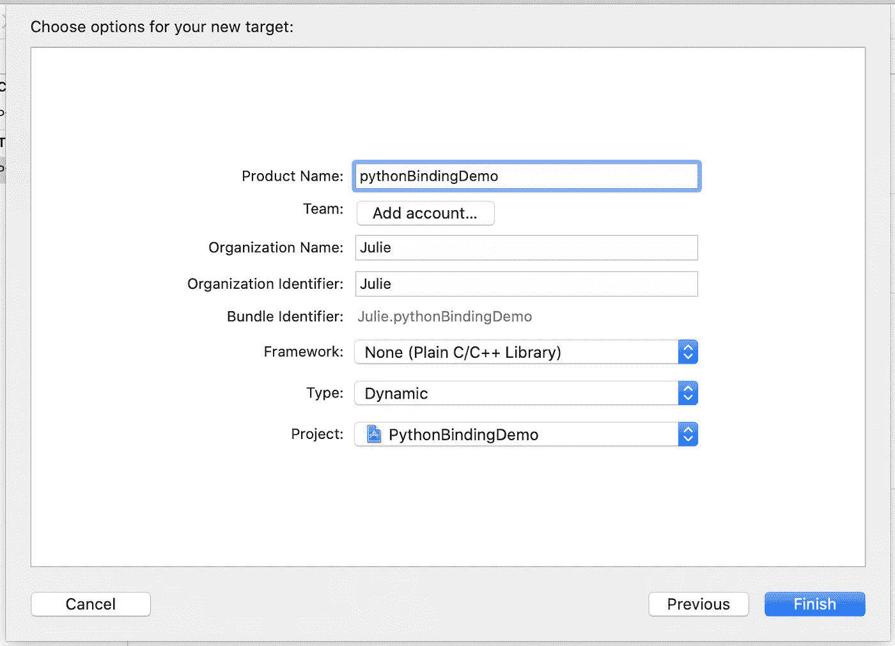
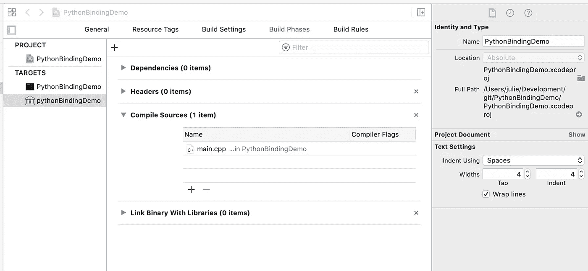
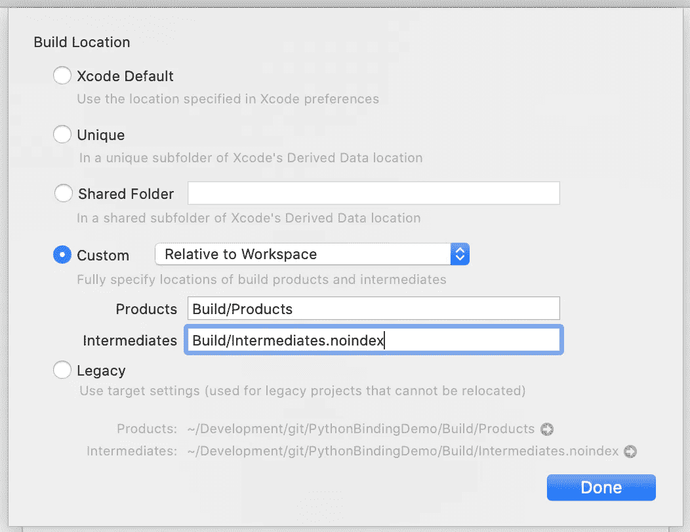
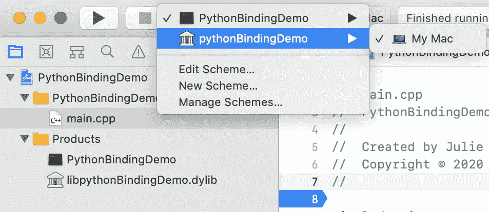
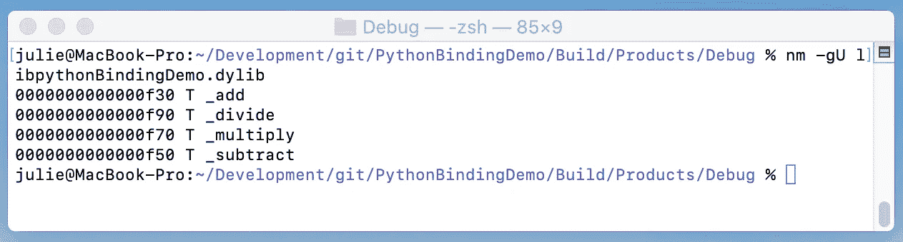

# 使用 Ctypes 用 C++增强 Python 的能力

> 原文：<https://betterprogramming.pub/power-your-python-with-c-using-ctypes-7095ffbbcec5>

## 使用 Xcode 和 ctypes 创建 Python 绑定的分步指南


在 [Unsplash](https://unsplash.com/photos/Y8lCoTRgHPE) 上由 [Jerry Zhang](https://unsplash.com/photos/Y8lCoTRgHPE) 拍摄的照片。

作为 Python 开发人员，您可能会遇到需要从 Python 代码访问 C++库的情况。在 Python 和 C++之间传递数据的一种有效方式是使用 Python [绑定](https://en.wikipedia.org/wiki/Language_binding#:~:text=Binding%20generally%20refers%20to%20a%20mapping%20of%20one%20thing%20to%20another.&text=For%20example%2C%20Python%20bindings%20are,access%20the%20Subversion%20software%20repository.)，，它们是连接两种编程语言的库。

可以用来创建 Python 绑定的许多工具和模块包括 [CFFI](https://cffi.readthedocs.io/en/latest/) 、 [PyBind11](https://pybind11.readthedocs.io/en/stable/) 、 [PyBindGen](https://pypi.org/project/PyBindGen/) 、 [SIP](https://pypi.org/project/sip/) 和 [Cython](https://cython.org/) 。在本文中，我们将使用标准 Python 库的一部分 [ctypes](https://docs.python.org/3.8/library/ctypes.html) 模块一步一步地运行一个示例，以加载由 macOS 上的 [Xcode](https://developer.apple.com/xcode/) 生成的动态链接库。

# 用例

在以下情况下，Python 开发人员可能需要调用 C++库:

*   C++库可以被多种应用程序和语言使用。为了确保该库在不同语言中保持可移植性，将核心库放在 C++中将减少对重复代码的需求并增加可移植性。
*   众所周知，C++比 Python 有相当大的性能提升。通过访问编译的 C++库，而不是依赖于解释的 Python 代码，用 Python 编写的应用程序可以利用更快的执行速度和多线程。
*   也许有一个现有的 C++库拥有你需要的所有特性和功能。创建绑定不是复制 Python 中的功能，而是减少上层系统中的重复代码，简化单元测试的数量，并降低发现 bug 的可能性。

# 从 Xcode C++项目生成 dylib 文件

在 macOS 上，动态链接库被称为`dylib`文件。这相当于 Windows 上的`DLL`和 Linux 上的共享库(或`.so`库)。第一步是创建一个包含我们的库的 C++项目，并构建生成一个`dylib`文件所需的目标规范。

*注意:下面的步骤和截图是从 Xcode 版本 11.7 生成的。*

## 设置 dylib 目标

1.  创建新的 Xcode 代码项目。项目类型应该是“命令行工具”
2.  添加一个额外的目标来生成`dylib`文件。

*   进入编辑器->添加目标并选择“库”



3.键入库名称。确保目标类型设置为“动态”



4.选择新创建的`dylib`目标和“构建阶段”选项卡。添加编译源和头文件:



5.验证导出设置，以确保`dylib`文件将在预期的目录中生成。

*   转到文件->项目设置。
*   如果项目设置中的构建路径没有指向预期的位置，请单击“高级”按钮更新构建位置。
*   要在项目文件夹中生成`dylib`，将“自定义”选项设置为“相对于工作空间”



## 编写绑定

当编写绑定时，我们需要确保所有函数都可以从`C`调用，因为 Python 是用`C`编写的。这是通过使用`extern “C"`关键字在代码周围放置一个 C 包装器来实现的。

cpp 文件

## 编制

将 Xcode 中的当前目标改为指向`dylib`目标并运行！



## 检查符号

一旦生成了`dylib`，检查以确保为绑定中包含的每个函数生成了符号。

```
nm -gU <dylib file>
```



# 从 Python 加载 dylib 文件

为了从 Python 加载动态链接库，我们将使用 [ctypes](https://docs.python.org/3.8/library/ctypes.html) 库，它是标准 Python 库的一部分。使用 ctypes 创建 Python 绑定包括加载动态链接库、使用 ctype 有效类型包装输入参数，以及指定函数的返回类型。默认情况下，函数将返回一个 int 类型。

# 结论

您现在已经创建了一个 Python 绑定！从 Python 调用 C++库允许开发人员构建一个充分利用 Python 和 C++优势的应用程序。结果是一个结合了速度和简单性的应用程序。

# 资源

*   [在 Xcode 中创建动态库](https://developer.apple.com/library/archive/documentation/DeveloperTools/Conceptual/DynamicLibraries/100-Articles/CreatingDynamicLibraries.html)
*   [Ctypes Python 模块](https://docs.python.org/3.8/library/ctypes.html)