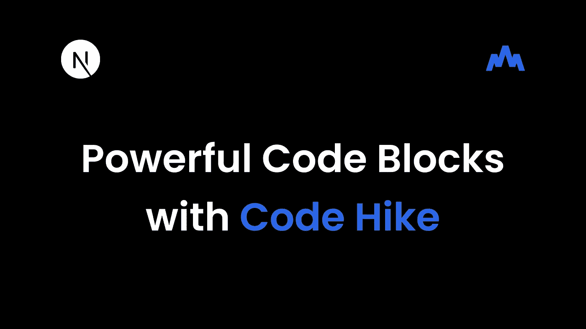
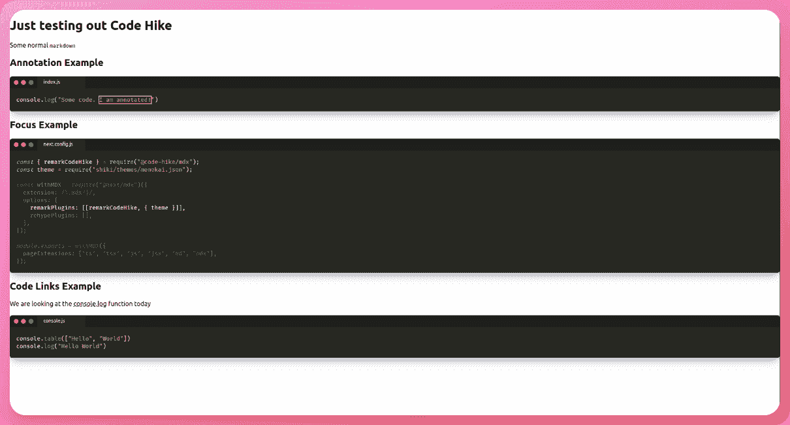

# 具有 Code Hike 和 MDX 的强大代码块

> 原文：<https://betterprogramming.pub/powerful-code-blocks-with-code-hike-and-mdx-4cd60049463f>

## 向 Next.js 应用程序添加代码 hike



[MDX](https://mdxjs.com/) 是一种将 markdown 中的标记与 JSX 代码结合起来，将组件嵌入 markdown 文档的格式。它被用于文档，博客文章，以及更多可以添加与 JSX 互动的例子。你可以在这里了解更多。

今天，我们将看看一个名为 [Code Hike](https://codehike.org/) 的库，它提供了 markdown 代码块的特殊特性。这些包括[聚焦代码](https://codehike.org/demo/code)，[添加文件名并将它们显示为标签](https://codehike.org/demo/filenames)，[注释](https://codehike.org/demo/meta-annotations)，[链接文本到代码](https://codehike.org/demo/sections)，以及更多！它还内置了对语法高亮显示的支持。

让我们看一下将代码 Hike 添加到 Next.js 应用程序中。请注意，虽然 MDX 得到了 Vue、Svelte 等许多框架的支持，但 Code Hike 只适用于 React。

[现场演示](https://code-hike-example.vercel.app/) < > [GitHub 资源库](https://github.com/AnishDe12020/code-hike-example)

# 在 Next.js 应用程序中设置代码标记

首先，让我们创建一个新的 Next.js 应用程序

```
npx create-next-app code-hike-example
# OR
yarn create next-app code-hike-example
```

现在，在您最喜欢的文本编辑器中打开项目。

# 设置 MDX

接下来，我们需要将 MDX 添加到 Next.js 应用程序中。为此，我们将遵循[官方指南将 MDX 添加到 Next.js 应用程序](https://nextjs.org/docs/advanced-features/using-mdx)。

请注意，Code Hike 也适用于 [Next MDX Remote](https://github.com/hashicorp/next-mdx-remote) 和 [MDX Bundler](https://github.com/kentcdodds/mdx-bundler) 然而，我们将看一个简单的例子，使用[官方 MDX plugin for Next.js](https://www.npmjs.com/package/@next/mdx) 。

首先，让我们安装所需的软件包-

```
npm install @next/mdx @mdx-js/loader
# OR
yarn add @next/mdx @mdx-js/loader
```

现在，打开`next.config.js`，用下面的代码替换它

我们只是告诉我们的捆绑器，当`.md`和`.mdx`文件在`pages`目录中时，也把它们当作页面。这也负责编译我们的 MDX。

现在，让我们设置代码远足

# 设置代码远足

首先，让我们安装[代码远足包](https://www.npmjs.com/package/@code-hike/mdx)

```
npm install @code-hike/mdx@next
# OR
yarn add @code-hike/mdx@next
```

现在，我们必须添加代码 Hike 作为一个[备注](https://remark.js.org/)插件。Remark 是一个简单的降价处理器，拥有一个庞大的插件生态系统。

Code Hike 使用 [Shiki](https://github.com/shikijs/shiki) 来提供语法高亮。我们可以在这里找到所有支持主题的列表。让我们和 Monokai 一起去做这个教程吧。

还有最后一件事要做。我们需要将代码远足 CSS 添加到我们的应用程序中。打开`_app.js`，将这一行代码添加到顶部

# 测试代码提升

让我们在`pages`目录下创建一个名为`code-hike.mdx`的新文件。在那里添加以下 mdx 标记-

在这里，我们首先编写一些基本的 markdown，然后添加 3 个代码块。在这 3 个例子中，我在指定语言之后提供了一个文件名(在这 3 个例子中是`js`)。

在第一个代码块中，我们在文件名后面传入了`box`属性。我们将它设置为`1[25:39]`，其中`1`表示行号，`25:39`表示该行上要注释的字符范围。

类似地，在第二个代码块中，我们传入`focus`属性并将其设置为`1:2,7`。这里`1:2`表示要聚焦的行的范围。我们还通过添加逗号分隔的值来添加第 7 行。

对于第三个代码块，我们必须将内容和代码块包装在`CH.Section`标签中。我们还必须将代码块包装在`CH.Code`标签中。这是为了当我们指定文件名时，Code Hike 知道我们将通过代码链接引用哪个文件。

我们将`console.log`作为指向`focus://console.js#2`的代码链接。这表明，每当我们将鼠标悬停在该代码链接上时，它将聚焦于`console.js`代码块中的第二行。

最后，这是它应该看起来像当我们导航到



是的，那些阴影很酷。

# 结论

这是代码远足的简要概述。Code Hike 支持更多的东西，比如[滚动编码](https://codehike.org/demo/scrollycoding)和预览。Code Hike 仍处于测试阶段，许多功能仍处于试验阶段。

希望到目前为止一切顺利，现在您可以在您的博客或文档中使用 Code Hike 来实现极其强大的代码块！

下一集见。

# 🔗重要链接

*   [代码远足](https://codehike.org/)
*   [代码 Hike GitHub 库](https://github.com/code-hike/codehike)
*   [本教程的 GitHub 库](https://github.com/AnishDe12020/code-hike-example)
*   [本教程的部署预览](https://code-hike-example.vercel.app/)

```
**Want to Connect?**Originally published at [https://blog.anishde.dev](https://blog.anishde.dev/powerful-code-blocks-with-code-hike-and-mdx).
```