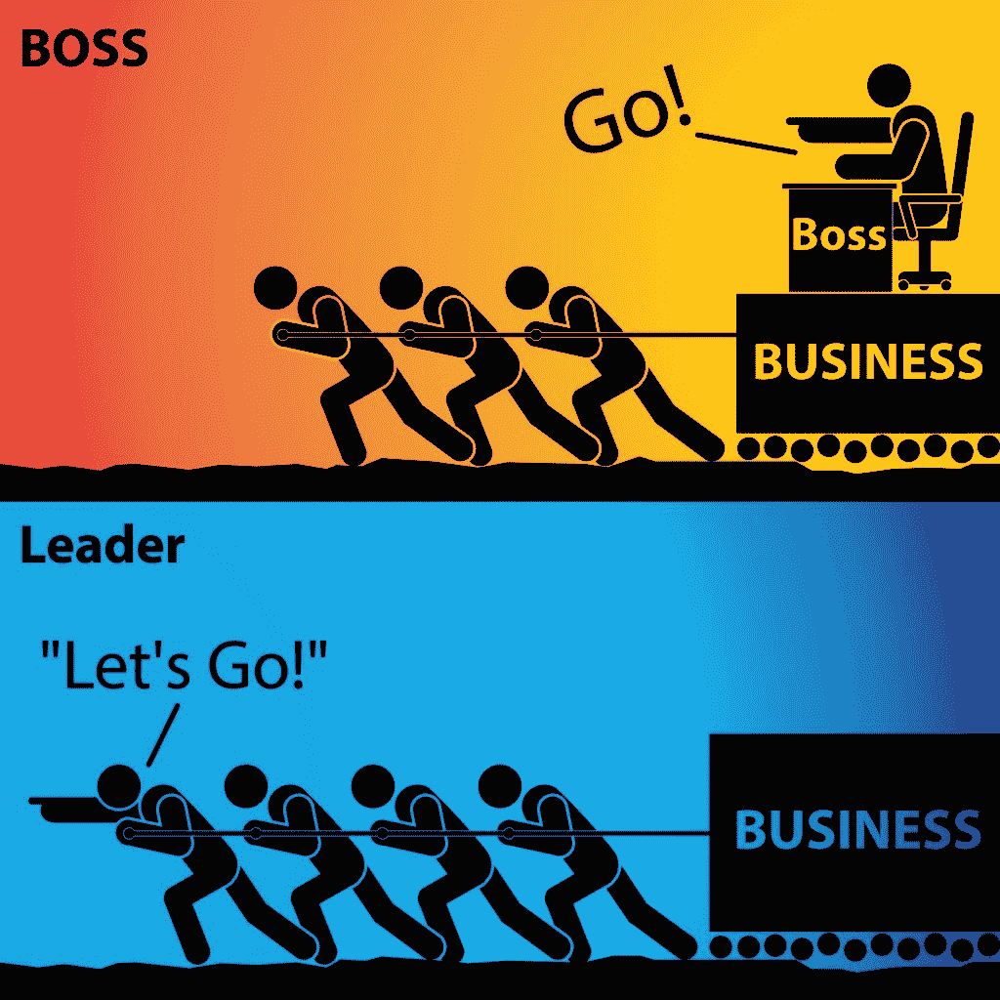

# 克服新工程经理面临的共同挑战的有力策略

> 原文：<https://betterprogramming.pub/powerful-strategies-for-overcoming-common-struggles-new-engineering-managers-face-5d9abb5f9ca>

## 在新的领导岗位上茁壮成长，而不仅仅是生存

妮可·沃尔夫在 [Unsplash](https://unsplash.com?utm_source=medium&utm_medium=referral) 上的照片

想象一下:你是一个超级开发人员！您编写了优雅的代码，您了解事情是如何在幕后组合在一起的，并且您是任何技术问题或关于组织代码库的问题的关键人物。正因为如此，你升职了。你得到了晋升，你的团队马上开始失控。

被提升为工程负责人，其实不是上台阶，也不是升职。这是一个横向的，独立的轨道。

 [## 你还没有准备好成为工程经理的 10 个迹象

### 真相可能会伤害你，但它会引导你走向正确的道路

medium.com](https://medium.com/better-programming/10-signs-that-you-are-not-ready-to-be-an-engineering-manager-yet-369b4f3fecd4) 

有句谚语说，让你在以前的职位上成功的东西不一定会在你的新职位上奏效，这句话再正确不过了。作为一个曾经是超级巨星开发者的工程领导者，你如何在新的角色中生存下来，然后茁壮成长？在这篇文章中，我将与您分享我过去从新工程经理那里观察到的一切，包括我自己的经验、他们面临的共同挑战以及克服这些挑战的有效策略。

因此，让我们从新的工程经理在他们作为工程领导者的最初几年面临的共同挑战开始。

# 斗争 1:他们喜欢编码。句号。

新的工程经理通常面临的第一个挑战是他们喜欢编码，他们在创造和构建东西时获得了极大的满足感。当这些伟大的工程师第一次成为技术领导者时，他们很快发现他们没有太多时间编写代码了，因为他们忙于参加会议、组织冲刺、与人交谈、执行管理任务等。

然后，当他们成为经理时，他们就没有时间编码了，因为他们忙于其他活动，如计划、预算、供应商管理、招聘、辅导、绩效管理等等。工程经理一天中没有几个小时的时间安静地坐在办公桌前，戴上耳机，写代码。

# 斗争 2:技术骄傲

新的工程经理面临的第二个挑战是他们的技术自豪感；他们有技术能力，因此，他们对自己的技术能力感到自豪。

然而，随着工程经理开始与来自工程以外学科的人打交道和工作，他们意识到企业中的其他人与他们自己非常不同。在这些情况下，技术技能和能力变得不那么重要了。

变得更重要的是能够以每个人，尤其是非技术观众理解的方式解释技术细节，并在会议结束时对所有学科达成共识。

# 斗争 3:害怕错过(FOMO)

第三个挑战是，新的工程经理已经亲眼目睹了技术是如何不断变化和发展的。

几乎每个月都会有新的框架、新的库、新的编程模式和/或新的工具问世。所以，很自然地，他们会有这种恐惧，如果他们不跟上，有一天他们的技术知识会过时。

当我第一次成为工程经理时，我也担心 10 年或 20 年后，人们会和我谈论一些尖端技术，而我根本不知道那是什么。我的恐惧成真了吗？不尽然——这要归功于策略 3，你会在本文后面找到它。

# 挣扎四:内向戒备！

内向的感觉

对于新的工程经理来说，最后的挣扎主要与他们的个性类型有关。这可能是一种概括，但我观察到这是真的:工程师和开发人员把他们的精力放在内部，倾向于私人化，他们通过花时间独处而充满活力。

然而，作为一名经理需要大量的人际交往。上图展示了内向的人在和许多来自不同部门的人开会时的感受。即使在担任领导职务十年后，我仍不时有同样的感觉。

我几乎可以听到你在想，哇，这些真的很难，一个新的工程经理如何生存，更不用说茁壮成长了？请允许我与你分享几个简单但有效的策略，帮助新的工程经理踏上早期管理之旅。我说它们有效是因为它们为我和我指导的几个工程经理工作过。

# 策略 1:首先寻求理解

马库斯·斯皮斯克在 [Unsplash](https://unsplash.com?utm_source=medium&utm_medium=referral) 上的照片

第一个策略是首先寻求理解……不是任何人，而是你自己。如果有什么是我真正相信的，那就是你必须首先改变自己，提高自己，以便更好地为他人服务。考虑到这一点，对于新的工程经理来说，重要的是忘记他们在个人贡献者时代学到的许多东西，并彻底改变他们的思维模式。

那么，你需要了解哪些事情——让我们来分解一下。首先是你的责任。找出你在新角色中期望达到的目标，我很确定这不是尽可能多地写代码。它可能通过技术交付业务成果，扩展团队的能力，以及扩展公司的技术能力。

接下来，你需要了解自己。我建议每位领导者研究不同的领导风格，发现你是哪种类型的领导者，你想为你的团队创造什么样的环境。你对自己了解得越多，你就会成为更好的领导者。

了解你的领导风格后，你需要找出你的弱点或发展领域，以便更好地工作，更重要的是，成为更好的领导者和个人。我在我周围信任的人的帮助下做到了这一点——通过 [360 度反馈](https://www.thebalance.com/sample-questions-for-360-employee-reviews-1917540)和人们交谈，询问他们的真实意见。举一个具体的例子，我发现的一个发展领域是，我经常过于投入技术，对技术过于热情，所以我无法从商业角度看待问题。

最后但并非最不重要的一点是，寻求理解你的原因、你的价值观和你的不可协商性。换句话说，你想因为什么而出名，你真正关心的事情是什么？对于我来说，我个人关心的几件事是诚信和成长。对于我的团队来说，我关心敏捷性、技术卓越性和创新。了解这些价值观会让你更容易做出选择，或者避免做出让你后悔的决定。

寻求了解自己实际上是一个持续的努力，这是值得你投入精力的事情，因为随着你变得更加有自知之明，你可以改善自己。

# 策略二:增强你的同理心

由[弗吉尼亚·拉金格](https://unsplash.com/@nowyouknowgini?utm_source=medium&utm_medium=referral)在 [Unsplash](https://unsplash.com?utm_source=medium&utm_medium=referral) 上拍摄的照片

第二个策略是增加你的同理心，理解他人的观点；要记住的第一条规则是人不等于代码。这听起来可能很有趣，但这是一个非常重要的规则，需要重申，尤其是对工程经理和技术领导者。

你不能指望人们总是合乎逻辑、通情达理，并根据你预先设定的假设行事。你不能围绕现实生活中的问题创建一个 if-then-else 语句并重复执行，期望每次都有相同的答案或反应。

 [## 在你作为工程经理的职业生涯中，你会遇到的 7 种人

### 以及作为他们的经理，你可以如何帮助他们

medium.com](https://medium.com/better-programming/the-7-types-of-people-youll-meet-in-your-career-as-an-engineering-manager-e2d333165944) 

技术人员之所以经常成为糟糕的领导者，原因之一是他们的思维逻辑化，有时过于逻辑化。我曾经和一位技术能力很强的经理一起工作，他非常擅长解决问题。

但是我不喜欢和他一起工作，因为我觉得他没有同理心，没有真正的关心，也没有对他的员工的欣赏。当我向他提到我不被欣赏或重视时，每次我见到他，他都会开始赞美我，让这一切变得不真诚。没有什么比有一个不优雅的领导更糟糕的了。

在我的领导之旅中，我学会了积极倾听、感同身受、慷慨付出时间，这有助于建立信任，营造一个让人们尽最大努力的环境。作为一名领导者，当你真诚地关心你的员工，照顾好他们——像对待人而不是机器一样对待他们——他们会更努力，通常会更有效、更合作、更有成效，因为他们更快乐。

作为工程师、开发人员和技术人员，我们习惯于解决问题和解决问题。然而，很多时候，作为一名领导者，你的工作不是解决问题，而是倾听、同情和授权。因此，这是我建议所有新的工程领导者在他们的领导旅程中尽早采取的心态变化。

# 策略 3:坚持学习

[瑞恩·华莱士](https://unsplash.com/@accrualbowtie?utm_source=medium&utm_medium=referral)在 [Unsplash](https://unsplash.com?utm_source=medium&utm_medium=referral) 上拍照

在工程领导力方面取得成功的下一个策略是持续学习。技术总是在变化，不断进步。成为技术领域的领导者意味着你是某个特定职能的领导者，你需要对这个职能有足够的了解。

例如:营销经理了解分销渠道和营销趋势，但不一定管理社交媒体渠道。财务经理知道如何阅读 P&L 和理解现金流，但不一定要做资产负债表。对于技术领导者来说，你至少需要了解公司的技术架构、技术堆栈和技术能力。

为了与技术保持联系，工程经理可以参加行业活动(聚会、会议、研讨会等)；阅读书籍、博客文章和出版物；并定期向主题专家学习。

我也鼓励工程经理尽可能多地通过你的人来学习。这有助于建立融洽的关系，并赋予他们权力，因为他们可以看到你对他们的工作感兴趣，并且你正在通过他们学习。这确实需要勇气和脆弱的开始。然而，一旦你接受你可能不知道所有的事情——如果你愿意学习，你总是可以扩展你的知识——这是一个非常强大的认识。换句话说，要有一个成长的心态。

# 策略 4:以身作则

[KOBU 机构](https://unsplash.com/@kobuagency?utm_source=medium&utm_medium=referral)在 [Unsplash](https://unsplash.com?utm_source=medium&utm_medium=referral) 上拍摄的照片

最后但同样重要的是，新的工程经理能做的最好的事情就是以身作则。

以身作则并不意味着要为你的开发人员亲自动手。支持和实践道德和负责任行为的领导者可能会激励其他人也这样做。

所以想想你希望你的团队成员做什么。你希望他们有责任心，有责任心，能解决问题吗？你希望他们在做某件事之前得到上层管理人员的许可吗？你希望他们带来问题还是解决方案？当你有了答案，想想你一直在做什么，并决定你是否以身作则。

至于我，我希望我的团队成员诚实透明；有强烈的职业道德；拥有自己的决定权；带来解决方案，而不是问题；永远学习。这就是我的工作。因为我真的相信领导力不是一个职位或头衔，而是一系列的行动和榜样。

# 我们到了吗？你如何找到快乐？

照片由[玛利亚·沙妮娜](https://unsplash.com/@mariashanina?utm_source=medium&utm_medium=referral)在 [Unsplash](https://unsplash.com?utm_source=medium&utm_medium=referral) 拍摄

现在，作为新的工程经理，你可能想知道，什么时候你才能最终在这个新的管理世界中找到乐趣——一个你不再亲力亲为的世界？我想分享当我不再编码或者当我不再有时间深入编码时，我是如何找到快乐的。

我们想做自己擅长的事情，这是人类的天性，因为这能给我们带来快乐和满足。我喜欢编码，因为我擅长编码。我相信新的工程经理也会有同感。

随着我在工程领导的工作中努力变得更好、更有效率，我能够在工作中找到快乐。我的价值观和优势，如好奇心、学习敏捷和追求卓越的愿望，对我很有帮助。我发现，当领导者不仅关心他们的团队给企业带来的价值，还关心他们的每一个团队成员时，最好的领导工作就会发生。然后，每个团队成员都关心所有参与者的成功——他们自己、他们的同事、他们的经理、他们的团队和他们的组织——因此，他们超越并实现了集体成功。

新的工程经理也应该接受你不需要了解每一项技术或者为每一个问题提供解决方案。作为一名领导者，你的工作就是授权给人们，给他们资源，让他们能够解决问题，自己想出解决方案。

如果你想知道，十年后的今天，作为一名工程师领导，对我来说，并不是每天都是阳光和玫瑰——即使我说我确实喜欢我的工作。几乎所有的工程经理都会同意以下情况是不愉快的:需要与表现不佳的团队成员打交道，项目没有按预期进行，高级管理人员要求完成某些事情或获取您不知道的某些信息，利益相关者会问这样的问题“这应该只是一个简单的改变，对吗？之前在别的网站/app 上看到过。明天会直播吗？我们不是很敏捷吗？为什么您的团队不能按时交付？”

无论如何，你很快就会意识到这些情况都是工作的一部分，你处理这些问题越多，下一次就能处理得越好。此外，随着时间的推移，你会更好地管理期望，并与利益相关者和高管沟通，这将有助于缓解一些情况。

 [## 工程领导者的一天

### 当你脱离日常编程时会是什么样子

medium.com](https://medium.com/better-programming/a-day-in-the-life-of-an-engineering-leader-532eba36b721) 

作为一名新的工程经理，你需要记住的是，每份工作都有好有坏，无论是开发人员、团队领导、经理还是高管，只要你保持开放的心态，有成长的心态，相信自己，你就会没事。

如果我回顾我的职业生涯，影响最大的领导者是那些让我能够独立思考并做正确事情的人，即使他们不在身边。他们关心我，他们相信我，他们为我提供成长的空间，他们不断挑战我，让我变得更好。这正是我想在我的员工中复制的。做好这件事的结果就是享受领导由非常聪明能干的人组成的高绩效团队的乐趣。

所以，让我给你们留下我最喜欢的一张照片——它完美地总结了我渴望成为的工程领导者的类型——以及 John Maxwell 关于领导力的这句话，他是一位知名的作家和关于领导力的演讲人。

> "一个领导者是一个知道道路，走道路，并指出道路的人."

在 [123RF](https://www.123rf.com/) 上由 [Taweesak Nunwongsa](https://www.123rf.com/profile_sakura28) 插图

📩[注册](https://eisabainyo.net/weblog/subscribe/)作者的时事通讯，定期获得你的科技职业建议和资源。您还将立即收到一个链接和密码，为您的职业发展下载免费赠品。