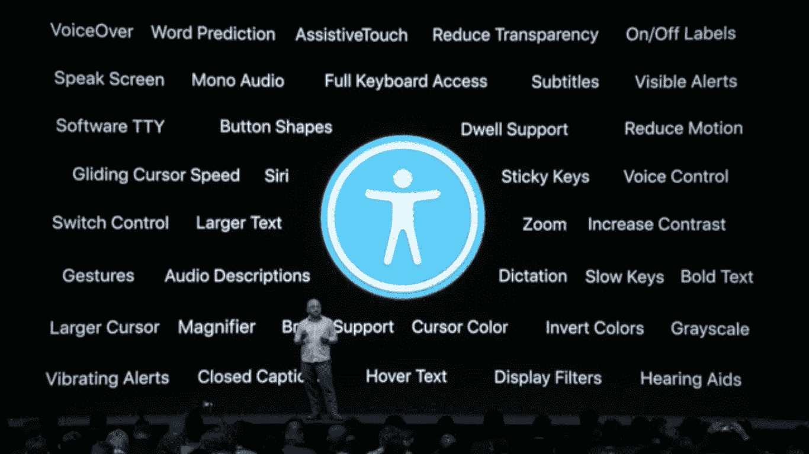
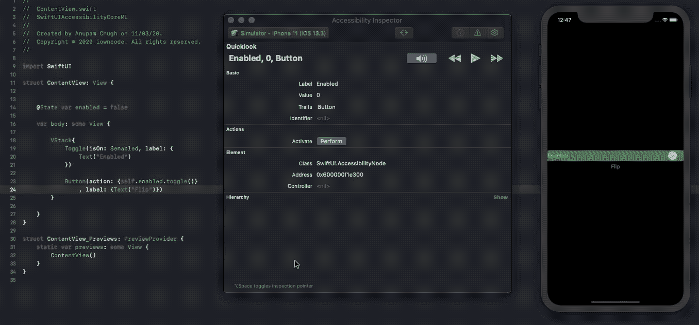
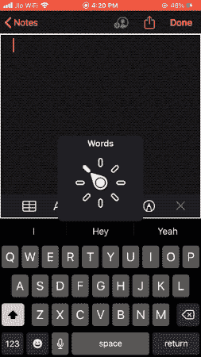

# 通过 SwiftUI 和机器学习在 iOS 上实现可访问性

> 原文：<https://betterprogramming.pub/powering-accessibility-on-ios-with-swiftui-and-machine-learning-292e2e71c40d>

## 手机上的机器学习

## 深入 SwiftUI 中可访问性的工作原理，看看苹果如何在其屏幕阅读器技术中利用机器学习


[保罗·格伦](https://unsplash.com/@pgreen1983?utm_source=medium&utm_medium=referral)在 [Unsplash](https://unsplash.com?utm_source=medium&utm_medium=referral) 上拍照

如今，数十亿人正在使用智能手机——这些设备真的无处不在。鉴于这种普遍性，有必要记住一些智能手机用户有视力不好、助听器或行动不便的问题。残疾不应该阻碍任何用户的智能手机体验。这就是可访问性的核心所在:构建每个人都可以访问的应用程序。

虽然许多开发人员由于时间和预算的限制而避免将可访问性集成到他们的应用程序中，但从长远来看，包括这些功能会扩大您的用户群。今天，许多政府支持的应用程序要求开发人员注入可访问性特性。

在过去的几年里，苹果也越来越多地投资于其可访问性和辅助技术，无论是通过他们革命性的 VoiceOver 系统(一种屏幕阅读器技术)还是语音控制(允许用户准确地告诉他们的手机该做什么)。

我们在这篇文章中的重点将是苹果的 VoiceOver 技术。我们将看到它如何帮助有视觉障碍的人大声听到屏幕上显示的内容。在我们在自己的应用程序中测试机器学习支持的 VoiceOver 之前，让我们来谈谈 SwiftUI，这是一个用于构建 UI 的新声明性框架，以及可访问性如何在其中工作。

# SwiftUI 和可访问性

在 WWDC 2019 期间发布的 SwiftUI 框架的推出带来了前所未有的兴奋。虽然相对易于使用的 API 让每个人都在谈论，但 bug 列表和许多组件回退到 UIKit 的需要向我们表明，SwiftUI 在未来几年有很多值得期待的地方。

[swift ui 做得绝对正确的事情之一是可访问性](https://developer.apple.com/videos/play/wwdc2019/238/)。Apple 的可访问性团队与 SwiftUI 密切合作，以确保声明性框架具有更好的功能来实现自动可访问性特性。

下图说明了 iOS 上当前可用的内置辅助功能:



在本文中，我们将重点讨论画外音。

辅助功能需要从 UI 获得辅助树，以便执行它们的操作。SwiftUI 自动从 UI 生成可访问的元素。此外，凭借其状态驱动的特性，SwiftUI 负责可访问性通知——自动通知可访问性功能(如 VoiceOver)关于 UI 中的变化。

记住这一点，让我们回到另一个重要的问题:什么是可访问性元素？

# 可访问性元素

为了理解可访问性元素，让我们看一下下面的代码片段:

```
struct ContentView: View {
    var body: some View {

        VStack{
            Text("Hello, World!")
            Button(action: {}, label: {Text("Play")})
        }
    }
}
```

`VStack`中的每个 UI 元素都被映射到一个可访问性元素。可访问性元素不是 UIView 或任何基础类类型。它本质上是一个对象，保存要传递给可访问性树和 API 的信息。

可访问性元素包含:

*   **标签:**一个描述 UI 的字符串。这是画外音首先朗读的内容。
*   特征/角色:这基本上是该元素的类型——文本、按钮等。对于某些 UI 元素，如按钮和开关，控件名称与标签一起阅读。
*   **动作:**向可访问性 API 指示当对 UI 元素执行手势时要做什么。
*   **Value** :某些 UI 元素，比如 Toggles 和 Pickers，保存元素的内容，它代表一个数值/布尔/文本表示。每当用户改变它时，它就会被读出。

为了在您的设备上测试 VoiceOver，您可以从您的*设置|辅助功能*页面启用它，或者直接让 Siri 来做！(iOS 13 撞了设置首页的可访问性！)

Xcode 附带了一个辅助功能检查器应用程序。这相当于一个画外音模拟器，在屏幕上高亮显示文本的同时读出文本。下面的屏幕截图演示了操作中的辅助功能检查器:



在这篇文章的结尾有一段视频，可以听到画外音。

虽然 SwiftUI 在默认情况下提供了可访问性，这在大多数情况下工作良好，但有时您可能需要根据应用程序的用户界面对其进行定制。令人高兴的是，我们有了可访问性 API，它通过为 SwiftUI 图像、排序元素等引入新的修饰符而得到了支持。让我们来看看几个可访问性修饰符。

# 可访问性修饰符

SwiftUI 提供了一组可访问性修饰符，可以应用于任何视图来修改默认标签/值/操作/顺序。

我们将从排序优先级可访问性修饰符开始。

## 排序优先级

通过使用此修饰符，我们可以更改 VoiceOver 导航元素的顺序。

默认情况下，VoiceOver 从左上角到右下角读取元素。有时，我们更喜欢控制导航的顺序，尤其是当在一个`ZStack`中将元素放在彼此之上时。使用`accessibility(sortPriority:)`，我们可以更改 VoiceOver 访问元素的顺序:

```
VStack {
   Text("This is read last")
      .accessibility(sortPriority: 0)
   Text("This is read first")
      .accessibility(sortPriority: 1)
}
.accessibilityElement(children: .contain)
```

在每个视图上设置`sortPriority`修改器，并为其分配一个数字，这样，在父视图中包含的兄弟视图中，最高的视图被首先读取。

## 标签和值

就像我们在前面的章节中已经看到的，标签描述了 UI 元素。默认情况下，大多数 SwiftUI 控件都需要标签。例如:

```
Image("filename", label: Text("This image has a cat"))
```

设置适当的标签很重要，尤其是在图像中。与 UIKit 的`UIImageView`不同，SwiftUI 图像在默认情况下是可访问的。这可以使 VoiceOver 仅在标签不存在的情况下读取文件名。

可以通过以下方式在 UI 控件上分配辅助功能标签修饰符:

```
RoundedRectangle(cornerRadius: 20.0)
.accessibility(label: Text("Rounded Rectangle "))
```

尽管值被绑定到 SwiftUI 的大多数 UI 控件，但有时您会希望使它们具有描述性，而不是简单地读出数字/文本表示。通过使用可访问性值修饰符，我们可以向该值添加更多的上下文，如下所示:

```
Slider(value: $value, in: 0…5)
    .accessibility(value: Text(“Rating is \(Int(sliderValue)) out of 10”))
```

如果没有`accessibility(value:)`修饰符，上面的 UI 控件只会读出数字，这会让用户感到困惑。

## 特征和群体

通过分配特征，我们为 VoiceOver 和其他辅助技术提供了更多关于 SwiftUI 元素的信息。例如，在一个`Text`元素上设置一个`isHeader`特征将会强制屏幕阅读器在文本标签中提到“header”。在按钮上设置一个`isSelected`特征会让画外音提示按钮被选中。

我们可以使用`accessibility(addTrait:)`和`(accessibility:removeTrait)`来添加和删除一些特征。

下面显示了一些可用的特征:


虽然特征帮助我们指出元素的角色，但是分组有助于减少树中可访问性元素的数量。以包含 100 个元素的 SwiftUI 列表为例。每行由一个文本和按钮组成，可访问性树中的元素数量是 200。通过使用下面的修饰符，我们可以对元素进行分组并降低树的复杂性。

```
VStack{

  Text("Random Row")
  Button(action: {}, label: {Text("Follow")})
}
.accessibilityElement(children: .combine)
```

## 隐藏可访问性

通过在视图上设置`**.accessibility**(hidden: **true**)`可以隐藏一个元素。由于 SwiftUI 图像是默认可访问的，有时当我们既有图像又有描述它的文本时，事情就变得多余了。或者，SwiftUI 图像有一个特殊的初始化器，它也跳过读取图像。它是:

```
Image(decorative: "filename wont be read")
```

## 构建可访问的应用程序

设计良好的可访问应用程序易于理解、可导航且易于使用。要知道您的应用程序是否真正可访问，以及 VoiceOver 技术是否以期望的方式运行，请尝试闭上眼睛进行测试。

启用 VoiceOver 时，标准触摸屏手势会被停用。相反，我们有一套新的手势，让用户不用看就能在手机上导航。以下是可用于在应用程序中执行 VoiceOver 操作的一些手势:

*   **向左或向右滑动** —这样做可以将用户带到上一个或下一个可访问的元素。
*   **点击**——点击一次读出该项目，而双击激活选择——如按下按钮。
*   **三指滚动** —在向上或向下方向上这样做可以将用户带到下一页或上一页。
*   **三指轻击并按住** —向用户指示屏幕上当前选择的可访问元素的位置。

有关 VoiceOver 手势的完整列表，[请参考此处的](https://support.apple.com/en-in/guide/iphone/iph3e2e2281/ios)。

现在，让我们进入本文的最后一部分，我们将看到苹果如何利用机器学习的力量让画外音变得更加智能。

# 基于机器学习的图像画外音

之前，我们看到 SwiftUI 中的图像可以用标签来描述。这对于静态图像来说很好，但是当我们处理远程图像时会发生什么呢？我们如何识别运行时下载的图像内容，并将其传递给辅助技术？

iOS 13 中的 VoiceOver 采用了内置的 Core ML 模型。该模型有助于对给定图像中的对象进行分类。从确定人脸的数量，到这个人的穿着，到背景和其他物体，这个分类模型提供了相当多的有用信息。此外，它能够确定图像是否包含文本，并足够智能地从您的照片应用程序中识别已知的面孔。

因此，人工智能驱动的 VoiceOver 可以提供高质量的图像内容描述。这只是进一步加强了苹果对他们的可访问性平台的重视，而且它只会越来越好。

让我们看一个由一系列图像组成的 SwiftUI 示例应用程序。我们将在 iOS 设备上启用 VoiceOver，听听它是如何描述应用程序的用户界面的。

画外音说了一句。小猫，2。一张戴眼镜的脸(我)，3。两个带衣服的成人 4。打印页面。

正如你所看到的，VoiceOver 的机器学习功能非常强大。它可以准确地描述图像，其中一个包含一个打印的文本图像。让我们看看苹果是否决定在 VoiceOver 的屏幕阅读器技术中包含图像的文本识别。

# 结束语

VoiceOver 还拥有一个转子，用于选择阅读器应该如何工作。如果所选元素属于输入类型，您可以更改语速、切换页面或启用盲文输入，只需在屏幕上进行双指手势旋转，如下所示:



接下来，既然我们已经对 SwiftUI 中的可访问性有了很好的了解，我们可以创建自己的文本识别核心 ML 模型，这可以进一步提升 VoiceOver 的性能。此外，我们可以使用语音识别来验证/调节 VoiceOver 读出的信息。

我希望这能启发你在 iOS 中构建基于机器学习的可访问性应用。

这一次到此为止。感谢阅读。