# JavaScript 中实用的异步迭代

> 原文：<https://betterprogramming.pub/practical-asynchronous-iteration-in-javascript-a-hackernews-stories-iterable-f3c7a70466d>

## 黑客新闻故事连载

照片由[内特·卡斯特纳](https://www.pexels.com/@nate-castner-345362?utm_content=attributionCopyText&utm_medium=referral&utm_source=pexels)从[佩克斯](https://www.pexels.com/photo/man-walking-in-the-snow-at-daytime-950740/?utm_content=attributionCopyText&utm_medium=referral&utm_source=pexels)拍摄。

随着 ES6 的引入，我们获得了对数据同步迭代的支持。当然，我们已经可以迭代 iterable 内置的结构，比如对象或数组，但是主要的引入是形式化一个可实现的接口来创建我们的 iterable**和生成器。**

**但是，如果我们的迭代是在从一个异步数据源获得的数据上完成的，比如一组远程 HTTP 调用或从一个文件中读取，那该怎么办呢？**

**在本文中，我们将对[“异步迭代”](https://tc39.es/proposal-async-iteration/)提案进行实际分析，该提案旨在添加:**

> **"使用 AsyncIterable 和 AsyncIterator 协议支持异步迭代。它引入了一个新的迭代语句， **for-await-of** ，并添加了创建异步生成器函数和方法的语法。**

**对于本指南，只需要 JavaScript(或一般编程)的基础知识。我们所有的例子都可以在 [this GitHub repository](https://github.com/josetapadas/async_iterators/blob/master/src/index.ts) 中找到，这些例子将带有一些简单的 TypeScript 注释。**

# **同步迭代器和生成器概述**

**在这一节中，我们将快速回顾一下 JavaScript 中的同步迭代器和生成器，这样我们可以更容易地将它们推广到异步情况。**

## **到底什么是迭代？**

**让我们通过自我意识到迭代时手头通常有什么来研究这个问题。例如，一方面，我们有数组，字符串等。**基本上是我们的出处。另一方面，我们有通常用来通过迭代消费数据的方法——即我们的`for`循环、扩展操作符等。****

****基于此，我们可以将迭代视为一个协议，当由我们的源实现时，它将允许消费者使用一组常规操作顺序地“消费”它的内容。该协议可以由以下接口表示:****

****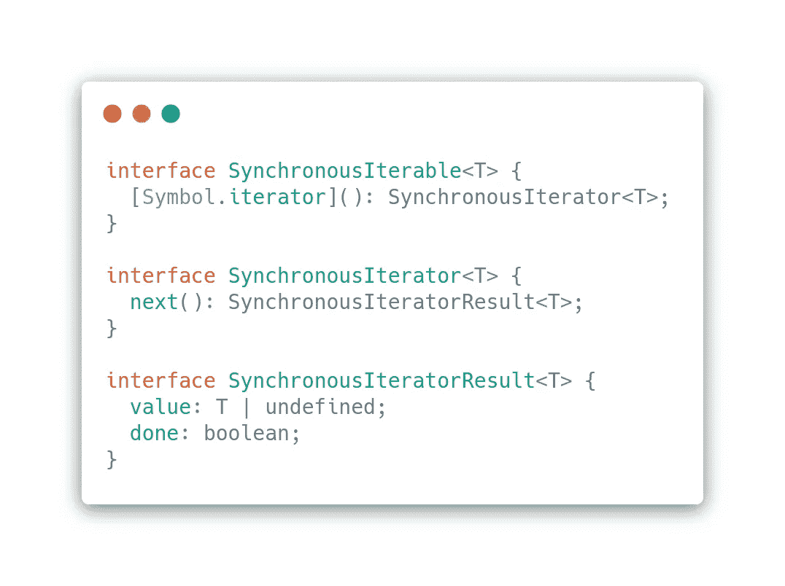****

****1.1 为每次迭代定义同步可迭代、迭代器和后续结果的接口。****

****因此，对于那些可能不熟悉 TS 接口描述的读者，我直截了当地说:****

*   ****一个`SynchronousIterable`通过一个将返回一个`SynchronousIterator`的`Symbol.iterator`提供一个方法。****
*   ****然后我们的`SynchronousIterator`将从`.next()`方法的实现中返回我们的`IteratorResults`。****
*   ****然后，`IteratorResults`将包含一个保存当前迭代值的值以及一个`done`标志，该标志在最后一项被迭代后被设置为`true`(迭代时为 false)。****

*****注:你可以通过阅读* [*ECMAScript 2021 语言规范文档*](https://tc39.es/ecma262/#sec-iteration) *了解更多关于这方面的内容。*****

****通过手动迭代数组，可以很容易地展示使用该接口的示例:****

****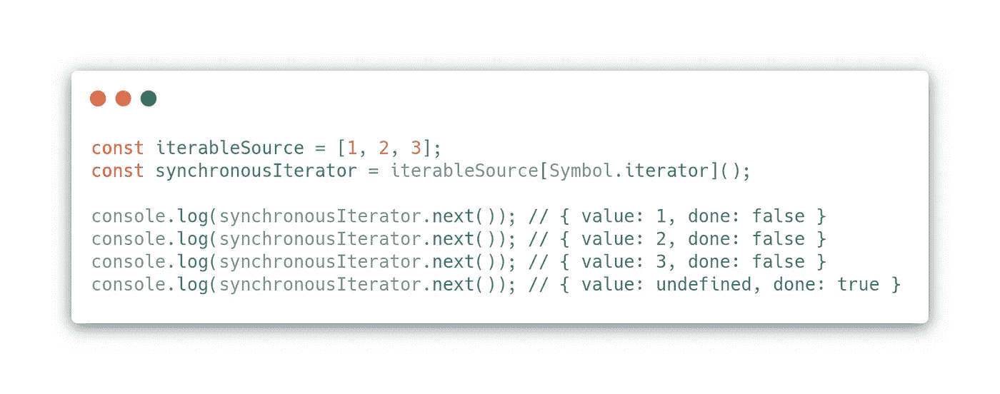****

****1.2 简单的手工迭代。请注意，当我们过度遍历对象时,“done”被设置为 true。****

****实现这个接口的源代码也可以通过`for..of`迭代指令进行迭代，您可能在某个时候使用过这个指令:****

****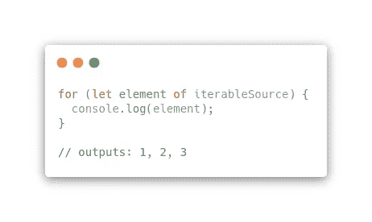****

****1.3 使用 for..迭代我们的源代码。****

****当然，我们希望像内置数组(如上所述)这样的源自然是可迭代的。为了以不同的方式展示它，我们将实现该接口，例如，生成一系列数字:****

****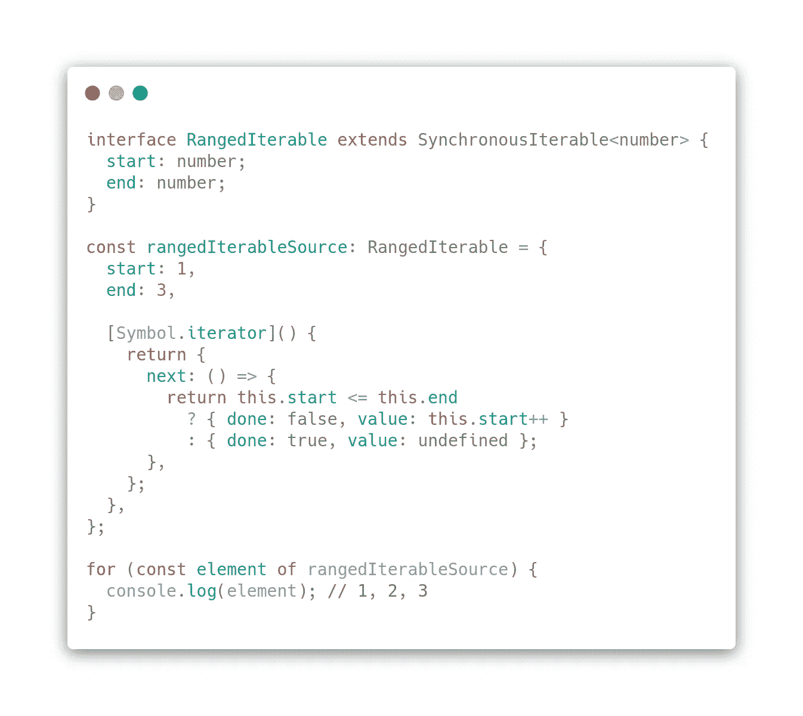****

****1.4 一个可迭代源的自定义实现，生成从“开始”到“结束”的数字范围****

## ****发电机呢？****

****通常，函数要么返回单个值，要么不返回任何值。我们可以把生成器看作是可以依次返回多个值的实体。这种价值观的持有，被归因于屈服的概念。****

****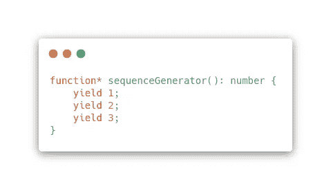****

****1.5 定义同时产生相同 1，2，3 序列的发生器函数。****

****这些生成器函数的行为不像常规函数，因为它们是延迟求值的。所以当被调用时，它们会返回一个生成器对象，负责管理它的执行。这些生成器也是可迭代的，这意味着它们也实现了我们的接口，所以我们实际上可以像上面一样对它们进行循环:****

****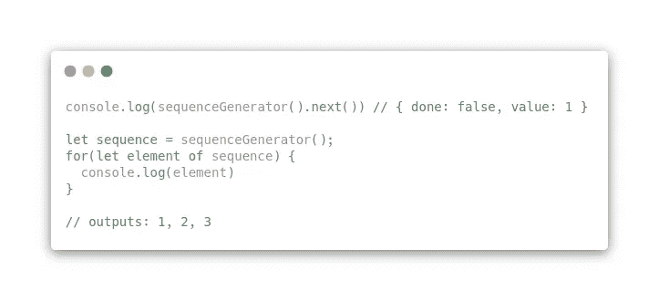****

****1.6.检查我们的生成器函数的值。没错生成器的主要方法也是。下一个()。****

****同样，指出`.next()`函数是获取这些生成器对象的下一个生成值的关键也是非常重要的。这将产生预期的输出。****

****因为我们现在可以产生值(而不是状态)，所以我们可以重新实现图 1.4 中的可迭代范围，但是现在使用一个生成器函数:****

****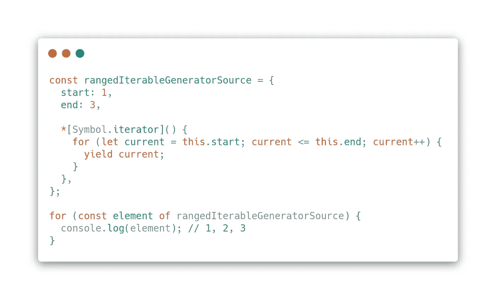****

****1.7 我们的范围可迭代源现在使用生成器函数实现。****

****正如我们所看到的，我们现在可以利用一个生成器函数来简化我们原来的范围可迭代的。****

# ****异步接口提议****

****掌握了 iterable 接口定义背后的思想(图 1.1)后，现在很容易扩展它，使我们迭代的每一步都返回异步操作的结果。这通常是通过承诺来实现的:****

****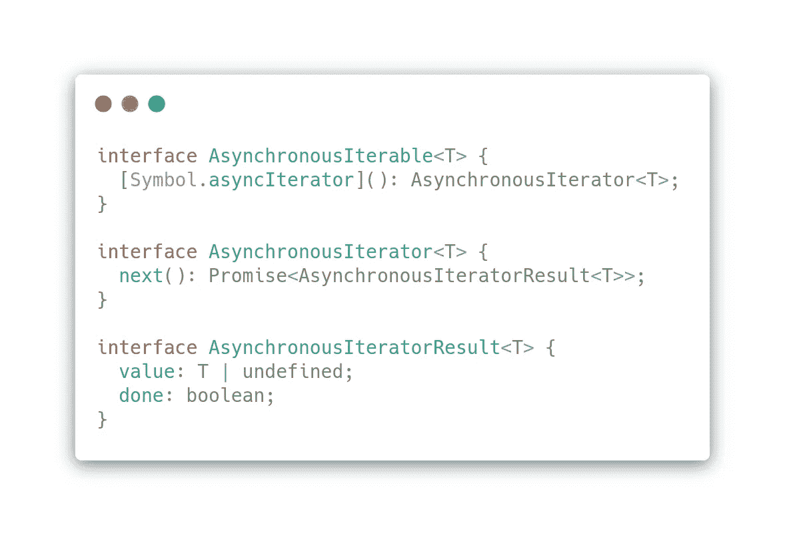****

****2.1.异步可迭代的接口。****

****从上面的定义中，我们可以很容易地识别出，当提供迭代的`.next()`元素时，异步操作确实是。因此，以一种将结果作为承诺来处理的方式来实现它是微不足道的。让我们以这种方式修改我们的范围迭代器(来自图 1.5)来弄清楚这一点，带有一个人为的延迟:****

****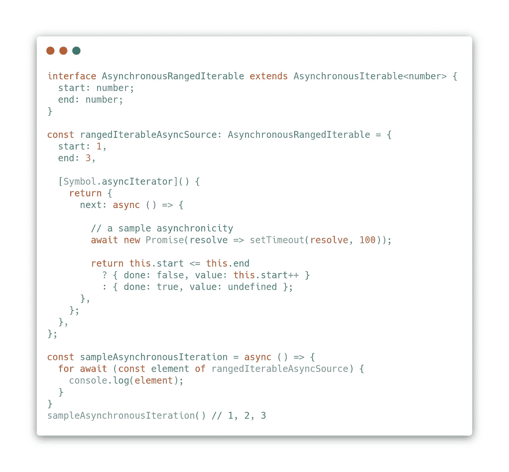****

****2.2 for…of 的异步范围迭代。****

****我们可以使用这个概念在(1.7)中抽象我们的生成器。使用异步发电机实现相同的范围是微不足道的:****

****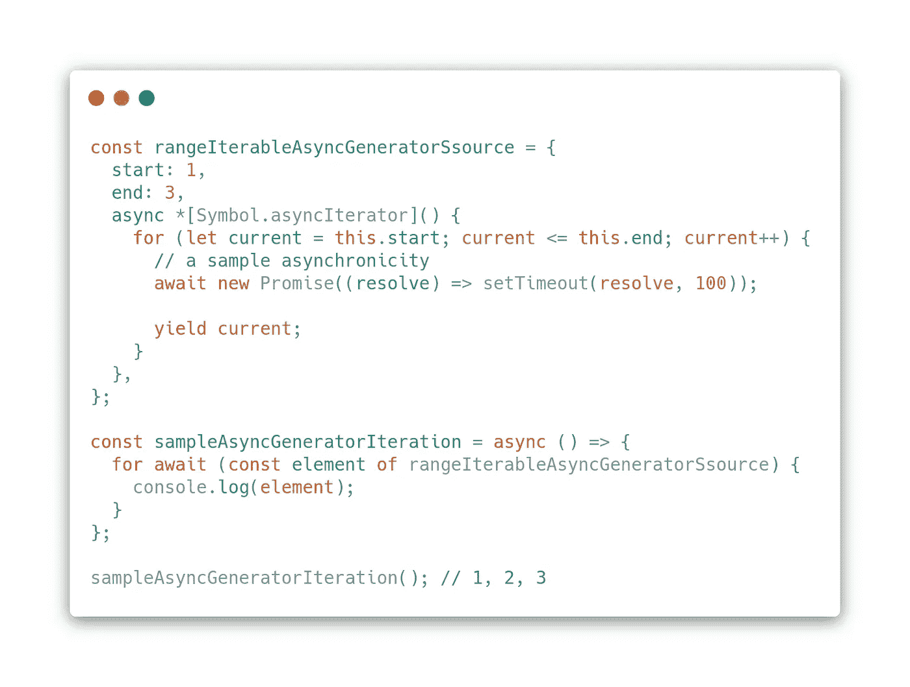****

****2.3 异步发电机的实现****

****不管我们如何生成数据，我们可以简单地迭代元素，就好像异步源是另一个可迭代的。实际上，只要它实现了我们的接口就可以了。****

****为了演示这一点，下一节将使用一个异步源(一个 Hacker News top stories 提要),我们将使用它来操作任何其他可迭代结构。****

# ******实战练习:一篇黑客新闻******

****基于异步生成器(2.3)的实现，现在为我们的帖子实现一个生成器源是很容易的。对于这个例子，我们将使用 [HN API](https://github.com/HackerNews/API) :****

****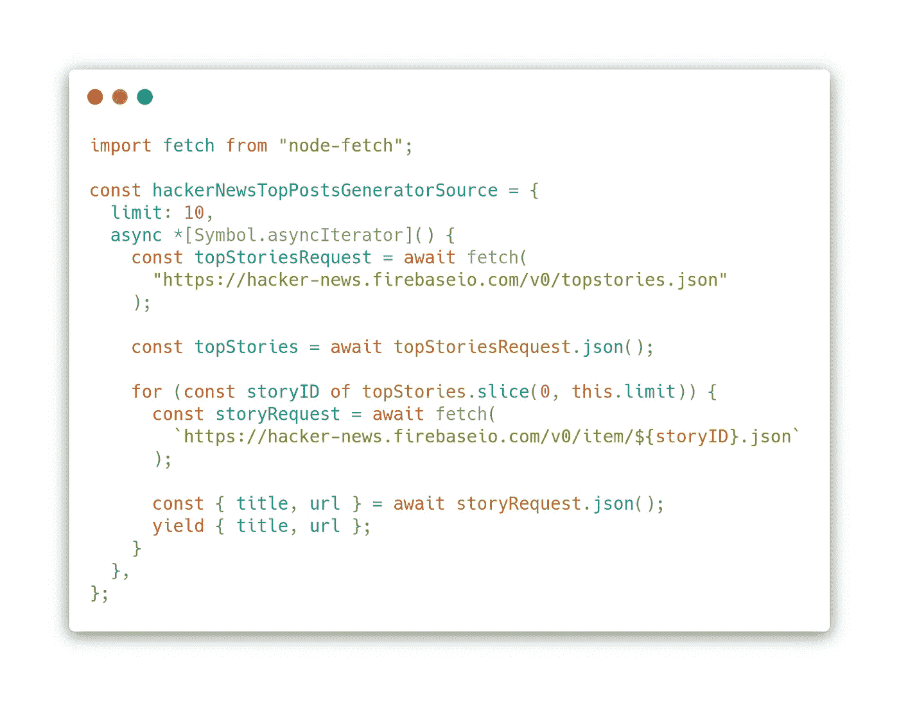****

****3.1 异步发电机，用于 HN 的顶级故事。****

****这段代码只是通过实现异步迭代器的常用接口来隐藏异步逻辑。对于这个例子，我们将条目限制为迭代，这是可选的。通过产生每个迭代值，我们可以使用下面的简单实现轻松地使用这个源:****

****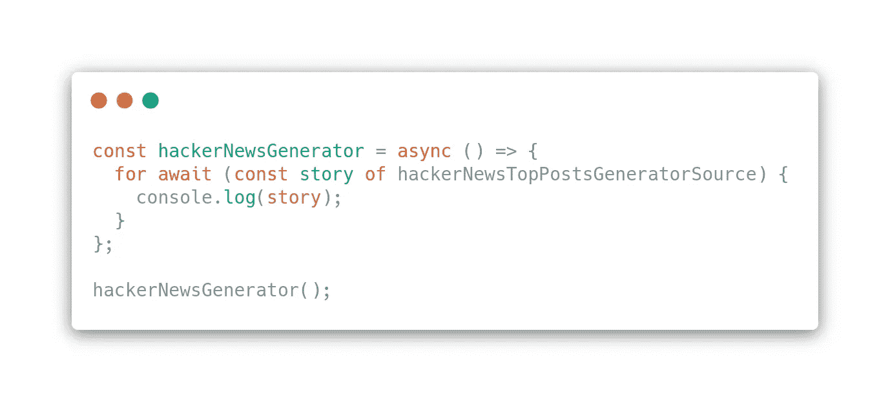****

****3.2 迭代我们的异步新闻源。****

****正如所料，这将为我们的源循环并呈现一个注释列表:****

****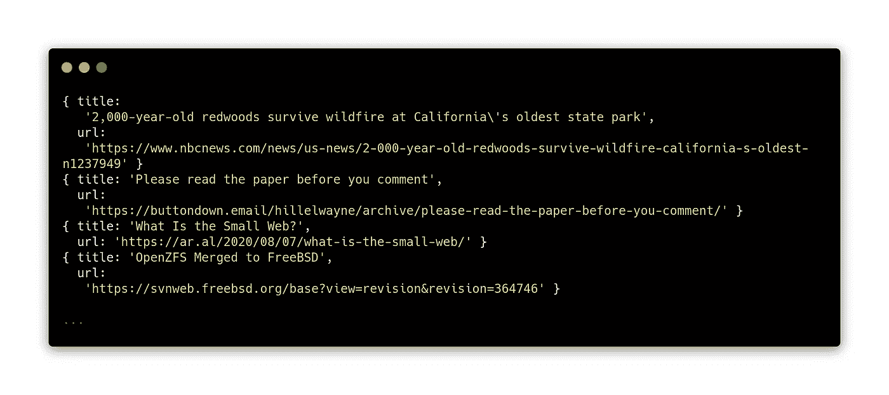****

****3.3 迭代结果来自我们的 HN 生成器。****

****我们现在可以查看我们的数据源，并将其作为一个简单的数据序列来处理，将完整的异步获取和操作逻辑保留在我们的生成器定义中。****

# ****摘要****

****希望这篇文章展示了通过应用语言规范中已经可用的简单语言形式来转换和观察我们的异步数据源以及可迭代对象是很容易的。****

****通过将同步情况推广到异步生成，我们现在可以迭代任何可迭代的数据源，不管数据源的性质如何——只要它实现了我们的接口。将我们的异步数据源视为可迭代的，这为我们开发更符合习惯、更有说服力的代码库的想法打开了一个创造性的潜力。****

****所有代码示例请参考本 [GitHub repo](https://github.com/josetapadas/async_iterators) 。****