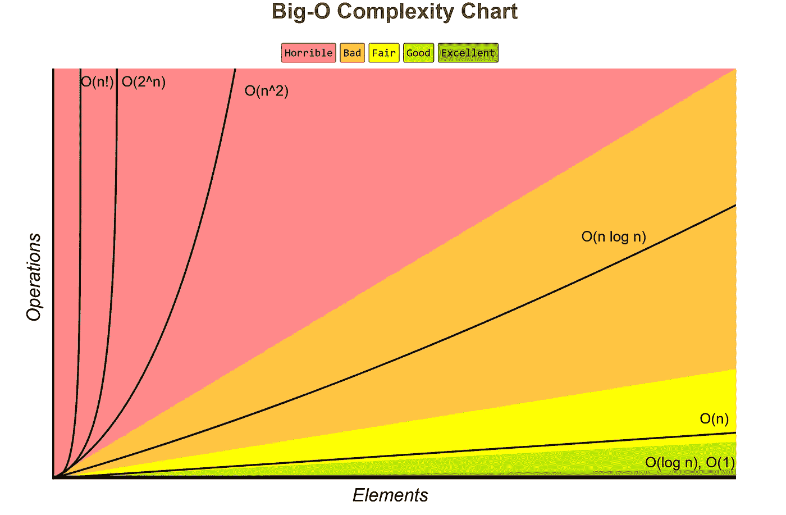

# 面向 JavaScript 开发人员的实用大 O 符号

> 原文：<https://betterprogramming.pub/practical-big-o-notation-for-javascript-developers-115f6368085d>

## 理解这一工具的实用方法

由[哈维·卡夫雷拉](https://unsplash.com/@xavi_cabrera?utm_source=unsplash&utm_medium=referral&utm_content=creditCopyText)在 [Unsplash](https://unsplash.com/s/photos/o-mouth?utm_source=unsplash&utm_medium=referral&utm_content=creditCopyText) 拍摄的原始照片，由作者编辑

大 O 符号是我们在接受某种形式的正规教育(即大学)时通常会学到的东西之一，否则我们日常生活的实际方面会超出它的范围，让它成为一个完全次要的术语，我们可以没有它——你们很多人都是这样！

话虽如此，我仍然相信在高层次上理解这个符号是有好处的。快速理解算法的性能含义不仅有用，而且非常实用。

所以让我们快速地看一下什么是大 O 符号，以及你应该注意什么。

# 什么是大 O 记数法？

大 O 符号只不过是一种描述算法复杂性和性能的数学方法。

我拒绝深入研究如何计算精确的表达式，因为老实说，你可能永远都不需要它。相反，你只需要它的缩略版本，这将让你知道一旦需要处理的值的数量增加，算法的复杂性会增长得多快。

让我这么说吧:大 O 符号是一种图形化表示算法复杂度增长速度的方法，同时它需要的数据点数量接近无穷大。或者这也是一种比较同一个域中两种算法的方法，具有较低 BigO 符号的算法通常更好，至少在性能方面。

我知道，这听起来并不容易，但让我告诉你我的意思:

图片取自 [**BigOCheatSheet**](https://www.bigocheatsheet.com/)

请看上图，Y 轴表示复杂度，而 X 轴表示算法要处理的元素数量(这里的“元素”可以是从变量数量到潜在的不同值，甚至是需要执行的指令数量，我们将看到一些例子)。

我不会在这里深入讨论每一个选项，因为同样，如果您直到现在还没有使用过 BigO，那么您已经可以通过理解 O(n！)、`O(nlogn)`、O `(n)`、`O(logn)`、`O(1)`的意思。其余的都介于两者之间，读完这篇文章后，你应该能够确定它们是否对你有益。

# O(n！)

让我们从最坏的情况开始，O(n！)案例，就是上面图表中的黑线。

有时你无法避免，但是如果可以的话，你应该试着远离这些类型的算法，因为它们是最糟糕的算法。

**注意:**如果你发现自己无法在不到 **n 的时间内用线性方法解决问题！**时间，然后考虑替代方案，如并行处理、分布式计算或其他可能产生更好结果的更复杂的解决方案。

但是除了个人注释之外，一些算法，比如寻找一个值列表的所有排列，或者甚至计算一个值的阶乘数，都有非常常见的 O(n！)解决方案。

还有，另一个很常见的要解决的问题，比如计算斐波那契数列。如果你递归地做这件事——除非你使用的编程语言有“尾部调用优化”(而 JS 没有)，你会遇到非常小的数字的问题——你会得到一个 O(n！)算法。

# O(nlogn)

我认为理解这个特殊的数量级很重要，因为许多常见的算法都属于这个数量级。

特别是合并排序、堆排序、快速排序等排序算法都会有这种性能。这意味着，如果您试图用它们对足够多的元素进行排序，执行时间将不会很好地伸缩。事实上，它们会继续快速上升。

许多开发人员声称 JavaScript 的`Array.sort`方法具有 O(nlogn)的大 O 复杂度，但实际上，这取决于运行时使用的实现。例如，Firefox 使用合并排序，所以作为一种常见的执行复杂度，O(nlogn)是正确的。然而，例如 V8 运行时(以及 Chrome、Node.js 甚至 Deno)，使用 [Timsort](https://v8.dev/blog/array-sort) 合并排序和插入排序的混合，最好的情况是 O(n ),如果你从上面回到图表，它会好得多。

# O(n)

图表上的绿线可以解读为:你的算法将不得不遍历每一个数据点来执行手头的任务。要处理的数据点越多，花费的时间就越多。

这些不一定是糟糕的算法，但如果 n 的值(即数据点的数量)打算增长得相当高，那么你必须考虑其影响，甚至可能进行某种优化。

经典的 O(n)算法需要遍历列表中的所有元素来执行一个操作，例如，想象一下必须计算数组中奇数值的数量:

如果我们处理数组中的 10 个元素，它会遍历所有的元素，但是会很快。但是，如果您的数组突然包含 1.000.000 个元素，这需要一段时间，因为它的复杂性也相应地增加了。

# o(登录)

蓝线(log2 n)告诉你，虽然复杂性会增加，但会增长得很慢，更好的是，增长率是有上限的。无论你增加多少数据点，它都不会超过某一点。这是一个非常好的算法，它可以扩展得相当高。

一个经典的`O(logn)`算法的例子是二分搜索法，它不断地将问题领域一分为二。

如果你不熟悉这个算法，这里有一个快速的运行，总是假设你在元素的排序列表中寻找一个值。

1.  您识别列表中间的元素。
2.  你比较你的目标值和中间值。如果匹配，你就完成了。否则，继续 3。
3.  如果目标值低于中间值，放下右侧列表，从左侧列表的步骤 1 开始重复。
4.  如果目标值高于中间值，放下左侧列表，从右侧的步骤 1 开始重复。
5.  重复该过程，直到找到目标或用完要比较的值。

这个算法的神奇之处在于，如果你增加列表中元素的数量，由于你不断地减少一半，你仍然可以很快完成。

例如，在最坏的情况下，如果您有 1.000.000 个元素，您将不得不比较这些值 20 次。没错，20 次(和 13.8 相当接近，是`logn(1000000)`的值)。

如果你考虑一下，你会从 1.000.000 到 20，从 O(n)到`O(logn)`有一个变化。

# O(1)

或者其他人所说的恒定时间。

这是一个理想的符号，它意味着你总是能够执行你正在寻找的动作，而不用关心你必须处理的元素的数量。

如果你能写出一个算法来实现恒定的时间，那么投入时间和精力绝对是值得的。

这方面的一个例子是使用一个对象文字与使用多个 IF 语句来决定如何处理您的逻辑。让我用一个例子来解释，想象有这样的代码:

最坏的情况是，代码检查每个 IF 语句，然后返回默认行为。当然，根据你决定`myValue`值的外部逻辑，你可以认为你的最佳情况要好得多，10 次中有 8 次`myValue`的值是 1。然而，我们做了最坏的打算，希望有最好的结果。由于我们有一个算法正在检查“n”乘以`myValue`的值，我们可以说现在它的大 O 符号是**O(n)**——请注意，对于非常小数量的“n”，但尽管如此，如果您经常调用此函数，它可能会影响性能。

我们能改进它吗？我会说是的，我们可以，让我们来看看:

现在你可能完全喜欢这个解决方案，也可能不完全喜欢，但是它不再检查每个值。实际上，它是在直接访问它应该调用的函数。由于我们正在为最坏的情况做准备，在我们的“最坏情况”中，首先检查索引在`logic`中的存在，然后调用`doTheDefaultThing`，这将是 O(2)的一个大 O 符号，同样，对于潜在的数百万个调用来说，它是一个常数，因此我们可以安全地忽略 2，并将其称为`O(1)` **。**

如果你从头回到图表，这将是粉红色的线。当然，并不是每个算法都是 O(1)。

大 O 符号无非是一个工具。它有助于我们在同一个空间内比较算法，并且一目了然地了解它们的性能如何，而不必阅读大量关于它们的文档或基准。

许多库甚至其他软件产品也会使用这种符号，Redis 就是一个典型的例子。Redis 的文档说明了它的所有命令的大 O 符号，这有助于您理解考虑到它们将要交互的记录的数量，您是否应该使用它们。

请记住，这也是一种“最坏情况”类型的测量，在适当的情况下，您仍然可以使用`O(n^2)`算法。

如果你不知道大 O 是什么意思，或者如果你有任何进一步的问题，请留下评论，我很乐意帮助你理解这个概念！