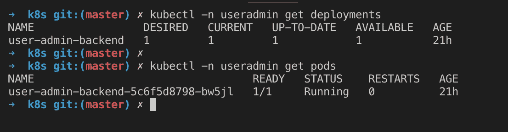
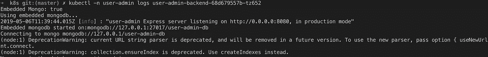
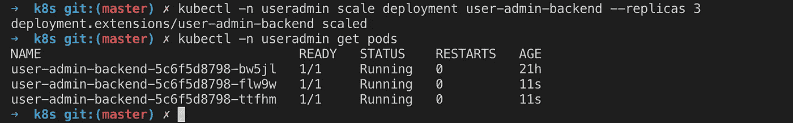
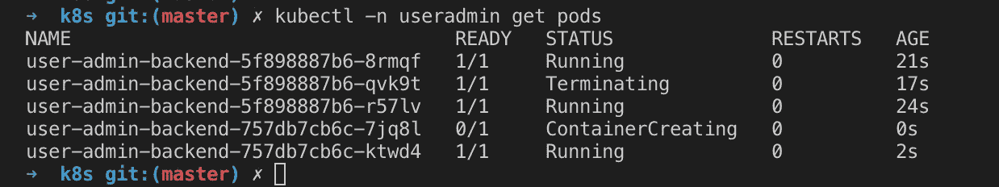
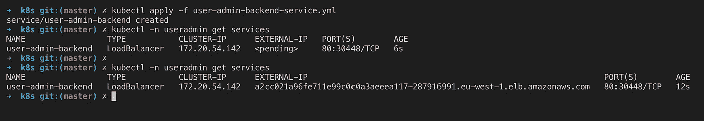
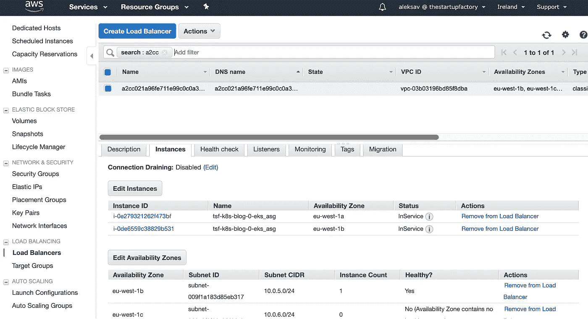
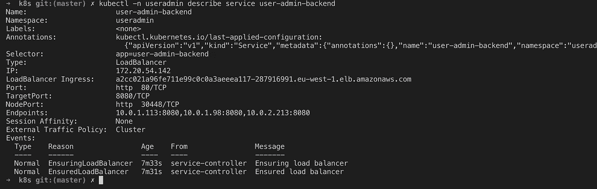
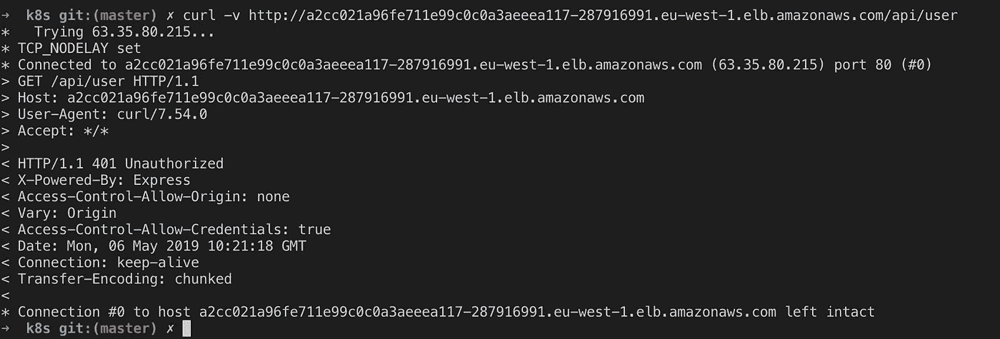
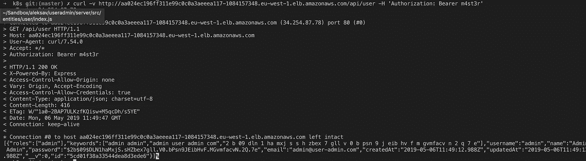

# 实用 Kubernetes:部署后端服务

> 原文：<https://betterprogramming.pub/practical-kubernetes-deploying-a-backend-service-dadc773975c>

## 实用 Kubernetes 系列的第二部分


照片由 [Unsplash](https://unsplash.com?utm_source=medium&utm_medium=referral) 上的 [Ihor Dvoretskyi](https://unsplash.com/@ihor_dvoretskyi?utm_source=medium&utm_medium=referral) 拍摄

在我们实用的 [Kubernetes](https://kubernetes.io/) 系列([在这里阅读](https://medium.com/tsftech/kubernetes-stories-starting-with-k8s-on-aws-2c9a409bd69e))的第一部分中，我们介绍了 Kubernetes 及其试图解决的问题。

我们还描述了一个“基础设施即代码”的设置，以在 [AWS EKS](https://aws.amazon.com/eks/) (亚马逊的托管 Kubernetes 服务)上使用 [Terraform](https://www.terraform.io/) 来提供一个工作集群。

# **先决条件**

*   运行 K8s 集群，kubectl 配置为与它通信(详见我们之前的[帖子](https://medium.com/tsftech/kubernetes-stories-starting-with-k8s-on-aws-2c9a409bd69e))

# 演示应用程序

为了演示部署和访问 Kubernetes 上运行的服务，我们将使用一个现成的 Docker 映像，其中内置了一个用户管理服务。

用户管理是一个简单的用户管理服务，构建在 MERN 堆栈之上，服务器公开 REST API 和 [React](https://reactjs.org/) 前端。

我们使用的图片已经发布到了 Docker Hub 上，但是如果你想研究代码，可以在这里找到:

[](https://github.com/aleksav/user-admin) [## aleksav/用户管理

### 使用 MERN 堆栈的简单用户 Amin 客户端-服务器应用程序

github.com](https://github.com/aleksav/user-admin) 

用户管理服务在运行时依赖于一个 [Mongo](https://www.mongodb.com/) 数据库。作为练习的一部分，我们还将在 Kubernetes 上部署和运行 MongoDB 集群。

# 将服务部署到 K8s

让我们首先创建一个**名称空间**资源。

在 Kubernetes 中，名称空间用于分隔 Kubernetes 中的虚拟集群。默认情况下，它们不提供完全隔离，但是当您想要隔离不同的环境或者在同一个物理集群中运行工作负载的团队时，它们是基本的

# 部署清单和运行 Pod

好了，我们有了后端应用程序的 Docker 映像，REST API 在 [Node.js](https://nodejs.org/) 和 [Express](https://expressjs.com/) 中实现。首先，我们需要用 Kubernetes 语言描述应用程序——这意味着用 [YAML](https://yaml.org/) 将部署清单放在一起。

K8s 部署是单个可部署单元的描述符——它包含关于部署的细节，例如应用程序的映像、实例数量、环境变量、卷等。

每当 Pod 状态改变时，Kubernetes 将咨询部署，以决定部署到其上的应用程序的期望状态，以及是否需要计划新的状态(例如，计划创建另一个 Pod，以防 Pod 崩溃将实例数量降低到部署中定义的数量之下)。

以下是我们的用户管理服务的部署清单:

以下是清单文件中的一些要点:

*   部署的目标是我们之前创建的`user-admin namespace`(第 4 行)。
*   我们将`replicas`的数量设置为 1(第 7 行)，因此 Kubernetes 将只为这个部署安排一个 Pod。
*   接下来，我们指定创建的 pod 将拥有的`labels`(第 8–11 行)。标签是在 Kubernetes 中标记对象的简单而强大的方法。在这里，我们说该清单的所有 pod 都标记有`app:user-admin-backend`标签。当我们在本文后面讨论服务时，我们会看到这有多有用。
*   我们指定了`image`的名字。该图像将从公共 Docker Hub 中提取，在运行该示例之前，我们将它上传到这里(第 15 行)。
*   我们将`image pull policy`设置为`Always`，以便 K8s 在每次启动 Pod 时尝试下载图像(第 16 行)。如果在部署期间，您使用相同的版本对映像进行多次推送，这将非常有用。如果图像拉策略没有设置为`Always`，图像将被缓存，Kubernetes 不会尝试下载它，除非版本改变。
*   服务监听的`port`是公开的(第 18 行)。
*   最后，我们设置配置服务所需的环境变量(第 19–25 行)。我们现在不必关注这些，我们稍后将回到这些。但是请注意，我们现在在容器中运行嵌入式 MongoDB(这种方法有问题吗？)，并且我们有一些秘密密钥直接暴露在清单文件中(这是好的做法吗？)

一旦我们将清单保存在一个文件中，我们就可以通过应用它来告诉 Kubernetes:

```
kubectl apply -f user-admin-backend-service.yml
```

现在，您可以在命名空间中列出 Pod，并查看 Pod 的运行情况:



Pod 是该服务的一个实例——它不是短暂的，可能会在任何时候崩溃、停止或重启，而不会提前通知。这就是为什么 Pod 的名称在部署名称后有一个随机的后缀——如果您重新部署服务，您会注意到这个后缀会发生变化。

注意，因为我们在部署清单中指定了一个名称空间，所以我们总是必须引用该名称空间来获取关于 Pod 的信息(否则您将得不到任何数据——试试看！).

我们的 Pod 处于运行模式，这意味着 K8s 成功下载了映像并启动了容器。

如果出现问题(找不到图像，或者容器注册需要认证，或者容器由于代码中的错误而无法启动)，您将会看到显示的不同状态。

请注意，Kubernetes 将继续重新启动 Pod，以防它在启动时崩溃(以匹配清单中配置的所需副本数量)。

在运行状态下，您可以检查 Pod 的日志以确保它按预期启动:



要查看 Pod 的完整状态历史，您可以运行 kubectl `describe pod`命令，这在排除 Pod 未按预期启动的故障时非常有用。

# 放大和缩小

要扩展 Pod，您可以简单地更新清单中副本的数量并重新应用更改，或者运行`scale`命令:

```
kubectl -n user-admin scale deployment user-admin-backend \
--replicas 3
```

如果您再次列出 pod，您会看到现在有三个，每个都运行相同的服务映像:



您可以根据需要尝试扩大和缩小服务。请注意，作为单独实例的每个 Pod 都有不同的名称(不同的随机后缀)。

扩展到零个副本有效地移除了服务:

```
kubectl -n user-admin scale deployment user-admin-backend \
--replicas 0
```

# 处理敏感配置

我们之前制作的部署清单充分描述了我们的服务——我们可以在任何集群上运行它，以完全相同的方式部署完全相同的容器。

预计我们会将清单推送到我们的代码库( [GitHub](https://github.com/) 或类似的)，在那里我们可以跟踪代码的更改，在更广泛的开发/开发运维/SRE 团队和个人之间共享代码和配置，或者在 CI/CD 管道中使用它。

像这样的一系列清单充分描述了我们应用程序的理想状态。我们希望部署什么以及如何拥有一个工作系统的单一事实来源，当编写脚本时，意味着我们可以快速启动我们的环境，运行所有需要的服务。

您已经注意到我们的服务需要三个环境变量作为配置:

1.  Mongo 网址，
2.  主密钥(用于以管理员身份调用 REST API)。
3.  [JWT](https://jwt.io/introduction/) 秘密(用于签署 JWT 令牌，这些令牌用于 REST API 端点的认证和授权)。

这些配置中的每一个都是非常敏感的信息，并且以不同于代码其余部分的方式进行管理。这不是我们通常会推到共享代码库中的东西。但是在这里，它们是明文的(sight ),任何有权访问代码的人都可以看到。我们如何能以更好的方式处理这个问题？

这就是 Kubernetes [秘密](https://kubernetes.io/docs/concepts/configuration/secret/)出现的地方。机密是由 Kubernetes 管理的对象，用于存储敏感数据(如密码)，在集群中用于服务配置。

可以使用秘密清单文件(然后与其余的服务清单分开管理)来创建秘密，或者通过 kubectl `create secret`命令来创建秘密，该命令可以根据组织的策略编写脚本。

让我们以创建主密钥的秘密为例:

```
kubectl create secret -n user-admin generic master \
--from-literal=key=”m4st3r”
```

该命令将创建一个名为`master`的通用密码。它有一个属性键，设置为我们的主键`m4st3r`的值。

注意，我们在运行 Pod 的同一个名称空间 user admin 中创建密码，否则 Pod 将无法访问它。

我们现在可以在部署清单中引用这个秘密(第 23–26 行):

一旦我们重新应用了部署清单，它应该会正常启动(注意，如果我们之前没有创建这个秘密，那么 Pod 会显示一个错误，说明这个秘密不存在)。

如果您在应用更新的清单后列出了 pod，您应该会看到 K8s 终止旧的 pod 并启动新的 pod。请记住，我们说过 pod 是可消耗的，将根据需要停止和重启，而不是就地更新。



现在，您可以更改其他环境变量来使用 Secrets。

我们将服务部署为 K8s Pods，但是我们现在如何访问它呢？

# 向外界公开服务

我们已经看到了如何通过指定部署清单在 pod 中部署容器。应用部署将告诉 Kubernetes 使用清单中描述的容器映像和配置来调度和启动 Pod。

我们还说过 K8s Pods 是不可变的——我们不能对正在运行的 Pod 进行更改，并且每次启动 Pod 时，它都会被赋予一个新的唯一名称和 IP 地址。

这就是 Kubernetes 服务的用武之地。

服务充当一个或多个 Pods 的逻辑标识符，允许我们使用一致的 IP 地址或主机名为每个 K8s 服务进行寻址。

这意味着我们可以添加和删除 Pod，启动新的 Pod 或重启已经崩溃的 Pod——服务保持不变，对于任何访问它的人来说，Pod 后端的更改将被完全抽象出来。

除了 pod 的可寻址性之外，服务还能让我们轻松实现负载平衡。如果服务引用多个单元，则单元的流量将由服务进行负载平衡(默认使用的负载平衡策略是循环法，但这可以配置)。

Kubernetes 中的服务只是另一种类型的对象，并在服务清单中定义——一个 YAML 文件，其结构类似于我们已经看到的部署清单。

为了定义服务，我们需要定义选择器，它定义了:

*   哪些 pod 被组合在一起以形成服务。
*   服务映射到的 Pod 端口(属于服务的所有 Pod 都需要公开指定的端口)。
*   将向服务使用者公布的映射端口。

有几种不同类型的服务，这取决于它们是应该在集群外部公开访问，还是应该在内部公开访问。

以下是我们的用户管理微服务的服务清单示例:

让我们看看我们在这里做了什么:

*   这是一个 K8s 服务清单，在`kind`字段(第 2 行)中指定。
*   我们将在放置部署和其他用户管理资源的同一个`namespace`中创建服务(第 4 行)。与我们之前讨论的名称空间类似，服务需要与它选择的 pod 在同一个名称空间中——如果我们没有在这里指定名称空间，就不会选择 pod，服务也不会起作用。
*   我们使用的服务`type`是`LoadBalancer` —这种服务类型为服务创建一个外部负载平衡器，可以从集群外部访问。我们还可以使用其他类型的服务，比如 ClusterIP(只能从集群内部访问)或 NodePort(可以在集群外部的工作节点上的特定端口上访问)。
*   接下来，我们指定服务要公开的端口(第 8–11 行)。`port`属性指定服务将公开的端口，而`targetPort`指定将流量路由到的 Pod 端口。最佳实践是命名公开的端口，这样我们可以在其他地方通过名称引用它们。我们将在未来的 Kubernetes 商店中看到这样的例子，但是现在让我们把它作为可读性的最佳实践。)
*   最后，但同样重要的是，我们指定了`selector`(第 13 行)。这就是我们如何告诉服务它应该将哪些 pod 逻辑地分组在一起，并对运行在所选 pod 内的容器的流量进行负载平衡。如果您还记得，当我们制作部署清单时，我们用`app:user-admin-backend`标签标记了用户管理面板。在这里，我们将相同的标记指定为选择器，这样所有用它标记的 pod 都被选择为所创建服务的后端

我们现在可以通过应用以下清单来创建服务:

```
kubectl apply -f user-admin-backend-service.yml
```

支持这篇文章的代码已经创建了这个清单，所以您可以应用它，并看到服务被创建。



正如您所看到的，我们第一次查询服务(`kubectl -n user-admin get services`，我们将看到服务名称、类型和公开的端口。

外部 IP 仍处于待定状态，这是因为在云提供商(本例中为 AWS)上为外部负载平衡器提供公共 IP 需要时间。如果您几秒钟后尝试，您将看到带有标准 AWS 动态主机名的外部 IP。

`LoadBalancer`服务嵌入到云提供商的基础设施中，根据云提供商的规范提供负载平衡器。

在 AWS 的情况下，每个`LoadBalancer`服务将提供一个 ELB(弹性负载平衡器 Classic)，您可以在 AWS 控制台中看到:



请注意，新生成的公共域名的 DNS 可能需要更长时间才能被发现。如果您看到“无法解析:未知主机错误”，请首先检查您键入的域名是否正确，如果正确，请等待几分钟，让 DNS 更改完全传播。

您可以使用 kubectl 命令来描述服务，以确认它已经发现了作为端点的所有三个 pod(参见端点部分):



现在，我们终于可以访问我们的服务了！为了进行演示，我们将使用 Kubernetes 提供的服务域名`curl`，并调用`GET /api/user`端点:



我们得到了一个“401 未授权”响应，但是查看标签，我们可以看到我们确实到达了 Express 端点(我们的示例服务使用了 Express Node.js 框架)。

让我们通过传递我们用来配置 Pod 的主密钥来进行同样的尝试:



结果！我们刚刚成功调用了部署在 Kubernetes 集群上的负载平衡用户管理微服务！

请注意，每次我们销毁服务资源时，AWS ELB 也会被销毁。每次创建服务时，都会用新的 IP/域名提供一个新的 AWS ELB。如果你已经注意到我们在一些 curl 例子和截图中使用了不同的域名，那是因为我们在这个过程中重新创建了服务。

# 删除资源

打扫卫生是一个好习惯。当我们运行演示代码时，我们经常忘记在演示后销毁我们不需要的资源，导致不必要的精力和金钱花费在我们不需要的基础设施上。

要删除我们在本文中创建的 K8s 资源，只需运行:

```
kubectl delete -f user-admin-backend-service.ymlkubectl delete -f user-admin-backend-deployment.ymlkubectl delete namespace user-admin
```

请记住，我们可以通过再次应用清单来立即重新创建它—这是关于开发运维以及基础架构即代码的一个伟大之处，使用 Kubernetes，我们可以立即启动并运行，而不管我们的基础架构的当前状态如何。

如果你想起我们以前的帖子，在那里我们提供了 K8s 集群，我们甚至可以破坏我们正在使用的整个环境，并用 [Terraform](https://www.terraform.io/intro/index.html) 脚本让它复活。

# 结论

在这篇文章中，我们使用了现有的 Docker 映像，公开了一个我们不太了解的 REST API，并将其部署在 K8s 集群上。

考虑一下我们如何使用一些特定于云的资源(AWS ELB)，而无需了解我们所处的云环境——我们所需要的只是 kubectl 与 Kubernetes 集群进行对话，后者反过来为我们编排容器，包括抽象基础架构层。

我们可以将我们刚刚制作的清单带到另一个 K8s 集群，也许是在 [Azure](https://azure.microsoft.com/) 、 [GCP](https://cloud.google.com/) 或一个私有数据中心，使用相同的工具和命令，立即在那里部署服务。

到目前为止，我们保持事情非常简单。例如，我们在部署的每个容器中都使用了嵌入式 MongoDB。这意味着每个 Pod 都有自己的数据库，所以如果我们要在数据库中创建一个用户记录，并查询它，我们可能得不到它(因为我们可能会从一个不同的 Pod 得到一个响应，它对保存在其他 Pod 上的数据一无所知)。

为了克服这个问题，我们需要为 REST API 单独部署一个数据库。

这将给我们带来其他挑战。我们说过 Pod 是可消耗的—它们可以在群集中的任何节点上停止和重启，并且它们没有静态 IP 和存储。如果我们运行一个数据库，我们实际上需要的所有东西。

但是不要担心——我们将在下一篇文章中了解这一点，很快就会发布