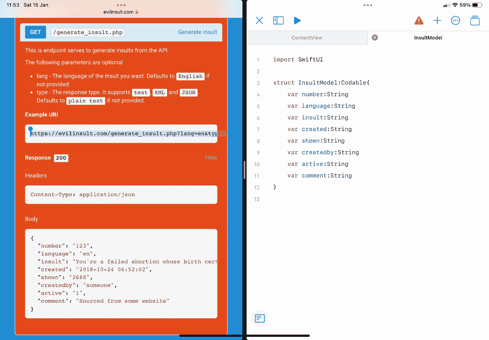
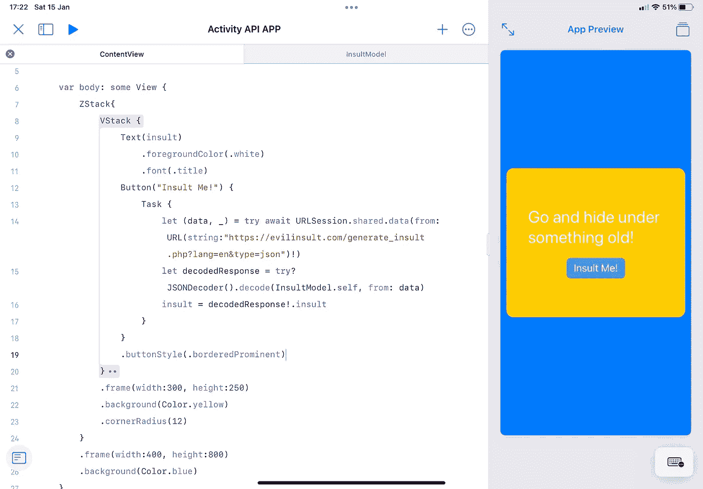
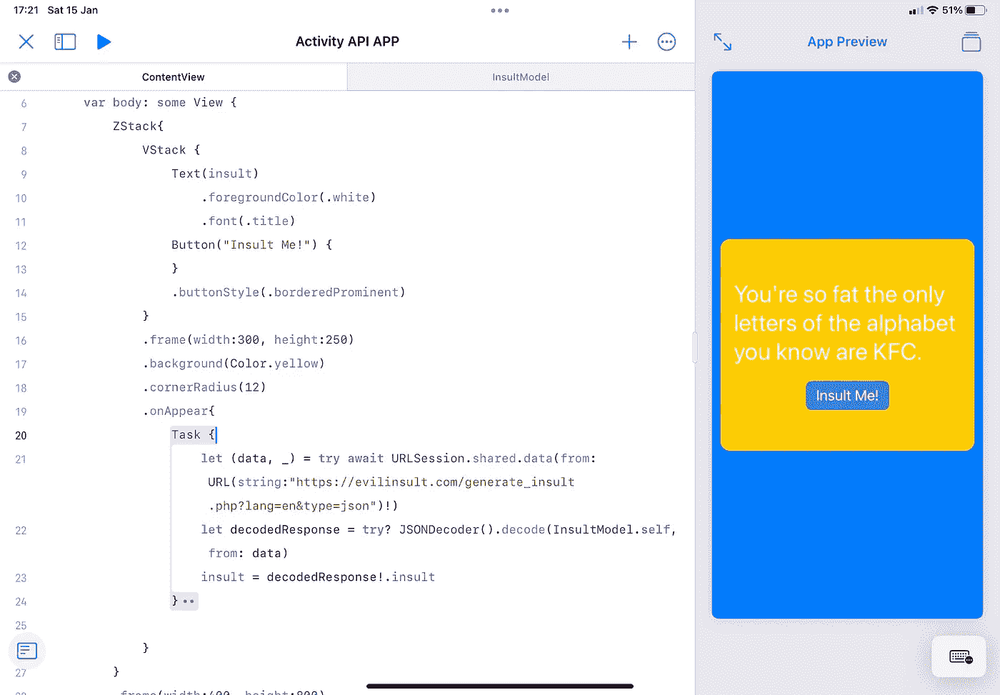
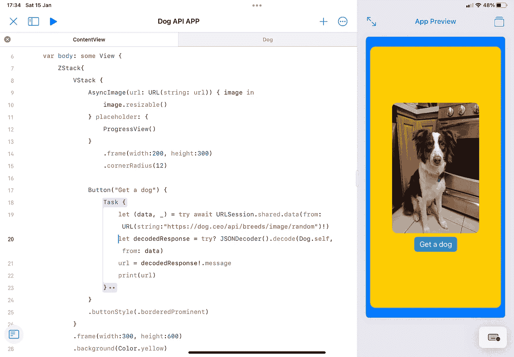
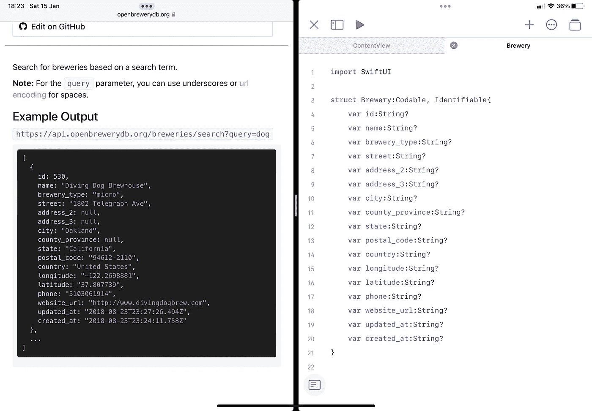
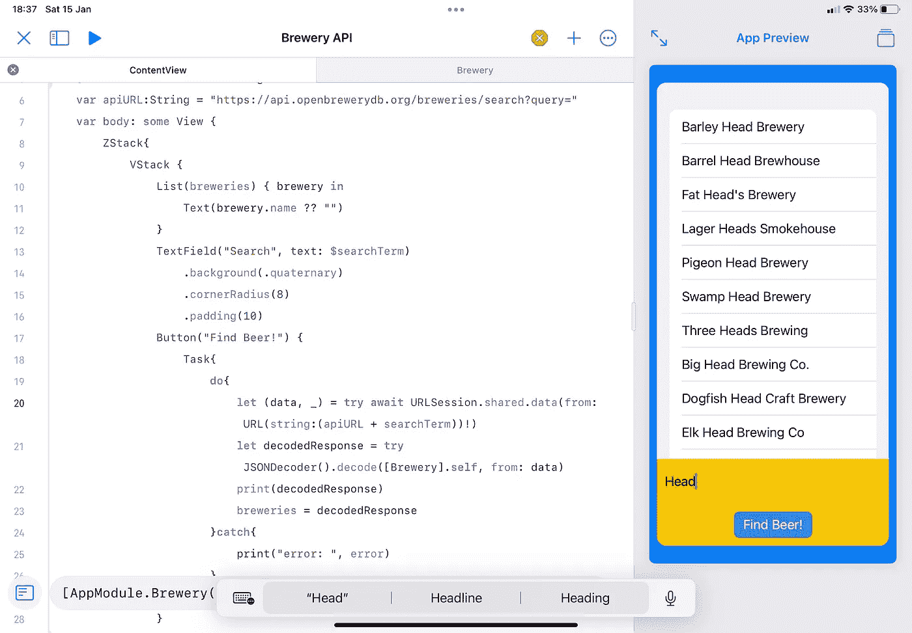
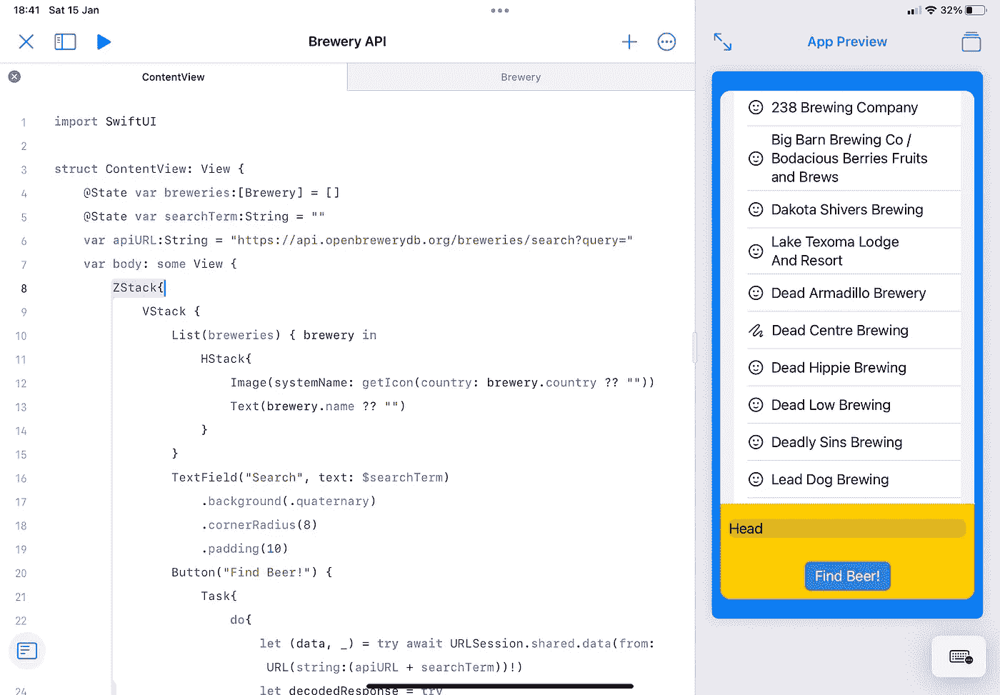

# 练习 SwiftUI 技能:在 iPad 上练习 API 调用和编码

> 原文：<https://betterprogramming.pub/practice-swiftui-skills-api-calls-and-programming-practice-6efbf6914db3>

## 如何在 20 分钟内用来自互联网的数据创建一个实用的 iOS 应用程序

道格拉斯·洛佩斯提供——Unsplash

像任何新的语言一样，一旦我们学会了如何交流，我们就想练习。无论是学法语还是学编码都是如此。我们在数字格式方面的问题是为一个应用程序找到一个想法是困难的。从头开始编写应用程序并提供所需的数据需要付出大量努力。但是要精通这门语言，你需要大量练习。你需要让这些话成为你的第二天性，而不是每两分钟就引用一次 StackOverflow。

另一个更令人痛苦的观点是，App Store 上有数百万个应用程序。您想要创建的东西与已经完成的东西在功能上有任何不同的可能性非常小。你的应用不是唯一的。抱歉，但是它在那里。在这篇文章的开头有一些令人沮丧的东西，但是请和我呆在一起。有积极的一面，从这里只能上山。

不承认这一点，还有另一种赢得用户的方法:用户体验。

你的应用想法可能不是完全独特的，你可能对现有的想法进行了轻微的旋转，开辟了新的可能性，但最终对用户来说，基本原理仍然是相同的。

但是你的应用程序与众不同的地方(除非你想严重侵犯版权)是它的外观、感觉和用户与它互动的方式。这些都是用户体验，有助于让应用程序看起来赏心悦目，交互流畅，抢先决定向用户显示什么信息。

作为一名程序员，练习不同的设计会帮助你理解什么可行，什么不可行，如何改变间距或颜色来定义一个应用程序。这些都是你可以学习的东西，遗憾的是，在你理解什么是有效的和理解设计模式之前，你不得不失败，或者落入陷阱。

# 怎样才能在不同的 app 上快速练习？

那么我们如何在不同的应用上快速练习呢？，我听到你问。嗯，通过 API。

互联网上有成千上万的免费 API(应用编程接口),它们提供了丰富的信息。

这很棒，因为这意味着你不再需要绞尽脑汁想出一个实践应用的想法，或者花时间创建你需要显示的所有数据。这已经为您完成，并且很容易访问。

这个概念很简单:

> 以任何一个 API 为例，想象一下你被一家公司雇佣来开发一个显示这些数据的应用程序。

您可以选择信息的外观、想要提供多少细节或者如何查询数据。你可以玩品牌，颜色，字体，间距。

最终目标是开发一个让用户满意的应用程序。最棒的是，每个应用程序应该花 2-3 个小时来创建(至少一旦你开始认识到工作设计模式)，这使得你很容易练习你的技能，并确保你经常编写的一些语言是真正根深蒂固的。

我在这些例子中使用 SwiftUI，但是这个原则可以应用于任何语言。下面我们先来看看基本步骤，然后是一个工作示例。

# 本练习的基本步骤

1.  找一个 API(最好是你一开始就感兴趣的)。第一次不要太雄心勃勃。从返回简单字符串响应的简单 API 查询开始。一旦你知道你有这个工作，你可以看看更复杂的 API 来练习。我将在下面提供一个我最喜欢的 API 的小列表，这些 API 适用于简单的应用程序，但是你可以通过在谷歌中输入“免费 API”来找到任何 API。
2.  创建一个线框——思考你想在应用程序中显示的所有视图。可能我们有加载视图、主页视图、详细视图和设置视图。开始画出你想在每个视图上显示的元素，以及如何在视图之间切换。这将帮助您确定您需要什么类型的导航控制器(如果有)。这也有助于关注最终结果。很难用不断变化的最终产品愿景来编程。
3.  开始编写功能代码——考虑所有的需求。您将需要一个 API 响应解码成的模型，您将需要一些按钮，标签和图像的视图。在这个阶段，我们的目标是让你的应用程序功能化，而不是实现一个视觉上完美的应用程序(尽管如果你是那些一次就能实现这两个目标的天才中的一员，那就太棒了——很遗憾，我不是)。
4.  开始考虑让应用程序对用户友好。考虑颜色、字体、大小和间距。对于奖励积分，根据设备大小或分辨率编写一些使用值的规则(这很有用，因为您正在为更广泛的受众增加用户体验。不是每个人都会和你在同一个设备上使用这个应用程序)。本文不会关注第 4 步，因为这是你可以在你的应用程序中加入的创意设计部分。

# 工作示例

按照上面的练习步骤，我们想要选择一个 API。我打算从一个简单的侮辱应用程序开始，主要是因为它很简单。作为一个用户，我按下一个按钮，我在屏幕上显示一个随机的侮辱。这更像是对 API 功能的介绍，但也给了我们一些扩展的内容。

参考文档，可以在 API 网站上找到。我正在使用一个[侮辱 API](https://evilinsult.com/api/) :

在网站上，你通常会看到一个将被返回的 JSON 对象的例子。这是你的应用需要翻译的内容。

为此，创建一个结构，如上所述，声明所有的元素和预期的数据类型。

你将会看到其他 API 有更大的灵活性，可以提供图片或其他数据类型的链接。

现在，我们的应用程序知道会发生什么，我们可以看看如何与 API 通信:

这个简单的代码块将调用 URL 并检索响应，然后将其解码成一个数据模型对象(如前所述)。

您可以看到,`https://evilinsult.com/generate_insult.php?lang=en&type=json`是我们调用来检索数据的 URL。

如果你查看在线 API 文档，你会发现通过修改这个 URL，我们可以对我们想要检索的内容应用额外的过滤器。对于侮辱 API 没有太多的选项，但是了解这一点对于未来的项目是有用的(我们将在下面看到一个演示)。

接下来，是在哪里放置这段代码？我们可以把它作为一个按钮的功能，或者我们可以让这个代码在我们的视图显示时自动运行。这有助于了解我们是否不希望我们的应用程序在加载时为空。

为了这个例子，我们将添加当我们按下按钮时要调用的代码。

参考上面的图片，我们定义了一个`insult`字符串来保存检索到的侮辱的值。

当我们按下`Insult Me!`按钮时，这将检索 JSON 对象，将其解码成一个`InsultModel`对象，然后我们用`InsultModel`对象的侮辱字符串更新侮辱字符串。

如果我们想让它在应用程序首次启动时出现，我们只需将`Task`中的代码放入`.onAppear{}`修饰符中。

了解这个位置很重要，因为应用程序的第一个视图通常是对象列表。在`onAppear`修饰符中放置一个 API 调用意味着应用程序要做的第一件事就是获取对象，这样就可以将它加载到列表中。

下面是在`.onAppear{}`中使用它的一个例子:

为了扩展此功能，如果检索的结果是特定条件，您可能希望显示一个符号或图像，即如果天气应用程序返回“下雨”，您可能会显示下雨的图片，否则如果是晴天，则显示太阳的图片。为此，我们可以简单地添加一个“switch”语句。

# 通过显示图像扩展您的应用程序

您可能想要显示来自 API 的图像。为此，使用`AsyncImage`并向其中传递一个 URL。您可以通过引用下面的 API 来尝试显示一张随机的狗照片:

 [## 狗 API

### 阅读我们的文档以了解更多信息，或者在下面亲自尝试一下。想把你的狗加入收藏吗？提交…

dog.ceo](https://dog.ceo/dog-api/) 

# 啤酒厂示例

我的最后一个例子是一个简单的啤酒厂数据库:

 [## 打开啤酒厂数据库

### Open Brewery DB 是一个免费的数据集和 API，提供关于啤酒厂、苹果酒厂、啤酒店和瓶装商店的公共信息。的…

www.openbrewerydb.org](https://www.openbrewerydb.org/) 

这个应用程序将允许用户通过搜索名称来找到啤酒厂。然后，它将检索一个啤酒厂列表供用户查看。

最后一个例子，我们将根据啤酒厂所在的国家显示不同的图标。

第一步是创建`Brewery`结构。我们需要使其符合`Identifiable`以便将该信息放入一个列表中。

第二步是在内容视图的顶部创建三个属性。一个将存储返回值的完整数组。这将是一个`Brewery`阵。第二个是用户将要输入的搜索词。最后，在这下面，我们声明 API URL(不包括查询本身)。

我们可以看到，通过组合`apiURL`和`searchTerm`，我们得到了要使用的地址:

第 3 步是创建显示结果的列表。现在，我们将显示每行中每个`Brewery`的名称。

这段代码的第二部分是用户输入搜索查询的`TextField`。

功能的最后一步是设置搜索按钮。这里与我们之前所做的唯一不同是，对于 URL 字符串，我们只是添加了`apiURL`和`searchTerm`，而不是在这里声明要使用的字符串。

我们还可以通过将这个调用放在一个`do catch`闭包中，并添加 print(error)语句来改进我们的代码。这使我们能够识别何时将 JSON 对象解码成我们的数据存在问题。

对于不同的 API，这种情况会定期发生，如果没有关于错误的信息，这将简单地返回一个空值。该错误将说明失败的原因，例如期望不同的数据类型。

将所有这些放在一起，我们得到一个功能应用程序，它将调用啤酒厂数据库中的搜索词，以数组的形式返回结果，并以列表的形式显示结果。

我们可以在这里进一步演示，如果满足某个标准，还可以显示一个附加元素。

例如在这里，如果酿酒厂在美国，我将显示一个笑脸，如果不使用`SFSymbols`，则显示一个涂鸦:

为此，只需传入国家名称，如果案例与给定场景匹配，则返回`SFSymbol`的字符串。然后，在`List`中，我们为每个`brewery`声明名称，然后我们可以显示它旁边的`Image`。以下是更新后的`List`代码:

最终结果看起来像这样:

# 摘要

这只是一个快速获取数据功能应用的指南。从上面可以看出，这一切都是在不到 50 行代码中完成的。一旦你有信心并练习过，这将需要 10-15 分钟来达到这一点，这意味着你可以将时间集中在颜色、间距、大小、符号和图像上。

我在上面创建的应用程序还不令人满意，下一步是实践这一点，看看什么可行，什么不可行。希望上面给了你显示基于 API 收据的元素的基本概念。现在找一些 API，搞编程。我最喜欢的一些快捷应用程序可以使用免费的 API 来创建，它们具有以下功能:

*   天气预报
*   随机狗/猫图片
*   玩笑
*   侮辱
*   建议一项活动
*   啤酒厂数据库
*   鸡尾酒数据库
*   配方数据库
*   货币转换器
*   查找 IP 数据
*   事实生成器
*   假冒用户生成器
*   新闻文章

现在你有了这个。我的下一篇文章将集中在如何管理不同的格式和创建主题。集中这些信息将有助于从一个地方创建和修改视图。快乐编码。