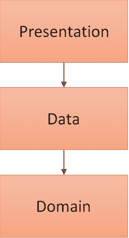
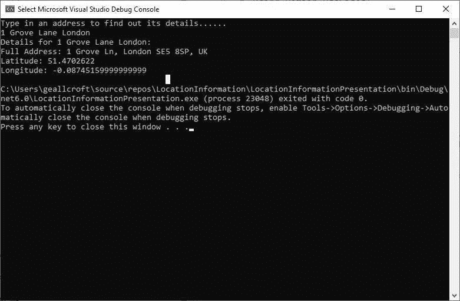

# 用 C#实践干净的架构

> 原文：<https://betterprogramming.pub/practicing-clean-architecture-in-c-62fe55aed83c>

## 将我的知识付诸实践

照片由 [AltumCode](https://unsplash.com/@altumcode?utm_source=medium&utm_medium=referral) 在 [Unsplash](https://unsplash.com?utm_source=medium&utm_medium=referral) 上拍摄

我一直在看鲍勃大叔的[清洁建筑书。我想我应该通过使用干净的架构原则创建一个迷你项目来检查我是否正确理解了一切。我就是这样上来的。](https://www.amazon.co.uk/Clean-Architecture-Craftsmans-Software-Structure/dp/0134494164)

# 什么是干净的建筑？

下图展示了清洁建筑是如何工作的:

干净的架构图

这个想法是圆依赖于它们内部的圆，即依赖关系指向内部。中间是应该保持不变的业务规则——这些规则不应该依赖于圈子中更远的任何东西。

目标是能够非常容易地改变您可能改变主意的事情(例如，外部框架、数据库和 UI 格式),并且核心业务逻辑不必更新。这也有助于代码易于测试。

为了实践 clean architecture，我将使用 C#构建一个应用程序，允许用户键入地址，然后用户将返回有关位置的更多详细信息，特别是地理坐标和完整地址。一个有点无意义的应用程序，但我们走吧！

我的项目将有一个三层架构——领域层、数据层和表示层。

我的应用程序的图层(箭头跟随依赖项)

我将遵循圆圈图中显示的干净的架构结构。

# **域层**

让我们从实体开始。

## 实体

实体是应用程序的业务对象。它们有最通用的高层规则，不会在外部有什么变化的时候改变。实体层应该不受其他层中任何更改的影响。

在我的应用程序中，我希望只有一个实体，名为`LocationEntity`。它将具有三个属性:`FullAddress`、`Latitude`和`Longitude`。

## 用例

在应用程序的“用例”部分，有特定于应用程序的业务规则(与企业使用的其他应用程序无关)。

对用例的任何更改都不应该影响实体层中的 LocationEntity。此外，这一层不应受到对数据库、UI 或所用框架的任何更改的影响。

在我的应用程序中，我将有一个用例，它将获得位置细节，给定一个地址。

我将创建一个`GetLocationInteractor`类。这将有一个名为`Handle`的方法，它将调用`IRepository`(稍后会详细介绍)的方法到`GetLocation`。

## 接口

接口层中有`IRepository`接口。接口层的想法是将数据从用例或实体中使用的形式转换成存储库(或数据库)或表示中使用的格式。

在我的代码中为`IRepository`使用一个接口也使得通过编写单元测试来测试我的代码变得非常容易。在这里，我模拟来自存储库的结果，以检查我的用例是否正常工作。

# 数据层

应用程序的数据层包含在域层中定义的数据接口的实现。在我的例子中，我需要实现的是 IRepository。

`LocationRepository`实现了`IRepository`的`GetLocation`方法，该方法调用另一个方法到在名为`ILocationApi`的接口中定义的`GetLocationData`。

`GoogleMapsApi`类使用 nuget 包`[gmaps-api-net](https://github.com/ericnewton76/gmaps-api-net)` 来获取用户使用 Google Maps API 输入的地址位置的数据。

代码非常简单——你需要做的就是从[谷歌云平台](https://console.cloud.google.com/projectselector2/google/maps-apis/credentials)获得一个 API 密钥，然后使用下面的代码。

# 表示层

表示层是最外层。因为这一层与其他层是分离的，所以任何类型的表示都是可能的。对于这个例子，我将使用一个很好的简单的控制台应用程序。

在我的程序中，我要求用户输入一个地址。当他们这样做时，控制台应用程序上会显示`FullAddress`和`Latitude`以及`Longitude`。

这是一个漂亮的应用程序:

这就是你想要的——一个用干净的建筑建造的项目！

# 结论

在读完《干净的建筑》这本书之后，将我的学习付诸实践是一件很棒的事情。

考虑如何分离不同的层是很有用的，这样核心业务逻辑就不会受到数据库或 UI 决策之类的干扰。

尝试自己做点东西真的有助于把理论变成现实。我希望你喜欢读它！