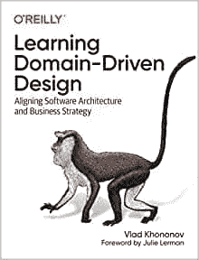
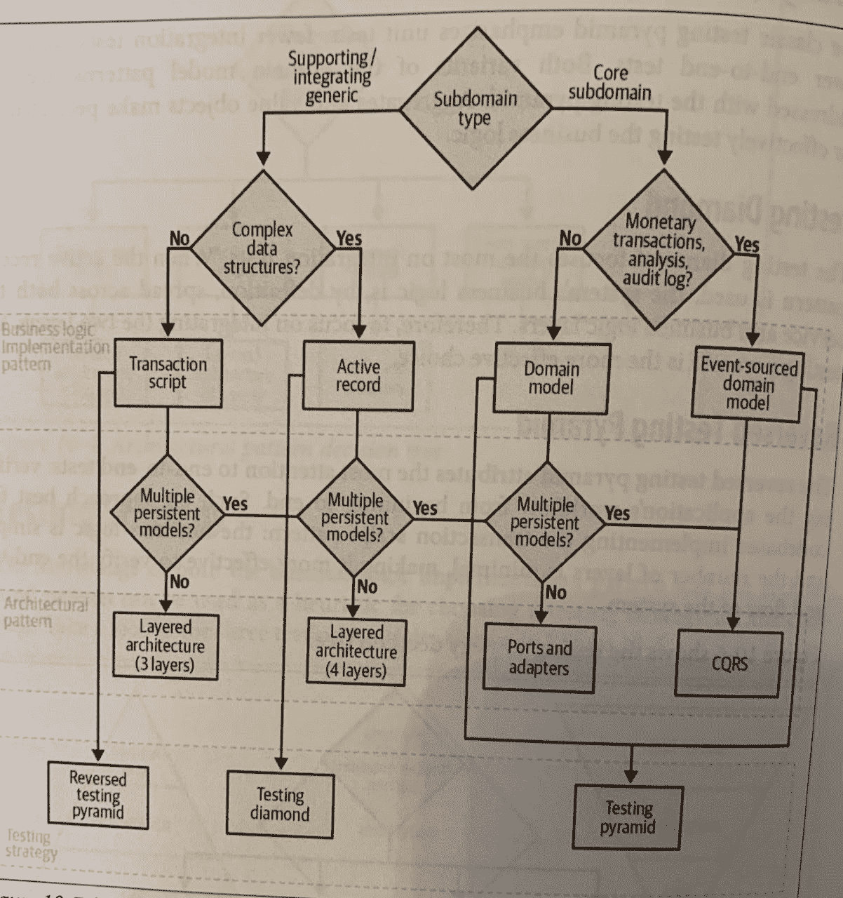

# 在 C#中实践领域驱动设计

> 原文：<https://betterprogramming.pub/practicing-domain-driven-design-in-c-f152fc91e671>

## 用领域驱动的设计概念构建新产品时需要考虑的关键战略和战术因素

文斯·弗莱明在 [Unsplash](https://unsplash.com/s/photos/sports?utm_source=unsplash&utm_medium=referral&utm_content=creditCopyText) 上的照片

我刚刚读完弗拉德·霍诺诺夫的 [*学习领域驱动设计*。这是一本很短的书(大约 300 页),旨在教初学者所有关于领域驱动设计的知识。](https://www.amazon.co.uk/Learning-Domain-Driven-Design-Aligning-Architecture/dp/1098100131)

我想通过将书中的概念付诸实践来检验我是否理解了它们。我希望你也能通过阅读这篇文章学到一些东西！我就是这样上的…

# 什么是领域驱动设计？

领域驱动设计的思想是使用您正在构建的业务需求作为您架构的基础。

要求您构建产品的业务团队是“领域专家”，他们工作的业务领域是“领域”。

有很多关于使用“无处不在的语言”的讨论，这意味着不是使用非技术人员可能不理解的编码词，而是使用业务团队用来描述产品的词来命名你的类、方法和变量并讨论东西。

DDD 的想法是每天用英语写代码！

在这本关于如何实现领域驱动设计的书中有很多不同的技术概念，我将在本文中尝试解释其中的一些。作为一个例子，我将通过构建一个假想产品背后的思维过程来完成这个任务。

# 我要建造什么？

我对产品的想法是能让你和其他人一起运动。我打算把它叫做“*体育连接*”。

以下是我刚刚提出的一些要求:

*   我希望用户能够给其他对同一项运动感兴趣的人发消息，这些人也有类似的水平。
*   我希望用户能够在完成后评价与对方一起玩的体验。
*   我希望用户能够登录和退出。
*   我希望体育教练能够在他们的领域看到球员的评级和标准水平，以便他们可以为球队侦察他们，并在应用程序中给他们发消息。
*   我希望运动队能够管理比赛和训练时间表，以及为每个比赛挑选的球员，并向球队中的球员发送通知。
*   我希望联赛中的球队根据过去的表现进行评级，并提供赛程预测。

# 战略决策

在你开始构建任何东西之前，首先要考虑的是不同子域的“类型”。这是一个领域驱动的设计概念。这里有一点解释。

## 域和子域

我的产品领域是一种运动员市场和运动队管理。对于领域驱动设计，我们真正感兴趣的是子域是什么。

子域是域的不同部分，它们被分为不同的类型。

## 1.核心子域

“核心子域名”是最重要的子域名类型，也是企业赚钱和从竞争对手中脱颖而出的原因。在我上面的例子中，我认为核心子域是:

*   找出附近对同一项运动感兴趣并具有相似标准的其他运动员的分析
*   计算一名运动员的等级
*   体育教练可以为球队挑选球员并安排他们的位置
*   运动队评级
*   体育联盟中的比分预测
*   一个真正的用户友好的网站，有一个伟大的设计

这些是相对复杂的逻辑，可能会根据业务需求频繁地改变需求。核心子域名是应该由你最好的开发者在内部构建的东西。在这种情况下，由我在我的卧室！

由 [Unsplash](https://unsplash.com/s/photos/developers?utm_source=unsplash&utm_medium=referral&utm_content=creditCopyText) 上的[火星扇区-6](https://unsplash.com/@heylagostechie?utm_source=unsplash&utm_medium=referral&utm_content=creditCopyText) 拍摄的照片

## 2.通用子域

“通用子域”是子域的下一种类型。它们通常很复杂且难以实现，但并不提供任何竞争优势。这种子域通常是从第三方购买的，因为自己构建这些是浪费时间。

在我的例子中，我认为通用子域是:

*   供用户相互联系的消息传递系统
*   登录和退出系统

## 3.支持子域

子域的最后一种类型是“支持子域”。这并不提供任何竞争优势，但确实很容易实现，例如从 CRUD 接口输入和获取数据。对于该产品，我的支持子域是:

*   输入和存储用户的个人数据
*   输入并存储用户之间的评分
*   球队赛程和训练时间表

好极了。我们已经弄清楚了我们的子域。我们必须分别考虑这些问题，以及它们如何融入我们的解决方案。现在让我们学习有界上下文。

## 有界上下文

有界上下文是领域驱动设计的另一个概念。我的理解是，这是一种“无处不在的语言”(即领域语言)适用的范围。

如果两个不同的业务领域用同一个词表示不同的意思，那么这是一个好的迹象，表明这是两个不同的有界上下文。

在我的例子中，我可能会发现，在个人玩家用来寻找一起玩的人的功能的上下文中，术语玩家与体育教练在管理他们的团队时使用的术语玩家具有完全不同的含义。

利亚·赫特伯格在 [Unsplash](https://unsplash.com/s/photos/sports-team?utm_source=unsplash&utm_medium=referral&utm_content=creditCopyText) 上拍摄的照片

因此，为个人玩家提供一个有界的上下文，为团队管理提供另一个有界的上下文可能是明智的。

一般来说，有界上下文越小越好，因为它更灵活。但是有一点是值得的，因为使上下文过小会导致集成时不必要的复杂性。

在实践中，只有一个开发团队应该在单个有界的上下文中工作(但是同一个团队可能在不止一个有界的上下文中工作)。

这就是我们从“战略”设计角度考虑的所有东西。现在让我们看看“战术”设计。

# 战术设计

是时候了解我们的代码将会是什么样子了。

在我们上面定义的每个子域中，我们应该考虑如何设计架构。基于其复杂性，每个都有自己的体系结构设计。

这本书有一个流程图，有助于显示你什么时候可能想要使用每种类型的架构。

如果您对术语感到困惑，端口和适配器架构也称为干净架构。

## 通用子域

想法是使子域的架构与其复杂性相匹配——对于具有基本数据访问功能的一般子域，用简单的“活动记录”类型架构来设计它可能是有意义的。

这将允许您执行 CRUD 操作，但不用担心编写 SQL 脚本。

## 核心子域

对于核心子域名——产品中利润丰厚的部分——业务逻辑可能会更加复杂。从流程图中可以看出，使用清洁架构或 CQRS 是一个好主意。

在这篇文章中，我将尝试用领域模型来构建一些东西，这样我就可以实践领域驱动的设计原则(当然！).一个领域模型非常适合一个干净的架构，所以我将继续研究它，因为这是我所熟悉的。

你可以从流程图中看到，我读的这本书也涵盖了事件源和事件源领域模型…但是由于这是我第一次尝试使用这些概念，我将保持简单，使用一个更简单的领域模型。我将离开实践活动采购和 CQRS 的另一天！

# 领域模型

在我的一个核心子领域里，我想把玩同一项运动，标准相近的玩家互相匹配。

我将创建一个玩家模型。当考虑领域模型时，有一些重要的事情需要考虑。

照片由[杰森·斯特鲁尔](https://unsplash.com/es/@jasonstrull?utm_source=unsplash&utm_medium=referral&utm_content=creditCopyText)在 [Unsplash](https://unsplash.com/s/photos/thinking?utm_source=unsplash&utm_medium=referral&utm_content=creditCopyText) 上拍摄

# 类型

## 值类型

值类型是指当它的一个属性被改变时，它会变成另一个东西。

播放器模型中的一个例子可能是地址类型。它将有一个第一线，第二线，城市和邮政编码。如果其中任何一项发生变化，该地址就会变成一个新的不同地址。

## 实体类型

实体类型是您希望随着时间的推移而改变的东西，并且需要某种 ID 来将其与其他对象区分开来。

`Player`模型本身将是一个实体类型，因为玩家的数据可能会随着时间而改变。玩家可以通过 ID 号来识别。

一般来说，如果你可以用值类型分解一个实体类型，那么你应该这样做。这是我的播放器模型的初稿:

Player 类是一个实体，但是属性都是值类型。如果任何值类型的任何属性发生变化，那么它将给出该对象的新版本。

# 聚集

聚合是领域驱动设计的另一个概念。这可以说是最重要的一点，也是最难做对的一点。

它是一个或一组链接在一起的实体模型，其行为相互影响。

聚合的一个非常重要的部分是，逻辑必须验证所有传入的更改，并确保这些更改符合实体的业务规则。

实体外部的一切只允许读取聚合的状态。这就是为什么有一个私人二传手。

聚合的状态只能通过执行聚合的公共接口的方法来更改。

在这里，我修改了我的`Player`模型，使其成为一个`Player`集合:

所有的属性都有一个私有的 setter。我增加了比较玩家的方法，如果他们“匹配”就把他们添加到列表中，还增加了更新玩家等级和地址的方法。

这些“命令”(在领域驱动设计中被称为“命令”)通过集合的公共接口被调用。

# 干净的建筑

如果你不熟悉 clean architecture，我已经用 C#在这里[构建了一个迷你的示例项目](/practicing-clean-architecture-in-c-62fe55aed83c)——快速浏览一下可能会有所帮助，因为我在这里不会深入讨论 clean architecture 的太多细节。

## 畴层

这一层包含了解决方案的所有业务逻辑。在我的领域层中，我将拥有我之前展示的`Player`聚合。

## 用例

出于本文的目的，我只创建了几个将由我的应用程序使用的用例:

1.  添加新玩家；和
2.  将一个玩家与另一个玩家进行比较，如果匹配，则将其添加到玩家匹配列表中

您可以看到我的用例类中的代码实现了播放器集合中的命令。

`Player`模型完全负责更新`Player`实体的状态。由于私有设置器，玩家不能被实体外部的逻辑修改。

下面是添加玩家用例代码:

这段代码调用了`Player`集合中的`Create`命令。然后它将`Player`添加到`Player`存储库中。

下面是比较玩家用例的代码:

如果满足匹配条件，这段代码使用`Player`集合中的`ComparePlayer`命令用新玩家更新`PlayerMatches`列表。

## 表示层

我没有费心为这个例子构建表示层，但是干净架构的美妙之处在于，可以使用任何类型的表示层，而不会扰乱到目前为止我们编写的代码中的任何核心业务逻辑。

最终对于这个应用程序，我们将希望建立一个时髦的用户界面，无论是网络还是手机..但是我们不需要在这个阶段做出任何决定，因为业务逻辑完全独立于表示层的选择。

# 结论

所以你有它！这是一篇相当长但很好的文章，讲述了在构建一个新产品时要考虑的关键战略和战术问题。

我已经向你介绍了如何划分不同类型的子域，以及每种子域应该使用的架构类型。

我还尝试使用领域模型和清晰的架构，为产品的一个核心子领域制作了一个非常简单的精简版本。

我希望这篇文章能给你一些领域驱动设计的背景知识，并让你看到它在实践中的样子。