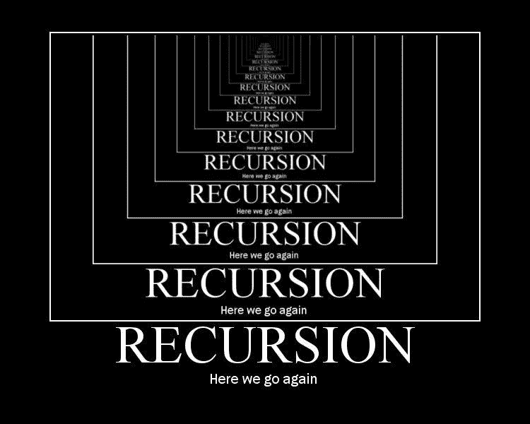

# 用 7 个算法挑战练习递归

> 原文：<https://betterprogramming.pub/practicing-recursion-with-7-algorithm-challenges-7ffdd634557>

## 用这些有用的练习题搞定你的下一次面试



图片来自[深度开发](https://indepth.dev/dijkstra-was-right-recursion-should-not-be-difficult/)。

还记得你第一次不用查答案就自己解决了一个算法难题，却被告知要用递归函数再解决一次吗？

由于这似乎是一个常见的场景，尤其是在技术面试环境中，我整理了一个经典算法挑战的列表，以帮助弯曲我们的递归大脑肌肉，因为这似乎是一个常见的场景，尤其是在技术面试环境中…

# 1.反转字符串

```
/* Instruction:
Given a string, write a recursive function to return the reversed string. */// Example:
reverseString('covid')
// => 'divoc'
```

这似乎是每个代码新手遇到的第一个挑战。如果你还没有用递归解决这个问题，我鼓励你在进一步阅读之前尝试一下。

这是我的解决方案，可以通过三元运算符进行重构:

# 2.将数字相加

```
/* Instruction:
Given an array and an index, write a recursive function to add up the elements of an array. */// Examples:
addingUpTo([1, 4, 5, 3], 2)
// => 10
// => adding the number all the way up to index 2 (1 + 4 + 5)
addingUpTo([4, 3, 1, 5], 1)
// => 7
// => adding the number all the way up to index 1 (4 + 3)
```

因为我们要返回多个数字的和，所以我马上想到声明一个变量`sum`。

此外，由于我们给定了一个索引，我决定将`sum`作为该索引处的元素，并将数字向后添加。

基本情况是当我们到达操作的末尾时，在这种情况下是索引`0`，因为我们向后添加:

# 3.寻找最大整数

```
/* Instruction:
Given an array, write a recursive function to find the largest integer in an array. */// Examples:
maxOf([1, 4, 5, 3])
// => 5
maxOf([3, 1, 6, 8, 2, 4, 5])
// => 8
```

这是一个比较问题。所以自然地，基本情况是我们不能进行比较的时候(也就是说，当数组中只剩下一个元素的时候)。

现在，我们如何继续比较和减少数组中的元素，以达到基本情况？

JavaScript 中的`splice`方法拯救了我。

感谢`splice`方法的可变性，我可以比较数组中的前两个元素，删除较小的一个，并用更新后的数组递归调用函数:

# 4.寻找特定元素

```
/* Instruction:
Given an array and a number, write a recursive function to see if the array includes the given element. */// Examples:
includesNumber([1, 4, 5, 3], 5)
// => true
includesNumber([3, 1, 6, 8, 2, 4, 5], 9)
// => false
```

类似于`maxOf()`函数，我们需要将数组中的元素与给定的数字进行比较。

一旦找到匹配，我们可以立即返回`true`。如果没有，我们可以递归调用函数，并传入减去刚才比较的元素的数组，直到到达基本情况。

我在这里建立的基本情况是当数组中没有元素时，在这种情况下，我们返回`false`，因为数组中没有元素匹配给定的数字:

事后看来，我应该使用`splice`而不是`slice`方法来移除当前元素。使用`slice`将在每次递归函数调用中触发数组的一个新副本，如果给定一个大数据集，这可能会降低操作速度。

# 5.回文

```
/* Instruction:
Given a string, write a recursive function to see if a word is a palindrome. */// Examples:
isPalindrome('madam')
// => true
isPalindrome('covid')
// => false
```

回文是一个单词或短语，如果你颠倒每个对立字符的顺序，它的意思是一样的。

我以镜像的方式处理这个问题:比较每个递归函数中字符串的第一个和最后一个字符，直到我们到达中间点，这成为我们的基本情况。

在递归的情况下，如果当前字符不等于相反的字符，我们应该立即返回`false`，因为这不满足回文的组成:

# 6.排列

```
/* Instruction:
Given a string, write a recursive function to print out an array of all possible permutations of the string. */// Examples:
permutations('abc')
// => ['abc', 'acb', 'bac', 'bca', 'cab', 'cba']
permutations('aabc')
// => ["aabc", "aacb", "abac", "abca", "acab", "acba", "baac", "baca", "bcaa", "caab", "caba", "cbaa"]
```

排列是一组项目的重新排列。现在，我们至少需要两个元素来完成排列。如果字符串只有一个或更少的字符，没有什么需要重新排列的，所以这是我们的基本情况。

递归的情况对我来说是一个棘手的问题。与之前的挑战不同，这次我们需要几层操作才能达到预期效果:

如代码片段中所述，在递归情况下，我们不仅需要考虑给定字符串中有重复字符的情况，还必须将当前字符与递归函数结果的每个排列连接起来。

如果你仍然感到困惑，我强烈推荐[这个详细的演练](https://levelup.gitconnected.com/find-all-permutations-of-a-string-in-javascript-af41bfe072d2)，它帮助我理解了这个挑战的递归解决方案。

# 7.斐波纳契

```
/* Instruction:
Given a number, write a recursive function to 
print out the n-th entry in the fibonacci series. Fibonacci series is a sequence, 
where each number is the sum of the preceding two: 
[0, 1, 1, 2, 3, 5, 8, 13, 21, 34] */// Example:
fib(3)
// => 2
fib(6)
// => 8
```

听说不查就想出递归解的情况并不常见，所以下面是“教科书”版。根据一些有经验的开发人员的说法，这是一个值得记住的公式:

这种递归方法的运行时复杂性是指数级的(`O(2^n)`)，因此它不如普通的旧迭代方法(`O(n)`)高效。

您可以利用`memoization`技术来优化递归，但是这超出了本文的范围。

# 最后的想法

我们都有使用递归解决问题的不同方法。我花了相当多的时间来发展自己的策略。

到目前为止，我倾向于从找出基本案例开始，正如多种资源所建议的那样。然后我将冒险进入递归情况，这通常涉及创建子任务和组合子任务的结果。

你呢？你是如何训练大脑递归思考的？请在评论中告诉我！