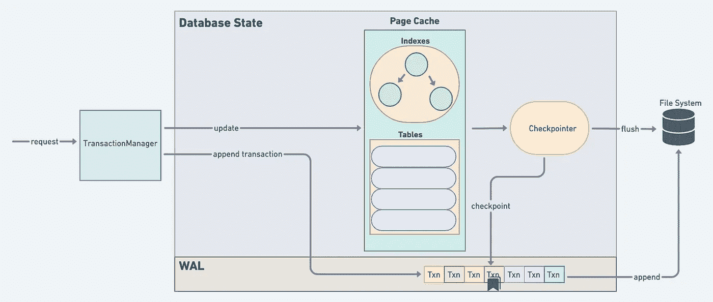
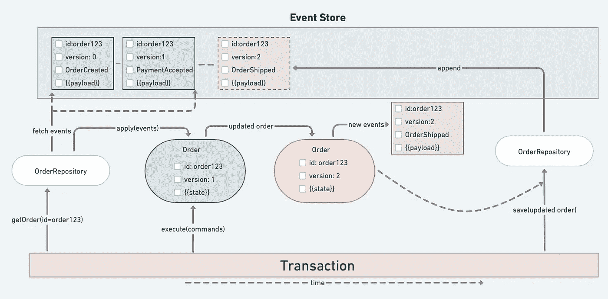
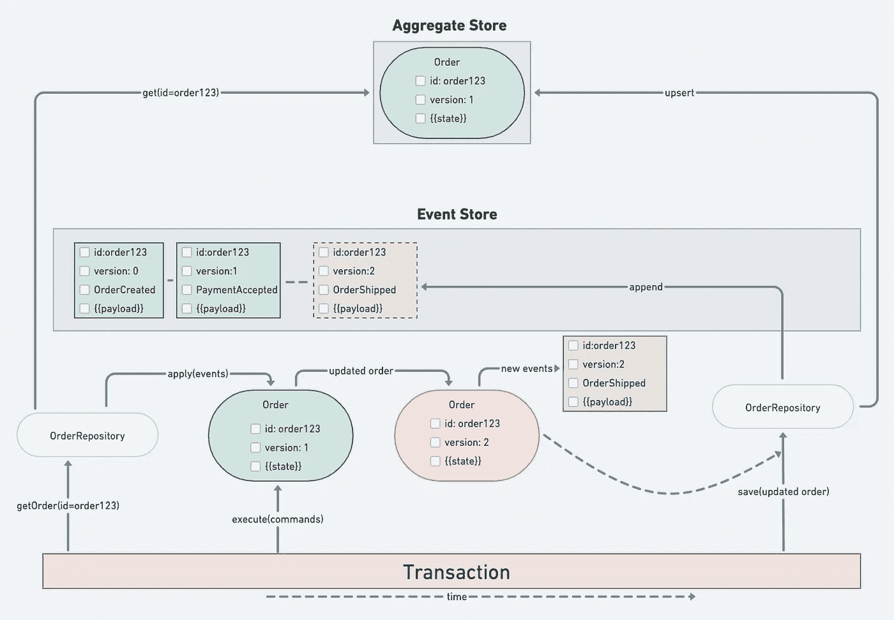
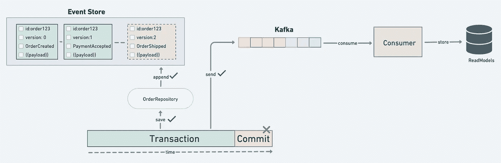
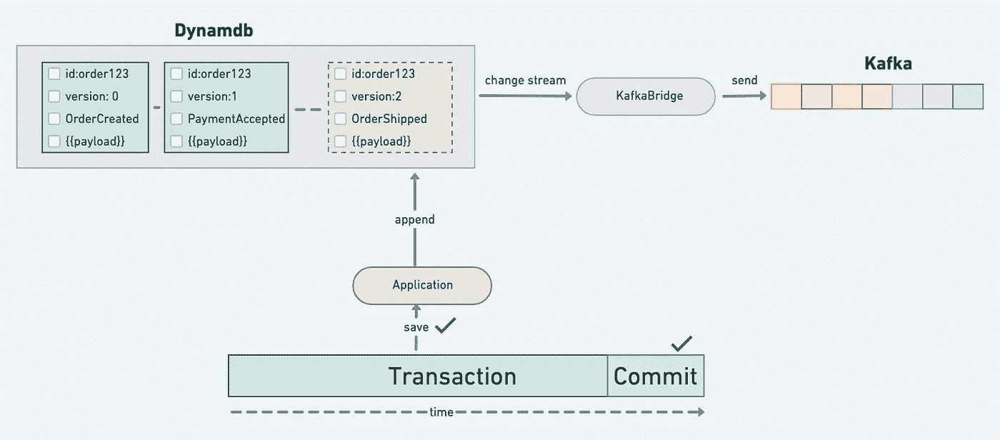
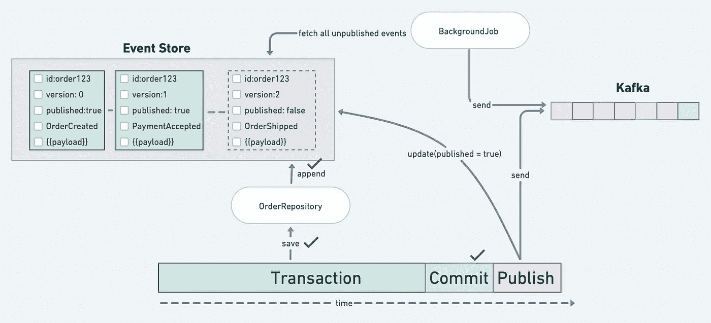
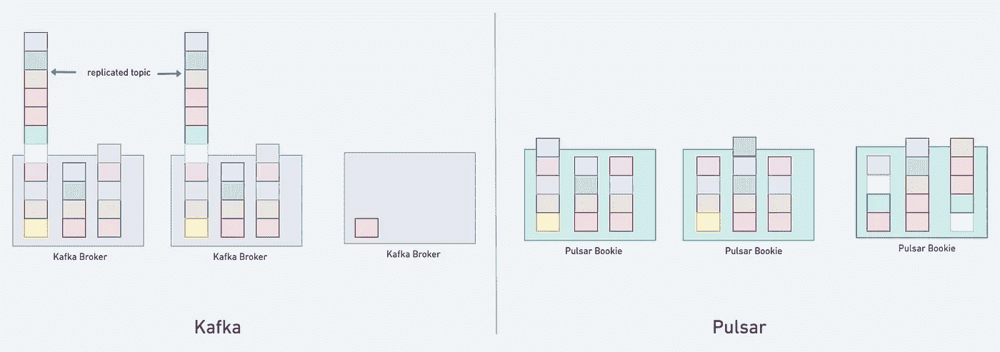

# 实用事件源

> 原文：<https://betterprogramming.pub/pragmatic-event-sourcing-8e929a56997e>

## 事件源是一种架构模式；这不是银弹

Mathyas 在 [unsplash](https://unsplash.com/photos/fb7yNPbT0l8) 上的照片

在使用事件源模式成功构建了多个系统之后，我也遇到过人们以事件源的名义将他们的架构复杂化的情况——这是对模式教条化而非实用化的不可避免的结果。

本文旨在帮助您理解事件源只是一种模式，它可以基于不同的问题域和上下文有多种实现变体。

我还将试图向您展示，您不需要花哨的框架或库；你只需要从模式中获得必要的灵感。您可以查看一些参考实现来借鉴一些想法，但是要务实地构建您的系统，并根据您的问题域和上下文做出相关的决策。

在本文的后半部分，我将分享我对基于事件源构建系统时出现的一些常见问题的想法。我相信这可能有助于您在实施过程中做出更好的决策。

***注*** *:如果你从未听说过事件采购，我建议你在阅读本文之前，先在别处读一篇好的介绍。*

# 介绍

总的来说，我看待架构的方式深受 Christopher Alexander 关于模式和模式语言的著作的影响。这是书中的一段引文:

*“每个模式都代表了我们目前对物理环境的最佳安排，以解决所呈现的问题。经验主义的问题集中在这个问题上——它发生了吗，它以我们描述的方式被感受到了吗？解决方案呢？我们提议的安排能解决问题吗？星号代表我们对这些假设的信任程度。*

但是，当然，不管星号怎么说，这些模式仍然是假设——因此，都是试探性的，在新的经验和观察的影响下可以自由发展。”

本质上，我们不应该混淆模式是一种严格的实现策略——模式不是一类问题的具体解决方案！

想要使用事件源的天真工程师通常倾向于以“理想的方式”实现它，但最终会给系统增加大量意外的复杂性。

然而，务实的架构师只会从所有已知的模式(不仅仅是事件源模式)中汲取必要的灵感，并以初学者的心态处理手头的问题。

目标不是实现一个理想的模式。相反，它是产生一个优雅和最简单的可能的解决方案，而不会被关于模式本身的不必要的教条所束缚。

# 事件采购是一个新颖的想法吗？

虽然“事件源”是由“Greg Young”创造的，但是这种模式可以在其他各种系统中发现，以解决一些有趣的问题。

例如，数据库使用类似的模式来提供崩溃恢复、备份、复制和持久性保证。

数据库墙|按作者分类的剩余图像

如上图所示，大多数数据库实现的核心都有 WAL(预写日志)的概念，以提供持久的、原子的和高性能的事务。

对数据库的所有更新通常遵循以下步骤:

1.  将变更(事务)附加到 WAL 文件
2.  持久化 WAL 文件(为了持久性)
3.  更新代表表和索引数据结构的页面缓存(内存中)。

正如您所注意到的，对表和索引的所有更改都是在内存中完成的。这对性能有好处，因为表和索引的更新通常代价很高，尤其是在高度并发的环境中。即使一次索引更新也可能需要完全重构 B 树索引结构，从而导致多次文件系统更新。

但是如果所有的更新都只在内存中进行，那么数据库就不能保证持久性。这正是我们使用 WAL 文件的原因，WAL 文件甚至在执行内存更新之前就捕获(通过持久化)文件系统的所有事务。

WAL 文件更新的成本很低，因为它总是一个仅附加的操作。有一些特定的优化系统调用( [Direct IO](https://access.redhat.com/documentation/en-us/red_hat_enterprise_linux/5/html/global_file_system/s1-manage-direct-io) )允许您对文件系统执行非常快速的仅追加操作。

因为 WAL 文件可以无限增长，所以数据库系统通常有一个在后台运行的检查点组件。它们会尝试定期将内存中的页面缓存刷新到磁盘。

每次检查点将页面缓存刷新到磁盘时，它都会将一个特定的 WAL 文件条目标记为当前“检查点”，表示到此时为止的所有事务都保存到磁盘中，因此是持久的。

有了检查点，您就可以删除所有旧的 WAL 条目，直到一个特定的检查点。但是，在大多数情况下，您会希望备份和归档 WAL 文件，因为它准确地反映了整个数据库的状态变化。

如果数据库在崩溃后重新启动，它会读取 WAL 文件并逐个重放当前检查点之后的所有条目，以恢复由于崩溃而丢失的任何更改！

您已经注意到了这个实现和事件源模式之间的相似之处。

*   WAL 文件类似于事件源应用程序中的“事件流”。
*   可以通过应用(或重放)WAL 文件来获得数据库的当前状态，就像如何从事件流中恢复聚合一样。
*   WAL 文件可以被视为事实的来源，就像事件流在事件源系统中充当事实的来源一样。
*   WAL 条目在网络上广播以构建数据库副本，就像各种消费者消费事件流以构建复杂的预测和读取模型一样。
*   检查点的作用类似于聚合快照

我比较了事件源和 WAL 实现，以强调和重申模式可以有多种不同的实现。没有“理想的”事件源实现，您也不应该试图创建一个！使用该模式作为指南，为手头的问题构建自己的解决方案。保持简单！

***注意*** *:如果您有兴趣探索具有该模式变体的其他系统，您可以研究一些区块链实现，如以太坊。*

现在是时候探究基于事件源模式构建系统时出现的常见问题了。

但是在我们开始提问之前，让我们先来看一个非常简单的参考实现作为例子。

# 示例:参考实现

> **注意**:如果你更喜欢阅读代码，这里有一个我几年前构建的下面方法的 golang 实现——[https://github.com/yehohanan7/flux](https://github.com/yehohanan7/flux)。

上图是一个使用事件源模式的“订单管理系统”的简单实现。对订单汇总的所有更新都将遵循类似的步骤序列，如下所示:

1.  使用订单`id`从存储库中获取订单。
    -存储库将获取订单的所有事件
    -存储库将使用获取的事件对集合进行再水合(即，应用事件来构建订单的当前状态)。)
    -存储库返回水合订单骨料。
2.  客户端对返回的聚合执行命令，这通常会生成存储在聚合中的新事件。
3.  客户端通过订单存储库保存更新后的集合(以及新生成的事件)
4.  存储库“有条件地”将新事件附加到事件存储中，即，在上面的例子中，只有当特定订单的最后一个事件(`order123`)仍然是版本为`1`的事件时，它才附加事件。这确保了在当前事务读取事件和执行命令之间，顺序不会被任何其他事务更新。这种技术被称为开放式并发，它通常为您的系统提供更好的整体性能。
5.  如果存储库在附加新事件时检测到冲突，即另一个事务已经附加了新事件，则存储库向客户端返回“冲突”错误。
6.  客户端在返回冲突时，可以再次重试整个过程
7.  但是如果没有检测到冲突，则认为交易成功。

# 实施常见问题

## 我需要聚合快照吗？

拍摄聚合快照是一种优化，因此请避免过早进行优化！

大多数域聚合只有几个事件，因为它们通常有一个固定的/明确定义的生命周期。

在订单管理的例子中，您不能期望生成数千个与特定订单相关的事件。你通常会有 10 到 20 个活动。

即使您认为您的聚合具有很长的生命周期，可以有多达 100 或 200 个事件，仍然没有必要实现快照！

您所需要做的就是对您的事件存储进行建模，以便一个聚合的所有事件都位于同一位置，这样您就可以更有效地获取它们。

例如，如果您使用 Postgres 作为您的事件存储，那么请确保您对您的事件表进行了分区，以便将一个聚合的所有事件存储在同一个分区中！

如果您使用像 DynamoDB 这样的键值存储作为事件存储，那么您应该选择分区键和范围键，这样事件就可以共存于同一个节点中，从而实现高效的读取。

但是，如果您真的认为您的聚合可能有数千个事件，那么您有几个选项来快照聚合状态。

最简单的选择是我所说的“一致的急切快照”每次添加一个新事件时，您也在同一个事务中保持了聚合的当前状态！

一致的急切快照

上述选项为您带来了额外的好处，即您的聚合状态是非常一致的，并且您只需对数据库执行一个简单的“getById”操作就可以获得聚合的当前状态。

或者，您可以延迟更新快照，即仅当事件大小达到最大阈值数时才存储聚合的当前状态。使用这种方法，每当您需要聚合的当前状态时，您都应该获取快照和创建快照后追加的所有新事件，并合并聚合。

# 我应该在哪里表演副作用？

总是试图让执行命令的代码尽可能的简单和纤细。存储事件的事务不应该有任何其他副作用。所有的副作用都应该通过消费发布的事件来完成。

所有的消费者应该被实现为等幂的，因为大多数流系统提供“至少一次”的传递保证。

但一个常见的误解是，将事件发布到像 Kafka 这样的消息系统也被认为是副作用，这是一个有效的关注。如果操作不当，您最终将处于不一致的状态，如下例所示:

在上面的示例中，如果您试图在同一个事务中持久化事件并发布它们，那么如果在提交阶段出现错误，那么要停止消息就太晚了。消费者用它来建立阅读模型，这是错误的。

有几种方法可以处理这种情况。我们来看两个这样的方法。

**Kafka Bridge** :如果您使用 DynamoDB 作为事件存储，您可以使用 [DynamoDB streams](https://docs.aws.amazon.com/amazondynamodb/latest/developerguide/Streams.html) 来监听所有新事件，并将其发布到其他流媒体平台，而不是在事务内进行，如下所示:

如果使用 Postgres 作为事件存储，也有类似的选项。你可以看看 [Debezium](https://debezium.io/) ，这是一个开源系统，它允许你像 DynamoDB 一样对数据库进行流式修改。

虽然上述方法非常可靠，但它增加了一些复杂性。但是如果你想保持简单，下一个方法是更好的选择。

**发件箱模式**:这种流行的模式通常用于自动更新事务和发布消息。

在 outbox 模式中，您在事务之外发布事件，并在事件存储中更新一个状态`published: true/false`，以指示事件是否成功发布。如果您未能发布事件，那么您可以有一个后台作业，通过重新发送所有未发布的事件，定期将事件存储同步到 Kafka。

**发件箱模式 v2** :这与之前的发件箱模式相同，除了您可以使用一个单独的表作为发件箱，而不是用一个`published:true`状态污染事件存储。这也将允许您按照状态对发件箱表进行分区(`published: true` vs `published: false`)，这将为后台作业提供一个性能增益，以便总是以最佳方式查询较小的分区。

## 可以使用 Postgres 作为我的活动商店吗？

绝对的！但是您应该有一个好的分区策略，以确保您可以最佳地读取聚合的事件。

建议每个聚合有一个表。比如`order_events`、`customer_events`等。

考虑创建一个复合索引(`aggregate_id`，`version`)，它将确保一个集合的所有事件都可以按照版本的排序顺序被有效地检索到。

选择与您的系统更相关的分区策略。例如，如果您的大部分读取是针对最近的订单，您可以按月对`order_events`进行分区。这将帮助您快速检索最近的订单，因为您将始终拥有一个非常小的分区。它还允许您分离非常旧的分区，并对它们进行归档，以使您的数据库在长期内保持合理的规模。

## 可以使用 NoSQL 数据库作为我的活动商店吗？

在大多数情况下，使用一个非常好的 NoSQL 数据库作为你的事件存储会更好。我过去曾使用 DynamoDB 作为我的事件存储。

DynamoDB 允许你选择一个“分区和排序”键，如这里的所述。这是基于我分别使用哪个聚合`id`和`version`作为我的分区和排序键。

这种策略效果最好，因为特定聚合的所有事件都将存储在同一个节点中，并按版本排序！

您可以在大多数现代的键-值数据库中开发类似的策略，如 Cassandra、CockroachDB 等。

与 Postgres 相比，这是一个相对更好的选择，因为您可以水平扩展您的事件存储，而不用担心归档问题。

## 我可以用 Kafka 作为我的活动商店吗？

尽管 Kafka 看起来很适合存储聚合事件，但它不是一个可以事务性地查询或更新事件的数据库。

但是，您仍然可以将 Kafka 视为“事实的来源”(前提是您正确配置了您的保留策略)，但是您仍然需要一个 OLTP 数据库来为您的聚合提供事务性更新以及高效查询事件的能力。

还有几个与卡夫卡相关的操作上的顾虑，我会在下一个问题中谈到。

## 卡夫卡 vs 脉冲星呢？

卡夫卡 vs 脉冲星

与卡夫卡相比，Pulsar 是一种优越的技术。如果您是一个拥有数十亿事件的大型组织，Pulsar 应该是您的首选，尤其是如果您希望将事件视为您的真实来源并长期保留所有事件的话！

如上图所示，Pulsar 在计算和存储方面是“真正”水平可扩展的。

当您向 Pulsar 集群添加新节点时，它会立即将主题和分区分布到各个节点上，也就是说，Pulsar 会将您的分区分成更小的块，以便在集群中复制和分布它们。

但是，当您向 Kafka 集群添加新节点时，它不会分发主题和分区，也就是说，Kafka 不会像 Pulsar 一样将您的分区分成更小的块。Kafka 将一个分区完全存储在一个节点中(并将它完全复制到其他几个节点中)。

Pulsar 的另一个吸引人的功能是"[旧存储](https://pulsar.apache.org/docs/2.10.x/concepts-tiered-storage/)"，在这里，您可以将旧事件移动到更便宜的存储(冷存储)中，同时允许客户端无缝访问它们！在基于事件的环境中，这对于不归档/删除非常旧的事件是很方便的。

此外，Apache Pulsar 提供了“恰好一次”语义，如果您需要的话，但是在大多数情况下，如果您正确地设计了系统，您就不需要它了。

阿帕奇 Pulsar 也号称比卡夫卡性能更好。如果你有兴趣，我建议你阅读他们的[详细对比](https://streamnative.io/pulsar-vs-kafka/)。

**注**:Pulsar 唯一的缺点是社区没有卡夫卡那么成熟和广泛，但我估计随着更多人了解 Pulsar 的价值，这种情况很快就会改变。

## 我可以使用 [eventstoredb](https://www.eventstore.com/) 作为我的 eventstore 吗？

Eventstoredb 似乎是一个专门为事件源构建的数据库。我没有尝试过，也从来没有真正觉得需要它。

但是，在尝试使用该数据库之前，您应该问几个问题:

*   它是集群/复制数据库吗？
*   它如何横向扩展(计算和存储)？
*   是否支持累储？
*   我可以轻松地存档旧事件吗？
*   它是针对读取还是写入进行优化的？
*   我可以在一致性和可用性之间进行选择吗？
*   运营成本是多少？
*   有任何维护开销吗？

我找不到 eventstoredb 的任何白皮书来研究实现细节。我将根据我的发现更新这篇文章。

## 我如何进行事件模式进化？

这是一个很大的话题，需要一篇专门的文章。如果您使用向后兼容的序列化库，如 Apache Avro 或 google protobuf 来序列化您的事件，您可以避开大多数模式演化问题。这里有一篇关于模式进化的很好的博文，作者是 martin kleppman。

## 我需要一个事件源框架吗？

不，真的！如果您正在构建一个非常小的应用程序，但是想要尝试事件源，那么您可以考虑一些框架来快速启动和运行它。

但是如果你正在为一个大规模的组织进行架构设计，我强烈建议你花一些时间根据你的问题领域来设计你的系统，并且尽可能的保持简单。

我还建议您研究一些开源实现，以获得一些想法，并将它们用作参考实现！

# 摘要

*   事件源只是一种架构模式；这不是银弹。
*   如果没有强有力的证据证明事件来源，最好不要使用它。
*   不要试图教条地实现事件源，要非常务实，尽可能保持你的架构简单。
*   在大多数情况下，你不需要一个现成的框架，你只需要一个“参考实现”
*   在你的旅程中准备好面对一些不可预见的挑战，但是总是找到一个实用的解决方案，只对手头的问题是必要的——小心意外的复杂性悄悄进入你的架构！

喜事采购:-)。