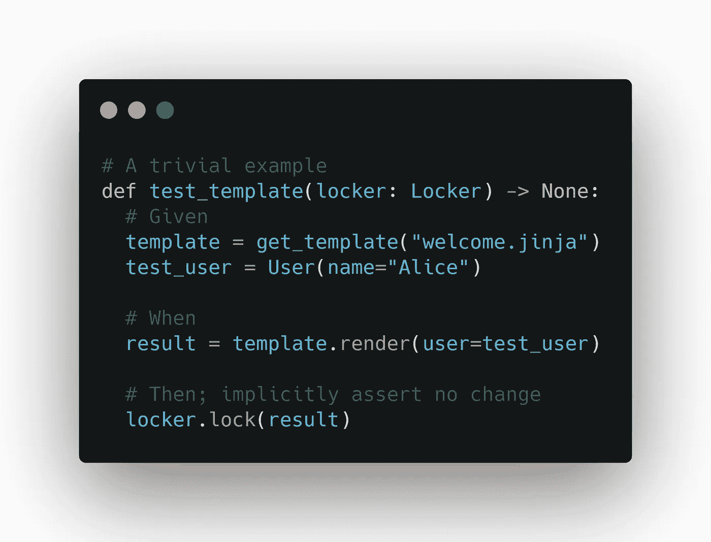

# 使用 Pytest-Locker 进行语用测试

> 原文：<https://betterprogramming.pub/pragmatic-testing-with-pytest-locker-e4d2588223f4>

## 锁定测试数据输出，提高测试效率

作者照片。

在本文中，我将介绍“锁定”输出的想法，本质上是断言自上次测试运行以来数据没有改变。这是在 [Pytest-Locker](https://github.com/Luttik/pytest-locker) 中实现的，这是一个“锁定”数据并与 [pytest](https://docs.pytest.org/en/stable/) 集成的包。虽然这违背了 TTD 的最佳实践，但它是省时的，提供了清晰性，并且在大量文本或数据的场景中非常有效——尤其是对于易变的界面。

开发代码时，人们总是在编写测试和编写代码之间寻找合适的平衡。此外，仅仅提高代码覆盖率并不是全部。同样重要的是，如果出现任何意外行为，测试就会失败。

# 斗争:当测试很乏味的时候

多年来，我一直在两个领域努力寻找正确的测试深度:

1.  包含大量文本的系统(例如聊天机器人)。
2.  具有在嵌套基础设施中共享数据的接口的系统。

如果出现以下一种或两种情况，情况会变得更糟:

1.  更有可能的是，需求发生了变化，而不是代码由于开发人员的错误而中断，这使得投入到测试中的时间更难证明是合理的。
2.  您正在与您不希望在测试期间遇到的外部服务进行交互(例如，因为您需要付费使用)。

在这些场景中，主要的问题是您需要大量的测试和大量的断言来覆盖所有的行为。

# 灵感:走向解决方案

当 Bryan Okken(来自 Python Bytes 和 Test&Code)说他的测试经验通常包括简单地运行代码并将代码的输出复制到断言语句中，然后对新代码进行测试时，我想到了一个解决方案。使用此工作流程，您可以有效地锁定行为。

这违背了 TTD 的红绿重构口号。但这实际上是许多软件工程师在做的事情。此外，虽然当您必须实现一个定义良好的契约时，这是没有意义的，但是当您正在尝试直到“它工作”时，这是有意义的在“它工作”的场景中，您只是想防止它不再工作。

尽管如此，这种 try-copy-assert 方法仍有一些改进的空间:

1.  如果任何阅读测试的人都清楚地知道使用了这种模式，这就太好了，这意味着它不是基于契约本身，而是断言错误可以被解释为行为改变的通知。
2.  它仍然需要运行、复制和将输出插入到测试中的手工步骤。
3.  在上面提到的场景中，您突然结束了大量的测试或者一个嵌套的字典弄乱了您的测试代码。

# 解决方案:Pytest-Locker

我的解决方案是 Pytest-Locker，它自动化并减轻了 try-copy-assert 方法的一些缺点。这个包相当简单。它公开了一个名为`locker`的 [fixture](https://docs.pytest.org/en/stable/fixture.html) ，该 fixture 又公开了一个名为`lock`的方法。

## 使用

1.  将`from pytest_locker import locker`添加到您的`[conftest.py](https://docs.pytest.org/en/2.7.3/plugins.html?highlight=re)`文件中。这确保了`locker`夹具在你的测试代码中随处可见。您也可以在您使用它的地方导入它。
2.  您在想要断言的数据上调用`locker.lock`。
3.  用`-s`或`--capute no`运行`pytest`。如果要锁定的对象还没有被锁定，那么仅仅运行 pytest 将会导致失败。`-s`允许 Pytest-Locker 提示用户允许或拒绝测试断言。当允许时，该结果被存储，并且在行为改变之前不需要`-s`。
4.  提交锁定的文件(存储在`.pytest-locker/`)。这不仅是 CI/CD 中测试成功的必要条件，也是在代码评审期间检查代码行为变化的影响的强大方法。

Pytest-Locker 的一个优点是，如果给定的字符串与存储的字符串不匹配，它不会失败。它显示一个 diff，如果可能的话，询问用户是否应该接受新的字符串。

## 一个例子

在下面的场景中，我们有一个想要填充的模板和一些填充它的测试代码。我们想要检查给定输入的模板。在本例中，`locker.lock(result)`行导致 pytest 断言`result`和`test.unit.test_template.1.txt`内容之间的变化。如果该文件尚不存在，它将提示用户接受或拒绝`result`并根据反应创建该文件。

上面的例子非常简单，但是 Pytest-Locker 对于编写更复杂的模板选择和填充逻辑(例如聊天机器人)来说非常有价值。

*注:更详细的例子可以在 GitHub* *上找到* [*。*](https://gist.github.com/Luttik/2ae284069aa88dde5f3e7340f03dd021)

## 另一个场景

我发现 Pytest-Locker 非常有用的另一个场景是当我必须使用 API 调用外部系统时，其中必须同时设置各种字段。当然，您不希望在测试时调用这些 API，但是您希望测试使用它的代码。我做的是用[修补](https://docs.python.org/3/library/unittest.mock.html#unittest.mock.patch)调用 API 的方法，使用 [MagicMock](https://docs.python.org/3/library/unittest.mock.html#unittest.mock.MagicMock) 并锁定将被发送给 API 的参数。

这样，我可能无法确保 API 调用会产生预期的行为，但我可以确保 API 以预期的方式被调用。

## 额外好处

Pytest-Locker 在使用 Given-When-Then 风格的测试(也称为 Arrange-Act-Assert)时带来了很多清晰性。根据我的经验，测试的“When”部分通常是一行，而使用 Pytest-Locker，测试的“Then”部分通常也是一行。这意味着你的大部分测试只是建立初始状态(GWT 模型中的“给定”)。

这意味着测试中最重要的部分,“何时”不再隐藏在两个长代码块之间。它可以很容易地作为测试的倒数第二行找到。

# 缺点

1.  代码需要确定性:虽然在许多场景中可以通过设置种子来减轻这种情况，但这并不总是可能的，而且可能比编写标准断言更麻烦。
2.  您必须将想要存储的对象序列化为一个字符串。这在 Python 中通常很简单。更好的是，如果您经常这样做，您甚至可以创建另一个继承自`Locker`的类，并使用相应的 fixture 自动进行序列化。然而，这仍然是一个问题，我将在下一节中进一步解决它。

# 我想补充的事情

仍有改进的余地。大部分都归结于与 pytest 的更好集成。

例如，如果您不必手动序列化对象，那就太好了。然而，自动序列化只是问题的一半。对象序列化后，您仍然希望给定对象和存储对象之间有一个清晰、可读的差异。这是 pytest 在断言失败时做得很好的事情。然而，我们希望在测试失败之前看到差异，以便用户可以接受更改。到目前为止，我还没有找到做那件事的任何方法。

此外，在检查更改之前，最好先看看哪些测试失败了，哪些成功了，哪些仍然需要注意(通过接受或拒绝对锁的更改)。我确实认为这在 pytest 中是可能的，但这似乎是一个庞大的、不平凡的任务(欢迎投稿)。

# 相关链接

 [## pytest-locker

### 测试锁可用于在测试期间“锁定”数据。这意味着不必手动指定…

pypi.org](https://pypi.org/project/pytest-locker/)  [## Luttik/pytest-locker

### 测试锁可用于在测试期间“锁定”数据。这意味着不必手动指定…

github.com](https://github.com/Luttik/pytest-locker)