# 用三次样条预测加密货币价格

> 原文：<https://betterprogramming.pub/predict-cryptocurrency-price-with-cubic-splines-275d109b9d65>

## 分段插值实用指南。Litecoin 价格预测的实用 Python 代码

在 [Unsplash](https://unsplash.com/) 上拍摄的 [ThisisEngineering RAEng](https://unsplash.com/@thisisengineering)

该实用指南提供了预测加密货币价格所需的基础知识。

15 年前，我开始探索数字货币的世界，并开发了一个仅使用短信的点对点移动货币平台。

最近，我的一位合作者问我，人工智能是否可以预测加密货币的价格。她对围绕区块链的大肆宣传感到好奇。

经过一些研究，我发现预测加密货币价格是一个可解决的问题，但肯定不是所有的市场条件。

加密资产的典型预测模型将利用时间序列预测(例如，ARIMA、[脸书预言家](https://facebook.github.io/prophet/))、机器学习(例如，随机森林、线性回归)或深度学习方法(例如，LSTM)。

在本文中，我研究了分段插值在预测给定日期[莱特币](https://litecoin.com/en/)的平均价格时的表现。

# 数据

我们将关注 2013 年 4 月至 2021 年 2 月莱特币的历史价格。该数据取自 [coinmarketcap](https://coinmarketcap.com/) 并且[可以免费使用](https://coinmarketcap.com/faq/)。我把数据分成 80%的训练数据集和 20%的测试数据集。后者用于评估我们预测收盘价的准确度。

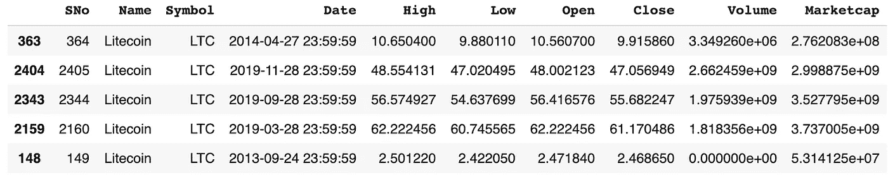

加密货币莱特币的价格历史(来源: [Kaggle](https://www.kaggle.com/sudalairajkumar/cryptocurrencypricehistory)

一个简短的探索性数据分析显示了平均收盘价如何在年初和年末最高。10 月份最低。

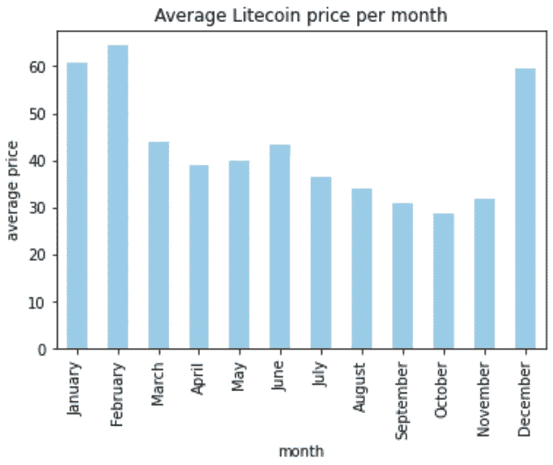

# 多项式回归

您可能听说过多项式回归，这可以说是创建一个阶为 *d* 的基来逼近一个非线性函数(在我们的例子中是加密货币价格波动)的最简单的例子。

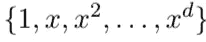

我使用 5、25 和 80 阶多项式对莱特币的历史价格进行了简单的多项式回归。在每种情况下，R2 分数将给出关于模型在测试数据集上的拟合优度的一些信息。

观察下面拟合训练数据的蓝线，我们可以观察到曲线随着多项式阶数的增加而增加。这是因为高阶多项式试图追踪训练集中的每个单个数据点，从而增加了模型的复杂性。

第 0 天表示 2013 年 4 月 30 日，第 2，800 天表示 2021 年 2 月 28 日。

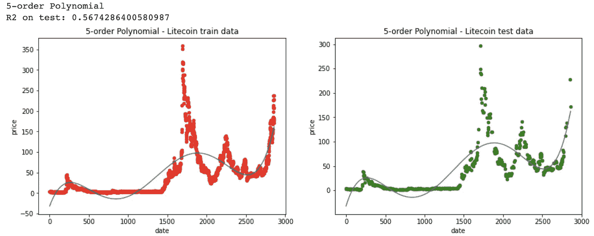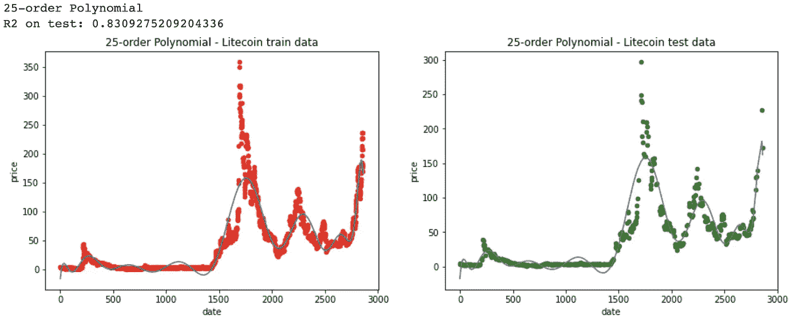

尤其是在有异常值的区域(图的中间部分)，更高次的多项式倾向于向那些异常值的方向发展。因此，具有 80 阶多项式的模型具有最高的方差。

与低阶多项式相比，它对训练数据的偏差最小，这体现在最高的 R2 分数上，低阶多项式具有较低的 R2，这意味着较高的偏差但较低的方差。低阶多项式对训练数据不太敏感。

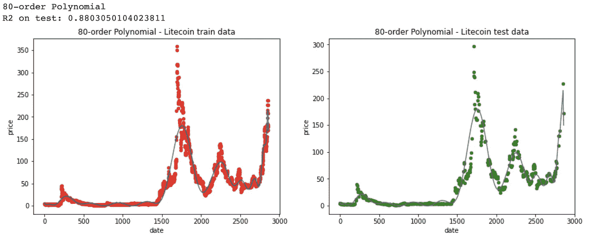

# 分段插值

我发现一种更灵活的方法是使用分段多项式来预测加密价格。

分段插值用低次多项式拟合大量数据点。由于我们只使用低次多项式，我们消除了过度的振荡和不收敛。

给定一组数据点，分段插值通过在数据的每个部分使用不同的多项式来工作。

特别地，我们使用连接的分段多项式，也称为*样条*。

样条的一个例子是下面的截断线性函数。它位于 4 的左侧，称为函数的*结*。

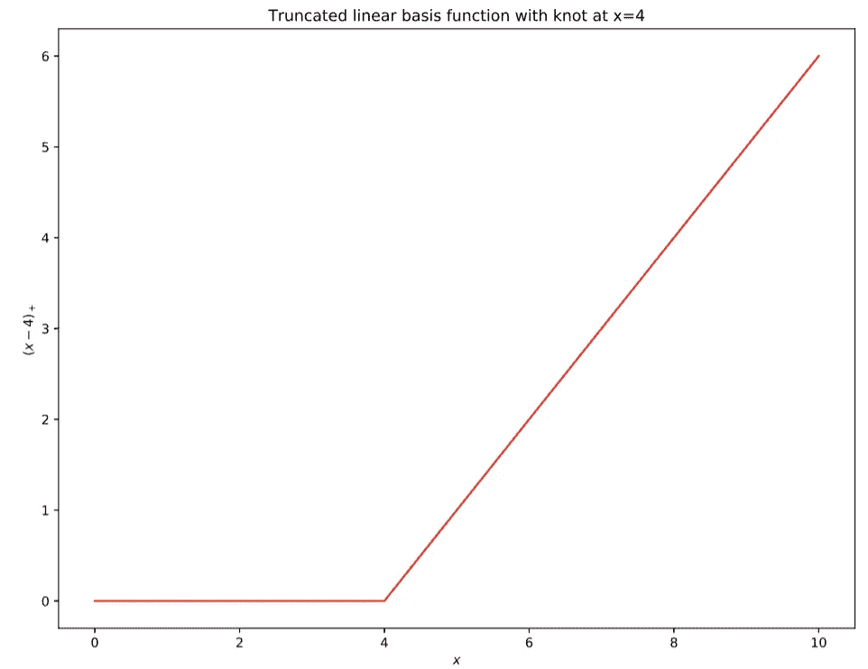

给定几个节点，我们可以组合多个线性基函数，并将它们拟合到非线性数据中。

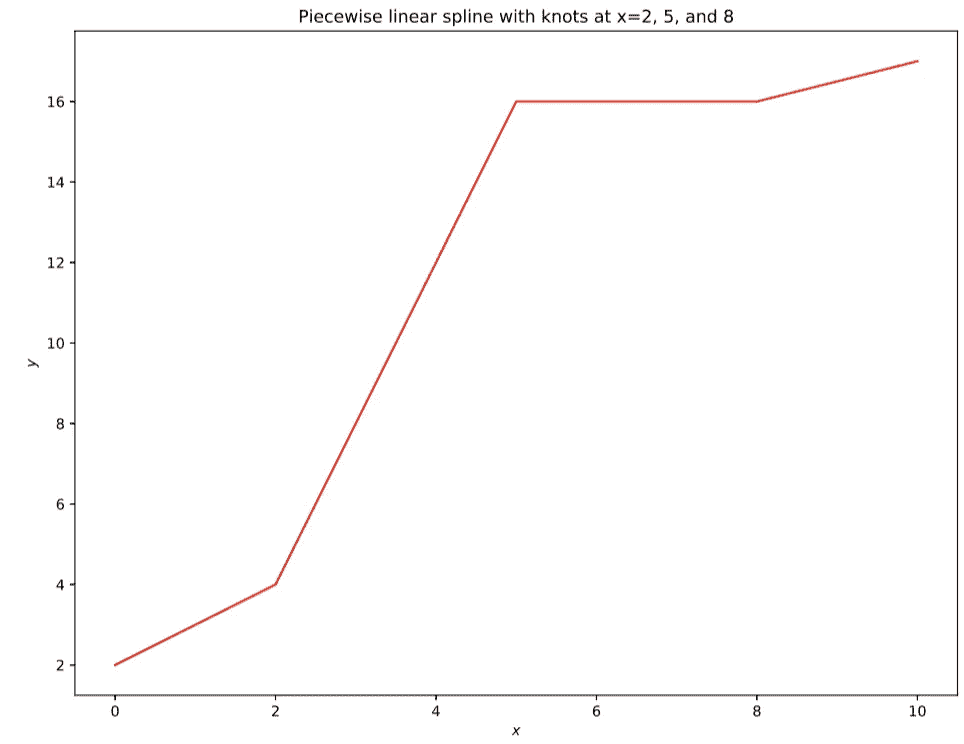

为了检测加密货币价格中存在的高度弯曲的关系，我使用了截断的三次函数，也称为*三次样条*。

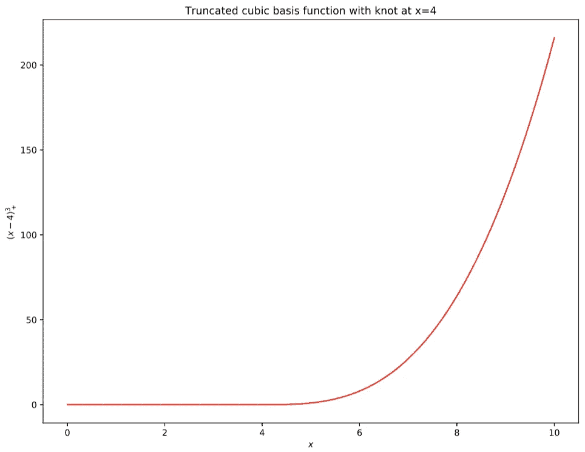

使用三次样条，我们将数据分成块，并为每个块拟合一个三次样条。每个样条函数都在节点处与下一个相连。

三次样条是加密货币价格变化的一个非常好的选择，因为连接是平滑的。三次样条及其一阶和二阶导数的斜率都匹配。三次样条是 3 阶多项式函数，仍然足够小以避免可变性。

*三次 B 样条*是用于高效计算的三次样条的一种更简单的变体，因为最多有五个基函数参与插值。我们可以看到在四分点上放置结后，三次 B 样条如何在下面的莱特币价格上表现。

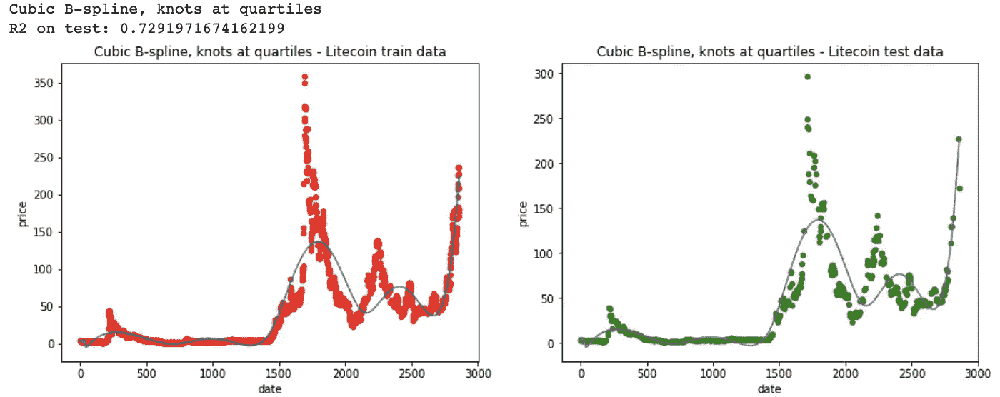

通过手动选择结，即，当我们有一堆数据点时，与基于四分位数放置结时的分数相比，我们在测试数据集上实现了更好的 R2。

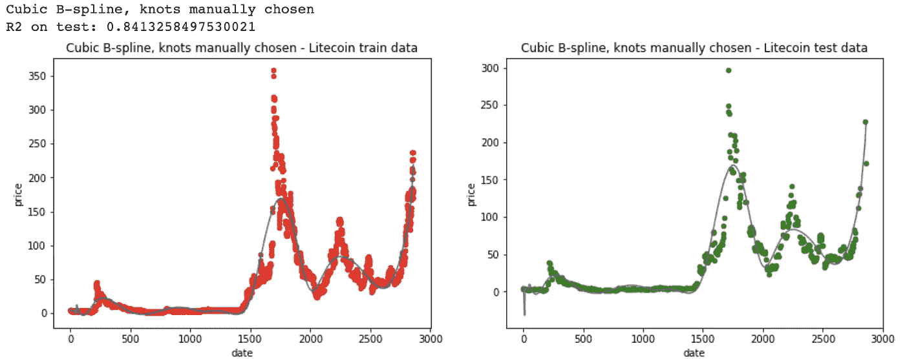

边界附近的三次样条曲线可以表现得很奇怪，正如你在上面的红色图中所注意到的。所谓的*自然三次样条*通过在每个极值处将三次多项式变为线性，强制函数在极值节点之外是线性的。

自然三次样条要求选择所谓的自由度。对于莱特币的价格，我通过交叉验证发现了最好的自由度:174 节是作为预测值的日期的合适选择分位数。结果是，与三次 B 样条相比，边缘处的可变性更小，但测试数据集上的 R2 稍差。

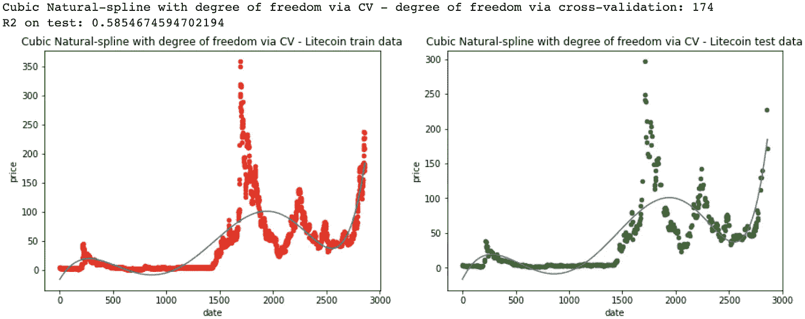

最后，我实现了*平滑样条*，它最小化了均方误差，同时惩罚了价格的变化。

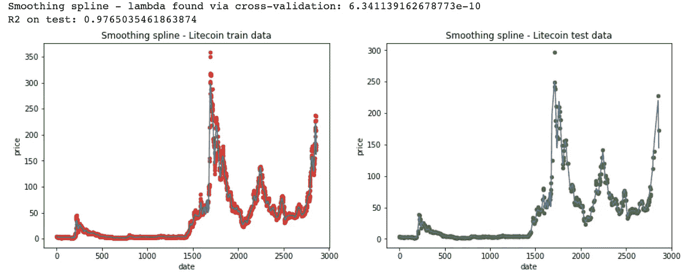

平滑样条似乎是莱特币价格最合适的分段插值。该模型在测试数据集上取得了迄今为止最好的 R2 评分。

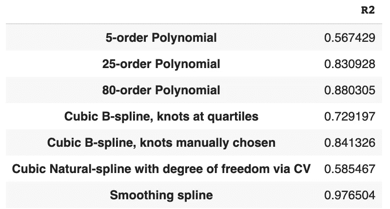

三次样条令人兴奋的部分是如何在用于训练模型的数据范围之外进行外推。

据以预测和时间序列工作而闻名的著名统计学家[罗布·金德曼](https://robjhyndman.com/publications/splinefcast/)称，三次平滑样条模型可以作为 [ARIMA 模型](https://en.wikipedia.org/wiki/Autoregressive_integrated_moving_average)的等效模型用于预测，但具有有限的参数空间。Rob 声称样条函数提供了一个平滑的历史趋势以及一个线性预测函数。

我邀请你进一步尝试这个想法。我的[计算机代码在网上](https://colab.research.google.com/drive/1rC830W23JrI8JtSj74lcZhdyABiSit3N)可以作为 Jupyter Python/R 笔记本在起点的伪装下获得。

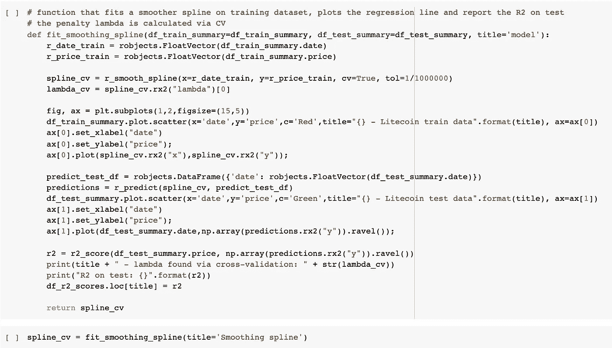

[本文使用的 Google Colab 笔记本](https://colab.research.google.com/drive/1rC830W23JrI8JtSj74lcZhdyABiSit3N)。

数字货币和加密货币(如莱特币)是现代全球经济中最具争议和最复杂的技术创新。本文旨在用一种不太流行的方法预测莱特币价格的变化:三次样条。