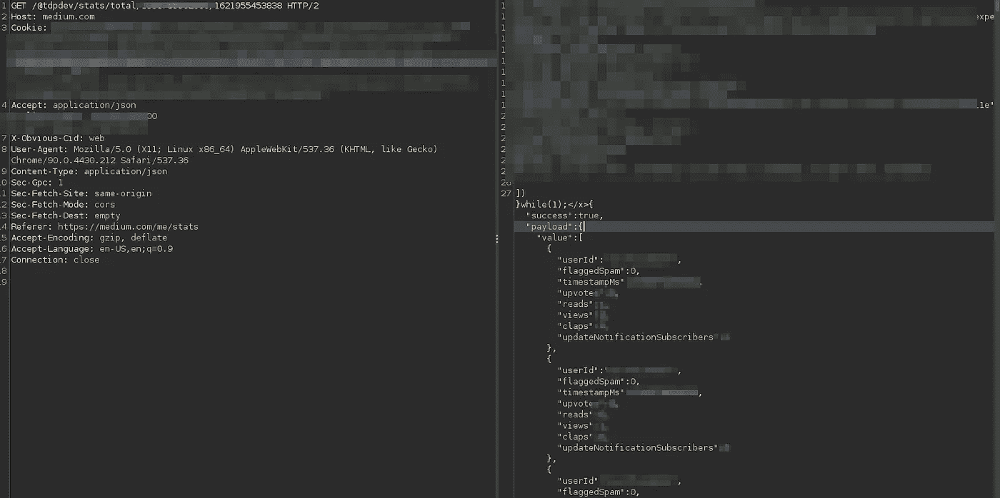
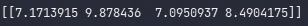

# 使用深度学习预测你未来的中等统计数据

> 原文：<https://betterprogramming.pub/predict-your-future-medium-stats-using-deep-learning-ce49bb3361ea>

## 使用一个简单的多层感知器和中等 API 来预测你的中等统计数据


雷蒙·克拉文斯在 [Unsplash](https://unsplash.com?utm_source=medium&utm_medium=referral) 上拍摄的照片。

最近几个月，我一直在努力提高我的深度学习知识——特别是掌握时间序列预测，我觉得这是所有分支中最有趣的一个。我是说，预测未来会发生什么似乎很酷。

为了测试我刚刚学到的技能，我决定实现一个简单的多层感知器来预测我未来的视图。

由于我创建这个深度学习模型只是为了在学习 MLPs 时有一些真实世界的问题经验，所以这个模型真的很简单。尽管如此，它最终可以成为未来项目的一个良好开端。

在这篇文章中，我将写下以下内容:

1.  问题概述
2.  数据析取
3.  数据准备
4.  构建模型
5.  训练和预测
6.  改进和未来工作

另外，你可以在[这个 GitHub repo](https://github.com/hensis/MLP_predict_medium_stats) 里找到所有的代码。

# 1.问题概述

MLPs 所做的基本上是近似一个从输入变量到输出变量的映射函数。由于 MLP 是一种神经网络，它不会对映射函数做出强有力的假设，因此是非线性关系的最佳选择。然而，不得不说的是，已经有很多研究投入到 MLPs 中，致力于解决时间序列问题，并取得了适度的结果。

我们正面临一个时间序列问题，因为我们希望能够使用某段时间内以前的视图数量来预测未来的视图。我们的数据集中有一个*时间依赖* 。

同样，由于这是一个非常简单的模型，我将只接受前一时间步的视图数作为输入，而不是，例如，我在那些时间步中写的文章数。所以，我们在讨论一个*单变量输入*。此外，我们希望能够预测尽可能长的时间。例如，我想对下一个*十个时间步*的视图进行预测。所以，假设每个时间步对应一天，我想预测接下来的十天。我们想要任意数量的输出，这也是一个*多步* 预测。

# 2.数据析取

在了解到我们想要的是一个*多步单变量预测*之后，我们可以继续从 Medium API 中提取构建数据集所需的数据。

第一步是获得我们的历史数据。我将在[介质](http://medium.com)上使用一个特殊的 API 端点来完成这项工作，因为官方的介质 API [不允许](https://github.com/Medium/medium-api-docs) us 检索这些数据。

端点看起来像这样:

```
/@username/stats/total/{start_timestamp}/{end_timestamp} 
```

例如，如果我想获得从 2020 年 3 月 1 日(时间戳中的`1583071962`)到撰写本文的当前时间(时间戳中的 2021 年 5 月 25 日— `1621955985` )的统计数据，调用的 URL 如下:

```
/@tdpdev/stats/total/158307196000/1621955985
```

长版是[https://medium . com/@ tdpdev/stats/total/1558789962000/1621955453838](https://medium.com/@tdpdev/stats/total/1558789962000/1621955453838)。

显然，我需要先被认证。原始请求如下所示:



1.我们从 JSON 加载数据，并将其存储为 NumPy `Array`对象。

有多种方法可以做到这一点:使用 python-requests，使用 JavaScript 的`fetch`方法，等等。然而，为了确保你真的明白到底在抓取什么数据，我将在 Chrome 开发者工具的帮助下手动*完成。*

1.  打开 medium.com/@{username}/stats/total/{start_ts}/{end_ts}.如果您被认证为{用户名}，您将看到加载的 JSON 数据。
2.  打开开发工具，使用 JavaScript 中的`for`循环，我们将构建一个所有视图的列表:

```
all_views = []
for (i=0; i < json.payload.value.length; i++) {
    all_views.push(json.payload.value[i].reads)
}
```

这将建立我们的列表。现在我们要复制它:

```
copy(all_views)
```

最后，我们要将复制的数据转换成单行数据。我们可以使用[文本到一行](https://lingojam.com/TexttoOneLine)。

一旦我们做到了这一点，我们就有了一个在`start_timestamp`和`end_timestamp`之间每小时的阅读列表。

3.将其粘贴到 Python 文件中。

同样，我建议您使用另一种更简单、更快速的方法，比如 python-requests 或者甚至 JavaScript `fetch` API。

# 3.数据准备

我们现在想为我们的 MLP 准备数据。为此，我们将构建一个如下所示的数据集:

```
X, y
[ 2 10 10  7 12  6 11 30 10 19] [35 22 15 17]
[10 10  7 12  6 11 30 10 19 35] [22 15 17 19]
[10  7 12  6 11 30 10 19 35 22] [15 17 19 23]
[ 7 12  6 11 30 10 19 35 22 15] [17 19 23 17]
```

诸如此类。

这意味着我们的 MLP 将使用过去十个小时的读数来预测未来四个小时的读数。当然，您可以将此更改为您喜欢的任何值(考虑到模型的准确性)。例如，您可以使用过去的 48 小时来预测未来的 12 小时。

这段代码将完成这项工作。我不会深入解释这段代码做了什么，因为它非常简单:我们得到了每小时所有视图的列表(`all_views`)，然后我们使用一个`for`循环将数据分成 *X* (用于预测`y`的输入)和 *y* (我们的输出)。注意这两个是 NumPy 数组。

既然我们已经准备好了数据，我们就可以构建模型了。

# 4.构建模型

我们将创建一个非常简单的 MLP。它只有一层(不包括输入和输出层):

```
model = Sequential()
model.add(Dense(100, *activation*='relu', *input_dim*=10))model.add(Dense(200, *activation*='softmax'))
model.add(Dense(4))
model.compile(*optimizer*='adam', *loss*='mse') 
```

我们使用 Keras 创建了一个`Sequential()`模型，然后添加了一个带有`[relu](https://machinelearningmastery.com/rectified-linear-activation-function-for-deep-learning-neural-networks/)`激活的输入层([整流线性单元](https://machinelearningmastery.com/rectified-linear-activation-function-for-deep-learning-neural-networks/))。之后，我们添加了一个输入层，接受输入`10`的*形状*，这正是`X`数组的形状。在输入层之后，我们添加一个隐藏层，使用 [softmax](https://towardsdatascience.com/softmax-function-simplified-714068bf8156) 作为激活函数。然后我们直接添加了输出层，它将返回给我们`4`输出。最后，我们编译了模型。

# 5.训练和预测

在构建和编译模型之后，我们可能想要拟合它:

```
model.fit(X, y, *epochs*=2000, *verbose*=2)
```

一旦模型经过训练，我们现在就可以根据过去十个小时的视图对未来四个小时进行预测。

```
x_input = array([3, 5, 7, 2, 9, 10, 2, 6, 4, 9])
x_input = x_input.reshape((1, 10))
```

我们首先构建一个数组，用于预测接下来四个小时的视图。然后我们重塑它，使它可以被我们的模型处理。

最后，使用 MLP，我们计算这些视图在过去十个小时内的预测值(`[3, 5, 7, 2, 9, 10, 2, 6, 4, 9]`):

```
yhat = model.predict(x_input, *verbose*=2)
```

我们的`yhat`(回归中的预测(因变量)将是我们的`x_input`的预测。

您现在可以打印`yhat`，这样您就可以看到在接下来的四个小时里有多少视图被预测。

这是基于`x_input`预测的示例输出:



```
[[7.1713915 9.878436  7.0950937 8.4904175]]
```

*请注意，由于模型的性质，您的结果可能与我的不同。*

## 完整代码

# 6.改进和未来工作

正如我最初所说，这是一个非常简单的模型。许多人的浏览量各不相同，但这有许多原因(例如，撰写文章的数量、在媒体上的份额数量等。).事实上，开发这个模型只是为了在时间序列上进行实践，本文将向您展示如何轻松地收集数据并将其转化为时间序列多步数据集。然后，我向您展示了如何使用 Keras 轻松实现多层感知器并预测未来值。

至于改进和未来的工作，您当然可以花更多的时间来准备数据，因为我在本文中使用了原始数据。您还可以尝试为时间序列实现其他执行的 nn(CNN、LSTMs)。你可能也想把它变成一个多变量预测，这意味着这个模型不仅要考虑浏览量，还要考虑文章数、分享数和许多其他可能导致阅读数变化的变量。那会花很多时间，但可能是值得的！