# 使用自然语言处理预测歌曲的类型

> 原文：<https://betterprogramming.pub/predicting-a-songs-genre-using-natural-language-processing-7b354ed5bd80>

## 有些歌词在某些流派中出现的频率会比其他流派高吗？

我一直很好奇如何量化单词之间的意义或关系。毕竟，我习惯于处理数字或将变量编码为数字，并将其输入统计和机器学习模型。因此，为了找到答案，我选择在 Python 课程的其他机器学习主题中学习自然语言处理(NLP)。

我和我的队友对探索一首歌的歌词和它的体裁之间的关系很感兴趣。我们的目标是建立分类器，学习给定主题中流行的歌词，仅通过歌词来预测歌曲的流派。以下是我们报告的一些精简概要，其中我删减了所涉及的统计/机器学习概念的详细解释。

# 数据

我们使用了来自 www.kaggle.com[的数据集，名为“来自都市歌词的 380，000+歌词”Kaggle 用户 GyanendraMishra 创建了这个数据集，以探索某些流派的艺术家和常见滥用物质之间的相关性。该数据集包含来自 18，231 位艺术家的 362，237 首歌曲，每首歌曲有六列:歌曲索引、标题、发行年份、艺术家、流派和歌词。数据库中的所有歌曲都是在 1968 年至 2016 年之间发行的，不包括几首被错误标记为无效年份的歌曲。](http://www.kaggle.com)

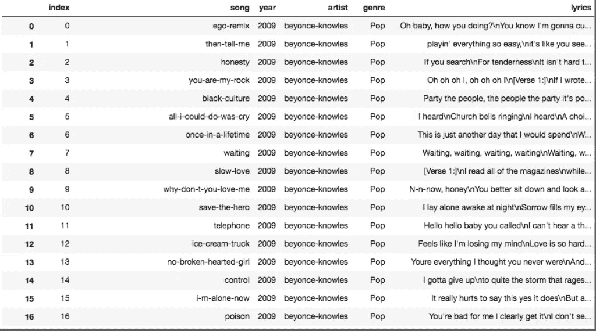

数据集的片段

# 数据集的问题

## **1。歌词直接取自都市歌词**

GyanendraMishra 直接从 MetroLyrics 上刮来歌词。这是一个问题，因为 MetroLyrics 通过用户输入建立数据库。虽然他们声称有一个使用内部审查人员的强大审查流程，但这足以引起我们的关注。用户输入允许人为错误，如拼写单词不同，尤其是口语。有些单词也是用俚语拼写，而不是字典拼写，这可能会导致错误计数。

## **2。并非所有歌曲都是英文的**

我们发现了许多其他语言的一些歌曲，不幸的是，dataframe 没有提供指示歌词语言的列功能。这有几个问题:

*   其他语言中的单词可能与某些英语单词拼写相同，然后被归类为相同的单词，这可能会误导分析。
*   在两种不同语言中意思相同的单词可能被归类为两个不同的单词。这是误导，因为它们应该被认为是相同的。
*   我们只删除了歌词中的英文停用词；我们无法从不同的语言中删除停用词

因此，这些非英语歌曲对于解释基于歌词的体裁没有价值，因为我们不能准确地处理它们。

## **3。倾斜数据集**

数据集严重偏向摇滚(131，377 首歌曲；36.27%).其他流派，如 R&B 和独立音乐，大约占样本的 1-2 %,总共有近 6000 首歌曲。这种数量上的差异使我们的模型比其他流派更准确地预测摇滚。

我们试图创建一个平衡的数据集，这样我们就可以用每个流派相同数量的歌曲来训练我们的模型；然而，流派*独立*在清理后的数据集中仅包含约 2000 首歌曲，这意味着平衡的数据集将仅包含不到 20，000 首歌曲。决定不丢弃成千上万的合格数据点，我们决定保持我们的数据集不变，并产生结果，尽管有这种限制。

# 数据清理

由于我们的数据集的限制，我们不得不做一些争论来准备数据进行分析。我们必须理解文本中任何预先存在的格式或模式，并检查异常情况。我们必须仔细考虑在每个清理步骤中要忽略多少和什么样的信息。

## **1。删除不需要的信息**

最初，我们的数据集包含每首歌曲的以下信息:歌曲索引、标题、发行年份、艺术家、流派、歌词。按歌词给歌曲分类，我们要重点看流派和歌词。我们认为发行的标题和年份不应该表明类型，假设每种类型的生产随着时间的推移保持一致。一个艺术家也可以写多种风格的歌曲，所以我们在这个分析中省略了艺术家特性。

## **2。排除歌曲缺失信息**

一些歌曲缺少流派，所以我们从数据集中排除了它们。我们删除了流派分类为“不可用”(29，814 首)和“其他”(23，683 首)的歌曲，因为我们只对既有歌词又有流派的数据感兴趣。此外，一些流派要么定义不明确，要么歌词不是很重，所以我们从我们的数据集中排除了这些歌曲。被排除的流派有其他、电子和爵士乐。

## **3。改变流派分类**

有些体裁在风格上非常相似，所以我们把它们归为一类，希望能简化我们的分析。流派组合:

*   “民间”与“乡村”→“乡村”
*   “摇滚”和“金属”→“摇滚”

## **4。将歌词符号化**

我们对歌词中的每个词进行了标记，为即将到来的数据清理步骤准备数据集，例如删除停用词和更改歌词格式。使用 NLTK 包，将大量歌词分割成列表中的单个单词非常简单。

## **5。标准化歌词格式**

并非所有歌词的格式都相同；有大写字母和小写字母的混合，还有一些包含特殊字符。我们把所有的歌词都改成小写，并去掉了任何特殊字符。

## **6。删除停用词**

歌词包含我们认为没有用的停用词。停用词对于训练我们的模型没有价值，因为它们非常常见，并且不能提供有价值的含义或情感指标。我们从歌词中删除了所有 179 个停用词，包括:

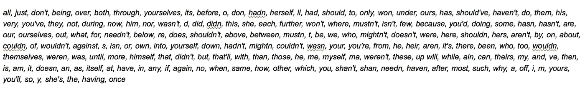

我们从`nltk.corpus`导入了这个预置的停用词列表。

## **7。歌词释义**

歌词中的一些词是同一个基本词的不同形式。比如*走*、*走*、*走*都是*走*的形式。

我们将这些单词的所有变体都更改为同一个基本单词(在本例中，是 *walk* )，以便更好地校准我们的数据，从而将不同的时态或复数形式解释为同一个单词。这是基于这样的假设，即这些形式的单词在整个歌词的上下文中具有相同的含义。

# 一些可视化

清理完数据后，我们制作了一些条形图来感受一下我们堆积如山的歌词语料库:

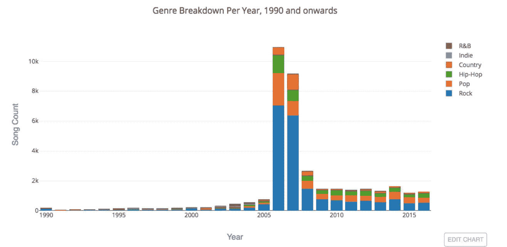

上图显示了每年发行的歌曲数量以及每种类型所占的比例。我们可以看到在 2006 年和 2007 年的一个大高峰，在此期间，大多数歌曲被归类为摇滚。嘻哈风格似乎主要由 1987 年至 1997 年间发行的歌曲组成。该国在 1998 年至 2001 年间出现了一个小高峰。从 2005 年到 2016 年，似乎大多数发行的歌曲要么是摇滚，要么是流行。

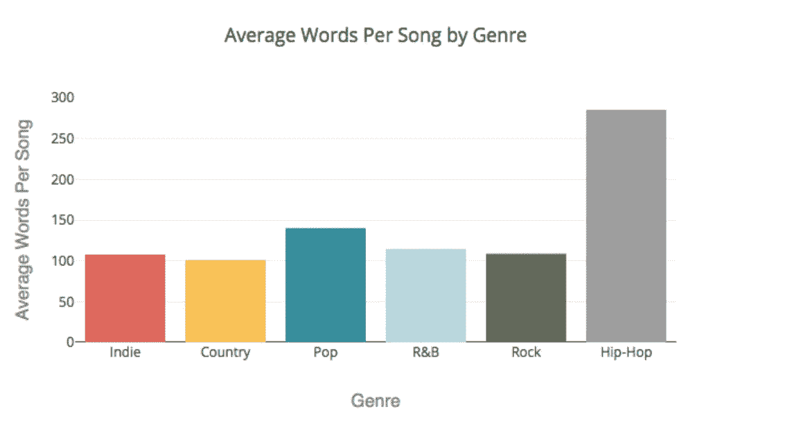

不出所料，摇滚包含了最多的单词和最独特的单词，这可能是因为我们的数据集中有大量的摇滚歌曲。Hip-Hop 是单词和独特单词数量第二多的流派，尽管它在歌曲数量方面排名第三。我们认为这可能是因为嘻哈歌曲往往包括说唱，这通常需要在短时间内大量的单词。

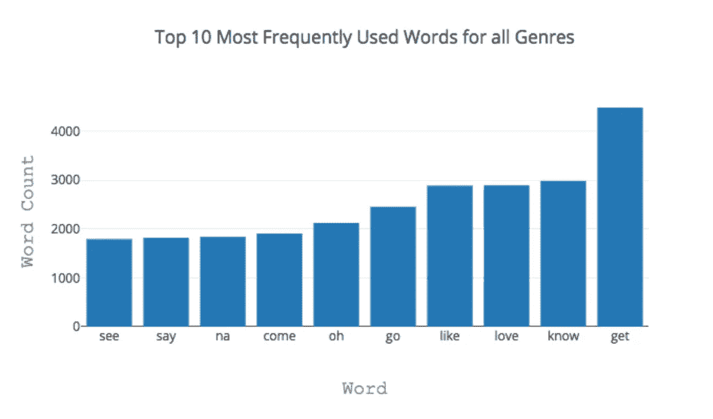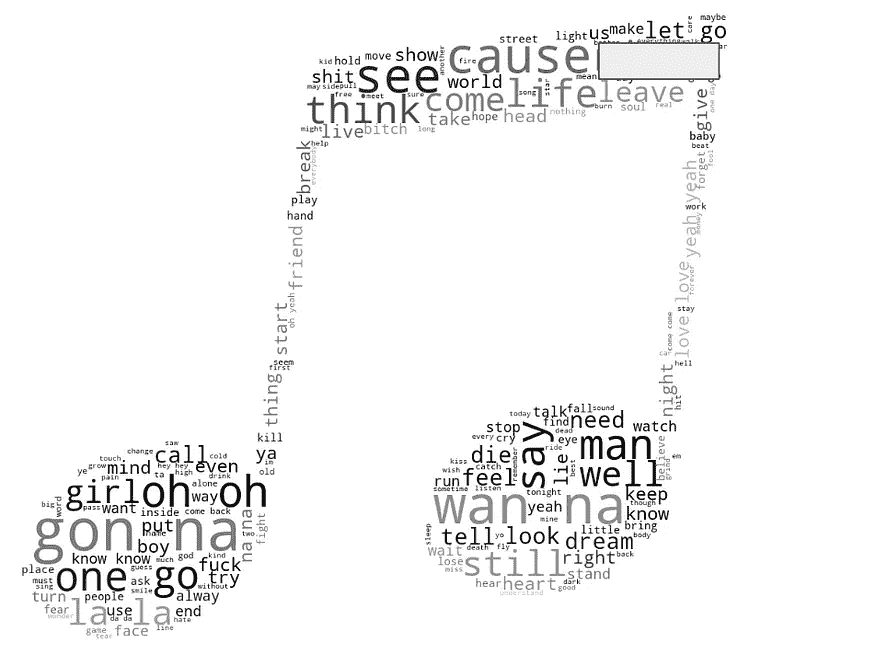

数据集中最常见单词的条形图和单词云

上面我们看到了数据集中最常见的单词。我们每天常用的词也往往会出现在歌词中。我们也看到前十名中的一些单词可能是用于听觉目的，而不是传达意思，比如 *oh* 和 *na* 。

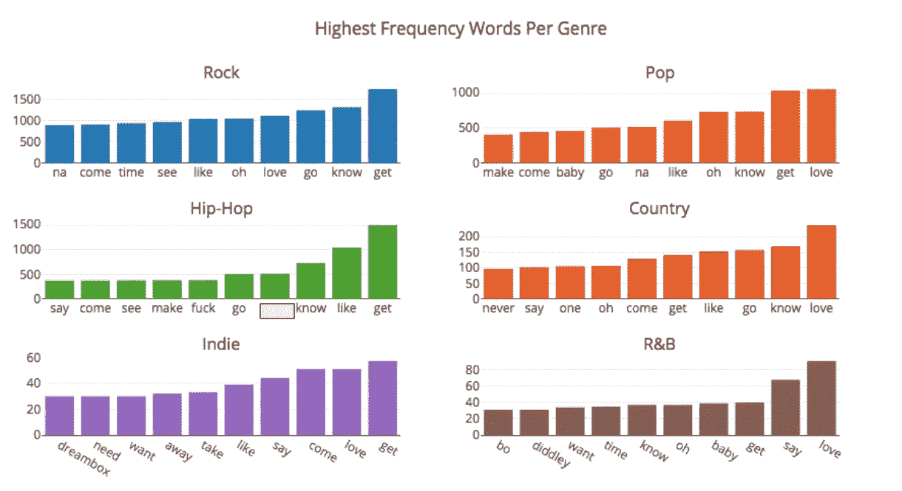

每个流派中出现频率最高的词的条形图

为每种类型制作相同的条形图，我们看到前十名的种类更多。我们在最通用的单词中看到一些相似之处，例如 *know* 和 *get* ，但是我们在一种体裁中看到一些更特殊的单词，例如 *diddley* 和 F-word。

## 词汇云

我认为在幻灯片上显示六个条形图会伤害人眼，所以我想用一种更吸引人的形式来展示我们的大量条形图。我摆弄了一下 wordcloud 软件包，用它来说明每种文体中最常见的单词，并定制了每种云的形状:

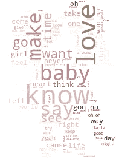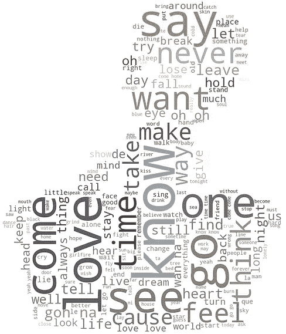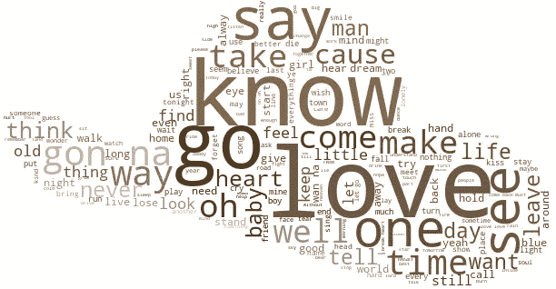

从左到右:R&B，独立，国家

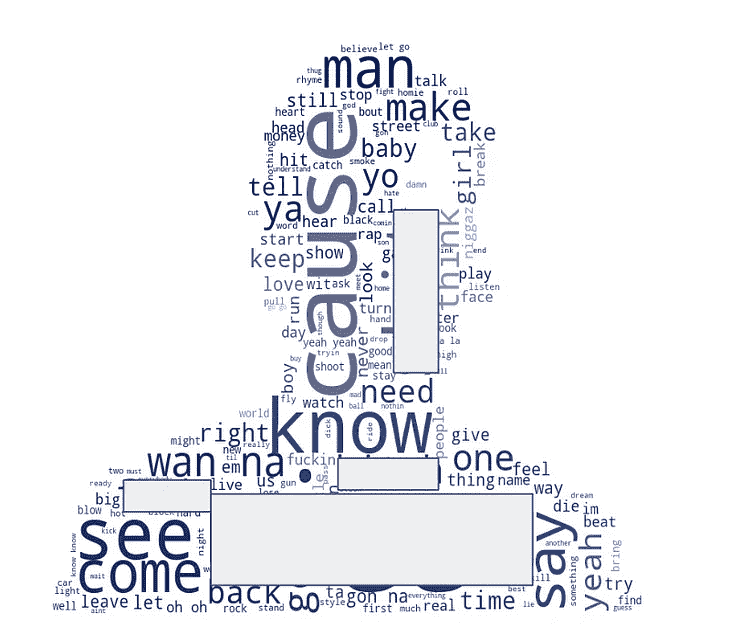

从左到右:摇滚、嘻哈、流行

这是一个简单的步骤，在我们的演示中证明是有效的。

# 使用 TF**–**IDF 进行特征提取

特征工程/提取是最具挑战性的，对于我们理解机器学习和文本数据尤为重要。特征提取旨在将原始文本转换为能够很好地表示信息的数字，即量化文本中的签名词。

## ***【TF】***

这将统计一个词在给定歌曲中的出现次数，从而说明该词在文本中的重要性。它假设如果一个词出现很多次，那它一定很重要。

## 反向文档频率(IDF)

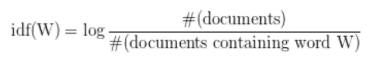

这度量了给定单词在整个文本中的信息量。对于要成为签名的给定单词，它必须在一种文本中明显出现，而在其他类型中较少出现。因此，签名词的文本文档频率必须低，其 IDF 必须高。

## 术语频率–逆文档频率(TF–IDF)

tf–idf 值是 TF 和 IDF 指标的乘积。它随着单词在文档中出现的次数成比例地增加，并被包含该单词的文档(在这种情况下是歌词)的数量所抵消，这有助于调整某些单词通常更频繁出现的事实。数字权重值越高，术语越罕见。重量越小，该术语越常见。换句话说，TF-IDF 对文本术语矩阵进行了规范化。文本中具有高 TF-IDF 的单词是签名单词，因为与其他单词相比，它大多出现在该体裁中。

# 模特们

为了简洁起见，本文只讨论了我们尝试的三种模型。

基于我们的研究，我们决定比较几种朴素贝叶斯分类器，因为已知它们在文档分类和文本分析中表现良好。朴素贝叶斯分类器使用贝叶斯定理来计算歌词属于给定特征的流派的概率，假设每对特征是有条件独立的(这是*朴素*部分)。分类器还假设单词的位置无关紧要(*单词袋*假设)。然后，分类器通过最大化关于参数的概率的对数似然，使用最大后验概率(MAP ),选择歌词可能属于的具有最高概率的流派，来进行预测。

总之，朴素贝叶斯分类器是概率分类器，其使用贝叶斯定理计算每个类别的概率，并输出具有最高概率的类别。

以下是关键步骤:

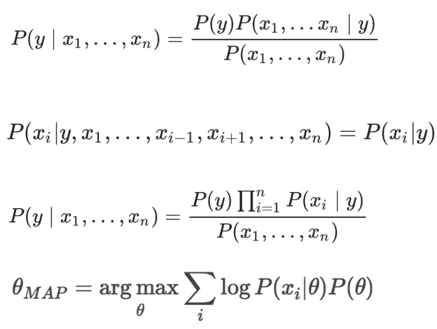

根据贝叶斯定理，给定类别变量 *y* 和从属特征向量 X *1，…，Xn*

我们可以使用天真的条件独立性假设。

这种关系就简化为这个等式。

一旦计算了所有的先验和条件概率，就可以计算每个类的先验和可能性，并选择概率最高的一个。

## 多项式朴素贝叶斯

多项式朴素贝叶斯在自然语言处理中有着广泛的应用。该模型将数据视为离散数据，每个条件概率 *P(Xi|y)* 都是多项式分布。这对于可以很容易地转化为计数的数据很有效，这对于我们使用某些歌词的频率来预测流派的情况很合适。

## 2.伯努利朴素贝叶斯

这将数据视为二进制，或者只能取两个值。在这种情况下，它通过为每个单词生成一个指示符(1 表示该单词在文本中存在，0 表示不存在)来将歌曲分类为流派或非流派。

伯努利模型与多项式模型具有相同的时间复杂度，但其不同的生成模型意味着不同的估计策略和分类规则。当对文本文档进行分类时，伯努利模型使用二进制出现信息，忽略出现次数，而多项式模型跟踪多次出现。因此，伯努利模型在对长文档进行分类时更容易出错。

## 3.逻辑回归

除了朴素贝叶斯分类器之外，我们还试图拟合逻辑回归。

逻辑回归对一首歌曲属于某一流派的概率进行建模。它是一种线性方法，使用 softmax 函数进行预测，并通过使用最大似然估计最大化给定歌词特征的流派概率来分配类别成员。

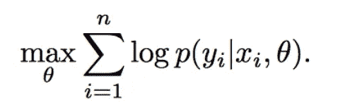

这是为了解释点的概率，而不是像线性模型那样只看点本身。该模型通过使用`multi_class = ‘ovr’`使用一对其余方案；每个`class(genre)`都有自己的一组通过 MLE 计算的参数值。

与朴素贝叶斯分类器相比，逻辑回归对相关特征更具鲁棒性。如果两个特征 *X1* 和 *X2* 完全相关，回归将部分权重分配给 *W1* 和部分权重分配给 *W2。*当有许多相关特征时，或者在这种情况下是单词时，逻辑回归将分配比朴素贝叶斯分类器更准确的概率。一般认为，逻辑回归在较大的文档中工作得更好。

# 结果

对于所有模型，我们使用样本的 30%的测试规模和 70%的训练规模。我们通过使用来自 *sklearn.metrics* 的`accuracy_score`来评估每个模型的准确性。这是一个计算子集准确度的函数，这意味着预测的标注必须与提供的实际标注完全匹配。*准确率*是正确预测的标签的分数，定义为(真阳性+真阴性)/(真阳性+真阴性+假阳性+假阴性)。

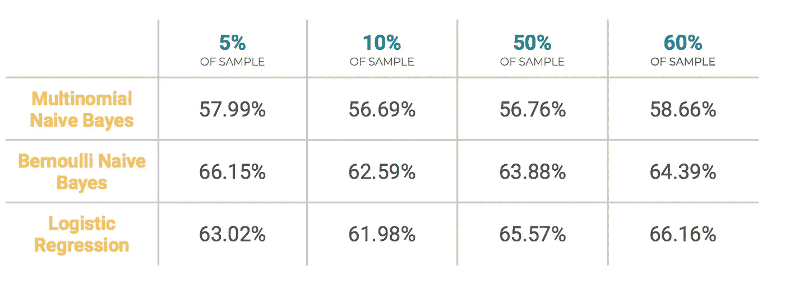

三种模型的准确性，不同的样本量

我们还使用了来自 *sklearn.metrics* 的`classification_report`，它生成了一个包含关键分类指标的报告，比如精度、召回率和 F1 分数。在最初的项目中，我们对每个模型的分类报告进行了相互比较分析。

下面我将只包括我们最精确的模型*逻辑回归*的结果作为例子。

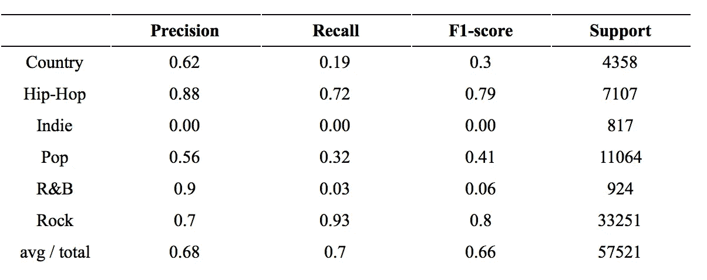

逻辑回归的分类报告片段

*   **精度**是实际为阳性的预测阳性事件的分数，定义为真阳性/(真阳性+假阳性)。
*   **回忆**(也称为敏感度)是正确预测的阳性事件的比例，定义为真阳性/(真阳性+假阴性)。
*   **F1-score** 是查全率和查准率的调和平均值，定义为(2 *查准率*查全率)/(查准率+查全率)。支持度是位于该类中的真实标签的样本数。最后一行 avg / total 提供了精确度、召回率和 F1 分数的加权平均值，支持度是权重。

此外，我们为每个模型生成了一个**混淆矩阵**，以了解他们如何在微观层面对数据进行分类。

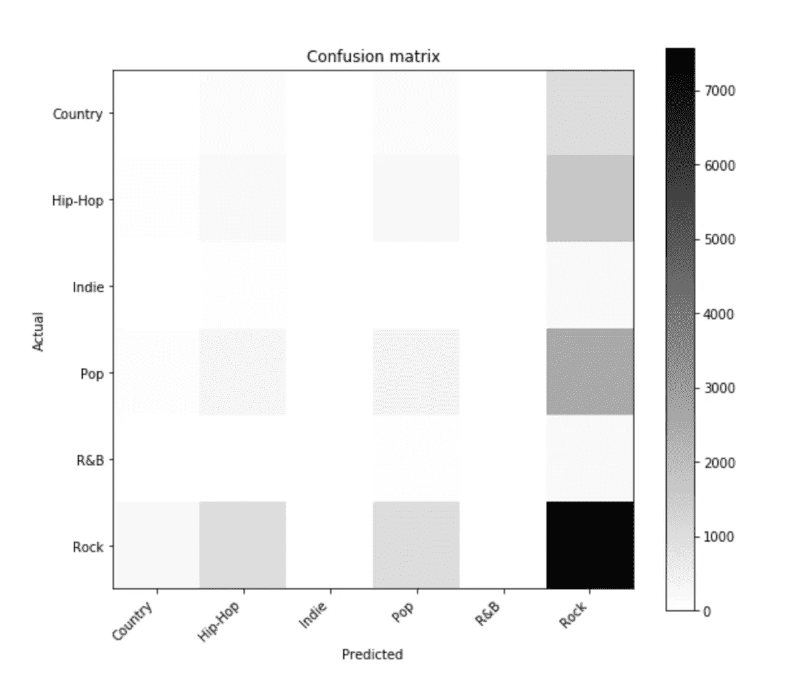

逻辑回归的混淆矩阵

我们还创建了一个图表，以查看我们使用的总样本部分如何影响我们模型的准确性。这些图表以 10%的增量计算了模型的准确性，从样本的 10%到 100%。

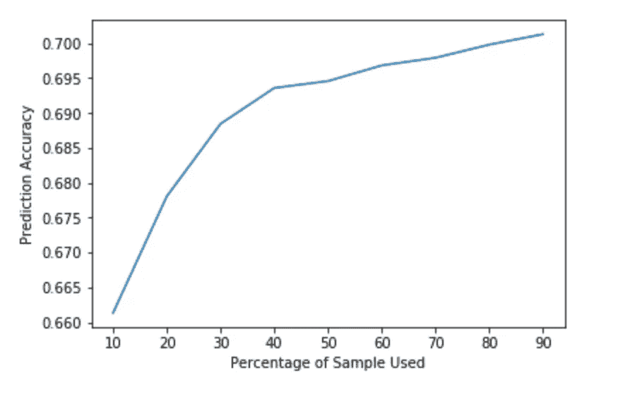

预测精度与使用逻辑回归的样本百分比

## 分析我们的结果

从歌词中确定歌曲风格的最准确方法是*逻辑回归，*如准确度表所示。这意味着当歌词出现在多个流派中时，逻辑回归考虑歌词属于每个流派的可能性，而不仅仅是贪婪地选择单一流派；每种类型都可以相互依赖。

虽然有些方法比其他方法更好，更适合这个程序，但程序的准确性从未真正偏离 60–70%。当我们遇到其他几个机器学习项目来对歌词进行分类时，我们发现大多数项目都会产生类似的精度范围。我们对原因有一些猜测:

*   **一首歌的歌词和它的体裁没有很高的相关性。**这大概是因为每个体裁中很多最常见的词也是其他体裁中最常见的词。例如， *make* 作为一个最常见的单词出现在程序所使用的每一个流派中。这意味着，尽管某些歌曲被归类为不同的流派，但它们也可能唱出相同的东西。这将进一步意味着一首歌曲的风格更依赖于它的听觉成分，如乐器和音乐量度(即音高、节奏等。)而不是像歌词这样的文学作品。
*   **训练数据集中的流派并不像最初认为的那样定义明确。**由于 MetroLyrics 在数据集中预先确定了流派，因此用户报告的流派可能不准确。

尽管如此，60-70%的准确率范围表明，虽然歌词可能无法确定歌曲的风格，但不同风格的歌词之间存在一些差异。这意味着某一特定流派的歌曲比属于不同流派的歌曲更有可能是关于某一特定主题的。

## 工作进展

我们的项目有许多进一步探索和改进的机会。说我们是 NLP 的新手是一种保守的说法——在一个快速发展的领域，我们还有很多东西要学。在写作的时候，我们记下了一些我们有兴趣尝试的事情:

*   尝试二元语法，n 元语法:我们可以计算单词序列，而不是考虑单个单词；即除了单个单词之外还考虑短语作为特征。
*   **细化预处理步骤:**研究识别和排除离群值的方法，检测和忽略非英文歌词以及“无意义”歌词，如 *oh* 、 *na* 、 *ye* 等…
*   **寻找更多可能产生更高精度的模型:** Word2Vec 特征提取、神经网络、决策树……我们还没有在我们的项目中尝试不太常见的方法，这些方法可能会产生更高精度的模型。
*   **探索发行年份、歌曲名称、艺术家和流派之间的相互作用:**通过创建更多的数据可视化，并通过更多的功能运行我们当前的方法，我们希望将这些发现联系起来，以讲述一个有凝聚力和洞察力的故事。

## 未来应用

*   除了歌词之外，利用**音频文件特征**将歌曲分类到它们各自的流派。我们目前的分析完全忽略了一首歌曲丰富的听觉特征，这些特征对于流派分类是有价值的。
*   试着根据**发行年份对歌词进行分类。**有些流派在某些年份可能比其他年份更受欢迎，因此添加发行年份作为特色可能会有所帮助。
*   **歌词上的情感分析**；将歌词分为消极、积极或中性可能对研究一个流派的共同情感很有意义。

P.S .这个项目是为我的 Python 类(PIC16)和我的另外两个了不起的队友 Emma 和 Kiyasha 一起完成的！非常感谢你长时间的辛勤工作，以及最初的疯狂想法。

# 参考

*   1.9.朴素贝叶斯。(未注明)。检索于 2019 年 3 月 19 日，发自[https://scikit-learn.org/stable/modules/naive_bayes.htm](https://scikit-learn.org/stable/modules/naive_bayes.html)l
*   Python 中的决策树分类。(未注明)。检索于 2019 年 3 月 19 日，来自[https://www . data camp . com/community/tutorials/decision-tree-classification-python](https://www.datacamp.com/community/tutorials/decision-tree-classification-python)
*   用 Python 生成单词云。(未注明)。检索于 2019 年 3 月 19 日，来自[https://www . data camp . com/community/tutorials/word cloud-python](https://www.datacamp.com/community/tutorials/wordcloud-python)
*   龙，A. (2018 年 08 月 05 日)。了解 Scikit 中的数据科学分类指标-了解 Python。检索于 2019 年 3 月 19 日，来自[https://towardsdatascience . com/understanding-data-science-class ification-metrics-in-sciki](https://towardsdatascience.com/understanding-data-science-classification-metrics-in-sciki)T-learn-in-python-3bc 336865019
*   使用 NLTK 的初学者文本分析。(未注明)。检索于 2019 年 3 月 19 日，来自[https://www . data camp . com/community/tutorials/text-analytics-初学者-nltk](https://www.datacamp.com/community/tutorials/text-analytics-beginners-nltk)
*   伯努利模型。(未注明)。2019 年 7 月 24 日检索自[https://NLP . Stanford . edu/IR-book/html/html edition/the-Bernoulli-model-1 . html](https://nlp.stanford.edu/IR-book/html/htmledition/the-bernoulli-model-1.html)