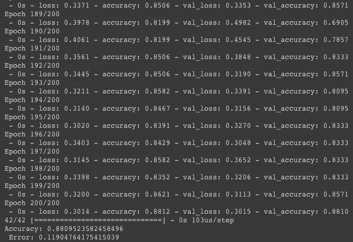

# 用神经网络预测心脏病

> 原文：<https://betterprogramming.pub/predicting-heart-disease-with-a-neural-network-a48d2ce59bc5>

## 用 Python 神经网络预测患心脏病的概率


由[肯德尔](https://unsplash.com/@hikendal?utm_source=medium&utm_medium=referral)在 [Unsplash](https://unsplash.com?utm_source=medium&utm_medium=referral) 拍摄的照片

在冠状病毒肆虐的这些日子里，很多医院人手不足，处于水深火热之中。人手不足导致了许多问题。并不是所有的病人都能得到治疗，医生会过度疲劳，并冒着不采取适当预防措施的风险。一旦医生生病，裁员就会加速，等等。

这让我们开始考虑技术在医疗领域的重要性。当今最有前途的技术分支之一是人工智能(AI)。今天，我们将讨论在医学领域实现人工神经网络。更具体地说，我们将创建一个预测患心脏病概率的神经网络。

声明:如果你看看我以前的作品，你会发现这不是我第一次写关于人工智能的医学用途。我想明确一点，这并不是一项科学严谨的研究——它只是一种实现 AI 解决现实世界问题的方式。

说了这么多，开始吧！

# 数据集

我们今天要用的数据集可以在[这里](https://www.kaggle.com/ronitf/heart-disease-uci)找到。它是开源的，可以免费下载，但我们不会使用它的完整版，而是使用一个修改版(由我修改)。不要担心，您不需要下载任何东西，因为我们将从它的 URL 读取数据集。

## 结构

该数据集有 13 个输入。这些输入预测一个目标:

*   年龄
*   性
*   胸痛类型(四个值)
*   静息血压
*   血清胆固醇(毫克/分升)
*   持续血糖> 120 毫克/分升
*   静息心电图结果(值 0，1，2)
*   达到最大心率
*   运动诱发的心绞痛
*   旧峰=运动相对于休息诱发的 ST 段压低
*   运动 ST 段峰值的斜率
*   荧光透视着色的主要血管数量(0-3)
*   Thal: 3 =正常；6 =修复缺陷；7 =可逆缺陷

目标:

*   有心脏病

关于[数据集](https://www.kaggle.com/ronitf/heart-disease-uci)的更多信息可以在[这里](https://www.kaggle.com/ronitf/heart-disease-uci)找到。

# 设置好一切

这个简单的步骤非常重要。它允许你用正确的软件包版本开发你的神经网络。

安装`virtualenv`:

```
pip install virtualenv
```

创建新环境:

```
virtualenv env
```

激活虚拟环境:

```
source env/bin/activate (macOS and Linux)
env\env\Scripts\activate.Bat (Windows)
```

安装以下软件包:

*   [**Keras**](https://keras.io/) **。**我们神经网络的核心。
*   [**张量流**](https://www.tensorflow.org/) **。**Keras 的后端(没有它，Keras 将无法工作)。
*   [**熊猫**](https://pandas.pydata.org/) **。**读取数据集。

```
pip install keras tensorflow pandas
```

完了！现在我们准备开始开发我们的神经网络。

# 建立和训练神经网络


马库斯·斯皮斯克在 [Unsplash](https://unsplash.com?utm_source=medium&utm_medium=referral) 上拍摄的照片

在这一步中，我们训练一个神经网络来预测受试者患心脏病的可能性，基于 13 个因素。Keras 和神经网络如何工作的一些基本知识不是必须的，但它会帮助你完全理解我们在做什么。如果你不知道什么是神经网络，你可能需要在网上研究一段时间。说完了，我们开始吧！

在我们的 Python 脚本中，我们将采取以下步骤来创建神经网络:

*   加载数据集。训练和测试数据集。
*   建立神经网络。创建它的层并编译它。
*   火车 NN。我们将在训练数据集上训练神经网络
*   评价 NN。在测试数据集上评估神经网络

## 加载数据集

正如已经提到的，您不需要安装任何东西——我们将使用`pandas.read_csv`函数从它们的 URL 中读取我们的[测试](https://raw.githubusercontent.com/tommasodeponti/Datasets/master/heart_test.csv)和[训练](https://raw.githubusercontent.com/tommasodeponti/Datasets/master/heart_train.csv)数据集。

这里我们只是导入了所需的模块:

*   `keras.models.Sequential`。我们将[序列](https://keras.io/getting-started/sequential-model-guide/)模型用于我们的神经网络。
*   `keras.layers.Dense`。我们为我们的`Sequential`模型使用`Dense`层。
*   `keras.utils.to_categorical`。我们将使用这个函数对我们的目标进行一次性编码。
*   `pandas as pd`。如前所述，我们将使用 [pandas](https://pandas.pydata.org/) 来读取我们的数据集。

我们创建了一个函数:

*   使用`pandas.read_csv`功能读取训练和测试数据集。(第 2/3 行)
*   将训练数据集分为预测器(我们在*数据集段落*中看到的 13 个输入)和目标(我们在*数据集段落*中看到的目标)。(第 5/6 行)
*   将测试数据集分为预测器(我们在*数据集段落*中看到的 13 个输入)和目标(我们在*数据集段落*中看到的目标)。(第 8/10 行)
*   定义了一些变量。(第 12/16 行)
*   [One-hot](https://en.wikipedia.org/wiki/One-hot) 对我们的训练和测试目标进行编码(第 18/19 行)
*   返回`Train`和`Test`预测值、`Train`和`Test`一键编码目标。(第 21 行)

现在，当我们调用`load_data()`函数时，我们得到所有的数据。

## 建立神经网络

这里我们创建了一个函数:

*   使用顺序模型创建神经网络。(第二行)
*   给模型增加了五个`Dense`层。第一层是输入层，有 200 个单元，采用`'relu'` [激活](https://keras.io/activations/)。注意 in `input_shape`值，这是指输入数据预测值的数量(在本例中为 13)。然后我们有三个隐藏层。最后，有两个单元的输出层，尽可能多的可能病例(有没有心脏病)；作为[激活](https://keras.io/activations/)，它使用`'softmax'`，这是输出层最有效的激活之一。(第 3/7 行)
*   [使用`'adam'`优化器和`'binary_crossentropy'`损失编译](https://keras.io/models/sequential/)模型。(第 9 行)
*   返回模型。(第 11 行)

## **训练模型**

*   **第 1 行:**使用`load_data()`函数加载数据。
*   **第 3 行:**使用`build_model()`函数建立模型。
*   **第 4 行:**在 200 个时期的训练数据上训练模型。

## **评估神经网络**

在这个重要的步骤中，我们评估我们的模型。模型评估是机器学习中的一个关键点。通过评估你的模型，你可以确定它是否运行良好。

*   **第 1 行:**在测试数据集上评估模型。
*   **第 2 行:**打印出神经网络的精度及其误差。

完了！您现在已经完成了编码。这应该是最终代码:

# 执行神经网络

是时候执行我们在上一步中构建的神经网络了:

```
python heart_disease_nn.py
```

你的模型现在应该正在训练。您应该得到以下输出:



这意味着我们的神经网络有 88%的准确率，误差为 11%。

# 结论

让我们看看我们的模型的局限性和优点。

## 限制

我们的模型有两个主要限制，这意味着神经网络不像我们希望的那样准确:

1.  **非常小的数据集**。这是一个关键点。我们的模型太小了。它有 262 个训练样本。而且，我们有 13 个预测器，所以 262 个样本太少了。
2.  **心脏病可能取决于其他预测因素。这个很明显——还有很多其他因素导致心脏病。**

## 赞成的意见

幸运是，我们的 NN 也有优点:

1.  **医用人工智能简介。**这也许是我们这款车型最棒的地方。为医学目的实现机器学习的可能性是迷人的，尤其是在这个时代。
2.  **它可以很容易地适应其他数据集。**这是我们的神经网络的另一个好处——它的简单性意味着它可以适用于其他数据集。只需用您想要的数据集替换`train_dataset`和`test_dataset`值。