# 预测 NBA 全明星

> 原文：<https://betterprogramming.pub/predicting-nba-all-stars-e03655021f63>

## 使用随机森林

TJ·德拉戈塔在 [Unsplash](https://unsplash.com/s/photos/basketball?utm_source=unsplash&utm_medium=referral&utm_content=creditCopyText) 上的照片

在我在 General Assembly 的数据科学沉浸式项目中，我们的任务是完成几个与数据科学基础相关的项目，每个项目都建立在另一个项目的基础上。

首先，我们对 SAT 和 ACT 数据进行探索性数据分析(EDA)。接下来，我们使用线性回归预测了爱荷华州埃姆斯的房价。然后，我们使用自然语言处理(NLP)和分类模型对两个相似子编辑帐户的帖子进行分类。

这种稳定的构建随着一个顶点项目的完成而达到高潮，在这个项目中，每个学生都必须就他们选择的主题制定一个问题陈述，并尝试使用整个项目中教授的技能和技术在很少指导的情况下解决它。

# 我的项目

对于我的项目，我想选择一个我不仅充满热情，而且我可以有所作为的主题。

我的决定很简单:必须是关于体育的。在我的生活中，没有一件事能像成为一名铁杆体育迷那样带给我如此多的快乐和痛苦。如果你是亚特兰大队或密歇根大学的球迷，那么你知道我在说什么。

我的目标是解决一个问题，这个问题可以在职业运动队中得到实际应用，并可能改善我所热爱的运动队的决策。

## 问题

尽管拥有比以往更多的数据和信息，职业运动队的前台和球探部门仍然继续努力做出正确的选秀选择。

在职业体育运动中，在选秀中选择合适的球员对球队未来的成功至关重要。这是以经济高效的方式建立团队深度的最佳方式之一，也是决定最佳业余运动员命运的地方。起草一名球员是一门不精确的科学，但有一种方法可以预测一名球员未来的成功，这将使一支球队更容易做出决定，并让他们在竞争中占据优势。

在 NBA，一支球队中有多名全明星球员已经被证明可以带来冠军。2019 年 NBA 冠军多伦多猛龙队的名单上有三名前全明星球员(科怀·伦纳德、凯尔·洛瑞和马克·加索尔)，金州勇士队是十年来最好的球队，他们在三次冠军赛中有五名前全明星球员(斯蒂芬·库里、克莱·汤普森、德雷蒙德·格林、凯文·杜兰特和安德烈·伊戈达拉)。

我的目标是建立一个模型，可以预测一个符合选秀条件的大学篮球运动员成为 NBA 全明星的可能性。

多年来，成为全明星的过程已经发生了变化，但目前两支球队的首发阵容是由球迷，球员和媒体投票的加权组合选出的(分别为 50%，25%和 25%)。

后备队员是由教练们投票选出的。我的目的是通过分析一个球员的哪些特征会导致未来 NBA 的成功，来预测一个符合选秀条件的大学篮球运动员成为全明星的概率。

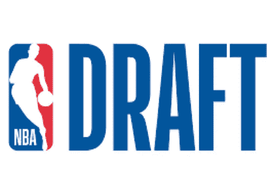

## 数据收集和清理

解决任何数据科学问题最耗时、最困难、最重要的部分之一是数据收集和清理。

对于我的项目，这也不例外。我在寻找早在 2005 年就有资格参加选秀的大学篮球运动员的数据。那一年，高中球员不再有资格绕过大学直接进入 NBA。不幸的是，由于数据限制，我只能收集到 2008 年以前的球员数据。

我收集的数据有两个来源:[Sports-Reference.com](https://www.sports-reference.com/cbb/play-index/psl_finder.cgi?request=1&match=combined&year_min=2006&year_max=2019&conf_id=&school_id=&class_is_fr=Y&class_is_so=Y&class_is_jr=Y&class_is_sr=Y&pos_is_g=Y&pos_is_gf=Y&pos_is_fg=Y&pos_is_f=Y&pos_is_fc=Y&pos_is_cf=Y&pos_is_c=Y&games_type=A&qual=&c1stat=&c1comp=&c1val=&c2stat=&c2comp=&c2val=&c3stat=&c3comp=&c3val=&c4stat=&c4comp=&c4val=&order_by=pts&order_by_asc=&offset=0)和[巴特·托维克](http://barttorvik.com/trankpre.php)。在 Sports-Reference.com 上运行了一个查询之后，我能够收集到 NBA 选秀和全明星赛名单的数据，并把它们组合成一个熊猫的数据框架。巴特·托尔维克的数据是通过巴特自己提供的一个 JSON 文件收集的。

我总共收集了 55，939 个大学篮球赛季的数据。这一数值包括了自 2008 年以来参加大学篮球赛的所有球员。如果一个人打了多个赛季，那么他们每个赛季都有多个观察记录。国际和高中运动员不包括在分析中，因为统计数据不能与大学篮球进行比较。大学篮球运动员也占 NBA 球员的 83%以上( [RPI 评级](http://rpiratings.com/NBA.php))。

在数据清理过程中，我确定了哪些球员入选了全明星赛。我在分析中只包括了被选中的球员，因为在过去的 10 年中，没有一个球员不是被选中的。

我还减少了数据集，只包含了一名球员在大学期间的最后一个赛季。包括一名球员的所有赛季可能会影响我的目标变量，因为这名球员将被多次列为参加过全明星赛。某人在大学的最后一个赛季往往是他们表现最好的赛季，也是球队管理层最看重的一个赛季。

最终，该数据集包括 581 个大学篮球赛季，其中 30 个赛季包括全明星球员(目标变量)。为每个球员收集的数据包括该赛季的许多个人统计数据，以及球员上学地点、会议甚至身体测量的信息。下面是我最终数据集的一个片段。

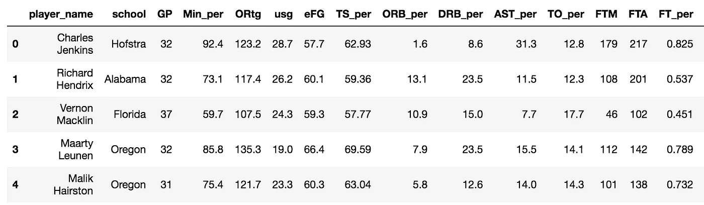

数据集的前五名玩家

## 探索性数据分析

在构建模型之前，我需要更详细地了解数据集。

为此，我进行了探索性的数据分析。我想看看有百分之多少的玩家在全明星游戏中加入了某种功能，以及百分之多少的全明星拥有这种功能。

我还观察了连续的特征(球员的统计数据),把参加过全明星赛的球员和没有参加过全明星赛的球员的数据分开，看看两者之间是否有显著的差异。

我看的第一个专题是学校的全明星。由于许多学校在过去 10 年中没有任何全明星，我决定从我的数据集中删除该功能，因为它不会为模型提供太多信息。正如你在下面看到的，自 2008 年以来，只有三所学校培养了超过一名全明星球员，其中肯塔基大学培养的最多。

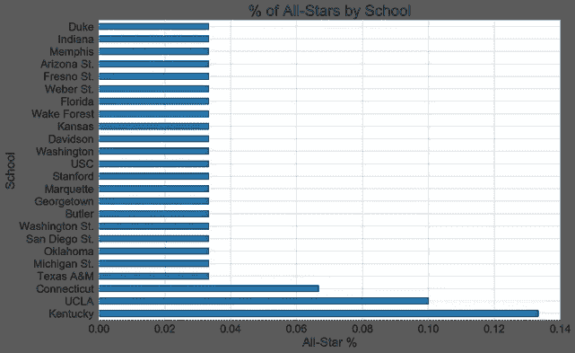

现在的全明星都在哪里上学

也许通过大学会议看全明星赛可以提供更多相关信息。在我打扫卫生的过程中，我把会议分为主要会议和非主要会议。

主要会议包括 ACC、Big 10、Big 12、Pac 12、SEC 和 Big East。非主流包括其他一切。非主力被列为一类，因为大多数球员都是从大型联盟中挑选出来的。

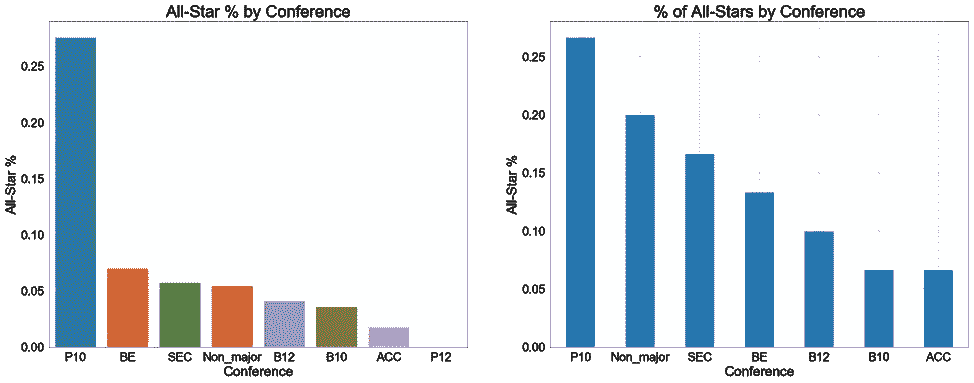

左边的图表显示了从那次会议中选出的球员中有多少人参加了全明星赛。右图显示了当前全明星球员在大学期间参加的会议。

结果相当令人惊讶。没想到除了 Pac 10(2011 年后就不存在了)之外，nonmajor 会议的所有明星比例都比其他所有会议高。从历史上看，ACC 一直是最好的大学篮球联盟，这使得看到他们的百分比最低令人震惊。

我想看的另一个方面是运动员在大学打球的年限。从下图可以看出，大多数全明星在第一或第二季结束后就离开了大学。这些球员往往是高中毕业的高材生，而且更加成熟。很少有全明星能一直呆到大学最后一个赛季。

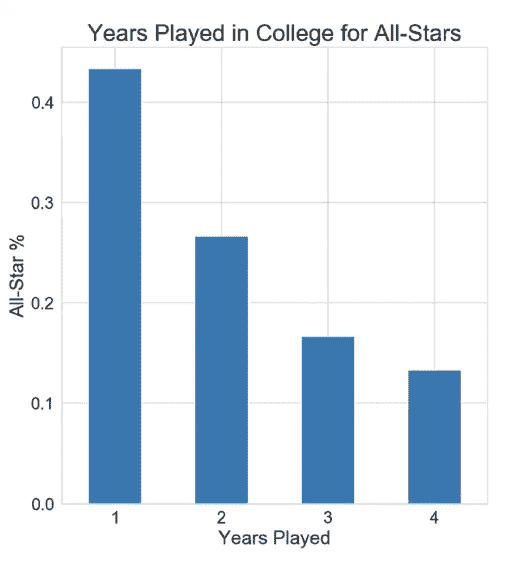

对于一个球员来说，在最后一年打完大部分比赛有多重要？从下图来看，这非常重要。

几乎所有的球员在大学的最后一个赛季都打了 30 到 40 场比赛。凯里·欧文是唯一一个在被选中之前至少 25 场比赛没有上场的球员。这表明所有的明星在大学期间都倾向于健康，并在赛季后期打球。

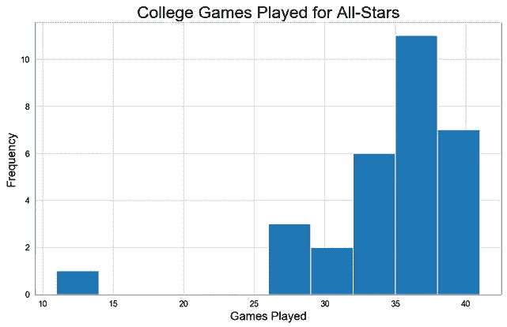

传统统计学重要吗？例如，每场比赛的得分是未来成功的良好预测吗？

如下表所示，情况可能并非如此。与其他人相比，所有明星的传统统计数据只稍微好一点。他们每场比赛的得分平均只高一分。也许更先进的指标能够讲述一个更好的故事。

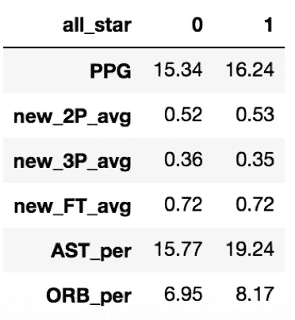

1 =所有星星

## 特征工程

我使用的几个特征在计算中有一些重叠。

例如，罚球次数(FTM)和罚球次数(FTA)用于计算罚球百分比(FT %)。

在消除他们计算中有重叠的一些特征之前，我计算了贝叶斯地图估计来调整它们的值。在放弃 FTM 和 FTA 特性之前，我使用先验知识(过去 10 年的历史平均值)和似然函数调整了 FT %。这为我提供了一个更准确的统计数据，并有助于解释那些尝试次数远少于其他玩家的玩家。

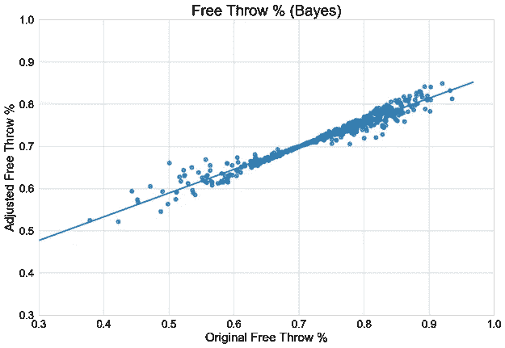

使用贝叶斯地图估计调整罚球百分比

## 建模

完成 EDA 后，我开始了分类建模过程。

我将数据分为训练集和测试集。训练数据包括 2008-2018 年的球员，测试集包括 2019 年 NBA 选秀的大学生球员。

在选择了要包含在分析中的特征之后，我开始对训练数据进行训练/测试分割。然后，我开始使用 GridsearchCV 构建几个分类模型，以优化最佳超参数。下面是使用的分类模型列表。

*   逻辑回归
*   最亲密的邻居
*   决策图表
*   随机森林
*   adaboost 算法

## 估价

使用的最佳模型是随机森林，它具有最高的准确性和最低的方差，但也具有基于先验知识的最现实和可解释的概率。

我能够正确预测一个球员是否在职业生涯的某个时刻成为全明星，99%的时间是在训练场上，94%的时间是在测试场上。该模型稍微有些过拟合，在测试集上的表现并不比基线更好，但这并不奇怪，因为目标类是如此不平衡。

在查看了该模型的主要特征后，我很快发现球员效率指标比传统的统计数据更能预测成功。最好的预测是 BPM，这是一个球员超过联盟平均球员 100 次以上的+/-(加/减)的方块得分估计。基本上一个球员在比赛的时候，他的球队得分是比对手多还是少？BPM 较高的球员往往在 NBA 表现出色。

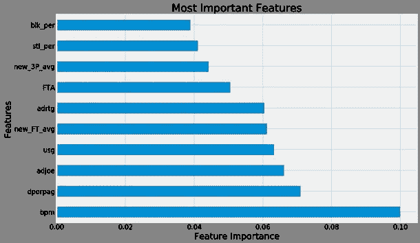

显然，传统的统计数据并不能说明全部情况。更重要的是知道一个玩家如何获得个人数据，而不是总量。乍一看，一个场均得分 30 分的球员可能看起来很有前途，但如果你深究一下，就会发现他之所以得到这个数字，是因为他投篮次数多，效率低，那么事实可能并非如此。

从 2008 年到 2018 年，选秀权和成为全明星的概率之间存在正相关关系(见下文)。选秀权越高，我的模型预测的概率就越高。

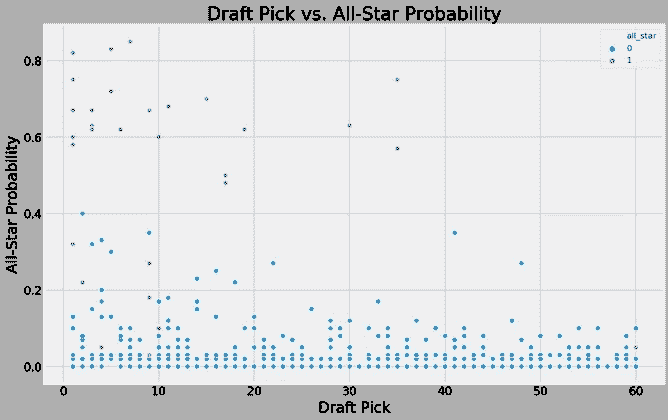

这表明前台在大多数情况下做得很好，但也很容易发现异常值和错误。这不应该是这样的情况，在选秀前 10 名中被选中的大多数人有不到 20%的机会进入全明星队。这些被认为是被选中的最好的运动员。这也提出了一个问题，球探错过了第二轮(第 30 轮)选出的球员，他们已经成为全明星。

德雷蒙德·格林以第 35 顺位被选中，但在我的模型中，他拥有第五高的全明星概率。他已经成为三次全明星和三次 NBA 冠军，那么前台错过了什么？

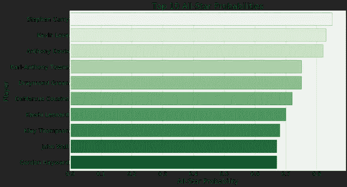

当你深入挖掘，很容易发现格林有非常高的效率统计。他的 BPM 明显高于选秀球员的平均水平，而且他是一个伟大的防守球员。他的选秀位置可能下降了，因为他不是一个伟大的运动员，他在高年级赛季后离开了大学。

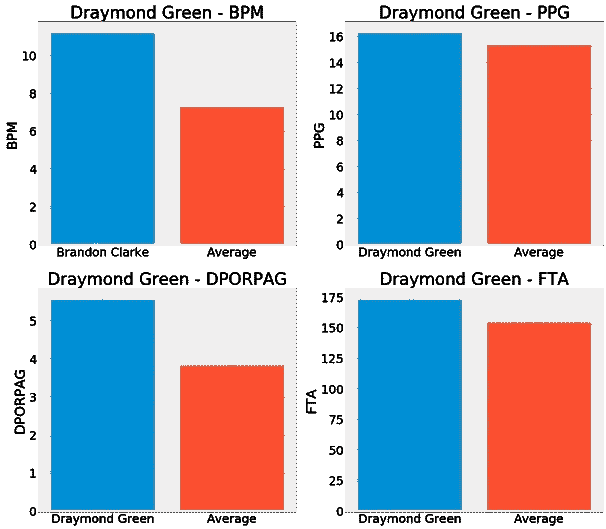

该模型对 2019 年的未知数据有类似的结果。选秀和全明星概率与分散在各处的一些异常值正相关。与 2008-2018 年类似，大多数球员的全明星概率不到 20%。

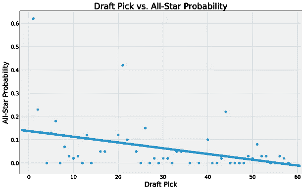

2019 看不见的数据

该模型预测锡安·威廉姆森最有可能成为全明星。锡安·威廉姆森在过去的一年里是大学里的杰出球员，也是第一个被选中的球员。该模型还显示了从早期到晚期在选秀中具有大于 5%概率范围的剩余球员。如果历史成立，选秀中只有三名球员会成为全明星。

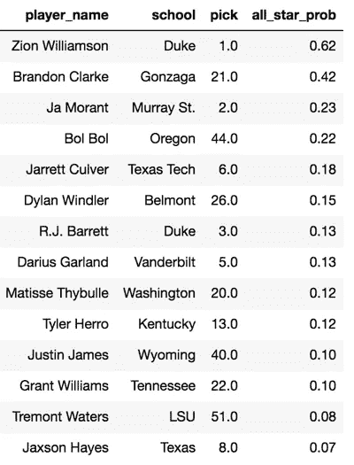

2019 全明星概率排名

可能性第二高的选手是来自冈萨加的布兰登·克拉克。他碰巧被选为第 21 名，这不是一个所有明星都被选中的范围。和德雷蒙德·格林相似，布兰登克拉克有着高于平均水平的 BPM 和良好的防守。

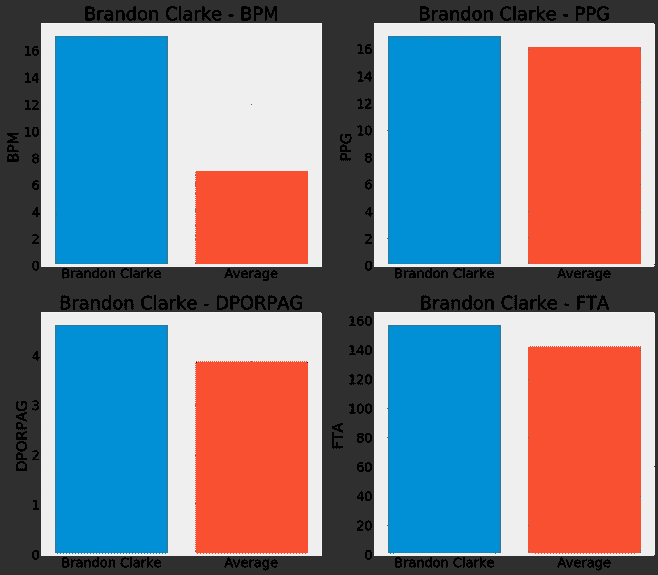

看看布兰登·克拉克是否会有和德雷蒙德·格林相似的职业生涯，并成为全明星让怀疑者大吃一惊，这将会很有趣。他有一个好的开始，因为他被任命为今年 NBA 夏季联赛的最有价值球员。

# 结论和下一步措施

利用我的模型，前台可以评估大学篮球运动员在被选中之前成为 NBA 全明星的可能性。

这是一个可以作为传统球探补充的工具。像德雷蒙德·格林这样的球员不太可能在第二轮选秀中被选中，如果前台可以使用这种模式的话。我们很快就会看到，如果我预测的一些更高的概率将证明球探是错误的，并在 NBA 取得成功。

将来，我想收集更多的数据。这包括 2008 年以前的数据。它还包括新功能的数据。我想加入的一些新功能包括球员高中招募排名、大学获胜次数和 NBA 联盟的运动测量。我还想收集国际球员的数据，以及从高中直接被选中的球员的数据。

另一个补充将是量化游戏的心理方面。知道一个球员在球场上的统计数据是很好的，但球场外还有其他方面可以导致成功。例如，了解一个球员的篮球天赋，了解他们的个性和行为，对于找到一个成功的球员和一个适合特定球队的球员来说是至关重要的。了解玩家是否触犯了法律也是一件好事。

这是一个非常棒的项目，我从头到尾学到了很多关于数据科学工作流程的知识。我希望在未来提供更多这样的职位。

这篇文章的代码可以在我的 GitHub 上找到。