# 如何用数据科学预测 NBA 球员薪资

> 原文：<https://betterprogramming.pub/predicting-nba-player-salary-with-data-science-c5702caa3f2e>

## 高绩效并不意味着更高的薪水

科怀和他的第二个冠军(来源:[https://www.washingtonpost.com](https://www.washingtonpost.com/sports/wizards/kawhi-leonard-is-an-nba-champion-he-also-may-be-the-best-player-in-the-game/2019/06/14/7d4f1b90-8e22-11e9-8f69-a2795fca3343_story.html?utm_term=.5838239c5a26)

截至 2019 年 6 月 19 日，我可以有把握地打赌，我不是唯一一个为猛龙队赢得 2019 年 NBA 总冠军感到高兴的人，终于把勇士队从高位上打下来，证明斯蒂芬·库里和那帮人终究是凡人。科怀·伦纳德是一个绝对的野兽，在球场两端杀死它，最终在一个曾经非常残酷的联盟中给整个加拿大带来了荣耀(*咳咳，勒布朗詹姆斯*)。

大约一个月前，我心中产生了一个问题:到底是什么决定了 NBA 中谁的薪水最高？如果你只是快速浏览一下 NBA 球员的薪水，你会发现并不一定是表现最好的球员拿到的薪水最高。卡梅隆·安东尼就是一个典型的例子。如果是这样的话，那么是什么决定了谁的工资最高呢？

有什么比数据科学更好的方法来回答这个问题呢！

*如果您想要更深入地了解这个项目，或者如果您想要添加代码，请查看* [*GitHub 资源库。*](https://github.com/jerrytigerxu/NBA-Salary-Prediction)

# 数据准备

重要的事情先来。我需要导入必要的数据，这些数据已经存储在我的 GitHub 存储库中。我还导入了必要的 [Python](https://www.python.org/) 库。

# 数据清理

通过查看数据，我可以看到有很多烦人的事情要处理，尤其是 NA 值。

目前最重要的数据集是我的`Seasons_Stats`集，它包含了大量的指标和球员统计数据，这些数据将成为以后预测预测器特性的变量。

该打扫房间了。

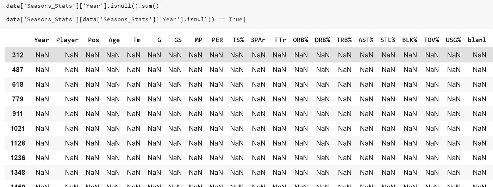

查找所有的空值

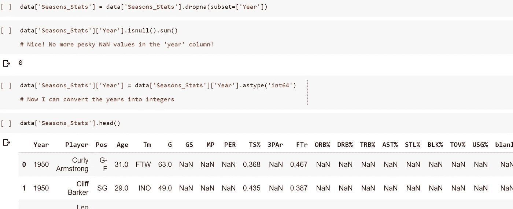

从年份列中删除 NA 值并转换为整数值

当我清理数据时，我遇到了一个问题。我已经收集但还没有整理的工资数据只是从 1980 年到现在，忽略了任何以前的信息。因为这个原因，我不得不删除所有 1980 年以前球员的数据。真扫兴。

然后，我花时间实际了解了各种列名。

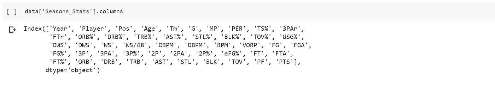

这些统计数据的含义如下:

*   “位置”—位置
*   ‘TM’—团队
*   ' G' —玩过的游戏
*   ' MP' —播放分钟数
*   “PER”——玩家效率等级
*   TS %’—真实投篮命中率(3 分球以上的权重)
*   3PAr——三分尝试率
*   “罚球命中率”
*   球%' —进攻篮板百分比
*   DRB%' —防守篮板百分比
*   TRB%' —总回弹百分比
*   AST%' —辅助百分比
*   STL%' —窃取百分比
*   BLK%' —数据块百分比
*   TOV%' —周转率百分比
*   USG%' —使用率
*   “OWS”的进攻性胜利份额
*   DWS 的防御制胜份额
*   ‘WS’—赢得份额
*   WS/48’—在 48 分钟内赢得份额
*   “OBPM”——进攻方加减分
*   “DBPM”——防守禁区加减
*   ‘BPM’—加/减框
*   “VORP”——相对于替补球员的价值
*   “FG”——制定的现场目标
*   “FGA”——尝试射门
*   FG%' —场目标百分比'
*   “3P”——三分球命中
*   “3PA”——尝试三分球
*   3P%' — 3 个百分点
*   “2P”——2 分命中
*   “2PA”—尝试 2 分球
*   2P%' — 2 个百分点'
*   “有效目标%”—有效领域目标百分比
*   “英尺”——罚球次数
*   “罚球”——尝试罚球
*   英尺%’—罚球百分比
*   “球”——进攻篮板
*   DRB 的防守篮板
*   TRB——总篮板数
*   ' AST' —助攻
*   ' STL' —偷窃
*   BLK 街区
*   TOV 失误
*   PF’——个人犯规
*   “分”——点数

对于工资数据，我意识到通货膨胀和其他与时间相关的问题会造成问题。正因为如此，我创造了其他的衡量标准，让工资可以相互比较，而不是绝对数字。这些指标是:球队工资总额，球员工资占球队工资总额的比例，球队工资占 NBA 工资总额的比例，球员工资占 NBA 工资总额的比例。

创建所有的值需要一些时间。我使用 Excel 来自动化一些事情，但是我必须创建一个 Python 脚本来节省更多的时间。

这里有一个简短的一瞥，我创造了什么来做到这一点。

# 特征工程

就像我之前提到的，我必须创造一堆新的变量。我把它们命名为:球员杠杆，联盟权重，球队市场规模，我们的区域。

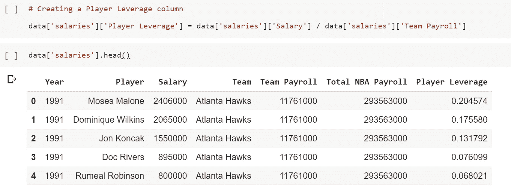

玩家杠杆栏

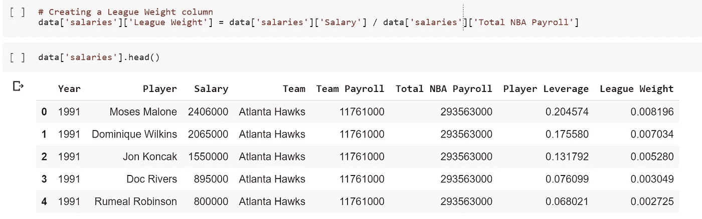

联盟重量栏

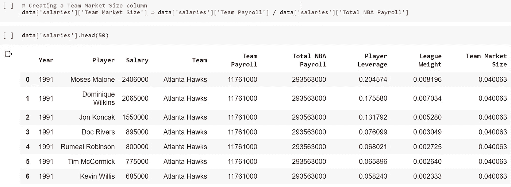

团队市场规模列

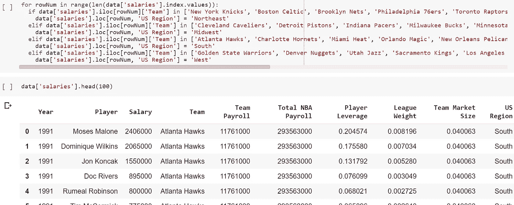

美国地区列

# 合并数据集

我最终只使用了三个数据集的其中两个，因为它们包含了所有必要的信息。现在，我需要将这两个数据集合并在一起。

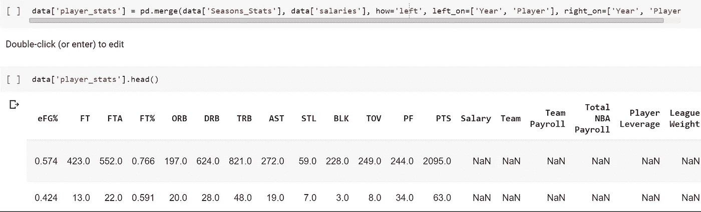

进行左合并以合并每一列

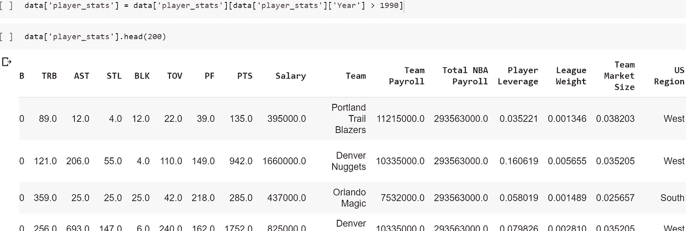

仅限于 1990 年以后

# 处理分类变量

因为这个数据集中的预测变量是连续的，所以我需要使用一个接受连续值的机器学习算法。问题是集合中的一些特征是分类的，所以我需要为它们创建虚拟变量。

# 探索性数据分析

现在是时候探究数据中的一些关系了！诚然，我本可以在这个阶段花更多的时间，所以你可以自由地为自己探索更多的数据。

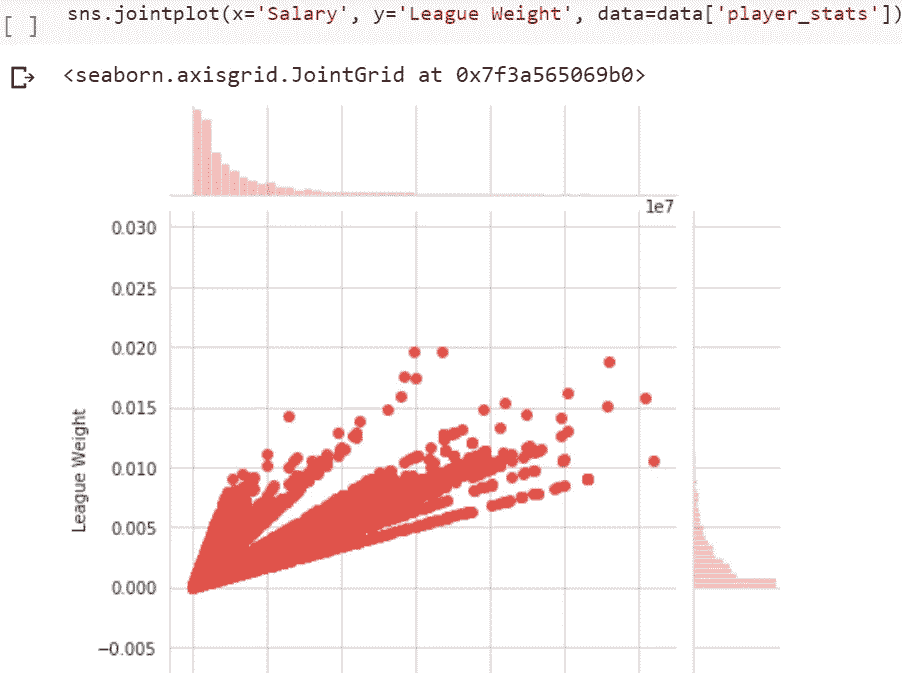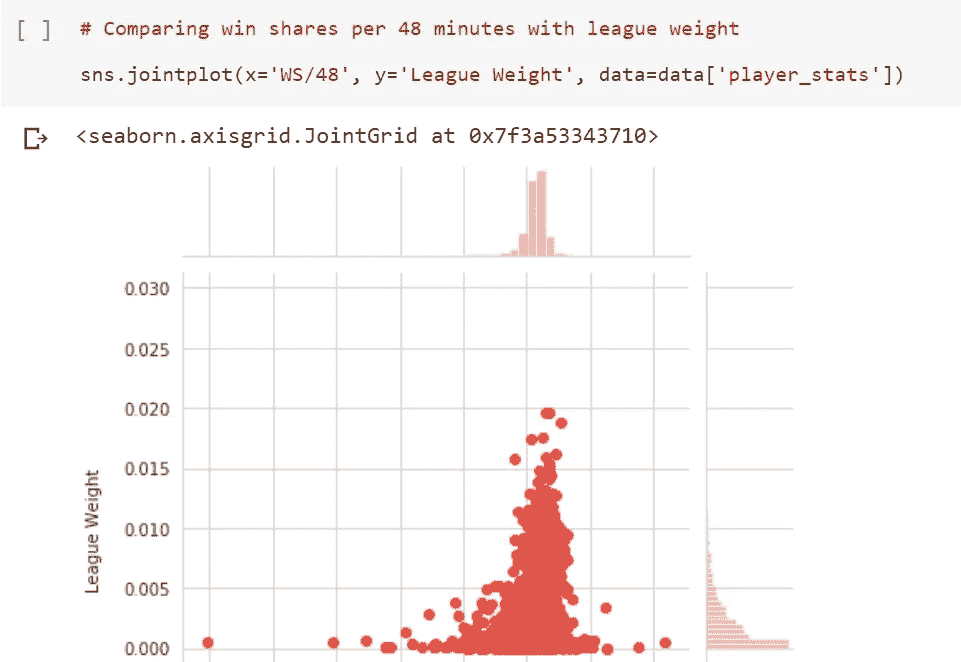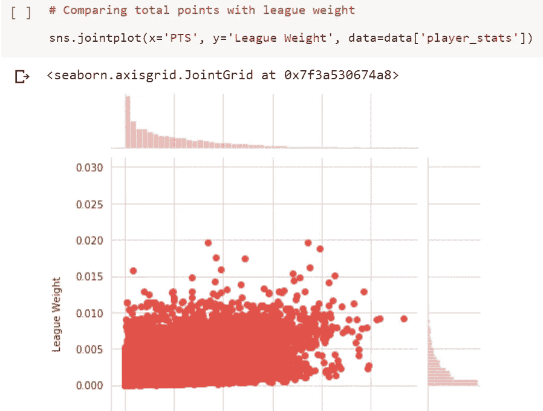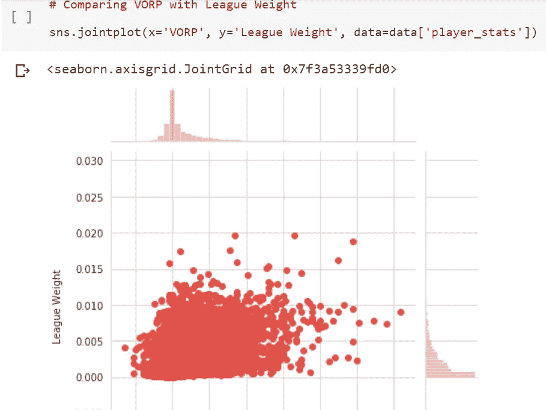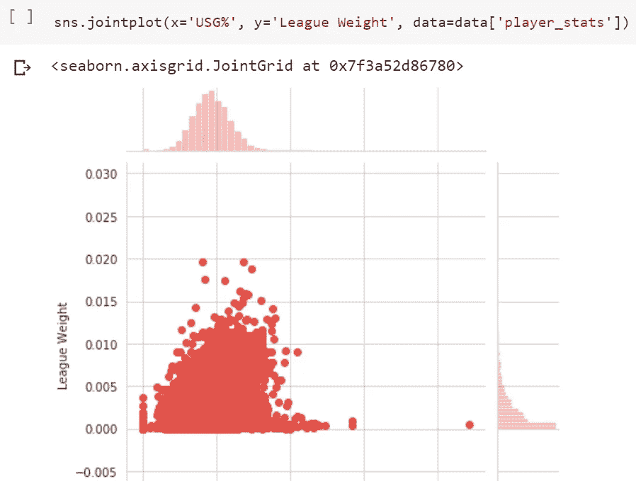

# 预测模型构建

是时候建立一个能产生最准确结果的模型了！

首先，我们需要将数据分成测试和训练数据。

我使用了三种机器学习算法来看看哪种效果最好:回归、决策树和随机森林。

以下是回归训练:

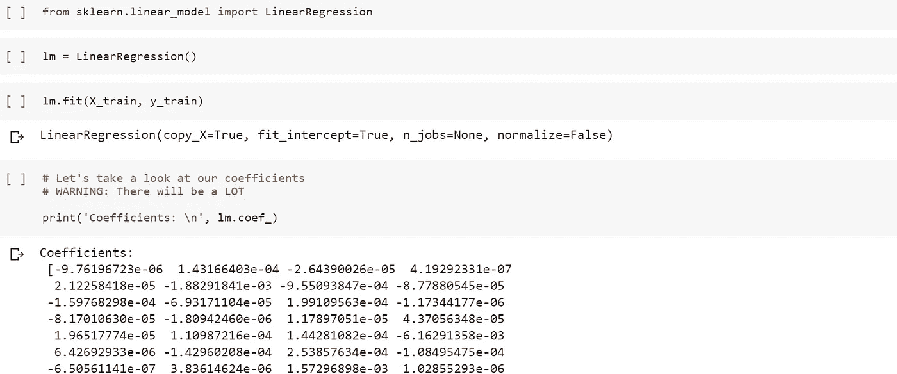

我还快速使用输出的系数来查看哪个变量对基于线性回归的模型影响最大。

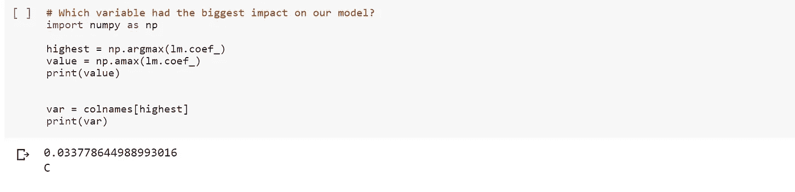

基于这一点，我们可以看到，球员作为中锋的特征对球员相对于联盟其他球员的薪酬有着最大的影响。这不是很有趣吗？

以下是决策树模型的训练:

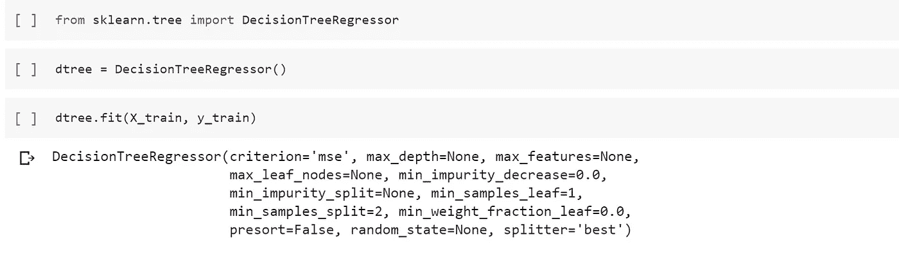

以下是随机森林模型的训练:

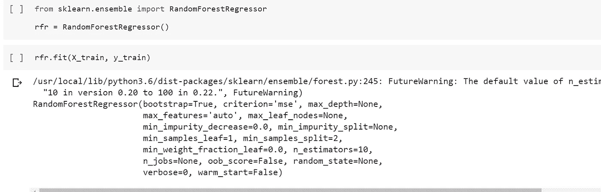

使用度量标准 MAE(平均绝对误差)、MSE(均方误差)和 RMSE(均方根误差)，我们可以比较每个模型在预测每个球员的联盟权重方面的表现。

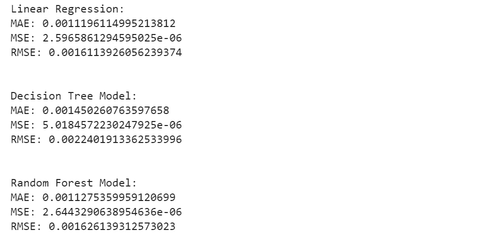

根据这些数字，似乎线性回归实际上做得最好！然而，重要的是要知道，我没有对决策树和随机森林模型的超参数进行太多的调整，所以这可能是它们表现不佳的重要原因。

# 潜在的改进

感谢您花时间阅读这篇文章！这实际上是我的第一个主要的端到端数据科学项目，因此还有很大的改进空间。

这个项目有几个方面可以改进。

## 1.更有效地处理金钱的时间价值

因为货币的价值会随着时间的推移而变化，我知道我不能将 20 世纪 90 年代的工资与今天球员的工资进行比较。我没有将这些数字转换成一个单一的调整后的数字，而是选择创建一个名为联盟权重的指标，根据谁在总工资中的比例更大，来计算所有球员的工资。也许这不是处理问题的最佳方式。请随便找一个更好的方法来调整工资数字。

## 2.获取更多总体数据

我只使用了从 1990 年到现在的数据，因为之前几年的工资数据和高级统计数据都很少，很难找到。1979 年以前连三分线都没有！尽管如此，对于那些没有我这么没耐心的人来说，不要害怕寻找更多的历史数据，这些数据可能会对 NBA 历史上的薪资数据进行更全面的分析。

## 3.添加更多功能

我在这个项目中使用了大量的变量，但是这些变量对最终结果的重要性明显不同。NBA 中还有许多其他高级的统计数据，我没有使用，其他人可以添加。

## 4.使用更多的机器学习算法

我只用了三种机器学习算法，而且都很简单。我考虑过使用神经网络，但那需要大量的超参数调整。

## 5.微调已经使用的算法

即使在我在这个项目中使用的几个算法中，对于决策树和随机森林，我肯定可以调整模型，使它们更有效。