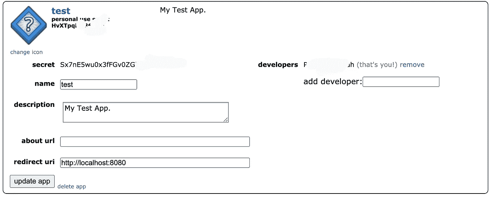
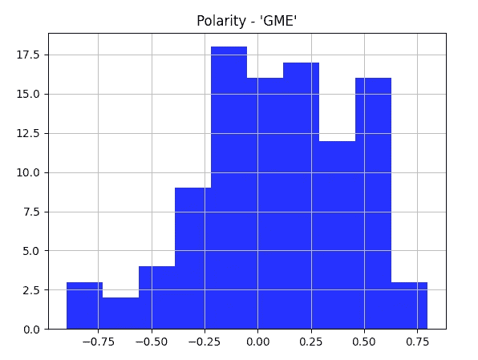
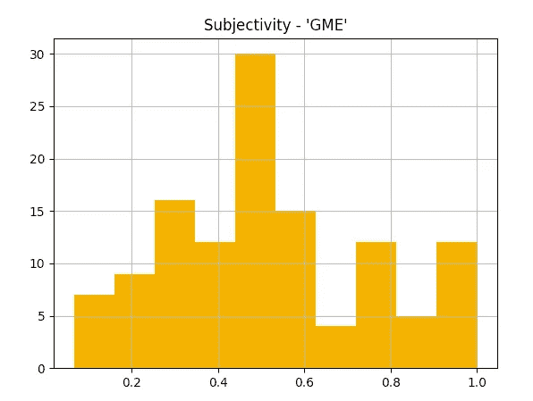
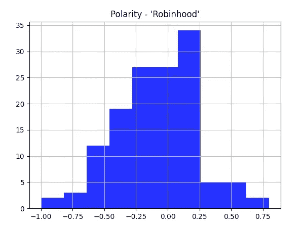
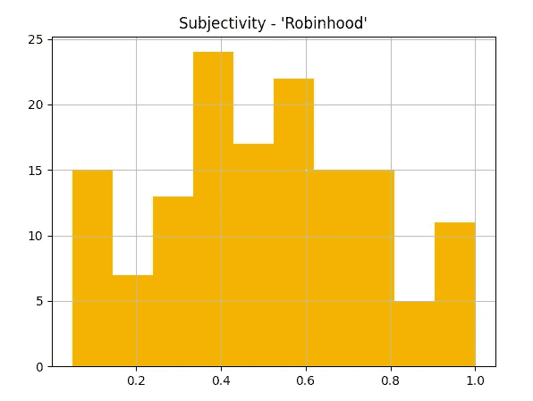

# 用不到 20 行代码预测 GameStop(GME)的崛起

> 原文：<https://betterprogramming.pub/predicting-the-rise-of-gamestop-gme-in-20-lines-of-code-or-less-44810c19027a>

## 使用代码和数据科学的力量追溯分析飙升的股票

*编者按:这一块不是投资建议；它仅用于娱乐和教育目的。*


由 [Austin Distel](https://unsplash.com/@austindistel?utm_source=medium&utm_medium=referral) 在 [Unsplash](https://unsplash.com?utm_source=medium&utm_medium=referral) 上拍摄

我相信你们都知道最近 GameStop 股价的天文数字上涨；不管你在这个问题上的立场如何，现实是，与一周前相比，今天有很多人变得更富有——或者更贫穷。

如果你能够避开社交媒体的话！% storm 和随后的新闻报道，不用担心… Reddit 基本上被武器化了，作为一种协调做空华尔街的手段——而且成功了！数十亿美元易手，至少一家大型对冲基金在此过程中宣布破产。细节在网上很容易找到，所以让我们言归正传，我们怎样才能参与到行动中来？

嗯，我不建议任何人拿自己的钱去冒险试图利用波动性，但我确实认为这是一个很好的例子，说明技术在打破现状方面有多大的力量——也许，更重要的是，甚至在竞争领域。所以，让我们这样做吧，让技术为我们所用——并在这个过程中为我们的投资组合增加一个有趣的项目。

之前，我发表了一篇文章，解释了我们如何利用 tweepy API 和 textBlob 库对 Twitter 数据进行情感分析。这些框架提供了一种简单的方法来获得有限但非常数据驱动的对社会趋势的洞察，这可能是有利可图的，或者至少是“可行的”，在使用它们的同时，我们识别并可视化了我们的发现。要查看我们的结果，您可能需要在尝试以下操作之前阅读这些内容。

# 用 Python 抓取 Reddit

所以，让我们重新编写 Python 脚本，用 Reddit 代替 Twitter。为此，我们需要为 Python 导入 Praw 库。您可以在这里安装 Praw，或者简单地运行以下命令:

```
pip install praw
```

你可以在我的 GitHub 上找到我的全部代码。不要期待任何花哨的东西，但要期待一个简单的例子，可以很容易地进一步缩短——因此有这个标题。

你需要一个 Reddit 账户，类似于 Twitter，你需要创建一个应用程序，你可以在这里[完成。当出现该选项时，您将需要选择“脚本”。创建后，您将看到以下内容:](https://www.reddit.com/prefs/apps)



图片由作者通过 Reddit.com

你需要在应用标题下的个人脚本 ID、应用名称`user_agent`、你的秘密和 Reddit 密码。


图片由作者通过 Reddit.com

关于设置，请参考以下内容:

在本例中，我使用所需的“子编辑”来缩小我们的结果，但您可以简单地输入“全部”进行全局搜索。我还需要一个关键字用于`.search(keyword)`函数——它返回给我们包含我们关键字的提交。例如，我们可以使用`Gamestop`或`$GME`。

有一些很好的工具，比如`.top()`和`.hot()`，当然，你可以像我用`limit=`一样限制返回的项目数量。您还可以遍历评论并检查分数或 upvote 值。我建议您进行探索和提炼，因为我们可能并不总是知道要搜索的子编辑，或者希望将自己限制在一个单独的子编辑中(使用“all”)。在 GameStop 的例子中，subreddit 被称为 r/wallstreetbets。当然，这已经变成了私有。

像以前一样，我们利用`textBlob`来执行分析，但是快速的谷歌搜索将返回许多替代服务和图书馆，包括 VADER。`.selftext`提供了我们的 API 响应的主体，我发现仅用`.title`就足够了，因为它似乎很好地表示了提交。`.title`可替代使用或与`selftext`结合使用。

现在，由于 Reddit 帖子往往比 tweets 大得多，您可能需要做一些额外的数据清理。这种清理可以用 Python 编程来执行，也可以利用 Pandas 之类的库来执行。为了简单起见，我再次删除了 0.0 的任何极性或主观性值，但是对于经过适当清理的数据，您会更适合将这些值作为有效数据点。

以下是我对 subreddit r/wallstreetbets 和关键字“GME”的搜索结果:



作者图片



作者图片

这表明情绪是积极的，这在很大程度上是主观的，也完全符合我们的预期。

如果你在关注这个故事，你可能知道[罗宾汉](https://robinhood.com/)停止了购买(而不是出售)一些精选的股票，包括 GameSpot 和 AMC。这些决定实质上操纵了一个有利于华尔街空头的自由市场，所以让我们看看这是如何在 r/wallstreetbets subreddit 上为他们淘出的:

```
Sentiment average Polarity: -0.08669017491053338 
Sentiment average Subjectivity: 0.5095377417078806
```



作者图片



作者图片

把这当作一个起点——通过一些额外的努力和工具，你可以很好地拥有编程能力来预测即将到来的游戏化或“迷因化”投资浪潮。