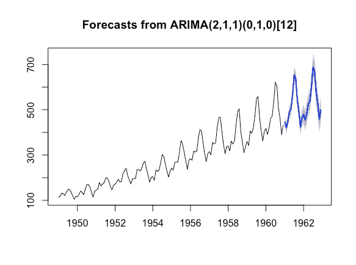
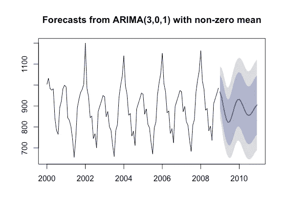
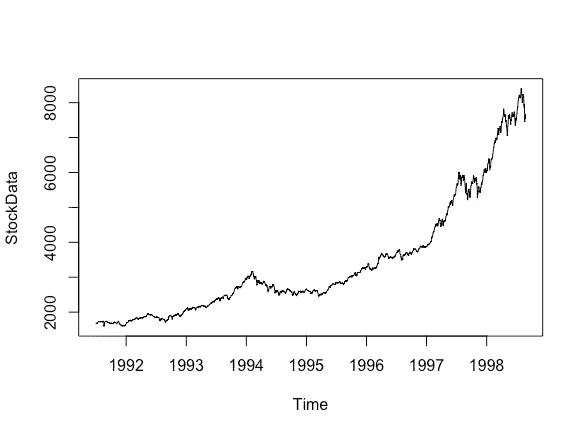
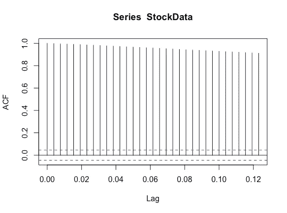
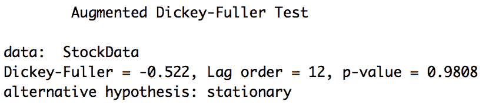
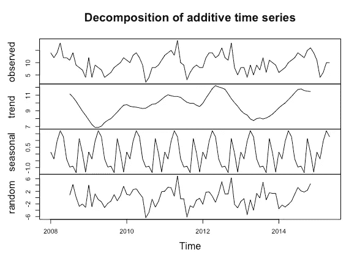

# R 中的预测建模(上)

> 原文：<https://betterprogramming.pub/predictive-modeling-in-r-part-1-64145669fb92>

## 如何开始使用 ARIMA 模型

照片由[克里斯·利维拉尼](https://unsplash.com/@chrisliverani?utm_source=unsplash&utm_medium=referral&utm_content=creditCopyText)在 [Unsplash](https://unsplash.com/s/photos/statistics?utm_source=unsplash&utm_medium=referral&utm_content=creditCopyText) 上拍摄

大约一年前，我们写了关于 ARIMA 模式的文章。我们想最终回到讨论使用 ARIMA 和/或 ETS 方法创建预测模型，而不是使用考虑许多变量的更复杂的基于驱动因素的模型。

ARIMA 模型只从过去的输出数据中寻找模式。

尽管这限制了 ARIMA 模型可以寻找的模式，但如果你理解 ARIMA 模型必须提供的各种参数，它仍然是相当健壮的，并允许许多修改。

之前观察的模式(也称为*滞后*)是开发该模型的关键因素，因为它决定了不同参数需要多少系数。

选择正确数量的参数是很繁琐的，因为它可能需要您测试多个不同的组合。对于非季节性时间序列，ARIMA 模型可以采用三个参数，在考虑季节性时，可以采用六个参数。

对于非季节性数据，这些参数被引用为( *p，D，q* );对于也包含季节性成分的时间序列，这些参数被引用为( *P，D，Q* )。在本文中，我们不会过多关注这些参数。相反，我们将讨论在你开始操作这些参数之前，如何用 R 来理解你的数据。

# 使用 auto.arima()

r 允许你运行一个非常简单的脚本来自动创建你自己的 ARIMA 模型(`auto.arima()`)。它会运行它认为最适合你的组合，而且不需要了解 ARIMA。这个函数有许多默认设置，所以唯一需要的输入是时间序列。

在`AirPassengers`数据集上使用它，代码可能如下所示。

这个预测实际上似乎非常接近。

然而，认识到`auto.arima()`功能并不总是像你想象的那样好是非常重要的。例如，让我们看看下面的图表。

在这里使用`auto.arima()`功能似乎不太管用。该预测在视觉上与之前的数据不太吻合，而且它的置信区间非常大。

这可能是因为总体模式每两年而不是一年相关一次。如果不了解各种参数，您将无法调整模型以更好地拟合数据。

因此，了解什么是 ARIMA 模型以及如何使用 R 来更好地理解时间序列中的模式非常重要(在我们的下一篇文章中，我们将讨论各种参数，并为上面的模型开发一个更好的模型)。

# r 编程和稳定性

*平稳性*是开发预测模型时的一个重要概念。

平稳时间序列是指具有一致的均值、方差和协方差的时间序列。简单地说，这意味着时间序列在某种程度上是可预测的。

趋势和自相关等属性会影响时间序列，通常会导致它们不再具有平稳性。

例如，让我们看看`EuStockMarkets`数据集。该数据集包含主要欧洲股票指数的每日收盘价:德国 DAX (IBIS)、瑞士 SMI、法国 CAC 和英国 FTSE。数据是在工作时间采样的，也就是说，周末和节假日被忽略( [R 文档](https://www.rdocumentation.org/packages/datasets/versions/3.5.0/topics/EuStockMarkets))。

这是一个很好的数据集，可以用来理解有漂移的随机游走。请看下图，该数据集没有一致的平均值，这意味着它很可能是不稳定的

您可以用 R 的几个函数来测试这个事实。这包括`acf()` (自相关)函数和`adf.test()`函数。

`acf()`功能用于测试自相关。*自相关*是不同观测值(滞后)之间的相关性。这可能是先前的观察，甚至是几个滞后之前的观察。

函数调用如下所示:

`acf(StockData)`

该函数的输出描述了当前观测值和随后观测值之间的相关性。蓝色虚线代表 95%的置信区间，每条实线代表与原始滞后的相关性。

一个稳定的数据集通常会有我们所说的指数相关性或不存在的相关性。这意味着原始观测值之后的一两个滞后可能会超出蓝色虚线，并显示出大量的相关性。

股票数据并非如此。相反，几乎每一个后续观察都与前一个观察相关。这是数据集不稳定的好迹象。

另一种测试平稳性的方法是使用`adf.test()`。该函数使用扩展的 Dicky-Fuller (ADF)检验。该测试分析单位根的数据集。单位根可以影响平稳性，因为单位根使过程不可预测。

可以只使用引用的时间序列对象来调用函数调用，如下所示。

输出可能有点混乱，因为替代假设将总是读取稳定，一些人假设这意味着数据集是稳定的。事实并非如此。输出只是告诉你另一个假设是什么。

然而，在这种情况下，我们将拒绝替代假设，因为`p-value`几乎是 1，而它应该小于或等于 0.05。如果`p-value`小于或等于 0.05，那么你知道你的数据集可能是稳定的。

在这种情况下，股票数据是非平稳的。

# 分解功能

ARIMA 模型依赖于它可以从提供的数据中提取的各种特征。使用分解函数是查看数据集的一些特性的好方法。

分解函数将数据过程分成三个部分:季节性、趋势和随机部分。在 R 中，您还可以调整分解函数来使用乘法模型或加法模型，如下所示。

为了进一步理解分解函数中发生了什么，可以看看下面的变量。与其说它们代表数字，不如说它们代表函数。

*S*

趋势

*e* =随机(误差)

使用的加法模型为: *Yt=Tt+St+et*

使用的乘法模型为: *Yt=Tt*St*et*

该函数首先使用移动平均值确定趋势。然后，它引出一个季节性成分，其余的是随机成分。

构建 ARIMA 模型是为了考虑趋势。然而，了解如何使用移动平均(ma)函数提取趋势总是很方便的。

它进一步演示了如何将单个组件从数据集中取出并放回数据集中。

感谢您阅读关于使用`auto.arima()`功能的解释。我们希望它能帮助你设计你的下一个模型。