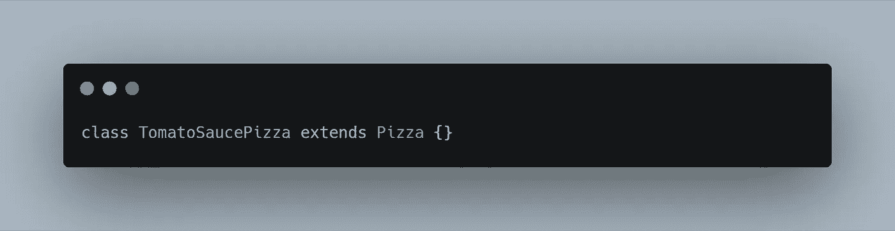
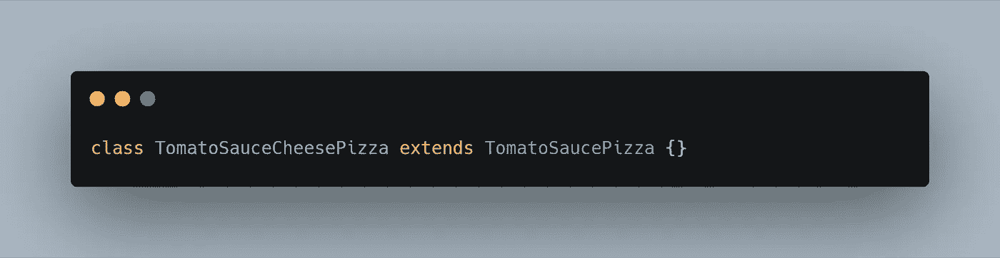
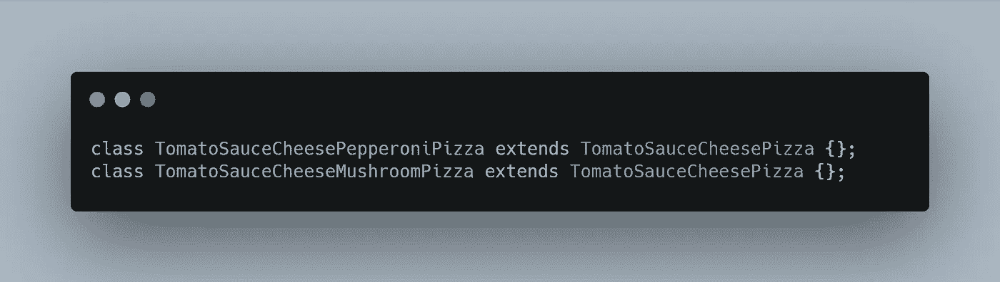
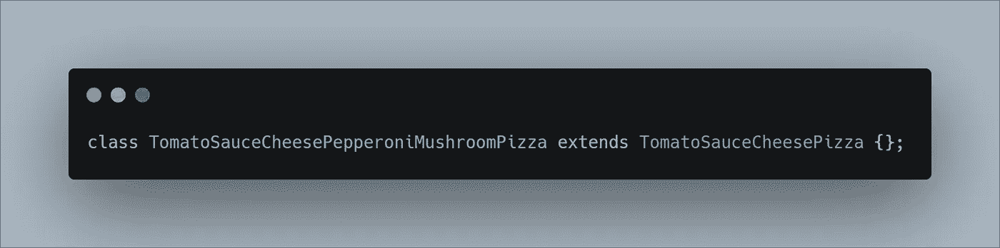
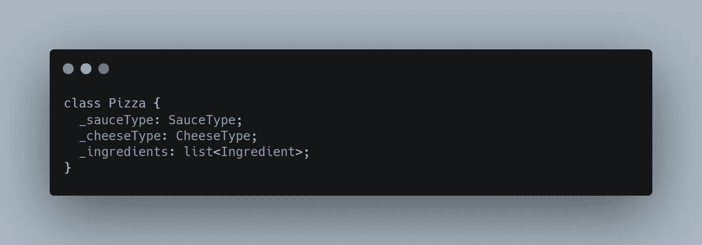
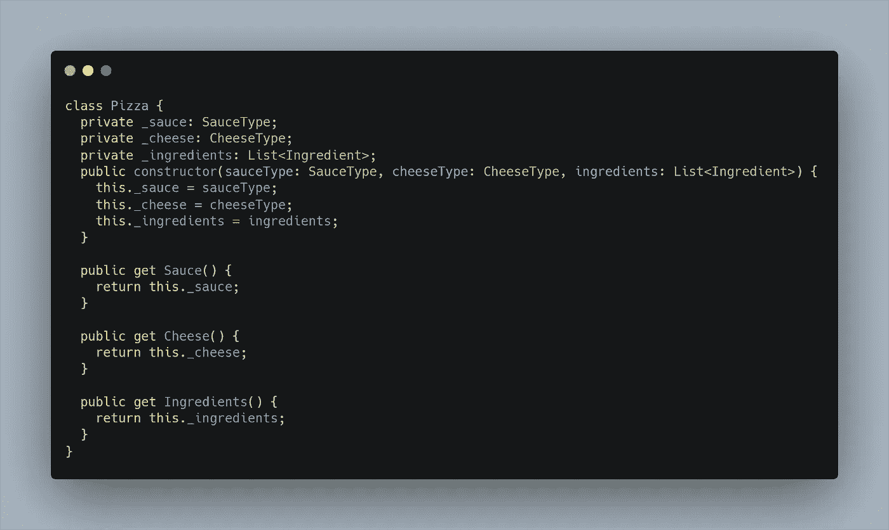
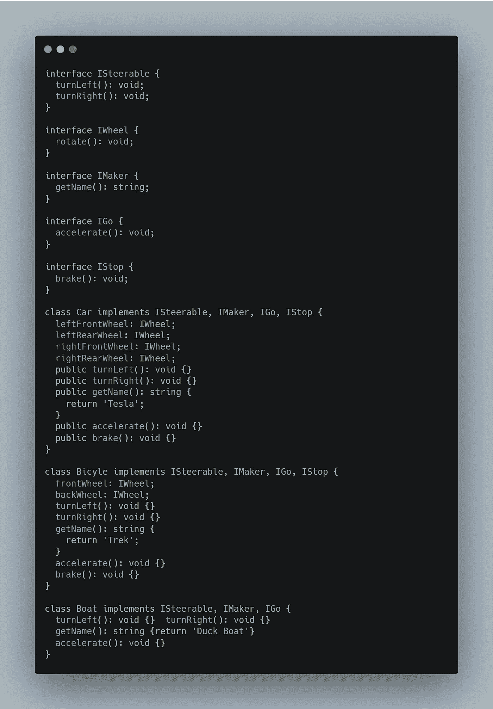

# 偏好组合而非继承

> 原文：<https://betterprogramming.pub/prefer-composition-over-inheritance-1602d5149ea1>

## 遗产会变得很混乱。构图灵活

[黄志刚](https://unsplash.com/@jasonhk1920?utm_source=unsplash&utm_medium=referral&utm_content=creditCopyText)在 [Unsplash](https://unsplash.com/s/photos/composition?utm_source=unsplash&utm_medium=referral&utm_content=creditCopyText) 上拍照

在三个 OOP 原则中，继承可能是封装后你开始理解的第二个原则。这是一个非常基本的想法——您可以扩充现有的类，同时仍然使用父类的所有功能。很简单，对吧？

有趣的是，继承最近已经有点失宠，取而代之的是组合的概念。继承是一个强大的特性，但是它可能会失去控制。让我们看一个例子来说明这一点。

# 失控继承

假设你拥有一家披萨店。你想写一个系统来管理你所有的比萨饼。所以，你从一个基类开始:

一堂简单的披萨课

当然，这是一个很好的抽象类，所以我们必须从它派生出来。我们假设所有自尊的披萨都有番茄酱，因此我们将创建:

后代阶级

当然，我们还需要奶酪:

又一个后代

太好了。但是你的顾客会想要更多的配料。让我们从意大利香肠和蘑菇开始。我们最后会得到:

甚至更多的后代。这开始变得复杂了

当然，有些客户可能两者都想要，所以您需要:

好吧，这有点过了

现在，让我们加入香肠、洋葱、凤尾鱼和黑橄榄。

嗯。事情会变得很复杂，不是吗？

使用继承，你会很快得到一个更深更广的继承模型。您的属性不能涵盖添加更多成分时可能出现的所有情况。

整个设计很快变得笨拙而不灵活。当老板决定把菠萝加到披萨上时，你将有很多代码要写(撇开披萨上的菠萝是一种完全令人厌恶的事实不谈)。

# 问题

继承很酷，但也有它的问题。

*   正如我提到的，它鼓励了一大堆笨拙的子类。你最终可能会得到很多很多可能满足也可能不满足你需求的课程。
*   谁也不知道超级阶级会做什么。也许它在你控制之外的一个模块中，并且超类有很多依赖项。创造它会导致你不想要或没有准备好的副作用。
*   一旦被部署，类的层次结构就很难改变。你可能会被没人点的披萨困住。在飞行中创造一个新的、特别的比萨饼是不可能的。你不能改变一个超类而不冒破坏用户子类的风险。

但是有更好的方法。不如我们“合成”一个披萨:

制作披萨的更好方法

这是一个很好的例子，说明为什么你应该更喜欢组合而不是继承。

我们披萨的构图版本很简单。它更加灵活，允许多种奶酪类型、酱料类型和几乎无限的配料集合。

上面的例子是一个非常简单的例子，它可以很容易地拥有私有字段、公共属性和一个构造函数，这样就可以一次性创建所有这些属性。它可能看起来像这样:

这才是披萨！

你很难描述一个这个类不能包含的比萨饼。如果您需要扩展什么是比萨饼的定义，您可以很容易地做到这一点，而不会影响现有的对`Pizza`类的使用。

这个类完成了我们上面创建的整个继承结构的工作。组合允许你在一个类中，通过继承做 2^n 类可能做的事情。它还提供了一个更简单、更易测试的代码库。

# 界面组成

另一种看待继承复合问题的方式是通过接口。([它总是回到界面，不是吗？](https://medium.com/better-programming/code-against-interfaces-not-implementations-37b30e7ab992))

如果你熟悉实体编码原则，你会知道接口分离原则声明你应该保持你的接口小而简单。

如果你这样做了，它们可以被用来使用那些接口而不是继承来组成类，这又会带来更多的灵活性。

注意，据说*更倾向于* 成分多于继承。它并没有说*总是* 用构图超过继承。继承有它的位置——在设计一个类框架时，它通常不是最好的选择。

比如拿`Vehicle`这个经典的例子。创建使用继承来定义车辆、添加车轮和转向方法的例子是很常见的。

这时来了一艘船，你不知道该怎么办。嗯，接口的组合可以考虑这种事情。

请考虑以下情况:

界面组合解决了经典的车辆问题

这里我们有一个接口集合，可以放在一起——如果你愿意的话，可以组合在一起——来创建任何类型的交通工具，甚至是一艘船。请注意，`Boat`和`Car`在他们的声明中并没有太大的不同，除了汽车有轮子，可以`brake`。

可用的各种接口足以定义几乎任何车辆的功能，如果没有，只需添加另一个接口就很简单了。

在上面的例子中，您可能会考虑添加`ILight`和`ITrailerHitch`作为接口，供能够使用它们的车辆使用。两者都可以相对容易地添加和组合，对类框架的现有用户来说没有痛苦。

# 结论

因此，出于多种原因，组合物变得更优选:

*   您的组合类可以很容易地添加到没有反响。也许你想给`Pizza`添加一种新的奶酪——没问题。也许你决定要添加特定种类的外壳——这可以很容易地添加，而不用担心会破坏现有的`Pizza`用途。
*   组合允许您将组件的创建推迟到需要的时候，或者如果不需要的话，根本不创建组件。也许你的`Car`在白天行驶，灯是不需要的，所以它们甚至不需要被创造。
*   您还可以设计您的类，以便在需要时可以动态更改组件。你不能用继承来做到这一点。一旦你创造了`TAnchoviePeppersMozarellaCheeseTomatoSauceThinCrustPizza`，你就会坚持下去。如果需要的话,`Pizza`可以随时改变外壳类型。

比起继承，更喜欢组合，这样你会有更灵活、可扩展和可测试的代码。