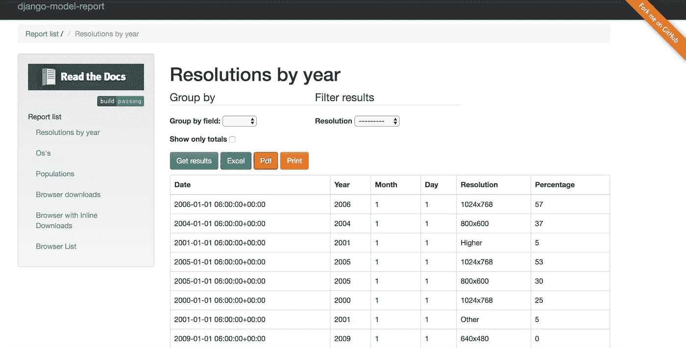
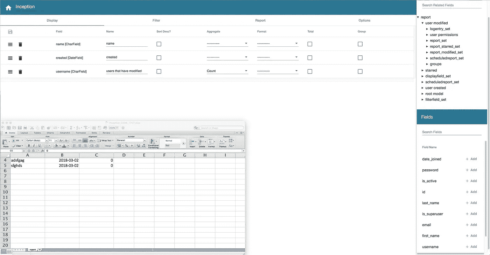
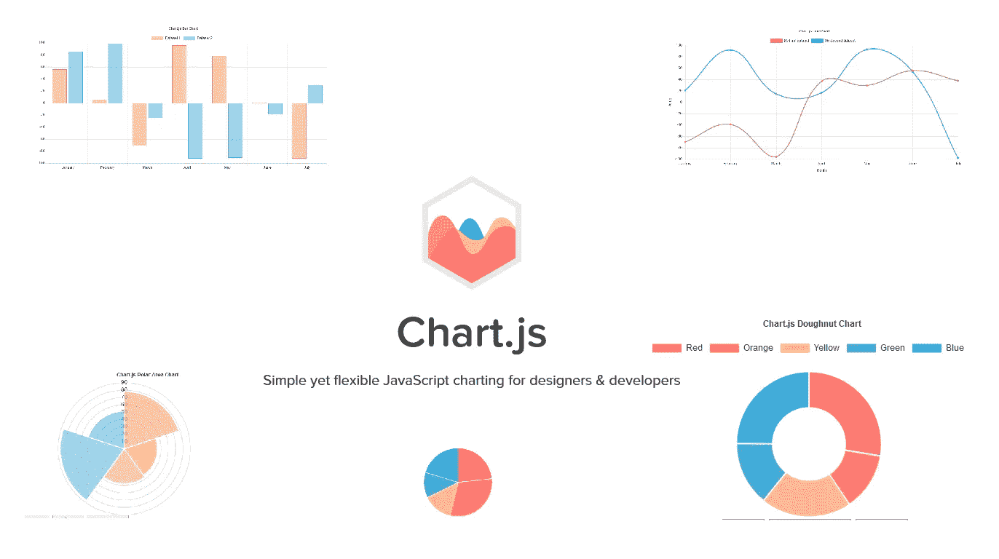
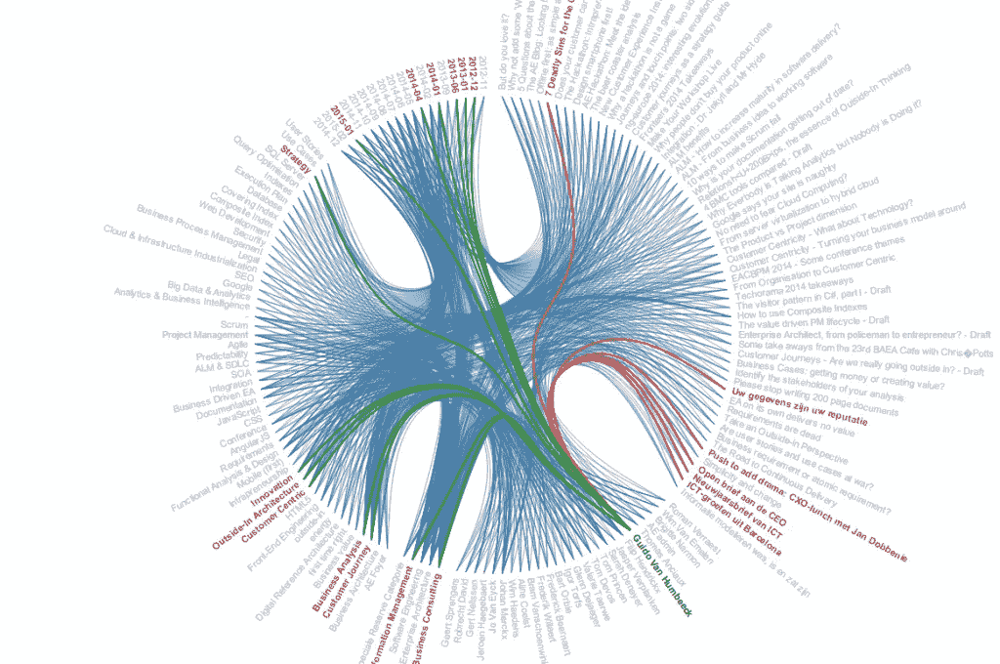

# 姜戈美丽的视觉图表

> 原文：<https://betterprogramming.pub/prettify-python-django-with-beautiful-visual-charts-836fe6646305>

## 为您的团队或用户构建难以置信的数据可视化

随着数据变得比以往更加丰富和更有价值，对这种数据的可视化需求已经成为一种必然。使用图表直观地表示这些数据可能是轻松消化大量信息并获得洞察力的最佳方式。

谈到 Django 中的数据可视化，有几个策略可以让你得到漂亮的报告，而且你不必是数据科学家。

最初，您可以使用自己的本地 SQL 语句在 SQL 客户端上执行，将结果导出到 Excel 进行进一步分析，这将允许您立即创建不同类型的图表，包括折线图、柱形图或迷你图(一种旨在快速表示数字或统计信息的小图形)。

如果你想用 Django 自动完成整个过程呢？如果您是 Django 开发人员，那么在编码工作的某个阶段，您可能需要向您的 Django 项目添加数据可视化和洞察力。

下面，我们将探索几个库，它们将帮助您在这个过程中轻松入门。

有三个关键的 Django 应用程序，你可以在你的项目中使用，它们会立刻给你带来令人惊叹的报告。让我们看看第一个选项。

# 1.Django 报告模型

[Django 模型报告](https://github.com/juanpex/django-model-report)是一个易于集成的库，它为您提供了一个以表格格式查看 Django 模型数据的绝佳方式，同时利用 [Highcharts](https://www.highcharts.com/) 。

Highcharts 部分允许您利用纯 JavaScript 编写的 JavaScript 图表库，提供了一种简单的方式向您的网站或 web 应用程序添加交互式图表。

Highcharts 是业内最受欢迎的框架之一，被大型企业所采用，支持大量复杂程度不同的图表类型。

您可能要记住的一件事是，您需要一点时间来了解如何使用它，因为特性集非常全面，从简单到复杂。

文档非常丰富，还有演示示例。我鼓励你把自己沉浸在其中，以便快速上手。文件全面而详细；因此，学习过程应该相对简单。

要了解事物的视觉效果，请看这个[演示网站](http://django-model-report.herokuapp.com/)。

# 2.django-报告生成器

Django-report-builder 是 Django 对象关系映射(ORM)的 GUI。

Django-report-builder 允许您构建自定义查询并显示结果。这个插件的目标用户主要是不需要任何开发技能的系统管理员。

该插件是基本的，可能不够全面，无法满足复杂的需求。

## 3.Django 高图表

[Django Highcharts](https://github.com/ernestoarbitrio/django-highcharts) 你绝对应该在你的 Django 工具箱里放一个令人敬畏的库，让你的朋友、同行或客户大吃一惊。

这个插件应用程序利用 Highcharts 为您提供交互式的数据分析图表。这意味着您可以点击图表，立即获得数据的动态可视化说明。您可以创建的可视化插图仅受您的数据集和想象力的限制。

# JavaScript 替代方案

如果你正在使用 [Django REST 框架](https://www.django-rest-framework.org/)，那么你的图表选项将从你的后端解耦，你甚至可以变得更有创造力，因为有大量的第三方 JavaScript 框架可供选择用于数据分析。

如果这还不够，还有其他非 Django 选项，如 [Tableau](https://www.tableau.com/) 用于交互式可视化和仪表板，与您的 Django 项目无关。

这种第三方可视化工具确实有价格标签，但如果价格不是一个问题，可能值得研究。下面是一些开源的、免费的、值得称赞的 JavaScript 图表工具。

# Chart.js

一个简单而灵活的 JavaScript 库，用于数据可视化。

主要特性:截至本文发布之日，Chart.js 支持八种图表类型:折线图、面积图、条形图、饼图、雷达图、极坐标图、气泡图和散点图。

所有图表类型都可以自定义和动画化，当在线使用时，所有图表都可以响应。如果您需要额外的功能，Chart.js 可以通过使用插件来扩展。

# Plotly.js

Plotly.js 是一个高级 JavaScript 库，免费开源。它是建立在 [D3.js](https://d3js.org/) 和 [stack.gl](http://stack.gl/) 之上的，所以这意味着你可以获得 D3 的强大功能，可以灵活地定制你的可视化。

js 是一个高级的、声明性的图表库，提供了 20 种图表类型，包括 3D 图表、统计图和 SVG 地图。

# D3 . js——一件艺术品

D3.js 是一个强大的开源 JavaScript 库，用于数据可视化。它在 GitHub 上有超过 20，000 个分叉。尽管学习曲线可能有点高端，但您可以从头开始获得任何种类的令人敬畏的可视化和图形。

D3 支持多种图表类型，比其他 JavaScript 图表库多得多。D3 提供了强大的可视化组件和数据驱动的 DOM 操作方法，包含数百个示例和一个大型开源社区，可以满足您的任何支持需求。

# 结论

上面的列表并不是在线可用选项的完整列表，但是列出了 Django 和 web 应用程序中最常用的库。

很难确定哪一个是最理想的库，因为每个用例都是不同的。

因此，当选定一个可行的库来集成到您的 Django 或 web 项目中时，选择一个能够实现您所设定的目标的库。