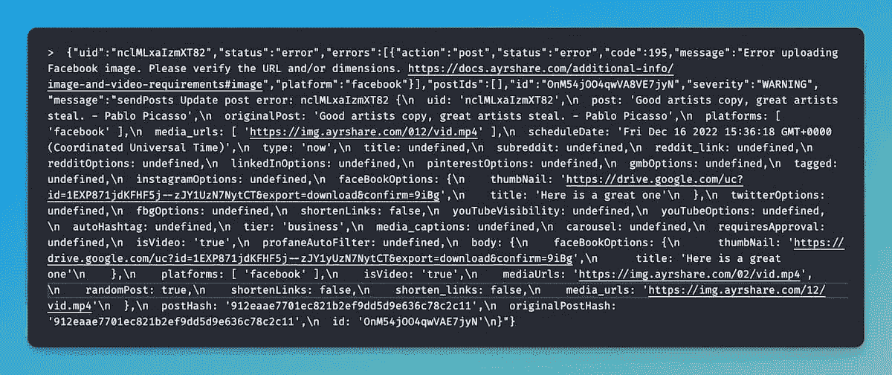
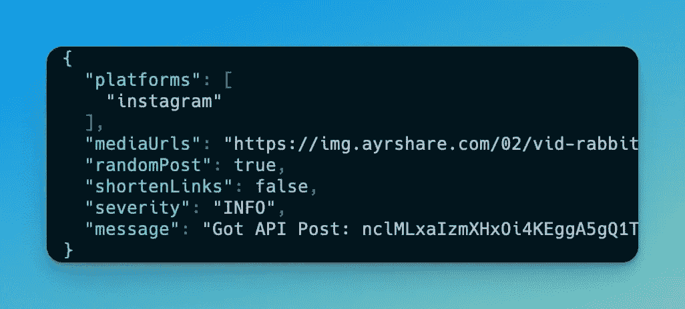
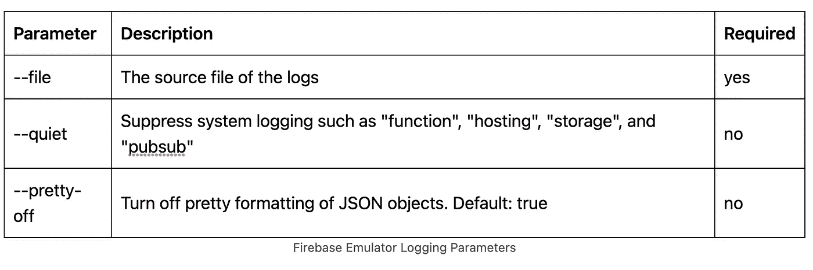

# 如何增强 Firebase 模拟器日志

> 原文：<https://betterprogramming.pub/pretty-up-and-remove-noise-from-firebase-emulator-logs-5991a40736c3>

## 打扮一下，消除噪音


作者图片

我是 Firebase 的忠实粉丝，并广泛使用模拟器和我们的[社交媒体 API](https://www.ayrshare.com) 进行本地开发。

模拟器有很多很棒的功能，比如模拟云功能，Firestore，甚至 pub/sub。如果使用`console.log`将 JSON 日志输出到控制台，输出是可以接受的，尤其是使用`JSON.stringify({...}, null, "\t")`对其进行格式化时。

然而，当你使用 Firebase 的[推荐的](https://firebase.google.com/docs/functions/writing-and-viewing-logs) [记录器](https://firebase.google.com/docs/functions/writing-and-viewing-logs)时，事情就变得混乱了。Logger 是 [Google Cloud Logger](https://cloud.google.com/logging) ，它允许你构建你的日志和 JSON，这样你就可以在 Google Cloud Dashboard 中轻松地查看和搜索它们。

虽然 Firebase logger 的输出在 Google Cloud 仪表板上看起来很棒，但在我们的终端输出中却不那么好看:



Firebase 模拟器日志

# 增强 Firebase 模拟器日志

我们对 Firebase 模拟器日志的理想期望是什么？

*   使用记录器时 JSON 对象的格式化。
*   彩色输出，以便我们可以突出错误。
*   删除我们可能不关心的无关数据，例如“函数:您正在调试模式下运行函数模拟器(`port=9229`)。这意味着功能将按顺序执行，而不是并行执行。”

因为 Firebase“还”没有提供这些功能，所以让我们构建自己的功能。

我们将把 Firebase 模拟器的输出保存到一个文件中，监视文件的变化，处理变化(格式等。)，并将处理后的数据输出到控制台。

1.  克隆 [Firebase 模拟器日志 GitHub 库。](https://github.com/ayrshare/firebase-emulator-logging)这是一个 Node.js 的 app。在克隆的目录中运行典型的`npm install`。
2.  像平常一样启动 Firebase 模拟器，并输出到一个文件。比如:`firebase emulators:start > save.txt`或者`npm run serve > save.txt`。
3.  回到克隆的目录，用`node index.js --file {file location}`运行节点应用程序。比如:`node index.js --file ./save.txt`
4.  享受新日志吧！



格式化的 Firebase 日志

# 增强的日志参数

运行 Node 应用程序时有几个选项。您已经看到了—文件，但是您也可以将输出设置为 quiet，这意味着以“function”或“hosting”开头的系统输出被禁止，并且您可以关闭漂亮的格式设置。



# 在幕后

如果你想看所有的代码，可以去 [GitHub](https://github.com/ayrshare/firebase-emulator-logging) ，或者这里是`index.js`文件:

```
import readline from "readline";
import TailFile from "@logdna/tail-file";
import colorizer from "json-colorizer";

const QUIET_STRING = ["functions", "hosting", "storage", "pubsub"];

const quiet = process.argv.indexOf("--quiet");
const prettyOff = process.argv.indexOf("--pretty-off");
const fileIndex = process.argv.indexOf("--file");

if (fileIndex <= -1 || !process.argv[fileIndex + 1]) {
  console.error(
    "You seem to be missing the --file argument. Please provide a file to tail."
  );
  process.exit(1);
}

const options = {
  pretty: prettyOff <= -1 ? true : false,
  colors: { STRING_LITERAL: "white" },
};

async function startTail() {
  const tail = new TailFile(process.argv[fileIndex + 1]).on(
    "tail_error",
    (err) => {
      console.error("TailFile had an error!", err);
    }
  );

  try {
    await tail.start();
    const linesplitter = readline.createInterface({
      input: tail,
    });

    linesplitter.on("line", (line) => {
      if (
        quiet &&
        QUIET_STRING.some((str) =>
          new RegExp(`(?<=^...)(.*)${str}`, "gm").test(line)
        )
      )
        return;

      let newLine = line;
      if (newLine.startsWith(">") && newLine.endsWith("}")) {
        const overrideOptions = { ...options };

        try {
          const json = JSON.parse(newLine.slice(3));
          switch (json?.severity) {
            case "INFO":
              overrideOptions.colors.STRING_KEY = "blue";
              overrideOptions.colors.BRACE = "blue";
              break;
            case "WARNING":
              overrideOptions.colors.STRING_KEY = "yellow";
              overrideOptions.colors.BRACE = "yellow";
              break;
            case "ERROR":
              overrideOptions.colors.STRING_KEY = "red";
              overrideOptions.colors.BRACE = "red";
              break;
            default:
              break;
          }

          newLine = colorizer(newLine.slice(3), overrideOptions);
        } catch (err) {
          // ignore
        }
      }

      console.log(newLine);
    });
  } catch (err) {
    console.error("Cannot start. Does the file exist?", err);
  }
}

startTail().catch((err) => {
  process.nextTick(() => {
    throw err;
  });
});
```

使用了两个外部 NPM 包:

*   `import TailFile from "@[logdna/tail-file](https://www.npmjs.com/package/@logdna/tail-file)";`—tail file 是一个很棒的包，它允许“跟踪”一个文件——只要有什么变化，就会发生一个事件。
*   `import colorizer from "[json-colorizer](https://www.npmjs.com/package/json-colorizer)";` —JSON colorizer 是一个包，允许您指定哪些 JSON 元素获得某种颜色。