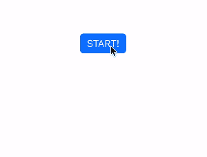
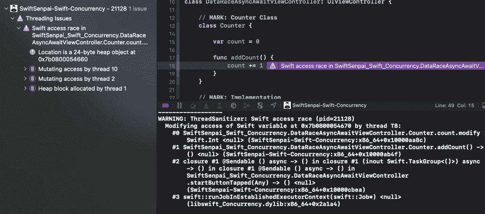
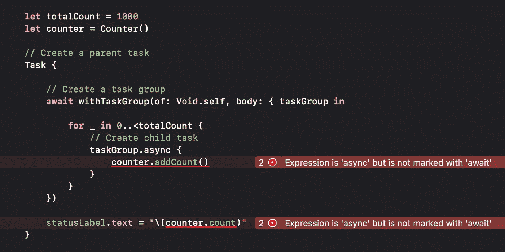

# 在 Swift 中使用 Actors 防止数据竞争

> 原文：<https://betterprogramming.pub/preventing-data-races-using-actors-in-swift-ed3d8a69adf3>

## 告别数据竞赛

汤米·范·凯塞尔的照片🤙 on [Unsplash](https://unsplash.com?utm_source=medium&utm_medium=referral)

数据竞赛——所有开发人员最糟糕的噩梦！它们很难被发现，非常不可预测，并且极难修复。苹果给了开发者各种工具集，如`NSLock`和串行队列，以防止运行时发生数据竞争，然而，它们都不能在编译时捕捉竞争条件。随着 Swift 5.5 的发布，这种情况将不复存在！

介绍 **Actor** ，新的 Swift 语言特性可以帮助开发者在开发期间捕捉任何可能的竞争条件。在本文中，我们将首先看看在使用调度队列和异步任务时，数据竞争是如何发生的。之后，我们将看看演员如何帮助我们识别代码中的竞态条件，并一劳永逸地防止它们发生！

别再浪费时间了，让我们开始吧。

# 数据竞争是如何发生的？

当两个或多个线程试图同时异步访问(读/写)同一个内存位置时，就会发生数据竞争。在 Swift 环境中，当我们试图使用调度队列修改对象的状态时，通常会发生这种情况。我这么说是什么意思？

考虑下面的`Counter`类，它有一个`count`变量，每调用一次`addCount()`函数，它就增加 1:

现在，假设我们有一个将触发以下代码的按钮:

基本上，上面的代码所做的就是使用调度组异步调用`Counter`的`addCount()`函数 1000 次。一旦调度组执行完成，我们将在标签上显示`counter`的`count`值。

理想情况下，当我们每次点击按钮时，我们应该看到标签上显示的 *1，000* ，然而事实并非如此。我们得到的结果非常不一致。我们可能偶尔会得到 *1，000* ，但通常我们得到的值都小于 *1，000* 。

数据竞争导致的结果不一致

您可能已经猜到，这种不一致是由数据竞争引起的。当多个线程(由调度队列产生)试图异步访问`count`时，不能保证每个线程都将一个接一个地更新`count`的值，从而导致最终的结果非常不一致并且很难预测。

**亲提示:**

Xcode 有一个**线程杀毒器**，帮助开发者以更一致的方式检测数据竞争。您可以导航到**产品** > **方案** > **编辑方案…** 之后，在编辑方案对话框中选择**运行** > **诊断** >勾选**线程杀毒器**复选框。

启用 Xcode 线程杀毒程序

现在您知道了数据竞争是如何发生的，如果我们使用 async/await 和异步任务做同样的事情，会发生数据竞争吗？让我们来了解一下！

# 异步任务和数据竞争

在 Swift 并发领域，任务和任务组的工作方式类似于调度队列和调度组。我们可以通过创建一个产生一组异步执行`addCount()`功能的子任务的父任务来实现前面的数据竞争条件。下面是如何做到这一点:

在上面的代码中，我们使用`withTaskGroup(of:body:)`方法来创建一个任务组。在任务组中，我们创建 1000 个子任务来异步执行`addCount()`功能。值得一提的是，`withTaskGroup(of:body:)`方法是可调整的，因此它将被挂起，直到所有子任务完成。一旦发生这种情况，我们将在标签上显示`count`值。

当我尝试运行上面的代码时，我得到的结果惊人地一致！每次代码执行完毕，我都能看到标签上显示 *1，000* 。这是否意味着当我们使用任务和任务组时，数据竞争不会发生？🤔

可惜，答案是否定的！

当我尝试在启用线程杀毒器的情况下运行上面的代码时，我仍然会得到一个线程杀毒器警告，表明数据竞争确实发生了。

Xcode 线程消毒警告

如果是，那么为什么我们能够得到如此一致的结果？我的猜测是，苹果在优化整个 Swift 并发模块方面做得非常好，因此它能够解决简单的数据竞争情况，就像我们在样本代码中遇到的情况一样。

当使用调度队列时，我们可以通过使用串行调度队列来防止并发写入，从而避免数据竞争。如果使用异步任务，我们应该使用什么来防止并发写入？这就是演员的用武之地。

# 拯救行动的演员

Actor 是 Swift 5.5 中引入的新语言功能，主要用于帮助开发人员在开发期间识别任何可能的数据竞争情况。正如您稍后将看到的，每当我们试图编写可能导致数据竞争的代码时，编译器都会给我们一个编译错误。如果你不熟悉演员是如何工作的，可以参考我之前的[文章](https://swiftsenpai.com/swift/swift-concurrency-get-started/#actor)讲演员的基础知识。

现在我们试着把`Counter`班改成演员。我们需要做的就是把`class`换成`actor`，就这样！

在这个阶段，我们的示例代码将在我们试图访问`count`变量的地方给出两个编译错误。

Swift 编译器捕捉数据竞争

错误消息“*表达式为‘async’但未标记‘await’*”到底是什么意思？这意味着我们不能像这样简单地访问`count`变量！

由于`Counter`现在是一个 actor，它一次只允许一个异步任务访问它的可变状态(变量`count`)。因此，如果我们要访问`count`变量，我们必须用`await`标记两个访问点，表明如果有另一个任务访问`count`变量，这些访问点可能会挂起。

值得一提的是，actors 将保护它的可变状态，使其不被 **read** 和 **write** 访问。这就是为什么我们会在示例代码中的两个访问点上都出现编译错误。

你有它！这就是我们如何通过使用参与者来防止数据竞争。如果您想亲自尝试一下示例代码，请在这里随意获取。

# 包扎

在 Swift 中包含 actors 无疑是一个受欢迎的做法。它使我们能够用很少的编码工作编写更安全的异步代码。事实上，它是一种语言特性，使得它能够在编译时捕捉任何可能的竞争情况，从而防止我们意外地将数据竞争导致的错误发送给我们亲爱的应用程序用户。

如果你觉得这篇文章有帮助，你可能想看看我的另一篇关于 Swift 并发的文章:“[在 Swift](https://swiftsenpai.com/swift/async-await-network-requests/) 中用 Async/await 发出网络请求。”

欢迎在 [Twitter](https://twitter.com/Lee_Kah_Seng) 上关注我，这样你就不会错过我即将发布的任何与 iOS 开发相关的文章。

感谢阅读。👨🏻‍💻