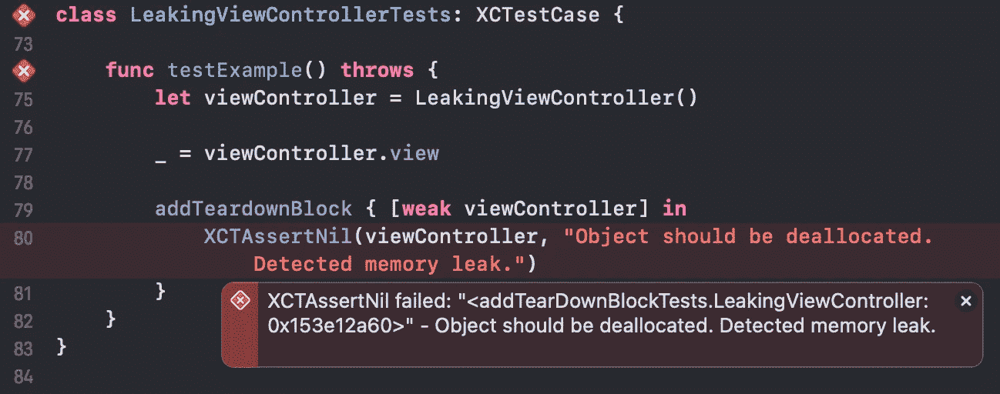
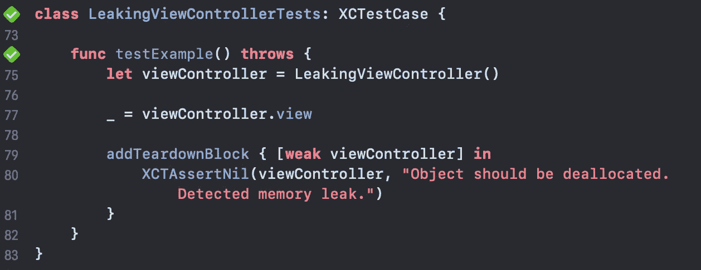
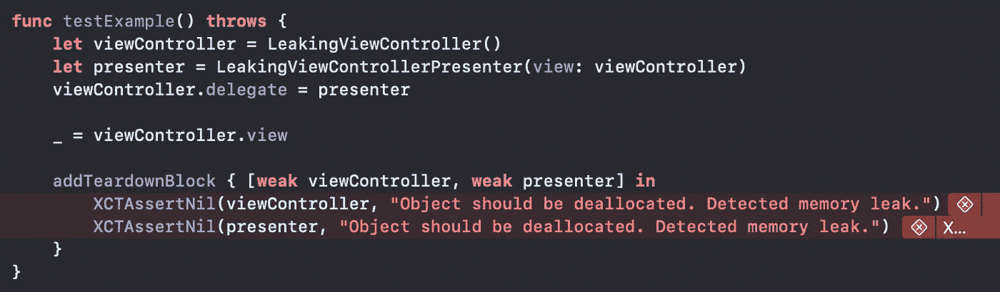
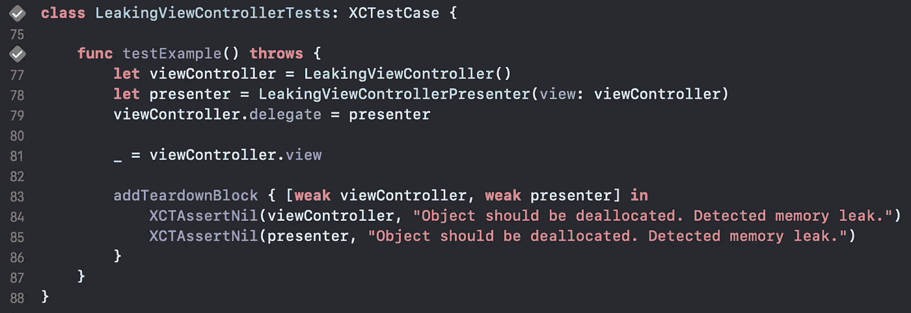

# 使用 XCTests 防止内存泄漏

> 原文：<https://betterprogramming.pub/preventing-memory-leaks-using-xctests-5fee5e1fa7c5>

## 减少对 iOS 中手工测试的依赖

照片由[威廉·胡克](https://unsplash.com/@williamtm?utm_source=medium&utm_medium=referral)在 [Unsplash](https://unsplash.com?utm_source=medium&utm_medium=referral) 上拍摄

在开发 Swift 应用程序时，我们会面临一些风险。其中之一是内存泄漏。

[自动引用计数器](https://docs.swift.org/swift-book/LanguageGuide/AutomaticReferenceCounting.html) (ARC)从内存中释放一个对象，仅在该对象没有强引用的情况下。此外，当两个引用类型相互引用时，它们都不会从内存中释放，这会导致内存泄漏。

为了研究这个问题，我们可以使用 Xcode 工具或内存图调试器。这些工具允许对发生的泄漏进行深入分析。然而，我们应该回答的问题是，是否有任何方法可以首先实际防止内存泄漏？

答案是肯定的，通过使用单元测试。自动化测试的执行允许在将应用程序传递给 QA 团队或客户自己之前捕捉应用程序中的错误。让我们来看看如何实现这样的保护。

让我们考虑一个简单的带有按钮的视图控制器。

在动作处理程序内部，对`self`的强引用导致`button`和`LeakingViewController`之间的保持循环。如您所见，即使在这个简单的例子中，我们也可以创建内存泄漏。现在让我们编写一个测试来提醒我们一个问题。

创建视图控制器后，您可以注意到一些神秘的块，称为`addTeardownBlock`。这个程序块在退出当前测试方法后执行——类似于`tearDown`方法。它保存对`viewController`的弱引用，以便不创建保留周期。在我们的例子中，在完成一个测试代码后，`button`和`viewController`将持有彼此的引用，创建一个保留周期，这样`addTeardownBlock`就能够访问`viewController`的引用，这反过来通知我们内存泄漏。

弱化按钮的处理程序闭包中的`*self*`将消除内存泄漏，同时满足测试。

正如您所看到的，一个小的疏忽会导致内存泄漏。让我们通过添加另一个`presenter`类来扩展这个例子——已知来自 MVP 模式。

`LeakingViewControllerPresenter`符合`LeakingViewControllerDelegate`，这就为调用`startLoading()`方法提供了可能，而且`LeakingViewController`也可以调用`LeakingViewControllerPresenter`上的`buttonClicked()`。通过不使委托属性变弱，我们引入了另一个保留周期，这已被我们的测试所证明。

让我们快速修复一个*演示者*类。

我们的测试又开始通过了。

随着代码开始增长，可能会有许多其他原因导致内存泄漏。

通过使用自动单元测试来处理它们，可以显著提高应用程序的质量并节省时间，否则你将不得不花费在冗长的手动调试上。

即使您不确定您的代码是否会触发保留循环，使用这种方法来获得对代码的信心总是好的。

## *参考*

[https://www.essentialdeveloper.com](https://www.essentialdeveloper.com)