# 预览未来的 IDE 舰队

> 原文：<https://betterprogramming.pub/previewing-the-ide-of-the-future-ff90da52c660>

## JetBrains 最近发布了他们最新 IDE Fleet 的预览版。让我们来看看它


图片由珀西·博尔梅尔提供。Gopher 由拓也·上田提供，原始 Go Gopher 由勒内·弗伦奇提供(CC BY 3.0)

我已经等了很久了，等待“喷气大脑”发布他们的新产品[舰队](https://www.jetbrains.com/fleet/)。坦白地说，我一直觉得 JetBrains 的产品比他们的竞争对手更强大，但也非常昂贵，这是有道理的。

IDE 是开发人员最重要的工具之一；它是我们花费大部分时间的地方，拥有一个好的工具是很重要的。

我是一个经常使用 Go 的开发者，GoLand 总是给我留下最强大的编辑器的印象。

所以你可能认为我会用 Goland？我确实有我仁慈的雇主提供的执照，但是我不能忍受使用它。用户界面看起来又老又混乱，我无法忍受。有这么多按钮，一切都隐藏在一些菜单后面。

我对 Fleet 非常感兴趣，但是，想象一下 IntelliJ 产品的力量，但是有一个更好的用户界面。这引起了我的注意。我知道他们可以提供强大的产品，但如果他们能管理一个更好的 UI，我会被说服。

该产品仍未完成，已处于封闭测试阶段一段时间，但他们最近发布了一个公共预览。让我们下载它，并给它一个旋转！

在预览期间，你可以在他们的网站上免费下载后使用 Fleet。

要安装它，您需要他们名为`Toolbox`的软件管理应用程序。一旦你启动工具箱，你可以在顶部找到 Fleet 进行预览，这允许你下载它。

在本文中，我们将基于 Go 代码探索 Fleet。代码可以在我的 [GitHub](https://github.com/percybolmer/websocketsgo) 上找到。

如果你更愿意把这篇文章当成视频来看，你可以在我的 YouTube 上找到它。

本文的视频记录

# 预览和导航代码

映入我们眼帘的第一个屏幕是工作区选择屏幕。在其中，我们可以看到当前支持的连接类型。

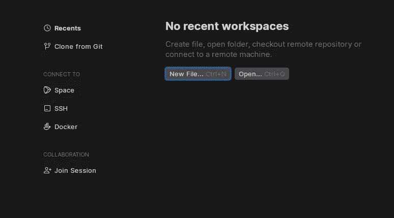

车队启动画面—设置您的通缉代码位置

Fleet 使得在远程服务器上使用本地计算机上的文件、 [Space](https://www.jetbrains.com/space/) 、Docker 或 SSH 变得很容易。这是一个非常好的特性。对于 VS 代码，我依靠一个[远程扩展](https://code.visualstudio.com/docs/remote/remote-overview)来实现。

为了测试这一点，我将`Clone from Git`把我在 [GitHub](https://github.com/percybolmer/websocketsgo) 上的一个 WebSocket API 的 GitHub 库拉回家。这很简单，只需输入一个指向存储库的 URL 和我电脑上存储它的位置。

一旦完成，舰队给我们看文件。UI 与 VSCode 非常相似，所有文件都在侧边栏中。

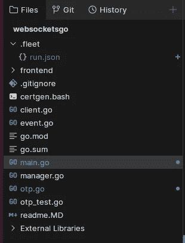

当前打开的项目的文件列表

有趣的是，Fleet 要求我们启用`Smart Mode`。智能模式将分析当前工作区中的代码库，启用语法高亮显示、自动完成、错误检测，并启用与文件内部语言相关的重构。您希望从 IDE 中获得的所有常规功能。我们当然希望这样，默认情况下必须启用它有点奇怪。

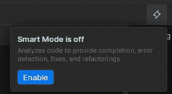

启用智能模式会通过分析代码库来触发常规的 IDE 功能

启用运行需要几秒钟，但是一旦完成，我们可以看到代码具有语法高亮。

> 我假设当你想打开一个巨大的代码库，又不想让你的电脑崩溃时，可以禁用智能模式

我注意到的第一件事是我觉得很酷的用法亮点。在我的`Event`结构上面，我可以看到一个小通知，这个结构在我的代码库中的七个位置被使用，当然，我也可以通过点击高亮来查看代码引用。

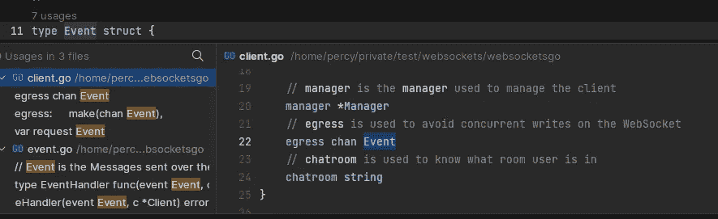

显示结构参考的使用说明

这是一个很好的功能。

我发现其他 IntelliJ 产品的一个很好的特点是他们的 GoTo 搜索屏幕。这是一个屏幕，允许您自由文本搜索您的代码库，并在给定的位置打开文件。幸运的是，他们已经将 goto 屏幕包含在舰队中。

以下要点向您展示了我如何使用它在代码库中搜索`RetentionMap`的声明，以找到并定位它被声明的具体位置。要调出 goto 搜索，我们可以使用`ctrl+K`。一旦菜单出现，我们就可以搜索单词及其参考。

Gist 显示使用舰队转到功能

搜索屏幕很漂亮。它向我们展示了多次点击和每次点击的一些代码预览，以便在它们之间轻松导航。

# 接口实现和使用亮点

在代码库中，我有一个基于计时器丢弃旧密码的`RetentionMap`，这是一个简单的一次性密码(OTP)解决方案。我想有一个名为`verifier`的接口，它可以有一个带有签名`VerifyOTP(otp string) bool`的方法。这暂时没有意义。这只是为了测试编写一些代码，看看它如何处理接口实现和代码建议。

展示代码建议和接口实现，托管在 [Giphy](https://giphy.com/gifs/go-code-fleet-BYWhcce5E5ibcFFerB) 上

gif 中的实际代码建议非常有限，但亮点是这个接口是由一个 struct 实现的，并且跳转到实现的能力很好。

你可以看到 RetentionMap 还列出了 1 `super`在编写接口之后，这是该结构正在实现的所有接口的列表，这在导航具有许多接口的大型代码库时很好。

因此，默认情况下，编辑器中有一些不错的功能。外观也相当有趣，在结构和接口等上面出现了小的高亮摘要。这也适用于变量和常量。在它们的用法之间导航真的很容易。

让我们写一些可以用来调试`VerifyOTP`实现的代码，因为在我看来，除了代码建议之外，调试可能是 IDE 最重要的特性。

# 编写代码、调试和测试

我们将要测试的代码相当简单，`RetentionMap`是一个存储字符串值的映射，在一段时间后，它们会被删除。

我们将为这个功能编写一个单元测试，以确保它能正常工作。

我打开`otp_test.go`，这是我要更新的文件。

Gif 展示了编辑器如何建议生成一个单元测试

在我键入`func TestOTP`之后，Fleet 推荐了一个名为`TestRetentionMap_VerifyOTP`的自动命名单元测试，这正是我想要的。然后它生成单元测试的函数签名，这很好。

在编写单元测试时，我们可以看到我在 VS 代码中错过的一个很酷的特性。每当我输入一个函数名时，Fleet 就会弹出一个窗口，它会在我的光标旁边浮动，提供一些代码建议，比如与我的模式匹配的函数名、它们的输入参数等等。

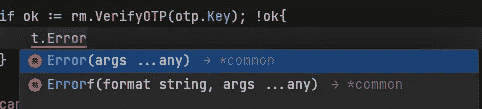

给我们功能建议的舰队

> 我说我在 VS 代码中错过了这个特性，但是它确实存在，但是没有显示输入参数。

一旦单元测试完成，我们可以在两种模式下执行测试:运行模式和调试模式。这些模式可以通过单元测试旁边一个漂亮的小播放按钮找到。


显示播放按钮以运行单元测试

Run 将简单地执行测试，并在新的终端中打印结果。Debug 将允许我们附加断点，并使用`dlv`来查看当前的应用程序状态。

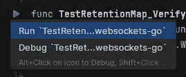

单元测试的运行和调试模式

如果我选择 Run，我们将在底部的一个新终端中看到单元测试日志和输出(类似于 VS 代码)。

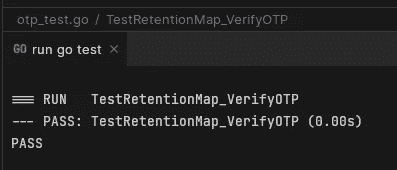

单元测试显示单元测试的结果

调试是我喜欢的事情，所以让我们试试吧。

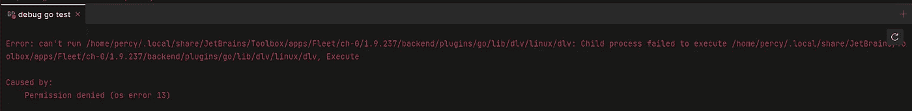

哎呀—安装程序似乎没有给出正确的调试权限

所以看起来安装没有产生正确的权限。我会向他们报告的。车队团队维护着一个 YouTrack，我们可以向它报告 bug。

> 我的 bug 已提交[【这里】](https://youtrack.jetbrains.com/issue/FL-15464/Ubuntu-ToolBox-installs-Fleet-with-Wrong-DLV-Permissions)

如果我们使用日志中的路径列出 DLV 二进制文件的权限，我们可以很容易地解决这个问题；它缺少执行权限。

```
chmod +x /home/percy/.local/share/JetBrains/Toolbox/apps/Fleet/ch-0/1.9.237/backend/plugins/go/lib/dlv/linux/dlv
```

让我们再次尝试调试。我在验证 OTP 的那一行设置了一个断点。

一个新的显示屏将显示调试信息。

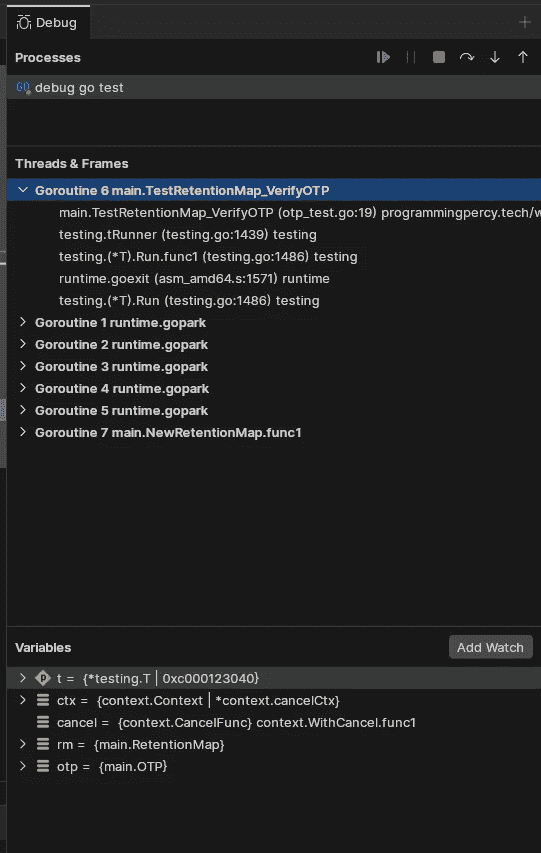

车队中的调试工具栏

给我印象最深的是它列出了所有的 goroutines。在这个视图中，我们可以在它们之间跳转，并检查所有当前正在运行的进程的当前状态。

正如您所看到的，我们也可以很容易地显示断点当前范围内存在的变量。

我们可以通过单步执行(转到下一行)来轻松浏览代码，单步执行进入被调用的函数，允许您调试嵌套的函数调用，同时尝试检测任何 bug。我们也可以跳出去，完成当前的函数，然后进入调用它的父函数。

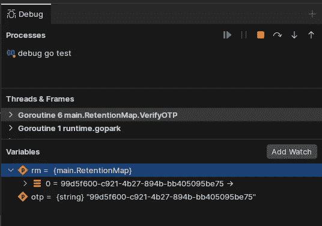

扩展变量并移入代码。

总的来说，在舰队中调试似乎是一次非常愉快的经历。

因此，我们对代码进行了更改，我们有一个存储库来推送这些更改，因此，让我们来探索 Fleet 中的源代码控制集成。

# 源代码管理集成

对于 IDE 来说，一件非常重要的事情是，它应该帮助我们集成 Git 或任何其他支持的版本控制系统。

让我们探索一下这在舰队内部是什么样子。我们在几个文件中做了一些改动。让我们看看我们是否可以查看这些并推动它们。

任何更改的文件都用蓝色文本和蓝点标记，以突出显示它们包含自上次提交以来的更改。

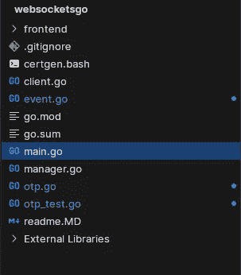

蓝色标记自上次提交以来的任何更改

我们可以查看文件中用绿线标记的任何附加内容。

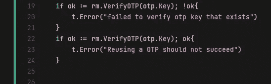

绿灯亮表示改变的行

还有一个名为`Git`的选项卡，显示已更改的文件，并允许我们进行新的提交。

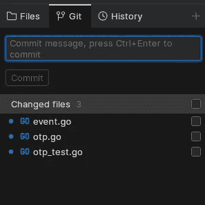

Git 选项卡显示更改并允许我们提交

在我们提交之前，让我们看看是否可以创建一个新的分支，这样我们就不会向主服务器提交任何东西。

如果我们启用了源代码控制，您可以在顶部菜单中看到您正在处理的当前分支，单击它允许我们快速而轻松地从当前分支创建一个新分支。

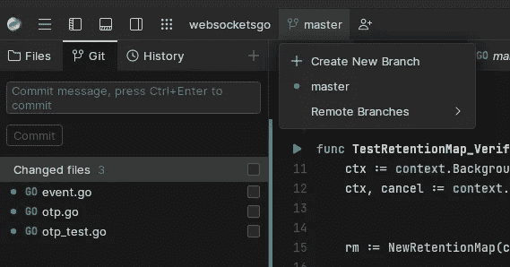

只需点击一个按钮就可以创建一个新的分支

一旦创建了一个新分支，它将更改为该分支。提交更改后，我们可以导航到`History`选项卡，它以非常漂亮的图形显示 git 日志，并且可以查看每个提交以了解更改。

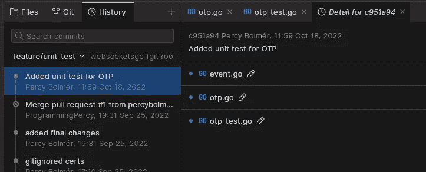

为存储库显示 Git 历史记录

一旦完成，我们可以通过使用 Sync 来推送它，这将拉和推在存储库上所做的任何更改。

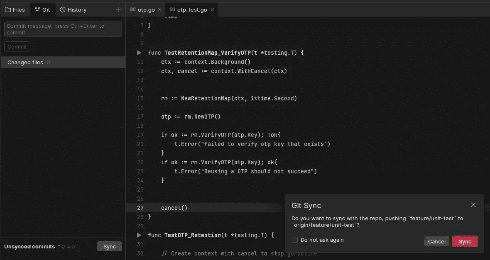

使用同步来推送本地提交

如果你是第一次使用 Git，它会要求你提供你的 GitHub 令牌。如果你按下生成按钮，它甚至会把 GitHub 带到正确的位置，这很好。

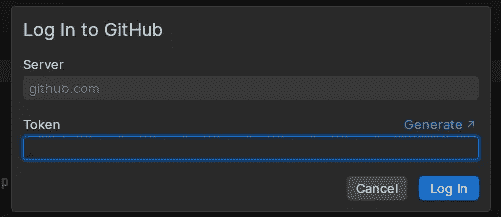

生成 GitHub 令牌以与车队集成

粘贴令牌后，我们就连接到 GitHub 了。

这很简单，不需要额外的插件。

# 操作和运行配置

我们要探索的另一个特性是使用编辑器执行程序。当我们想要运行应用程序和附加调试器时，这是很有用的。

正如您所想象的，要附加断点和其他东西，我们需要从 IDE 中执行应用程序。通过单元测试，我们可以很容易地通过按下播放按钮来完成，但是对于应用程序来说，这可能会变得更加复杂。

您可能已经构建了一个 CLI，并希望传入不同的参数，或者某些特定的环境变量。

因此，让我们来看看用于处理这种情况的运行配置。

按下`CTRL+SHIFT+K`调出动作面板，里面有一堆可以运行的动作。

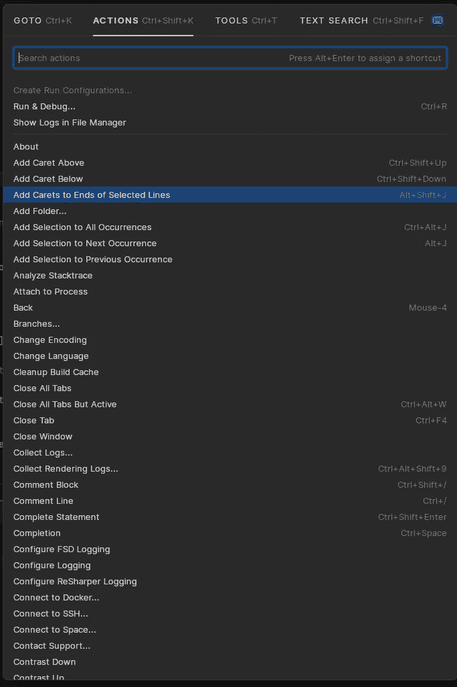

舰队中的行动

动作就像小的宏，通过热键帮助你执行某些任务，而不是重复执行。

我们将尝试的一个特定动作是`Create Run Configurations`。这有助于我们生成一个配置文件，使我们能够以我们想要的方式运行我们的应用程序。

该命令将启动一个向导来设置配置，帮助您完成每个步骤。

在要点中，您会看到我添加了一个 print 语句来打印一个环境变量并放置一个调试器。然后，我生成一个新的配置，并将环境变量设置为某个值，使用`CTRL+R`我们可以调出 Run 选项卡，它列出了我们已有的所有配置，并允许我们运行它们。

展示如何为 Go 应用程序使用运行配置和环境变量

正如您所看到的，编辑器运行应用程序，断点受到尊重，我们可以查看应用程序的状态。

在示例中，有一个 bug。没有显示打印的环境变量。我也向舰队[这里](https://youtrack.jetbrains.com/issue/FL-15480/Run-Configurations-Go-environment-variables-are-not-passed-to-the-binary)的家伙们报告了这一情况。

运行动作和运行配置超级酷，功能强大。这不是一个新功能；它存在于几乎所有 IntelliJ 产品中。VS 代码将它们命名为调试配置。

# 合作

Fleet 的一个很酷的特性是代码库的内置会话共享和协作。

如果您遇到问题，需要同事或朋友的帮助，只需点击顶部菜单中的用户图标，即可开始新的协作会话。这将复制一个链接，您可以将其发送给任何安装了 fleet 的人，一旦他们单击该链接，就会打开一个包含您的代码的 fleet 实例，他们可以对其进行编辑，您可以实时看到发生了什么。

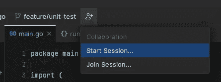

开始新的协作会话

一旦有链接的人试图加入，你会得到一个小的弹出窗口，要求你允许他们。

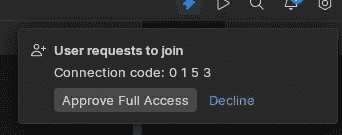

弹出窗口，询问是否允许新的会话连接

用户现在可以同时处理相同的文件。这个特性很酷，因为它不是主机和客户端之间的镜像。客户端可以处理不同的文件，而主机可以处理另一个文件。

这只是一个我们可以合作的共享会议。

在要点中，你可以看到我打开了`main.go`，而同事更新了`otp.go`。然后，我们可以通过点击同事的图标，跳转到他们当前的工作位置。太神奇了。

通过单击协作者的个人资料来查看协作者的行为

另一件疯狂的事情是，合作者甚至可以根据主机配置触发操作。

还记得我们之前是如何创建运行服务器配置的吗，看看我的主机编辑器，它是为我们运行的协作器触发器，就像我们运行`CTRL+R`并选择它一样。

我们共享终端和运行输出，这适用于所有合作者。

显示远程协作者如何触发运行命令，以及终端如何向所有参与者显示的图形

# 结论

我要说实话。我对调试器印象深刻；它感觉更流畅，比我习惯的 VS 代码更清晰地显示变量值。

最让我惊讶的是，它展示了所有的 Goroutines，我觉得这是一件大事。我不得不回到 VS 代码，检查这是否可能，它是可能的。它只是更隐蔽，正因如此，我以前错过了。所以我现在在 VS 代码中发现了一个非常好的新特性，感谢 Fleet。

内置的会话共享似乎也可以成为一件大事。我知道有外挂等。这也很酷，但是每个人都需要安装一个插件，等等。如果是内置的，感觉会顺畅很多。

我会转到舰队吗？

还没有。我希望插件到来，并允许编辑器增长一些第一。我知道所有的东西都可以从一开始就被内置，拥有作为插件的扩展是令人惊讶的，可以帮助每个人使他们的 IDE 有自己的风格。

我也觉得我做的这个小测试出现了两个 bug。我知道这是一个预览，但可能还有许多其他的错误。

在全职尝试之前，我会让车队成熟一点。我确实喜欢它的某些部分。IntelliJ 产品有很强的建议引擎和其他我觉得 VS 代码有点欠缺的部分。

但是说实话，这感觉像是抄袭 VS 代码——设计和布局 95%都是抄袭 VS 代码。

然而，如果我们有一个像 VS 代码一样的漂亮的 UI 和一个编辑器后面的 IntelliJ 产品的强大功能会怎么样呢？

嗯，我想这就是未来的舰队。