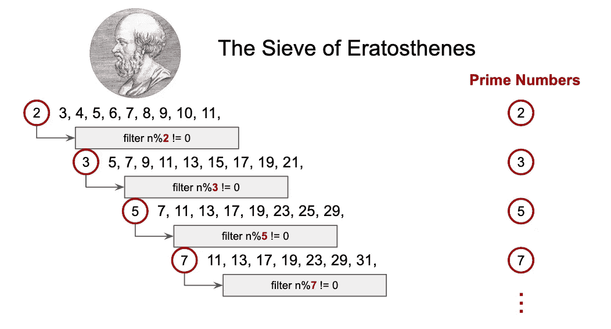
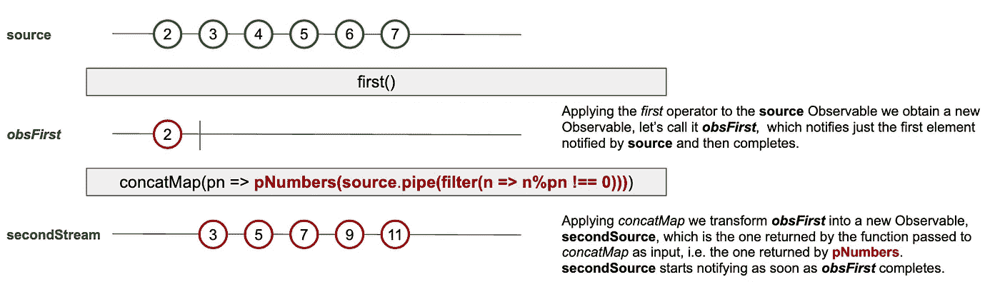
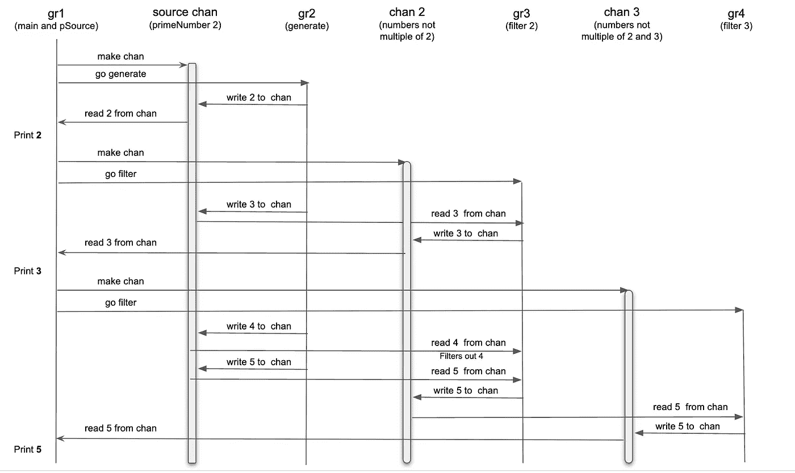
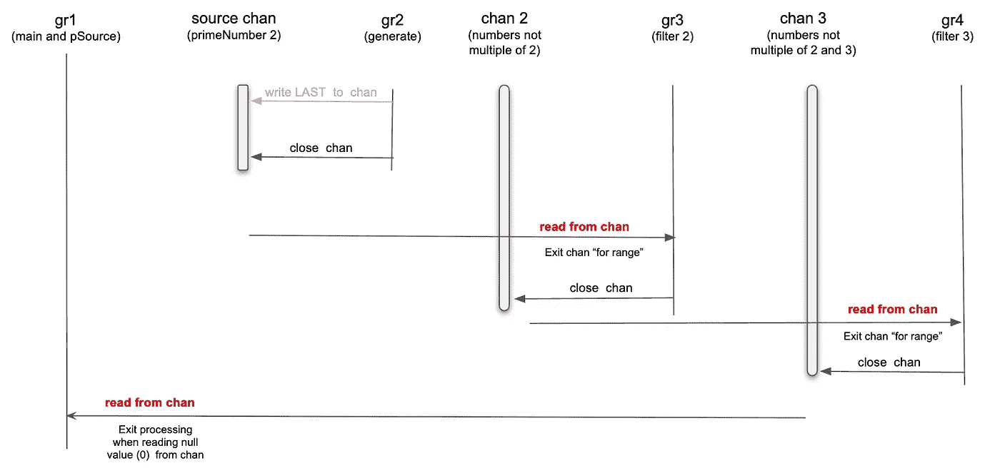

# 质数作为流，用 RxJS 和 Go

> 原文：<https://betterprogramming.pub/prime-numbers-as-streams-with-rxjs-and-go-a18b0292fb5e>

## 用流递归实现的厄拉多塞算法的筛选



厄拉多塞之筛:质数如流

质数可以被想象成一个无限的整数流:1，2，3，5，7，11…等等。

2000 多年前，希腊数学家[厄拉多塞](https://en.wikipedia.org/wiki/Eratosthenes)发现[素数可以用流](https://en.wikipedia.org/wiki/Sieve_of_Eratosthenes)以递归方式计算。

在本文中，我们将看到这种逻辑的几种不同实现，一种使用 RxJs 和 Typescript，另一种使用 Go 通道作为流。

# 具有 RxJs 可观测流的“厄拉多塞筛”

为了开始我们的计算，我们需要生成一个所有整数的流，从 2 开始，这将是算法使用的源。RxJs `range`函数给我们的正是这个:

`const **source** = range(2, 1000) // 2, 3, 4, 5, 6, ...`

然后我们需要取`source`的第一个值，实际上是第一个`primeNumber`，用它来生成第二个数字流，这个数字流是从`source`过滤掉所有是`primeNumber`的乘数的数字得到的。`first`和`filter`是要使用的 RxJs 运算符:

```
const secondStream = **source**.pipe(
   first(),
   filter(**primeNumber** => **source**.pipe(
     filter(n => n % **primeNumber** !== 0)
   )
)
// 3, 5, 7, 9, 11, ...
```

如果我们能够从`source`开始生成数字`secondStream`(3，5，7，9，11，…)，我们可以以完全相同的方式从`secondStream` 开始生成第三个流，即使用`first`和`filter`:

```
const thirdStream = **secondStream**.pipe(
   first(),
   filter(**primeNumber** => **secondStream**.pipe(
     filter(n => n % **primeNumber** !== 0)
   )
)
// 5, 7, 11, 13, ...
```

这显然是一个递归模式，可以编码为一个函数`pNumbers`:

```
function ***pNumbers***(source: Observable<number>): Observable<number> {
   return source.pipe(
      first(),
      concatMap(pn => ***pNumbers***(
         source.pipe(filter(n => n % pn !== 0))
      ))
   );
}
```

但是为什么是`concatMap`？下面的大理石图有助于澄清。



在 **pNumbers** 函数中发生的变换链

我们从`source`开始，它是一个流，我们通过操作符`first`把它转换成一个新的流`obsFirst`**。然后我们需要将`obsFirst`转换成一个新的流`secondStream`，它是由`pNumbers(source.pipe(filter(n => n%p !== 0)))`返回的`Observable`通知的值的流。**

**所以我们基本上是用*将*内部的`Observable`(也称为更高一级的`Observable`)，即由函数`pNumbers`返回并作为输入传递给`concatMap`的那个，展平到在`pipe`中执行的整个转换的结果流中。**

**在 RxJs 中，由`mergeMap`、`switchMap`、`exaustMap`和`concatMap`等操作符对更高级别的可观察对象进行展平。在这种情况下，我们使用`concatMap`,因为通知应该在前一个源可观测值(在上面的例子中为`obsFirst`)完成时开始。**

**准备好递归函数`pNumbers`后，就可以计算达到某个阈值的质数了:**

**打印 100 以内的质数**

**我们还可以创建一个`Observable`，通知所有达到给定阈值的质数。这是通过构建新的`Observable`包装`pNumbers`的函数获得的。**

**素数是一个函数，它返回一个可观察值，通知所有达到某个阈值的素数**

**为了测试上面定义的`primeNumbers`函数返回的`Observable`，我们只需要像这样订阅它:**

```
const pNums = primeNumbers(100);
pNums.subscribe(pn => console.log(pn));
```

## ****这只是一个最终达到“最大调用堆栈大小”的长长的过滤器链****

**如果我们仔细观察我们的实现，我们会发现逻辑的核心在下面几行:**

```
return pNumbers(**source**.pipe(
  filter((n) => {
    return n % primeNumber !== 0;
  })
);
```

**这里我们用一个`filter`函数链接`source`流。由于这一行被递归调用，我们最终构建了一个长长的`filter`函数链，附加到我们计算的初始`source`流。**

**如果我们重复这个递归足够多次，我们最终会一个接一个地链接许多`filter`函数，我们最终会达到调用栈的最大大小。如果我们用足够大的`upTo`输入数运行这段代码，就会发生这种情况。**

# **以围棋频道为溪流的“厄拉多塞之筛”**

**在 Go 中，我们可以使用通道来实现流。例如，从 2 开始的整数的未绑定流可以这样生成:**

```
ch := make(chan int)
for i := 2; ; i++ {
  ch <- i
}
```

**在这种情况下，流由信道`ch`表示。任何想要读取流的客户端代码只需读取通道`ch`。**

**我们的逻辑要求从输入流开始递归地创建非质数倍数的流。我们可以使用*流作为通道*的概念编写一个`filter`函数来实现这样的逻辑:**

```
func filter(inStream <-chan int, filteredStream chan<- int, n int) {
  for i := range inStream {
    if i%n != 0 {
      filteredStream <- i
    }
  }
}
```

**`inStream`是代表输入流的通道，`filteredStream`是代表非`n`倍数的流的通道，其中`n`是质数。注意`<-chan`和`chan<-`的使用。`inStream`的类型是`<-chan int`，这意味着一个我们只能从中读取的通道，而`fitleredStream`的类型是`chan<- int`，这意味着它是一个我们只能从中写入的通道。**

**最后，我们需要`pNumbers`函数，给定一个输入流，它获取第一个值，这是一个质数，将过滤逻辑应用于流的其余部分，以创建一个新的“过滤”流，并使用这个新的“过滤”流作为输入流递归调用自身:**

```
func pNumbers(inStream <-chan int, lastPrime int) {
  primeNumber := <-inStream 
  fmt.Println(i, primeNumber)
  filteredStream := make(chan int)
  go filter(inStream, filteredStream, primeNumber)
  pNumbers(filteredStream, primeNumber)
}
```

**完整解决方案的最终版本只是我们刚刚创建的构件的组合。**

**计算前 100 个质数**

**值得注意的是，对函数`pNumbers`的所有递归调用都在同一个“主”goroutine 中运行，而对`generate`和`filter`的每个调用都在它们自己的 go routine 中运行。基本原因是`pNumbers`只是流的*消费者*，换句话说，它只是从创建的通道中读取，并且它必须顺序工作，因为我们想要一个有序的素数序列。消费者需要生产者，即在通道上写的函数。`generate`是一个制片人，因为它只在一个频道上写作。`filter`既是消费者，也是生产者，因为它从一个通道读取，在另一个通道写入。同一流的消费者和生产者，即同一通道上的读者和作者，需要在不同的 goroutines 中运行，以避免死锁。**

**1 之后的前三个质数(即 2、3、5)的 goroutines 和通道之间的各种相互作用如下所示。**

****

**在计算 1 之后的前 3 个素数时，goroutines 和 channels 交互**

**实际读取和写入的顺序可能略有不同。例如，在 gr1 创建 chan 2 之前，goroutine gr2 可以将 3 写入源 chan。然而，从逻辑的角度来看，上面的图表清楚地展示了流程中发生的交互。**

**看计算的关闭方式也很有意思。当达到`upTo`值时，`generate`函数退出其循环，然后关闭通道源 chan **、**，即其写入的通道。`source chan`是运行在 gorourine `gr3`中的`filter`函数读取的通道。因此，当该函数尝试从`source chan`进行下一次读取时，它发现一个关闭的通道，因此退出范围循环的*，并关闭通道`chan 2` **、**，即它写入的通道。`chan 2`是`gr4`中运行的`filter`功能读取的通道。但是现在 `**chan 2**` 关闭了，这就导致了关闭 chan 3。依此类推，直到我们到达由`pNumbers`创建的最后一个通道，即`gr1`想要读取的通道。但是这个读操作不能完成，因为通道在任何东西被写入之前被关闭，所以`pNumbers`退出，导致整个程序退出。***

**该顺序如下图所示:**

****

**关闭频道和结束节目的顺序**

**上面的实现是 Go 中“Prime Sieve”的一个变体，集中在流概念上，这是一个非常优雅的解决方案，你可以在这个关于 Go 的原因的有趣讨论中找到相同问题的解释。**

**Go 素数筛实现**

## **并发的美妙之处在于您可以利用所有的内核**

**“厄拉多塞之筛”的 Go 实现充分利用了并发性。为了找到前 X 个质数(从 2 开始)，我们创建了 X 个并发运行的 goroutines。我们以并行的方式组织逻辑，这样我们可以同时处理许多事情。这许多事情是以并发方式发生的各种过滤操作。**

**执行不一定是并行的，因为它也只在一个可用的内核上工作。但是，如果有许多核心，并行性可以非常自然地派生出来。Go 运行时将确保所有的内核都被使用，从而随着内核数量的增加而减少执行时间。**

# **结论**

**我们已经看到了基于“厄拉多塞筛”算法的基于流的逻辑的两种不同实现，一种使用 RxJs 可观察值，另一种使用 Go 通道。**

**我们的目标不是构建高效的实现来寻找质数，而是感受基于流的逻辑的强大功能，以及 RxJs 和 Go 通道为这种编程模型提供的自然实现。**

**在由云、分布式计算和事件驱动架构主导的世界中，基于流的逻辑可能会变得更加普遍。我们最好做好准备，学习如何使用这些工具。**