# Prisma、GraphQL 和如何开始

> 原文：<https://betterprogramming.pub/prisma-graphql-how-to-9a3d09419e93>

## 为数据库提取添加类型安全


由 [Marvin Ronsdorf](https://unsplash.com/@marvin_ronsdorf?utm_source=unsplash&utm_medium=referral&utm_content=creditCopyText) 在 [Unsplash](https://unsplash.com/s/photos/starting-line?utm_source=unsplash&utm_medium=referral&utm_content=creditCopyText) 上拍摄的照片

几个月来，我一直想写一写 Prisma。几个月前，我的团队在一个开源项目上工作，在那里我第一次遇到了它。几个月后，我在各种项目中，没有设法写文章来解释它是如何工作的。所以我来了。我将尝试解释如何创建一个小项目。

有些部分参考了Á·阿尔瓦罗关于发展的文章。

# **文件夹结构**

整个想法是你有一个商店。一个商店有一个位置、坐标和丢失的商品——这是一个类型为`Item`的数组。

在根文件夹上，我首先创建了一个名为`Prisma`的空文件夹。

在主文件夹外面，我有了`package.json`文件。

结构需要如下:

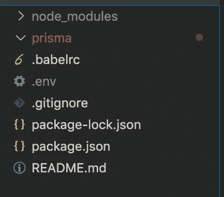

文件夹结构

`.babelrc`包含使用我们应用程序根目录中的环境变量的预置。

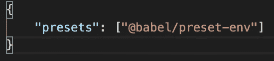

。巴伯尔克

`package.json`包含以下内容:

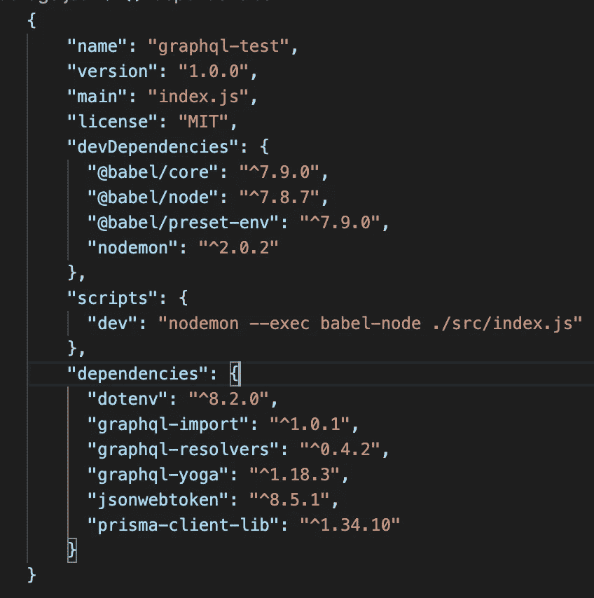

package.json

下一步，我们需要运行`npm install`。

我们还需要通过运行以下命令来全局安装 Prisma:

```
npm install -g prisma 
```

# **1。设置 Prisma**

这一步的回购可以在[这里](https://github.com/arismarko/prisma-stepbystep/tree/prisma-first-step)找到。

要设置 Prisma，我们需要导航到 Prisma 文件夹。

为此，只需在您的终端上写下`cd prisma`。

对于下一步，我们还将使用 Docker，它将托管我们的数据库。对于我们的例子，我们使用 Postgres(不过，您也可以使用 MongoDB 或 MySQL)。

# **2。设置 Docker**

我们将在`prisma`文件夹中创建一个 Docker 文件`docker-compose.yml`。

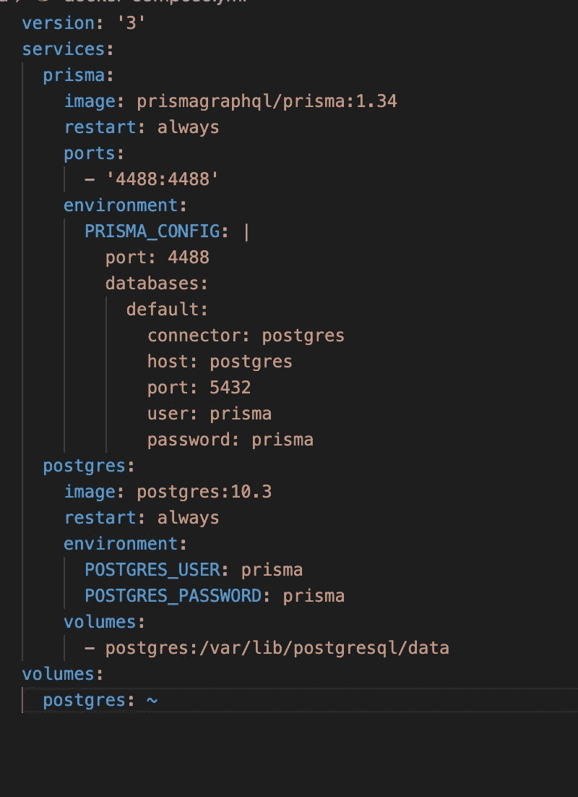

我们的 Docker 文件来创建我们的服务和数据库

然后，运行以下命令:

```
docker-compose up -d 
```

这个命令应该已经在 Docker 中创建了一个数据库实例。

如果你在 Mac 或 PC 上从 Docker 菜单中选择 Dashboard，你就可以查看它(抱歉我已经有一段时间没有使用 Windows 了，但它应该是可用的)

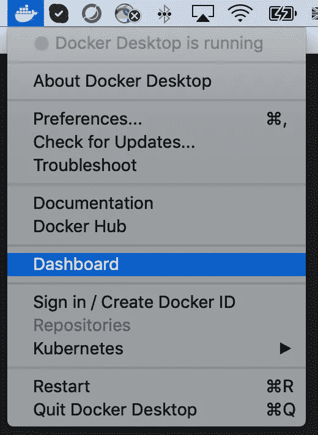

在 Mac 上访问我们的仪表板

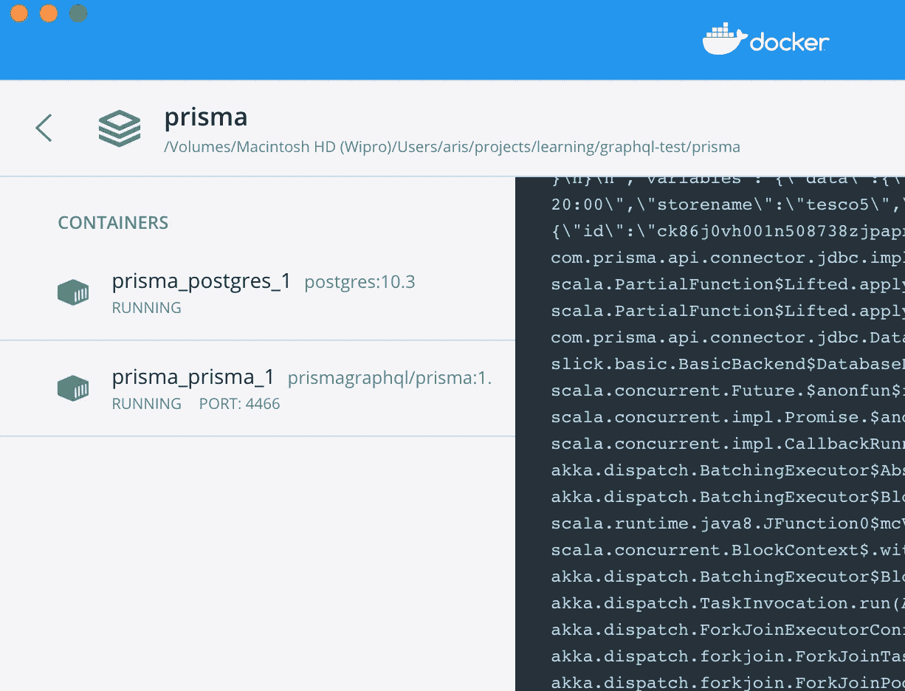

Docker 显示我们的服务和数据库

# **3。Prisma 设置**

然后，我们按照Á·阿尔瓦罗的博客文章中的步骤进行。

```
prisma init --endpoint [http://localhost:YOUR_PORT](http://localhost:YOUR_PORT) (in my case 4488)
```

该命令将在文件夹`prisma`中创建两个文件。

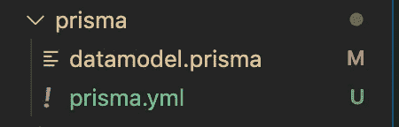

运行 init 命令后的 prisma 文件夹

我们将复制以下模式:

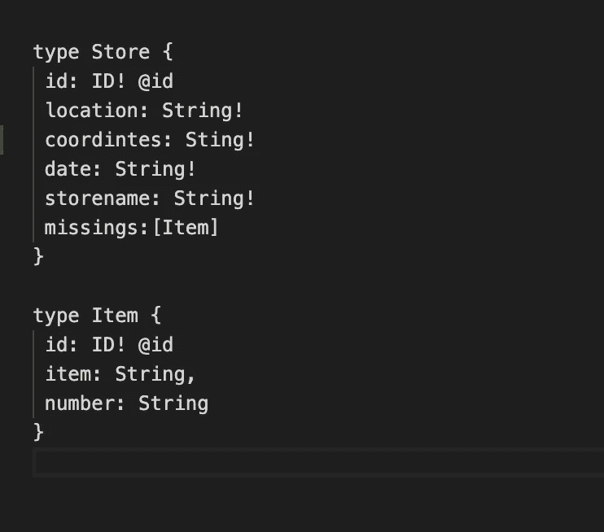

我们的模式

**注意:**为了我们的下一步，您必须将`prisma.yml`上的端口修改为`4488`。

```
prisma deploy
```

如果你导航到`localhost:4488/_admin`，你应该能看到 Prisma 界面。

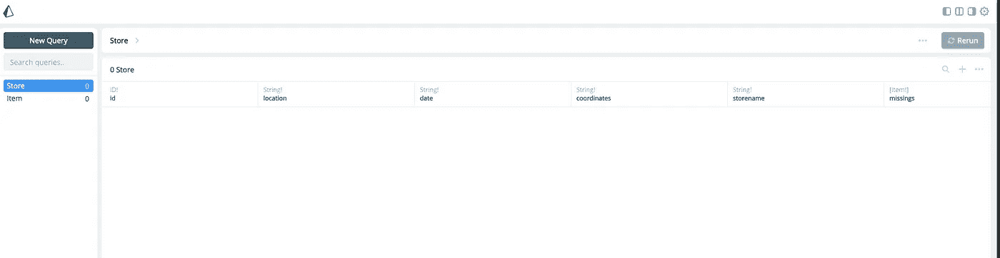

管理界面

从这个面板中，我们可以添加和删除数据，并测试我们的代码是否工作。

如果你喜欢清理数据，你可以运行`prisma reset`。

## **可选—播种数据**

还有一个用于植入数据库的命令，它基本上是在开始使用数据库之前向数据库添加一些数据。为此，您需要创建一个数据文件夹，并添加一个种子文件，其中包含要填充的内容的说明。

为此，您需要运行`prisma seed`。

一个例子可以在我和我的团队做的一个老项目中看到——点击下面的链接。

# **4。生成我们的 ORM 代码**

我们现在可以通过运行以下命令来释放 ORM bin 文件:

```
prisma generate
```

为了实现这一点，您需要在`prisma.yml`中添加以下内容:

```
generate:
  - generator: javascript-client
    output: ./generated/prisma
```

您应该能够在您的`prisma`文件夹中看到以下生成的文件夹。

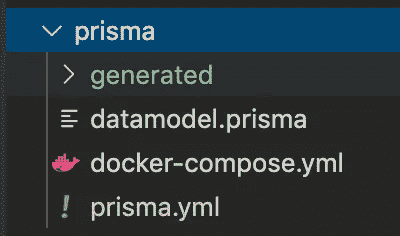

运行生成后的 prisma 文件夹

我们可以开始使用 ORM 代码。

# **5。使用 ORM 代码**

我们现在可以在文件夹的根目录下创建一个`src`文件夹。

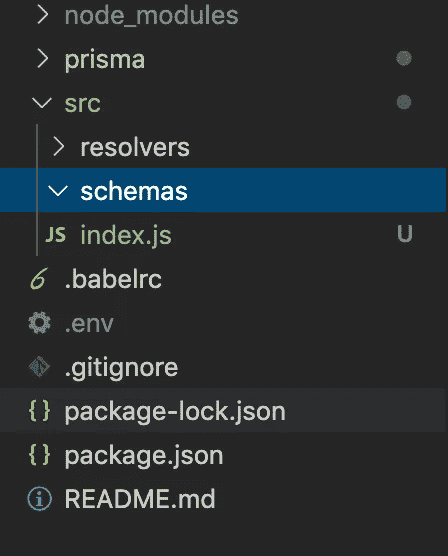

我们将创建一个`index.js`文件和两个文件夹`resolvers`和`schemas`。

`index.js`文件如下所示:

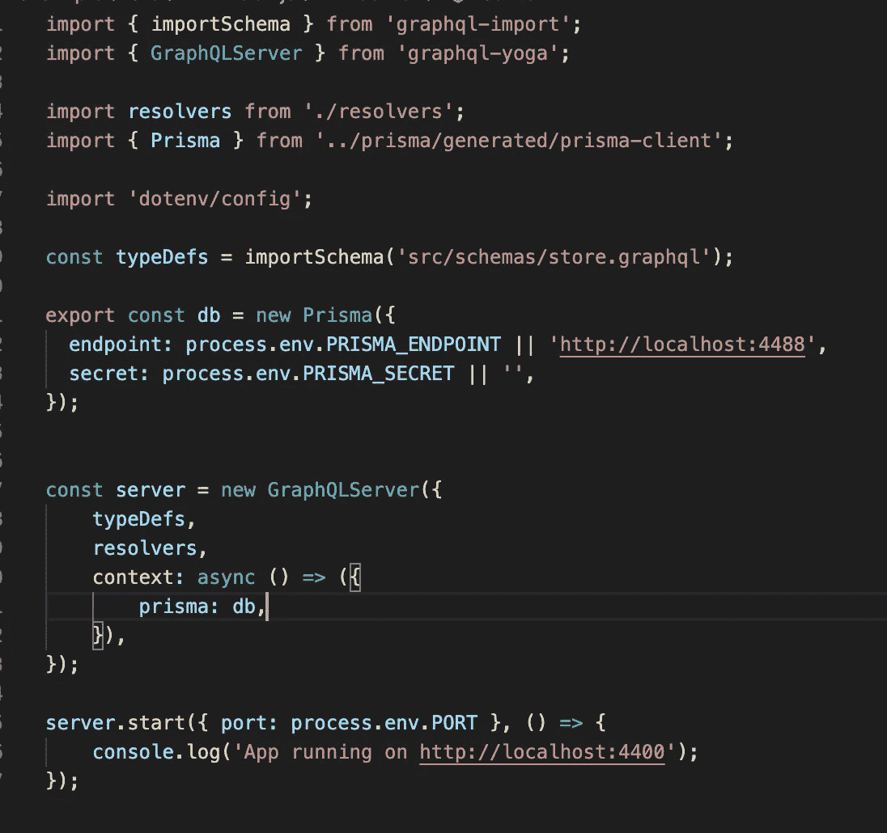

index.js 文件

我们从`schemas`文件夹和`store.graphql`文件夹获取模式，并通过从`resolvers`文件夹导入解析器。

```
import resolvers from './resolvers';
```

我们在`store.graphql`上定义模式，如下图所示:

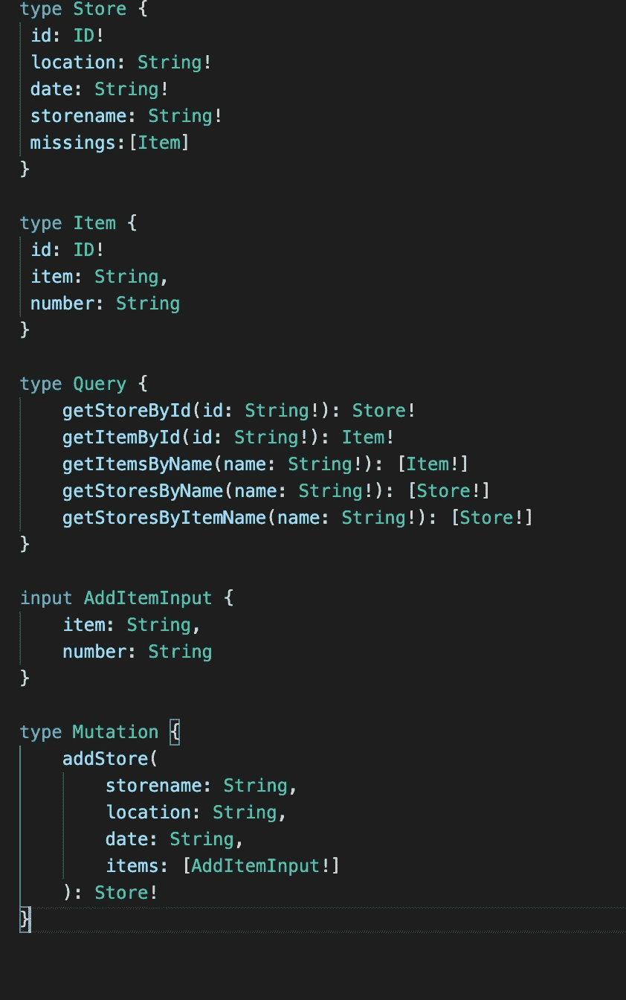

store.graphql

我们可以为使用模式的解析器编写代码，然后运行使用 ORM 的代码。上面的查询是通过 ID、名称获取商店，最复杂的查询是获取特定商品的商店。

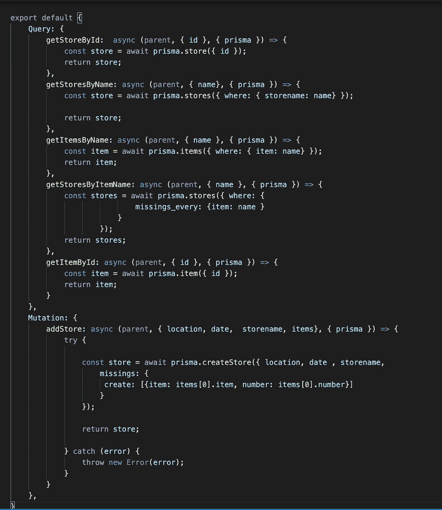

在底部，您可以看到我是如何添加商店和商品的。

# **6。在操场上测试这个**

你可以在操场网址`[HTTP://localhost:4400](http://HTTP://localhost:4400.)` [访问你的最终成绩。](http://HTTP://localhost:4400.)

在那里，您可以尝试一些不同的事情，例如，让我们添加一个商店。

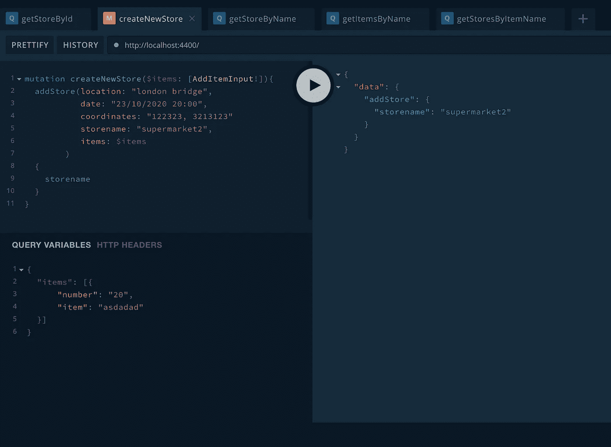

我们可以通过编写以下查询来测试存储:

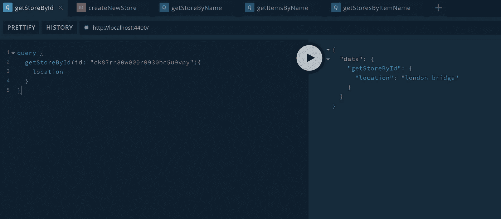

完整的例子可以在我创建的回购的[主分支上看到。](https://github.com/arismarko/prisma-stepbystep)