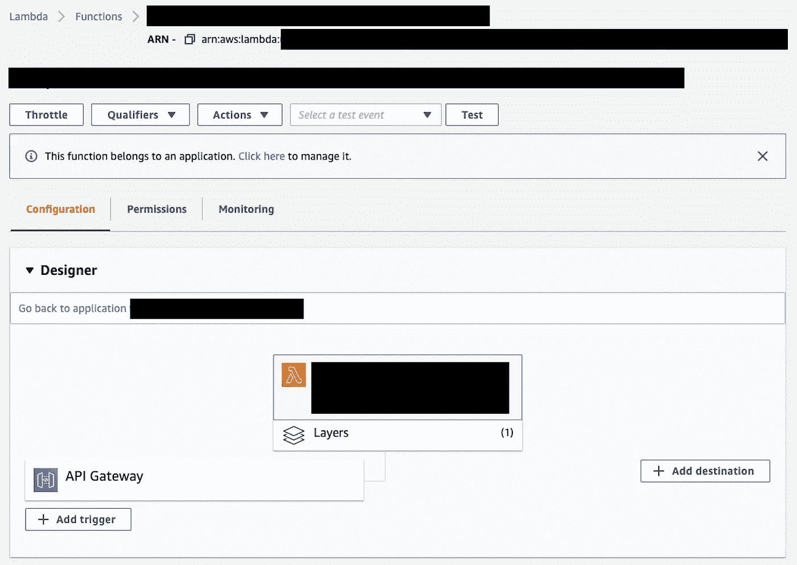

# 使用 SAM 的 AWS Lambda 私有无服务器 REST APIs

> 原文：<https://betterprogramming.pub/private-serverless-rest-api-with-lambda-using-sam-2eb31864b243>

## 使用 Lambdas 快速创建无服务器微服务


菲利普·莱曼在 [Unsplash](https://unsplash.com?utm_source=medium&utm_medium=referral) 上拍摄的照片

通过使用 [Amazon API Gateway，](https://aws.amazon.com/api-gateway/)有可能快速创建由 [Lambda](https://aws.amazon.com/lambda/) 支持的无服务器微服务。我们将回顾一个这样的部署，并使用 AWS 无服务器应用程序模型(SAM)来部署它。

# 介绍

随着云系统的不断增长，许多公司已经选择从单片系统转移到由微服务组成的分布式架构。AWS 允许开发这样的服务，而不需要管理底层的服务器基础设施。

我们将讨论使用 SAM 部署一个这样的服务的基础设施即代码(IaC)方法。部署将假设[虚拟专用集群(VPC)](https://aws.amazon.com/vpc/) 已经就绪，并且只有集群内特定子网上的虚拟机能够访问专用服务。我们还假设开发者已经在本地安装了必要的 [AWS SAM 工具](https://docs.aws.amazon.com/serverless-application-model/latest/developerguide/serverless-sam-cli-install.html)。

# 1.文件和文件夹

```
my-microservice/
├── cmd/
│   ├── debug.sh
│   └── deploy.sh
├── src/
│   ├── index.js
│   └── package.js
├── .gitignore 
├── test-event.json
└── template.yaml
```

`cmd`文件夹将包含我们的助手脚本，用于部署和本地调试我们的函数，如下所示:

`debug.sh`:使用`test-event.json`作为输入，在本地计算机上运行该功能。

```
#!/bin/bashscript_path=$(cd "$(dirname "${BASH_SOURCE[0]}")" ; pwd -P)sam local invoke \  
  --event ${script_path}/../test-event.json \  
  --template-file ${script_path}/../template.yaml
```

`deploy.sh`:将服务部署到 AWS。

```
#!/bin/bash# exit when any command fails
set -escript_path=$(cd "$(dirname "${BASH_SOURCE[0]}")" ; pwd -P)sam deploy \  
  --template-file ${script_path}/../template.yaml \  
  --stack-name my-microservice \  
  --capabilities CAPABILITY_IAM \  
  --guided
```

`src`文件夹将包含 Lambda 的源代码。在这种情况下，它由节点`index.js`和`package.json`文件组成。然而，这里将要展示的技术同样适用于任何其他受支持的 Lambda 语言。

## *package.json*

```
{  
  "name": "my-lambda-code",  
  "version": "1.0.0",  
  "description": "AWS Lambda function for microservice",  
  "main": "index.js",  
  "scripts": {    
    "test": "echo \"Error: no test specified\" && exit 1"  
  },  
  "author": "",  
  "license": "ISC",  
  "dependencies": {},  
  "devDependencies": {}
}
```

## *index.json*

一个简单的函数，要求在请求体中有一个`callerName`键。该函数将`“Hello, ”`添加到接收到的`callerName`字符串的前面，并将其作为响应返回。

```
exports.handler = async (eventObject, context, callback) => {

  const name = JSON.parse(eventObject.body).callerName;

  var response = {
    "statusCode": 200,
    "headers": {
      "Content-Type": "application/json"
    },
    "isBase64Encoded": false,
    "body": JSON.stringify({message: "Hello, " + name})
  }

  return response
};
```

## *test-event.json*

包含将由 API 网关代理给函数的请求对象的示例。这是我们的`debug.sh`在本地测试功能时使用的，通过消除每次更改后部署的需求，可以节省大量时间。

```
{
  "resource": "/",
  "path": "/",
  "httpMethod": "POST",
  "requestContext": {
      "resourcePath": "/",
      "httpMethod": "POST",
      "path": "/"
  },
  "headers": {
      "accept": "text/html,application/xhtml+xml,application/xml;q=0.9,image/webp,image/apng,*/*;q=0.8,application/signed-exchange;v=b3;q=0.9",
      "accept-encoding": "gzip, deflate, br",
      "Host": "70ixmpl4fl.execute-api.us-east-2.amazonaws.com",
      "User-Agent": "Mozilla/5.0 (Windows NT 10.0; Win64; x64) AppleWebKit/537.36 (KHTML, like Gecko) Chrome/80.0.3987.132 Safari/537.36",
      "X-Amzn-Trace-Id": "Root=1-5e66d96f-7491f09xmpl79d18acf3d050"
  },
  "multiValueHeaders": {
      "accept": [
          "text/html,application/xhtml+xml,application/xml;q=0.9,image/webp,image/apng,*/*;q=0.8,application/signed-exchange;v=b3;q=0.9"
      ],
      "accept-encoding": [
          "gzip, deflate, br"
      ]
  },
  "queryStringParameters": null,
  "multiValueQueryStringParameters": null,
  "pathParameters": null,
  "stageVariables": null,
  "body": "{\"callerName\":\"Luis Hamilton\"}",
  "isBase64Encoded": false
}
```

`template.yaml`文件描述了我们的部署，将在第 2 部分中详细介绍。

# 2.基础设施作为代码

事不宜迟，`template.yaml`文件可以在下面找到，它概述了我们的 Lambda 函数的部署，该函数由一个 API 网关调用，只能从一个已经存在的 VPC 中访问。以下部分将介绍部署的不同组件。

```
AWSTemplateFormatVersion: '2010-09-09'
Transform: AWS::Serverless-2016-10-31
Description: My serverless hello world API

Resources:
  MyServelessLambdaFunction:
    Type: AWS::Serverless::Function
    Properties:
      CodeUri: src/
      Handler: index.handler
      Runtime: nodejs12.x
      MemorySize: 1024
      Timeout: 20
      Policies:
        - AWSLambdaBasicExecutionRole
        - AWSLambdaVPCAccessExecutionRole
      Events:
        APIRoot:
          Type: Api
          Properties:
            Path: /
            Method: ANY
            RestApiId: !Ref MyPrivateApi

  MyApiSecurityGroup:
    Type: AWS::EC2::SecurityGroup
    Properties:
      VpcId: MyVpcIdShouldBeHardcodedHere
      GroupDescription: Allows access over 443
      SecurityGroupIngress:
        -
          IpProtocol: "tcp"
          FromPort: 443
          ToPort: 443
          CidrIp: 0.0.0.0/0

  MyApiAccessEndpoint:
    Type: AWS::EC2::VPCEndpoint
    Properties:
      VpcId: MyVpcIdShouldBeHardcodedHere
      ServiceName: !Sub "com.amazonaws.${AWS::Region}.execute-api"
      VpcEndpointType: Interface
      PrivateDnsEnabled: true
      SubnetIds:
        - MySubnetId1ShouldBeHardcodedHere
        - MySubnetId2ShouldBeHardcodedHere      
      SecurityGroupIds:
        - !Ref MyApiSecurityGroup

  MyPrivateApi:
    Type: AWS::Serverless::Api
    Properties:
      StageName: Prod
      MethodSettings:
        - HttpMethod: POST
          ResourcePath: /
      EndpointConfiguration: PRIVATE
      DefinitionBody:
        swagger: 2.0
        info:
          title: MyPrivateApi
        basePath: /Prod
        schemes:
          - https
        x-amazon-apigateway-policy:
          Version: "2012-10-17"
          Statement:
            -
              Effect: "Allow"
              Principal: "*"
              Action:
                - "execute-api:Invoke"
              Resource: "execute-api:/*"
              Condition:
                StringEquals:
                  aws:sourceVpce: !Ref MyApiAccessEndpoint
        paths:
          /:
            x-amazon-apigateway-any-method:
              produces:
              - application/json
              x-amazon-apigateway-integration:
                responses:
                  default:
                    statusCode: 200
                uri: !Join [ "", [ !Sub "arn:aws:apigateway:${AWS::Region}:lambda:path/2015-03-31/functions/arn:aws:lambda:${AWS::Region}:${AWS::AccountId}:function:", !Ref MyServelessLambdaFunction, "/invocations"] ]
                passthroughBehavior: when_no_match
                httpMethod: POST
                type: AWS_PROXY

Outputs:
  MyPrivateApi:
    Description: "API Gateway endpoint URL for Prod stage"
    Value: !Sub "https://${MyPrivateApi}.execute-api.${AWS::Region}.amazonaws.com/Prod/"
  MyServelessLambdaFunction:
    Description: "Lambda Function ARN"
    Value: !GetAtt MyServelessLambdaFunction.Arn
```

## MyServelessLambdaFunction

下面的代码块指定了 Lambda 函数。一些重要的属性包括:

1.  运行时:指定我们脚本的语言。
2.  Events:描述触发此 Lambda 的资源的对象。在这种情况下，Lambda 由 API 网关`MyPrivateApi`触发。从 Lambda 控制台拍摄的下图中可以看到生成的网关。



```
 MyServelessLambdaFunction:
    Type: AWS::Serverless::Function
    Properties:
      CodeUri: src/
      Handler: index.handler
      Runtime: nodejs12.x
      MemorySize: 1024
      Timeout: 20
      Policies:
        - AWSLambdaBasicExecutionRole
        - AWSLambdaVPCAccessExecutionRole
      Events:
        APIRoot:
          Type: Api
          Properties:
            Path: /
            Method: ANY
            RestApiId: !Ref MyPrivateApi
```

## 我的安全组

下面的代码块创建了一个安全块，我们将把它分配给 API，它允许来自任何原始 IP 地址的 HTTP 访问(端口 443)。注意，由于 API 是私有类型的，所以不能从 VPC 外部访问它。

```
 MyApiSecurityGroup:
    Type: AWS::EC2::SecurityGroup
    Properties:
      VpcId: MyVpcIdShouldBeHardcodedHere
      GroupDescription: Allows access over 443
      SecurityGroupIngress:
        -
          IpProtocol: "tcp"
          FromPort: 443
          ToPort: 443
          CidrIp: 0.0.0.0/0
```

## 我的观点

下面，我们创建一个 [VPC 端点，](https://docs.aws.amazon.com/vpc/latest/userguide/vpc-endpoints.html)它是一个 AWS 构造，允许将 API 网关等资源连接到 VPC，而不会将流量暴露给互联网。需要考虑的几个关键属性:

1.  `ServiceName`:端点将连接的 AWS 资源类型。`${AWS:Region}`将被脚本部署到的地区所替代。
2.  `VpcEndpointType`:我们应该将其设置为`interface`，这是一个 [AWS 私有链接](https://aws.amazon.com/privatelink/?privatelink-blogs.sort-by=item.additionalFields.createdDate&privatelink-blogs.sort-order=desc)——连接到内部资源的 powered 端点。
3.  `PrivateDnsEnabled`:应该设置为`true`来创建允许 VPC 中的实例访问 API 的 DNS 记录。

```
MyApiAccessEndpoint:
    Type: AWS::EC2::VPCEndpoint
    Properties:
      VpcId: MyVpcIdShouldBeHardcodedHere
      ServiceName: !Sub "com.amazonaws.${AWS::Region}.execute-api"
      VpcEndpointType: Interface
      PrivateDnsEnabled: true
      SubnetIds:
        - MySubnetId1ShouldBeHardcodedHere
        - MySubnetId2ShouldBeHardcodedHere      
      SecurityGroupIds:
        - !Ref MyApiSecurityGroup
```

## MyPrivateApi

最后，下面的代码块使用前面块中概述的资源创建 API 网关。需要记住的一些重要属性:

1.  `EndpointConfiguration`:定义端点的类型。在我们的例子中，我们有一个只能从 VPC 访问的`private`端点。
2.  `x-amazon-apigateway-policy`:为 API 定义一个资源策略，授权先前创建的端点访问它。
3.  `paths`:应该创建的路径列表以及它们应该如何表现。在我们的例子中，我们创建了一个根路径，`/`。
4.  `x-amazon-apigateway-integration`:该属性定义了 API 网关和 Lambda 函数之间的集成。关于其他属性的信息可在[这里](https://docs.aws.amazon.com/apigateway/latest/developerguide/api-gateway-swagger-extensions-integration.html)找到。
5.  `uri`:这个冗长的表达式将 Lambda 函数与集成相关联。
6.  `httpMethod`:λ函数的`x-amazon-apigateway-integration`的`httpMethod`应始终设置为`POST`；否则，整合是行不通的。注意，这与公开 API 的 HTTP 方法不同，后者可以是任何类型。

```
MyPrivateApi:
    Type: AWS::Serverless::Api
    Properties:
      StageName: Prod
      MethodSettings:
        - HttpMethod: POST
          ResourcePath: /
      EndpointConfiguration: PRIVATE
      DefinitionBody:
        swagger: 2.0
        info:
          title: MyPrivateApi
        basePath: /Prod
        schemes:
          - https
        x-amazon-apigateway-policy:
          Version: "2012-10-17"
          Statement:
            -
              Effect: "Allow"
              Principal: "*"
              Action:
                - "execute-api:Invoke"
              Resource: "execute-api:/*"
              Condition:
                StringEquals:
                  aws:sourceVpce: !Ref MyApiAccessEndpoint
        paths:
          /:
            x-amazon-apigateway-any-method:
              produces:
              - application/json
              x-amazon-apigateway-integration:
                responses:
                  default:
                    statusCode: 200
                uri: !Join [ "", [ !Sub "arn:aws:apigateway:${AWS::Region}:lambda:path/2015-03-31/functions/arn:aws:lambda:${AWS::Region}:${AWS::AccountId}:function:", !Ref MyServelessLambdaFunction, "/invocations"] ]
                passthroughBehavior: when_no_match
                httpMethod: POST
                type: AWS_PROXY
```

# 3.部署

要部署我们的服务堆栈，只需运行`deploy.sh`脚本；同样，您可以运行`./cmd/deploy.sh`。

在部署过程中，会提示您一条消息:“`MyServelessLambdaFunction`可能没有定义授权。这样可以吗？”这是意料之中的，因为我们没有实现授权。

# 结论

我们已经看到了如何使用 Amazon API Gateway 和 Lambda 创建无服务器 API 微服务。完整的服务在单个模板文件中描述，并且可以通过编程方式部署。

## 额外资源

[](https://github.com/3pillarlabs/aws-sam-express-sample) [## 3 pillar labs/AWS-Sam-express-样品

### 一个简单的演示展示了 AWS 无服务器应用程序模型(SAM)和 NodeJS Express 应用程序的集成，它…

github.com](https://github.com/3pillarlabs/aws-sam-express-sample) [](https://github.com/awsdocs/aws-lambda-developer-guide/tree/master/sample-apps/nodejs-apig) [## AWS docs/AWS-lambda-开发者指南

### 这个示例应用程序是一个 Lambda 函数，它处理来自 API Gateway REST API 的事件。该 API 提供了一个…

github.com](https://github.com/awsdocs/aws-lambda-developer-guide/tree/master/sample-apps/nodejs-apig)