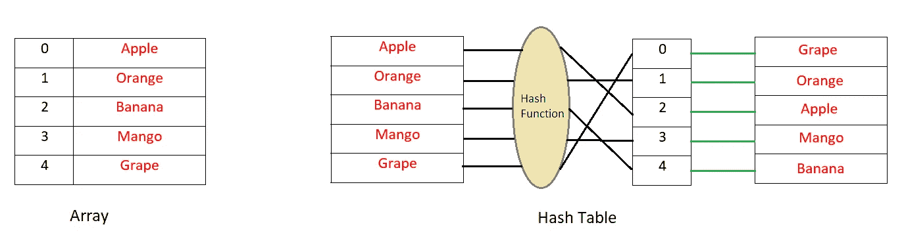
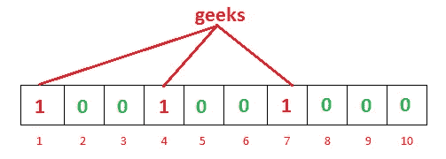
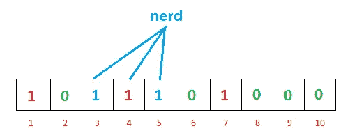
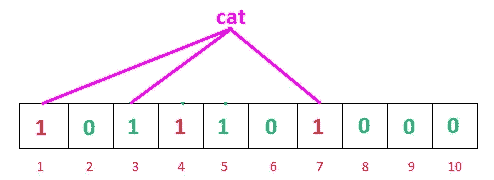
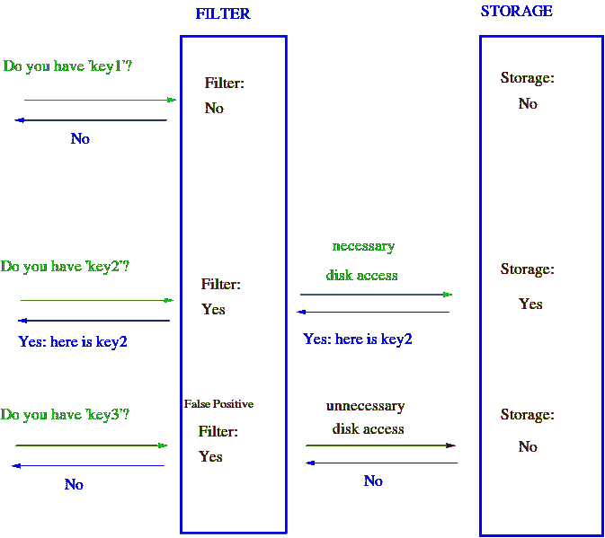
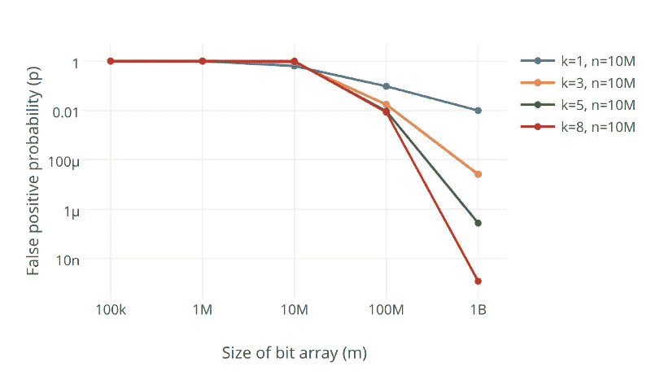
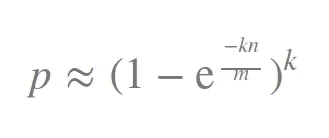
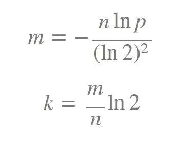

# 概率数据结构:布鲁姆过滤器

> 原文：<https://betterprogramming.pub/probabilistic-data-structures-bloom-filter-5374112a7832>

## 理解最流行的概率数据结构之一

安东尼·马蒂诺在 [Unsplash](https://unsplash.com/?utm_source=unsplash&utm_medium=referral&utm_content=creditCopyText) 上的照片

如果你有一个玻璃保护的书架，它会保护你的书免受灰尘和昆虫的侵害。然而，这将花费你更多的时间在你需要的时候去取书，因为你首先需要滑动或者打开玻璃才能拿到书。话说回来，如果是开放式书架，它会让你更快地拿到书，但你会失去保护层。

同样，如果你按照字典顺序组织你的书，如果你知道它的名字，你可以很容易地搜索到它。但是如果你的书架有不同大小的书柜，你就必须根据它们的大小来整理你的书。它看起来会很好，但是你能很快找到一本书吗？我不这么认为。

数据结构没有什么不同。它们就像应用程序的书架，您可以在其中组织数据。不同的数据结构会给你不同的便利和好处。为了正确地使用数据结构的功能和可访问性，您需要知道权衡。

主流数据结构，如列表、地图、集合、树等。主要用于获得关于数据是否存在的某些结果，可能还有出现的次数等等。然而，概率数据结构会给你节省内存和更快的结果——代价是提供一个*可能的*结果，而不是一个*确定的*结果。

现在，使用这样的数据结构似乎不太直观。但是，在本文中，我将试图让您相信这些类型的数据结构有其特定的用例，并且您可能会发现它们在某些场景中是有用的。

在这篇文章中，我将讨论一种最流行的概率数据结构，叫做 Bloom filter。以后，我会试着写一些其他的。

# 布隆过滤器

你知道哈希表是如何工作的吗？

当您在简单的数组或列表中插入新数据时，数据插入的位置不是由要插入的值决定的。这意味着在*键*(索引)和*值*(数据)之间没有直接关系。因此，如果您需要在数组中搜索一个值，您必须在所有索引中进行搜索。

现在，在哈希表中，通过散列值来确定键或索引。然后将这个值放入列表的索引中。这意味着键是由值决定的，每次需要检查值是否存在于列表中时，只需散列值并搜索该键。这非常快，并且在 [Big-O 符号](https://en.wikipedia.org/wiki/Big_O_notation)中需要 O(1) 的搜索时间。

现在，让我们假设您有一个庞大的弱密码列表，它存储在某个远程服务器上。由于大小的原因，不可能一次将它们载入内存/RAM。每次用户输入他/她的密码时，您都希望检查它是否是弱密码之一。如果是，你想给他/她一个警告，让他/她换一个更强的。你能做什么？

因为您已经有了弱密码列表，所以您可以将它们存储在哈希表或类似的东西中。每次你想匹配时，你可以检查给定的密码是否匹配。匹配可能很快，但是在磁盘上或通过网络在远程服务器上搜索它的成本会使它很慢。不要忘记，您需要为每个用户提供的每个密码都这样做。怎样才能降低成本？

嗯，布鲁姆过滤器可以帮助我们。怎么会？在解释完 bloom filter 的工作原理后，我将回答这个问题。好吗？

根据定义，布隆过滤器可以检查一个值是否是*可能在集合*中或者*肯定不在集合*中。可能和肯定不是的微妙区别在这里至关重要。这可能就是布隆过滤器被称为概率过滤器的原因。

用聪明的话来说，概率意味着[假阳性](https://en.wikipedia.org/wiki/False_positives_and_false_negatives)是可能的。换句话说，可能存在过滤器错误地认为元素是正的情况。但是，假阴性是不可能的。

不要急躁。我将很快解释它的实际含义。

布隆过滤器本质上由长度为 m 的位向量或位列表 *(* 仅包含 0 或 1 位值的列表 *)* 组成。最初，所有值都被设置为零，如下所示。

图片来源: [GeeksforGeeks](http://www.geeksforgeeks.org/bloom-filters-introduction-and-python-implementation/)

为了向布隆过滤器添加一个项目，我们将它提供给不同的散列函数，并在结果位置将位设置为 1。正如您所看到的，在哈希表中，我们使用了一个哈希函数，因此，只有一个索引作为输出。但是在 bloom filter 的情况下，我们将使用多个散列函数，这将为我们提供多个索引。

图片来源: [GeeksforGeeks](http://www.geeksforgeeks.org/bloom-filters-introduction-and-python-implementation/)

正如你在上面的例子中看到的，对于给定的输入*极客*，我们的三个哈希函数将给出三个不同的输出——一、四和七。我们已经做了标记。

图片来源: [GeeksforGeeks](http://www.geeksforgeeks.org/bloom-filters-introduction-and-python-implementation/)

对于另一个输入， *nerd* ，哈希函数给我们三个、四个和五个。你可能已经注意到，索引四已经被之前的极客输入标记了。保持这种想法；这一点很有意思，我们马上就要讨论。

我们已经用两个输入填充了我们的位向量。现在我们可以检查它的存在值。我们如何做到这一点？

很简单——就像我们在哈希表中做的一样。我们将使用三个散列函数对搜索到的输入进行散列，并查看结果索引包含什么。

图片来源: [GeeksforGeeks](http://www.geeksforgeeks.org/bloom-filters-introduction-and-python-implementation/)

因此，搜索 *cat* ，我们的哈希函数这次给出了 1、3 和 7。我们可以看到所有的索引都已经标记为一。这意味着我们可以说，“也许猫已经被插入到我们的列表中了。”

但事实并非如此。那么，哪里出了问题？

实际上，没什么问题。问题是，这是一个假阳性的案例。Bloom filter 告诉我们，可能之前插入了 cat，因为应该由 cat 标记的索引已经被标记了(尽管是由其他不同的数据标记的)。

那么，如果是这样的话，有什么帮助呢？好吧，让我们考虑一下，卡特彼勒是否会给出 1、6 和 7 的输出，而不是 1、3 和 7。那时会发生什么？我们可以看到，在三个索引中，六是零，这意味着它没有被任何之前的输入标记。这意味着，很明显，这只猫以前从未被植入过。如果是的话，6 就不可能是零，对吗？这就是布隆过滤器如何确定某个数据不在列表中的原因。

所以，简而言之:

*   如果我们搜索一个值，并看到这个值的任何散列索引为零，那么这个值肯定不在列表中。
*   如果所有的散列索引都是一个，那么可能搜索的值就在列表上。

开始有意义了吗？一点点，也许？

好了，现在回到我们之前讨论的密码例子。如果我们用这种类型的 bloom filter 实现弱密码检查，您可以看到，最初，我们会用密码列表标记 bloom filter。这将为我们提供一个位向量，其中一些索引标记为 1，其他的标记为零。由于布隆过滤器的大小是固定的并且不是很大，所以它可以很容易地存储在存储器中，并且如果需要的话也可以存储在客户端。

这就是布隆过滤器非常节省空间的原因。在哈希表需要基于输入数据的任意大小的情况下，布隆过滤器可以在固定大小的情况下很好地工作。

因此，每次用户输入他们的密码时，我们都会将其输入到我们的哈希函数中，并根据我们的位向量进行检查。如果密码足够强，bloom filter 将向我们显示该密码肯定不在弱密码列表中，我们不必再做任何查询。但是如果密码看起来很弱，并且给了我们一个肯定的结果(可能是假的)，那么我们将把它发送到我们的服务器并检查我们的实际列表来确认。

如您所见，大多数时候我们甚至不需要向服务器发出请求，也不需要从磁盘中读取列表。这将大大提高应用程序的速度。如果我们不想在客户端存储位向量，我们仍然可以将它加载到服务器内存中，这样至少可以节省一些磁盘查找时间。

还要考虑，如果您的 bloom filters 误报率是 1%(我们将在后面详细讨论错误率)，这意味着在到服务器或磁盘的高成本往返中，只有 1%的查询会返回错误结果。剩下的 99%不会白去。还不错，是吧？

关于布鲁姆过滤器如何工作的漂亮的视觉模拟。图片来源:[维基百科](https://en.wikipedia.org/wiki/Bloom_filter)

## 布隆过滤器操作

基本布隆过滤器支持两种操作:*测试*和*添加*。

Test 用于检查给定元素是否在集合中。

Add 只是将一个元素添加到集合中。

现在给你一个小测验。

基于我们到目前为止所讨论的，有可能从 bloom filter 中删除一个项目吗？如果是，那怎么做？

休息两分钟，思考一下解决方案。

有什么发现吗？什么都没有？让我帮你一点。在插入极客和书呆子之后，让我们把位向量带回来。

图片来源: [GeeksforGeeks](http://www.geeksforgeeks.org/bloom-filters-introduction-and-python-implementation/)

图片来源: [GeeksforGeeks](http://www.geeksforgeeks.org/bloom-filters-introduction-and-python-implementation/)

现在我们想把极客从里面去掉。那么，如果我们从位向量中去掉 1，4，7，把它们转换为零，会发生什么呢？你很容易看到，下一次，如果我们搜索 nerd 作为索引，四将显示零；它会告诉我们，书呆子不在名单上，尽管它实际上是。这意味着在不引入假阴性的情况下移除是不可能的。

那么，有什么解决办法呢？

解决方案是我们不能在这个简单的 bloom filter 中支持删除操作。但是，如果我们真的需要一个移除功能，我们可以使用一种叫做*计数布隆过滤器的布隆过滤器。*

这个想法很简单。我们将存储一个整数值，而不是存储一个比特的值，然后我们的比特向量将是一个整数向量。这将增加大小，并花费更多的空间给我们删除功能。在插入一个值时，我们不是将一个位值标记为 1，而是将整数值递增 1。要检查某个元素是否存在，请在对该元素进行哈希运算后检查相应的索引是否大于零。

如果你很难理解一个计数型布鲁姆过滤器是如何给我们一个移除功能的，我建议你拿起笔和纸，把我们的布鲁姆过滤器模拟成一个计数型过滤器，然后试着移除它。希望你会很容易得到它。如果你失败了，再试一次。如果你又失败了，那么请留下评论，我会试着描述一下。

## 布隆过滤器大小和哈希函数的数量

你可能已经明白，如果 bloom filter 的大小太小，很快所有的位域就会变成一个。然后，我们的 bloom filter 将为每个输入返回“假阳性”。因此，布隆过滤器的大小是一个非常重要的决定。

较大的过滤器会有较少的误报，而较小的过滤器会有较多的误报。我们可以根据误报率，根据需要精确地调整我们的布隆过滤器。

另一个重要的参数是我们将使用多少散列函数。我们使用的哈希函数越多，布隆过滤器就越慢，它就会越快填满。然而，如果数量太少，我们可能会遭受太多的假阳性。

图片来源: [Abishek Bhat 关于布鲁姆滤镜的文章](https://engineering.semantics3.com/use-the-bloom-filter-luke-b59fd0839fc4)

从上图可以看出，增加哈希函数的个数 k，会大幅降低错误率，**p**

我们可以根据滤波器的大小 m、哈希函数的数量 k 和插入元素的数量 n 来计算误报率 p，公式如下:

别担心，我们主要需要决定我们的 m 和 k 会是什么。因此，如果我们自己设置误差容限值 p 和元素数量 n，我们可以使用以下公式来计算这些参数:

这里我还需要提到的另一个要点。由于使用 bloom filter 的唯一目的是为了更快地搜索，所以我们不能使用慢哈希函数，对吗？加密哈希函数，如 Sha-1 和 MD5，不是 bloom filters 的好选择，因为它们有点慢。因此，从更快的散列函数实现中更好的选择是[杂音](https://sites.google.com/site/murmurhash/)、散列的 [fnv](http://isthe.com/chongo/tech/comp/fnv/) 系列、詹金斯散列和[散列](http://www.google.com/codesearch/url?ct=ext&url=http://www.concentric.net/~Ttwang/tech/inthash.htm&usg=AFQjCNEBOwEAd_jb5vYSckmG7OxrkeQhLA)。

# 应用程序

布隆过滤器是关于测试集合中的成员的。使用 bloom filters 的经典例子是减少对不存在的键的昂贵的磁盘(或网络)查找。正如我们可以看到的，bloom filters 可以在 O(k)常数时间内搜索一个密钥，其中 k 是哈希函数的数量，这将非常快地测试一个密钥的不存在性。

如果元素不在布隆过滤器中，那么我们肯定知道我们不需要执行昂贵的查找。另一方面，如果它在布隆过滤器中，我们执行查找，并且我们可以预期它在一定比例的时间内失败(假阳性率)。

一些更具体的例子:

*   在我们给出的例子中，您已经看到我们可以使用它来警告用户弱密码。
*   你可以使用布隆过滤器[阻止你的用户](https://medium.com/@nathankrishnan/using-a-bloom-filter-to-prevent-users-of-your-ios-app-from-accessing-malicious-sites-7ad555a69598)访问恶意网站。
*   您可以先使用 bloom 过滤器进行廉价的查找检查，而不是查询 SQL 数据库来检查某个用户是否有特定的电子邮件。如果邮箱不存在，太好了！如果它确实存在，您可能需要额外查询数据库。您可以对[搜索进行同样的操作，查看用户名是否已被使用](http://www.geeksforgeeks.org/bloom-filters-introduction-and-python-implementation/)。
*   您可以保留一个基于网站访问者 IP 地址的布隆过滤器，以检查您网站的用户是回头客还是新用户。返回用户的一些误正值不会伤害你吧？
*   您还可以使用 bloom filter 来跟踪字典单词，从而制作一个[拼写检查器。](http://codekata.com/kata/kata05-bloom-filters/)
*   想知道 Medium 如何使用 bloom filters 来判断用户是否已经阅读了一篇文章吗？读一读这篇令人兴奋、令人敬畏的文章。

你还认为你永远不需要布鲁姆过滤器吗？嗯，我们并没有在日常生活中用到所有我们学过的算法。但也许有一天它会救你一命。谁知道呢？学习一个新东西从来不会有坏处，对吗？