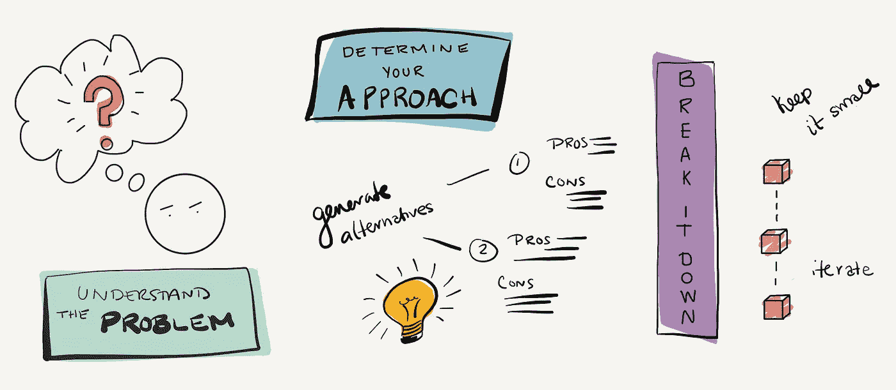

# 为新软件开发人员解决问题

> 原文：<https://betterprogramming.pub/problem-solving-for-new-software-developers-1ee8422e67b5>

## 发展个人方法如何增加你的影响力

照片:[心理医生](https://www.pexels.com/@mentatdgt-330508) / [像素](https://www.pexels.com/)

成为一名有经验的软件开发人员并不意味着你知道每个问题的解决方案。它也不依赖于了解整个系统及其许多边缘情况。

我明白了。感觉你应该冷静地了解这些东西，尤其是当你和一个似乎什么都知道的高级开发人员交谈的时候。但是问问你自己:这个人正在解决一个他们已经知道答案的问题吗？他们会成功进入一个全新的领域吗？

你的职位越高，你就越有可能被要求处理复杂的、定义不清的问题，而且通常没有什么背景。**这是增加你影响力的秘密:学会如何通过将问题分解成你能解决的可管理的部分来解决任何规模的问题。**

我雇佣、指导并提拔了数十名实习生和应届毕业生——我发现发展一种有效的解决问题的方法可以引导你走上最快的成功之路。

# 编程是一项团队运动

看看你周围。有经验的开发者在合作吗？在我的职业生涯中，我曾在 IBM、黑莓、Shopify 和现在的 Lever 等公司工作过。我观察并实践了许多头脑风暴和验证想法的方法。这些范围从协作团队活动，如结对编程、白板和 Slack 头脑风暴，以及对问题的评论和[拉动请求](https://help.github.com/en/github/collaborating-with-issues-and-pull-requests/about-pull-requests) (PRs)，到更正式的“大公司”流程，如技术设计评审和架构评审委员会。

## 尽早并经常获得反馈

在大多数公司中，您要求在发货前对您的实施进行审查。新开发人员通常会误解这一步的意义。他们假设目标是独立工作，直到问题完全解决，然后在代码评审时公开它以获得反馈。这是一个巨大的错误！

大多数**有经验的开发人员不会等到他们实现了解决方案之后才与其他人一起头脑风暴和验证这个想法**。他们从一开始就是透明和协作的。他们已经知道了伟大的问题解决者的一个小秘密:尽早寻求反馈往往会带来更多高质量的想法和更好的解决方案。

作为一个有经验的开发人员，没有什么比审查一个采取了完全错误的方法的公关更糟糕的了。告诉某人重写他们编写的大部分代码并不有趣。如果你提前和我联系，我可以帮你解决问题，或者给你一些你写的代码的反馈，这样你就不会从头到尾重复同样的错误。我们还可以进行面对面的交谈，这样你就能真正理解我的反馈，而不是试图解读书面意见。

## 提前确定合作伙伴

从一开始就在您的团队中选择一名开发人员。理想情况下，你已经有了一个正式的导师或伙伴——一个关心你的成功并会帮助你学习的人。如果你没有，就去找一个！

如果不是你的正式伙伴，或者你没有，主动询问他们是否有时间，并确保他们致力于你的成功。它应该是在最后执行代码审查的人。这个人将挑战你对问题的理解，帮助你解决问题，并最终检查你的代码。

理想情况下，这个人还应该对你工作的领域有足够的了解，这样他们就可以回答关于事情应该如何运作的问题。他们不需要成为专家。事实上，我经常发现在开发方面领先你一步的开发人员提供了最好的指导。他们只是最近才学到你需要知道的东西，而且通常仍然很乐意应用这些知识。他们也从指导中获益最多，因为这有助于他们巩固已经学到的东西。

# 进步！=编写代码

解决一个问题有许多方法，它们并不都涉及编写代码。有经验的开发人员对进展采取更全面的观点，让他们自己突出他们在理解问题和与他人验证他们的想法方面取得的进步。

## 用新方法突出你的进步

当验证我对问题和方法的理解时，我通常会在我们使用的任何问题管理工具中对问题进行评论——无论是吉拉、Github 还是其他工具。当我在处理一个更复杂的问题时，我会使用一个文档、一个[要点](https://gist.github.com/discover)或一个新问题来捕捉设计，然后收集反馈。我喜欢这些选项，因为它们便于协作和评论。

想想你的公司使用的工具，在开发人员花费时间的地方发布你的进展。开发人员最常用的工具是什么？它们是如何被使用的？对你来说，沟通和验证自己进步的最透明的方式是什么？你的团队中谁拥有最详细的问题和公关描述、设计文档和公关评论？有什么方法你可以模仿吗？

确定捕捉每一步进展的最佳工具。

## 记录=交流=合作

这里有一个秘密:**所有的开发人员都可以更多地记录他们的进展。**

感觉反直觉。你可能认为你的职位越高，你就越不需要在你的问题和评估请求中解释自己。但是我对我的高级开发人员有更高的期望。你越有经验，我越希望你清晰地记录你的分析和方法。作为一名高级工程师，你不仅仅是向你的代码审查者解释你自己，你还在为团队中的其他人模仿你的思维方式。这带来了两个明显的好处:首先，你可能会以不同于其他人的方式解决问题——我们希望鼓励多样化的方法，尽可能成为最好的工程团队。其次，你在分享你的学习和经验——如何解决问题，特定的问题领域，以及你应用软件工程原理和模式来解决它。

## 尽早并经常验证

我向任何抱怨延迟代码评审反馈导致他们刚刚实现的一大块代码被重写的开发人员解释了这一点。在将 PR 提交审核之前，您是否已经提前获取了不同的方法来获得反馈？你能不能早些原型化一些东西并在上面结对编程，以获得你可能遗漏的任何上下文？

> "一开始五分钟的对话可以为你节省几个小时的重写时间。"
> — DJ 霍顿

你可能会比其他人记录更多，但我从未听说有人因为记录太多而对某人给予负面反馈。我的团队成员多次因他们所做的彻底调查工作以及与他们合作的天衣无缝而受到称赞。正是这种深思熟虑的方法为队友之间的协作提供了最佳机制。

# 理解问题

你被分配了一项任务——太好了！第一步是理解问题。解决的方法不止一种吗？通常，在你职业生涯的这个阶段，任务会告诉你预期的结果是什么。也许它甚至会包括截图。然而，没有人知道当你开始着手一个解决方案时，你会发现什么，所以不要期望它总是按照要求的方式工作。

## “为什么”在“什么”之前

无论任务是编写一个新方法还是创建一个新的面向用户的特性，理解这个特性为什么存在以及它解决了什么问题是最基本的。

假设您正在开发一个面向用户的组件，您被要求在用户界面中公开一个新的字段。该字段已经存在于后端，并且可以通过 API 进行设置，因此您只需要创建一个位置来在用户界面中显示它。有个截图——很容易复制，对吧？

但是为什么这个字段对用户很重要呢？是一直存在还是有些情况下不存在？它有最大尺寸吗？需要输入验证吗？

这是一个很好的机会来理解产品的一个新领域，并头脑风暴一些您可能需要测试的边缘案例。不要假设制造问题的人考虑到了每一个案例。他们可能只包括他们知道或记得的东西。如果问题是由外部涉众(如支持)造成的，这种情况尤其明显。但是你现在正在解决这个问题——到你发货的时候，你将成为用户体验方面的专家。

想想这其中的力量:通过深入理解问题，并尽早和经常合作来解决问题，你正在使你的产品和你的公司变得更好。有经验的开发人员帮助创造令人惊叹的产品。

## 设置您的环境

在这一点上，我还建议开始设置您的本地环境来手动测试这个区域。这可能意味着学习点击进入你正在编辑的视图。这也可能意味着创建新的数据，开始创建一些您想要测试的排列。你最终会需要这样做，所以你现在做得越多，你就越有可能完全理解这个问题，并且以后不会遇到任何意外。

## 验证你的想法

到这一步结束时，我希望你已经和你的导师谈过了，以验证你对产品在完成实现后应该如何工作的理解。我还希望您在您的问题管理系统中编辑描述或向原始任务添加注释。即使实际上是相同的，评论也应该:

*   描述你的理解
*   识别独特的排列或限制，
*   包括您的解决方案和预期的用户体验

这个书面步骤很重要，原因有几个。首先，它开始培养你理解和掌握问题的信心。其次，它让你的导师确认你理解了讨论问题时交流的任何反馈。第三，你是一个更大的团队的一部分！将这些事情记录下来，其他人可以检查您的方法，其他利益相关者，如设计师和产品经理，可以看到您取得的进展并提供反馈。

也许最重要的是，你已经取得了明显的进步(不仅仅是写代码)。值得庆祝的事情！

# 确定你的方法

一旦你明白了问题所在，就该想出解决办法了。考虑为原型创建一个临时分支。并不是你写的所有代码都值得发布。这是一个很好的时机，利用你的本地环境来做出改变，看看什么是有效的。您可能需要更改或创建哪些文件和方法？把这看作是你的机会，去做一些你可能永远不会考虑合并的改变。

## 生成替代方案

通常有不止一个解决方案，即使其中一个是明显的赢家。我建议花些时间思考至少两种方法。我们通常首先实现最简单、最直接的方法。但是它可能不是最容易维护或性能最好的。

一旦你有了至少两种方法，记录下每种方法的优缺点。你可以在任何地方的一个临时文件中这样做。形成对最佳解决方案的看法。你更愿意实现和支持哪一个？一旦你有了自己的想法，就通过这些方法和你的导师或伙伴谈谈。有没有漏掉什么利弊？你是否成功地确定了前进的最佳路径？

> “对我来说，了解我有能力/权力形成自己的观点，并倡导我认为最好的方法，这很有意义！而在以前，我会想出一些方法，但等待我的导师告诉我该走哪条路。我必须意识到，形成一种观点来提出一个建议是可以的，即使它最终不会成为被选中的那个。那就是学习！”—王从希

最近，我向一个刚开始和我一起工作的人推荐了这种方法。第二天，她和她的技术主管安排了每周一次的结对编程会议。她列出了各种方法、利弊以及选择哪种方法的意见。后来，技术负责人告诉我，这是他们有过的最有成效的结对编程会议。当我要求我的新报告对此进行反思时，她这样说:“我总是被告知要为结对编程会议做准备，但从来没有人解释过准备会是什么样子。”

这并不是说你应该这样准备所有结对编程会话，因为你将处于解决问题的不同阶段。但是如果你刚刚开始解决一个新问题，这是一个很好的技巧，可以帮助你展示你已经投入了多少思考，并验证你的发现。

# 将它分解

既然您已经知道如何实现该解决方案，那么就考虑该解决方案的组件。你需要写多首曲子吗？其中一些甚至可以作为他们自己的 PRs 独立发货吗？确保与您的导师一起验证您计划如何分解实现。它们也许能够帮助您识别您没有想到的其他组件或依赖项。

## 保持小规模

把问题分解成你能想到的最小部分。每个组件越小，就越容易理解、开发和测试。更重要的是，小代码改动更简单，审核时间更少。对于大的变化，评审者可能会觉得他们需要留出时间来获得正确的空间。通过一些小的改变，他们也许能够快速地投入而不失去他们的流动。你会更快得到反馈(赢！).你不仅能更快地行动，而且在成功发货之前，你需要处理的反馈也更少。

## 保持可测试性

如果您决定运送单独的 pr，请记住，这些应该仍然是完整的。例如，您可以引入一个新的后端方法，用户界面最终会在另一个 PR 中使用它。该方法必须独立工作，这使其成为分离的最佳选择。自动化测试应该同时交付。

## 进一步分解它

最后，记住编程是迭代的。当您开始实现您的解决方案时，您可能会发现有些部分可以进一步分解。你应该把它分成更小的部分吗？最近，我团队中的一名开发人员发现，她想要编写的自动化测试需要重构先前存在的代码才能进行测试。因为她的 PR 已经有了测试覆盖范围，并且已经被充分审查，她选择独立地实现重构和自动化测试。由于将重构分离成它自己的变化，她能够避免重新访问她已经实现的代码。她还减少了团队成员审查相同代码所需的时间。最后，她能够更快地交付重构和新的测试，并且有更高的信心。

# 把所有的都拉在一起:一个成功的工程师的工作流程

记住，提高影响力的秘诀是学会如何解决任何规模的问题，把它分成你能成功解决的可管理的部分。你将如何着手解决更大的问题？

无论您是刚刚开始软件开发职业生涯，还是经验丰富并正在寻找更好地与团队和其他人协作的方法，我希望您能花一些时间来思考这对您有什么帮助。你理想中的心智模式是怎样的？你如何就你的问题解决方案改善沟通和征求反馈？适应性强，考虑如何最好地将该方法应用到团队现有的工具和流程中。你用什么方法？请在评论中告诉我！