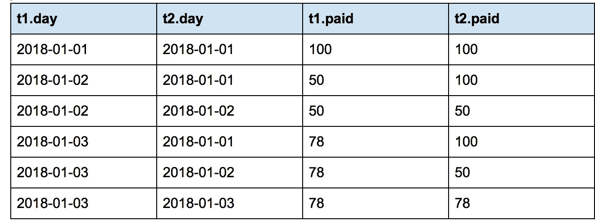

# 使用 SQL 解决问题

> 原文：<https://betterprogramming.pub/problem-solving-with-sql-b0ad58fe8643>

## 用 SQL 计算滚动和并连接连续事件

[https://xkcd.com/](https://xkcd.com/)

SQL 是数据的语言，在任何公司都可以用来回答无数的问题(除非那个公司还是 100%脱离大型机运行)。

无论您是数据工程师、分析师还是数据科学家，数据的无处不在使得 SQL 熟练程度成为最常用的技能之一。

即使公司在其数据系统和工具中依赖更大的数据集，如 Hadoop、Hive 和 Presto，SQL 仍然很重要。它是少数几种你可以一次学会的“语言”之一，当你切换数据存储系统时，只需要做一些微小的语法改变。当您第一次开始使用 SQL 时，它可能看起来很有限，因为您没有接触过各种各样的问题。一旦你了解了 SQL 中的[过去的连接、循环和其他基本概念](https://www.codecademy.com/articles/sql-commands)，比如子查询、分析函数和聚合，看起来你已经理解了你需要知道的一切。

奇怪的是，你是对的。你知道做许多复杂工作的所有基本构件。但是仅仅因为你知道构建模块并不意味着你知道所有的应用。这就像说你理解加法、乘法、除法和减法，因此你也必须理解代数是如何工作的。

代数使用所有的基本概念，但以一种新的方式应用它们。同理，基本的 SQL 概念可以解决复杂的问题，但并不意味着你知道如何应用它们。

这些问题的解决方式并不总是一致的。在 Oracle 和 MySQL 中回答问题的方式在 Redshift 或 SQL Server 中可能会有所不同。这些问题可能是分析性的，也可能与性能、优化甚至设计有关。

仅仅因为您使用了许多相同的命令并不意味着您使用了相同的方法。

我们来谈谈其中的一些问题。

# 分析函数

在开始之前，我们想讨论一个有用的工具来帮助解决很多问题。

这些被称为解析函数。它们可能不是你最先学会的东西，但是一旦你学会了，你可能会开始在任何地方使用它们。如果你还没有很好地掌握它们，那么我们建议你看一下[快速介绍](https://docs.microsoft.com/en-us/sql/t-sql/functions/analytic-functions-transact-sql?view=sql-server-2017)。

一个小提示:不是所有的 SQL 引擎都有内置的分析函数，所以您必须使用变通方法。我们将在下面讨论几个。

# 计算滚动总和

假设您想计算一辆快餐车每天的利润总额[。目前，我们不会因为添加月份或年份而使其复杂化。简单地说，所有时间的滚动总和。](https://en.wikipedia.org/wiki/Running_total)

你会如何使用 SQL 来实现呢？有什么想法吗？

实际上，用解析函数来做这件事有一个非常简单的方法:

就这样…你完了！

哇！这真的很简单。使用这个快速脚本，您能够计算所有食品卡车的滚动总和。那几乎太容易了！

现在，如果您不知道，使用这种类型的`function() over (partition by x order by y)`子句被称为分析函数或窗口函数。它允许最终用户做一些类似于`group by`的事情，但是它不是根据一组特定的字段进行分组，而是根据该组字段进行分区，然后使用 order by 应用一个函数。该功能可以是`row_number`、`rank`、`sum`、`avg`等。所有这些函数本质上都是基于 order by 语句以滚动方式工作的。`Row_number`将为该组字段添加一个行号，一旦该组字段不同，则从一个行号重新开始。

我们说过，解析函数非常有用。太有用了，有时候面试官不喜欢你用。假设你正在面试，面试官说他们希望你不用分析功能就能解决这个问题…

你的胃刚刚下降了吗？也许这是你知道的解决这个问题的唯一方法。花一点时间，想想如何用现有的基本 SQL 工具解决这个问题。想想 SQL 语句实际上在问什么。

在这种情况下，您可以使用带有大于或等于语句的自联接，并创建如下所示的表:

如您所见，您将能够在`t1.day`字段上分组，并获得滚动求和效果。一个主要的缺点是依赖于数据量。因为根据数据的结构和您想要回溯多远，这种方法可能会导致系统内存不足。

如果万一这是一个问题，这里有另一个想法。您可以创建一个汇总表，基本上汇总每天的总数。

这取决于你是分割滚动和。例如，只要你知道你将不断地报告每月和每年的滚动总和，这将很好地工作。这将锁定你的设计，但在你实际查询时，既增加了速度又减少了计算机。同样，这更多的是一个设计问题。根据你的总体目标，什么是正确的答案？

# 加入连续事件

您可能会被问到的另一个问题是，为患者、客户或其他实体提供对连续事件的洞察。例如，您可能想要计算客户访问商店或您的网站的间隔天数。也许您需要一个简单的标志来指示患者在首次就诊后的 x 天内是否再次入院。在基本层面上，它们有着相似的目标。

您需要知道两次不同交易之间的天数。

大多数交易都是一行一行地排列的，所以你不能简单地走到下一行去弄清楚这些信息。

这就是分析函数再次发挥作用的地方。使用行号功能，您可以按每个客户和患者划分数据，并为每个事件添加一个行号。

以此为基础数据，您可以使用行号行上的+1 将此表自联接到下一行，以联接下一行:

有了这个自连接表，可以并排查看每一行，您可以获得更多信息。您可以回答这样的问题，例如，每次活动平均间隔多少天，或者在不到 15 天的时间内，客户有多少次再次光顾。

这可能是一个很好的起点，有助于分析如何专注于保留或[政策改进](http://www.acheronanalytics.com/healthcare-policyprogram-roi-engine.html)。你可以开始看到你的问题在哪里，并可能根据他们的表现注意到商店或医生之间的趋势。

有些人喜欢采用的另一种方法是遍历数据，本文不会涉及这种方法。这可能会变得稍微复杂一点，并且通常会更慢。

# 结论

这是解决 SQL 问题的两个例子。我们将继续发布各种问题以及您可以解决这些问题的不同方法。我们甚至可以重新研究上述同样的问题。这就是 SQL 的伟大之处；根据数据的布局，您的局限性迫使您使用不同的解决方案。您可能已经在某个地方使用过 SQL Server，并且已经习惯了允许您在其上放置索引的临时表。然后，您转到不再允许临时表的数据库，您的性能会大大下降。