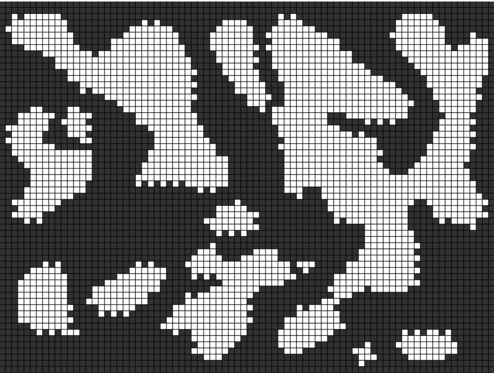

# Python 中的程序化地图生成

> 原文：<https://betterprogramming.pub/procedural-map-generation-in-python-174cd28daf24>

## 让我们用细胞自动机创建一个只有几行代码的简单地图


照片由[安德鲁·斯图特斯曼](https://unsplash.com/@drwmrk?utm_source=medium&utm_medium=referral)在 [Unsplash](https://unsplash.com?utm_source=medium&utm_medium=referral) 上拍摄

在[计算](https://en.wikipedia.org/wiki/Computing)中，程序生成通过算法[而非手动方式创建数据](https://en.wikipedia.org/wiki/Algorithm)，通常通过人工生成的资产和算法与计算机生成的随机性和处理能力相结合。

我们可以使用细胞自动机，用几行代码创建一个简单的地图。这个自动机的规则是，如果一个单元格周围有四面以上的墙，它将创建一面墙。否则，它将生成一个地板。在我们的例子中，墙和地板的唯一区别是颜色:墙是黑色的，地板是白色的。

让我们从导入所需的库和创建颜色常量开始。

```
import numpy as np
import pygame
import time
# Set colors 
WALL_COLOR = (50, 50, 50)
GRID_COLOR = (0, 0, 0)
FLOOR_COLOR = (255, 255, 255)
FLOOR_NEXT_COL = (0, 0, 255)
```

现在我们需要定义`update`函数，它将计算地板或墙壁周围的单元格数量，并根据前面解释的规则决定应该创建哪个资产。

我们初始化一个临时的零矩阵，它将存储单元格在下一次迭代中的值，然后开始一个 for 循环，对每个单元格求和，计算其周围九个单元格的值。然后我们应用规则。我们将`FLOOR_NEXT_COL`颜色分配给下一轮将被转化为墙壁的细胞。

我们使用 pygame 来绘制单元格，最后，我们将边界设置为墙壁。否则，在几次迭代中，地图将退化为只有楼层。

```
def update(screen, cells, size, with_progress=False):
    # Create temporary matrix of zeros
    temp = np.zeros((cells.shape[0], cells.shape[1]))

    for row, col in np.ndindex(cells.shape):
        walls = np.sum(cells[row - 1:row + 2, col-1:col+2]) -   cells[row, col]      
        color = FLOOR_COLOR if cells[row, col] == 0 else WALL_COLOR

        #Apply rules (if more than 4 walls create a wall, else a floor)
        if walls > 4:
            temp[row, col] = 1
            if with_progress:
                color = WALL_COLOR  
        else:
            if cells[row, col] == 1:
                if with_progress:
                    color = FLOOR_NEXT_COL

        # Draw rectangles, using as backgorund the screen value.
        pygame.draw.rect(screen, color, (col * size, row * size, size - 1, size - 1))   

    # Set borders to walls    
    temp[0:60, 0] = 1
    temp[0, 0:80] = 1
    temp[0:60, 79] = 1
    temp[59, 0:80] = 1  

    return temp
```

我们现在可以定义`main`函数，如下所示:

```
def main():    
    #Initialize pygame
    pygame.init()
    # Set size of cells
    size=10
    # Set size of screen
    WIDTH = 800
    HEIGHT = 600
    # Set dimension of cells and their initial configuration
    cells = np.random.choice(2, size=(60, 80), p=[0.38, 0.62])
    cells[0:60, 0] = 1
    cells[0, 0:80] = 1
    cells[0:60, 79] = 1
    cells[59, 0:80] = 1

    #Init surface/screen
    screen = pygame.display.set_mode((WIDTH, HEIGHT))

    # Fill the screen with the grid
    screen.fill(GRID_COLOR)

    update(screen, cells, size)

    #Update the full screen
    pygame.display.flip()
    #Update only portions of the screen
    pygame.display.update()

    # Initialize running as false, so it won't immediately start the game
    running = False
    # Create infinite while loop to listen to keys 
    while True:
        for event in pygame.event.get():
            if event.type == pygame.QUIT:
                pygame.quit()
            # If space key is pressed, change running in true/flase
            elif event.type == pygame.KEYDOWN:
                if event.key == pygame.K_SPACE:
                    running = not running
                    update(screen, cells, size)
                    pygame.display.update()                    

        if running:
            cells = update(screen, cells, size, with_progress=True)
            pygame.display.update()
        time.sleep(2)

if __name__ == '__main__':
    main()
```

我们初始化 pygame，设置单元格的大小和屏幕大小，然后是单元格的初始配置。这部分很重要。单元格被随机设置为墙壁或地板，但我们需要墙壁多于地板来创建平滑的地图，因此我们使用`numpy random.choice`函数将墙壁的概率设置为 62%，将地板的概率设置为 38%。然后，我们必须将边界设置为墙壁，以避免算法退化。

现在我们只需要使用标准的 pygame 函数来更新和显示游戏。如果希望以不同的速度创建地图，可以更改睡眠时间。

然后我们启动代码。您可以使用空格键启动和停止自动机。

如果你想要一个平滑均匀的贴图，你应该等待更多的迭代。否则，如果您喜欢参差不齐、支离破碎的地图，只需几步就足够了。



作者图片