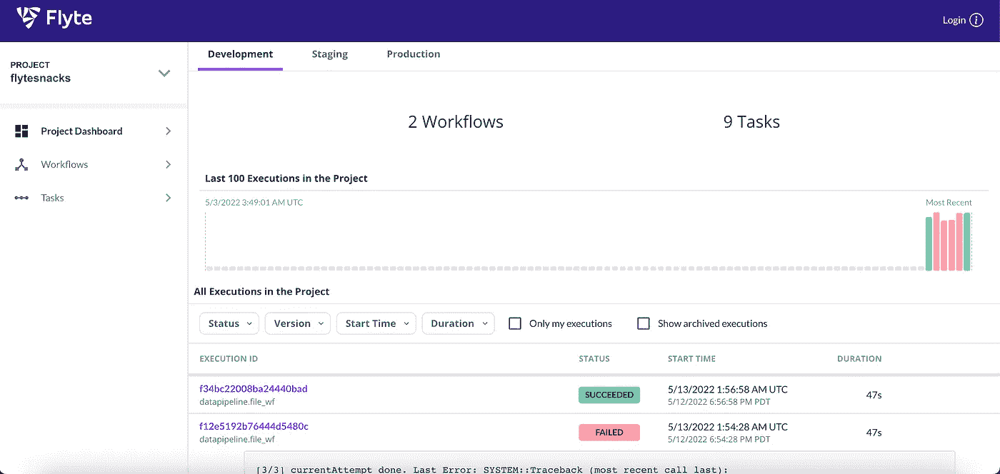
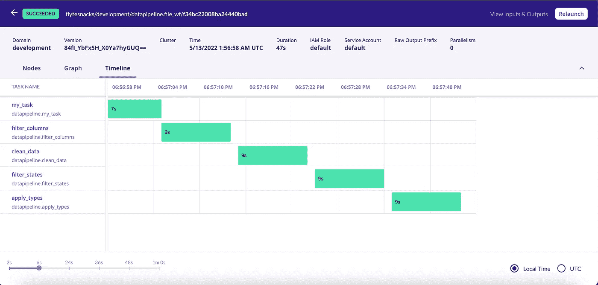

# 使用 Flyte 处理数据

> 原文：<https://betterprogramming.pub/processing-data-using-flyte-778cafd70d6e>

## Airflow 和 Prefect 的替代数据编制器


由 [Charles Postiaux](https://unsplash.com/@charlespostiaux?utm_source=medium&utm_medium=referral) 在 [Unsplash](https://unsplash.com?utm_source=medium&utm_medium=referral) 上拍摄的照片|图像高度降低

在我以前的许多职位中，我都是一站式服务者，所以我知道坏数据会带来多大的问题。我看到了它如何影响整个业务——报告显示不同的结果、战略变化，客户开始怀疑数据和产品。经历这些变化凸显了干净数据的重要性。

我们如何从原始数据到干净的数据？我们创造数据管道。很多人。然后，我们安排他们。这需要大量的编排工作，找到合适的工具来完成这项工作至关重要。

我最近谈了一点关于[提督](https://blog.devgenius.io/airflow-theres-a-new-competitor-in-town-d59b48a642ff)和[我在学习这个非凡工具上的努力](https://levelup.gitconnected.com/moving-your-prefect-flow-from-local-to-the-cloud-heres-how-64ba140172ae)。

尽管与流程编排工具如 Airflow 和 Azure Data Factory 相比，Prefect 无疑正在改变游戏，但它仍有一些不足之处；一个是它不容易与机器学习和 spark 工具集成。

今天，我将介绍一个名为 Flyte 的数据编排工具，它可以完成所有这些功能。

下面是我用的[代码和 CSV](https://github.com/sdf94/flyte) 。

# 什么是 Flyte？

下面介绍一下 Flyte。你听说过一个叫 Lyft 的公司吗？当然，你有！Flyte 实际上是 Lyft 与 Spotify、Freenome 和许多其他公司合作创建的。

它可以服务于 Python、Java 和 Scala。而且它是在 Kubernetes 之上创建的，所以它包含了所有这些额外的好处，包括可再现性、可移植性、可伸缩性和可靠性。一切都在你的基础设施上，所以你可以看到 Flyte 正在做的一切。抱着同样的心态，Flyte 对所有执行的操作进行版本化和审计。

我一直喜欢开源库。当然，开始可能需要一些时间，但最终结果是让整个社区走到一起，创造出一个伟大的产品。Flyte 也不例外，因为它是完全开源的，在 Linux 基金会下拥有 Apache 2.0 许可证，并有一个跨行业的监督委员会。

## 关键概念

最小单位是任务。它们是完全独立的执行单元和 Flyte 的一级实体，因此是用户代码的基本构建块。每个任务还具有两个特征:它们是容错的，并且具有缓存/记忆机制。

任务的组合构成了所谓的工作流。这些工作流是在 protobuf 中定义的，它比典型的 JSON 格式更小更快。用户可以将工作流定义为节点的集合，工作流中的这些节点可以产生输出，后续节点可以将这些输出用作输入。这些节点及其依赖关系决定了工作流的结构。因此，根据其用途，节点将是三种类型之一。任务节点是任务的实例，工作流节点包含整个子工作流，最后，分支节点将改变流的输出。

每个启动计划都与一个特定的工作流相关联，该工作流具有一组唯一的输入参数。这允许动态和静态流动。一旦创建了发布计划，我们就可以轻松地共享和执行它们。

安排这些发布计划的一个问题是，一旦确定了发布计划的时间表，就不能对其进行编辑。每次计划变更时，都会创建新版本的发布计划。

是时候举些例子了！

# 安装本地 Flyte 沙箱

在安装 Flyte 的演示项目 flytesnacks 之前，我们需要安装以下先决条件:

1.  Docker——选择你正确的 Docker 版本，并遵循他们的指示[这里](https://docs.docker.com/get-docker/)。
2.  git——选择你正确的 Docker 版本，并遵循他们的指示[这里](https://docs.docker.com/get-docker/)。
3.  flytectl

```
brew install flyteorg/homebrew-tap/flytectl
```

或者

```
curl -sL https://ctl.flyte.org/install **|** bash
```

然后检查 flytectl 是否安装正确:

```
flytectl version
```

## **设置项目**

首先，我们必须下载 flytesnacks 和 flytekit，我们可以使用以下代码完成:

```
git clone https://github.com/flyteorg/flytesnacks
cd flytesnacks/cookbook
pip install -r core/requirements.txt
```

为了确保在您的虚拟环境中一切正常，请在本地运行`hello_world.py`:

```
python core/flyte_basics/hello_world.py
```

预期产出:

```
Running my_wf() hello world
```

现在我们准备好了！

# 演示项目

首先，我们需要设置 Flyte 演示集群。

```
flytectl demo start
```

然后，我们可以在本地测试工作流。

```
pyflyte run core/flyte_basics/hello_world.py:my_wf
```

并将其推送到集群。

```
pyflyte run --remote core/flyte_basics/hello_world.py:my_wf
```

您应该会看到类似这样的内容:

```
Go to [http://localhost:30080/console/projects/flytesnacks/domains/development/executions/f82bd12acd76d4505a04](http://localhost:30080/console/projects/flytesnacks/domains/development/executions/f82bd12acd76d4505a04) to see execution in the console.
```

我们有控制台。现在让我们做一次练习。

```
pyflyte run --remote core/flyte_basics/basic_workflow.py:my_wf --a 5 --b hello
```

您可以在控制台中看到成功的项目运行，如图所示。


Flyte 控制台作者截图

你看到我看到的了吗？它被划分为开发、试运行和生产。你试过用气流吗？没错。没用，哈哈哈。

您可以将域从开发更改为暂存，如下所示:

```
pyflyte run -d staging --remote core/flyte_basics/basic_workflow.py:my_wf --a 5 --b hello
```

是不是很牛逼？

# 管道

你可以在这里看到这个代码和数据集[。](https://github.com/sdf94/flyte)

我最近从美国劳工部，特别是从这些表格中提取了一些数据。我把那些年的那些表格结合起来，用计算机和数学职业过滤那些文件，使文件最小化。

接下来，我创建了一个管道来清理这个表，因此我设置了一个具有可调数据集参数的工作流。

```
pyflyte run --remote datapipeline.py file_wf --dataset [https://raw.githubusercontent.com/sdf94/flyte/master/salary.csv](https://raw.githubusercontent.com/sdf94/flyte/master/salary.csv)
```

这将启动下面的工作流来分析来自 GitHub 的数据文件。

```
[@workflow](http://twitter.com/workflow)
def file_wf(
   dataset: str
    = DATASET_REMOTE
) -> pd.DataFrame:
   df = download_file(dataset=dataset)
   df = filter_columns(df=df)
   df = clean_data(df=df)
   df = filter_states(df=df)
   df = apply_types(df=df)
   return df
```

每一行对应于工作流中的一项任务。

第一个任务是下载要阅读的文件。

```
[@task](http://twitter.com/task)
def download_file(
       dataset: str
) -> pd.DataFrame:
    urllib.request.urlretrieve(dataset, DATASET_LOCAL)
    df = pd.read_csv(DATASET_LOCAL)
    return df
```

现在，你实际上不必下载它“本地”或在我运行这些作业的 pod 中。您可以使用 FlyteFile 或 FlyteDirectory 来代替。

第二个任务:我只想查看几列，您可以通过添加一个列列表来标准化这些列。

```
[@task](http://twitter.com/task)
def filter_columns(
      df: pd.DataFrame) -> pd.DataFrame: 
    return df[['area_title','occ_title', 'tot_emp',  'jobs_1000', 'a_mean', 'a_pct10', 'a_pct25',
       'a_median', 'a_pct75', 'a_pct90', 'year','o_group']]
```

第三项任务:我需要通过删除空值、删除重复项以及删除带有*和#符号的行来清理它们。

```
[@task](http://twitter.com/task)
def clean_data(df: pd.DataFrame) -> pd.DataFrame:
    df = df.dropna()
    df = df.drop_duplicates()
    df = df[(df != '**').all(1)]
    df = df[(df != '*').all(1)]
    df = df[(df != '#').all(1)]
    return df
```

第四个任务:我只过滤了华盛顿州、俄勒冈州、加利福尼亚州、宾夕法尼亚州、德克萨斯州、乔治亚州、佛罗里达州和密歇根州。

```
[@task](http://twitter.com/task)
def filter_states(df: pd.DataFrame) -> pd.DataFrame:
    df = df[df['area_title'].str.contains("WA|OR|CA|PA|TX|GA|FL|MI|")]
    df = df[df['area_title'].str.contains("-")]
    return df
```

第五个任务:我想强制数据类型。

```
[@task](http://twitter.com/task)
def apply_types(df: pd.DataFrame) -> pd.DataFrame:
    return df.astype({"area_title": 'object',
                              "occ_title": 'object', 
                              "tot_emp":'float',
                              "jobs_1000":float,
                              "a_mean":float, 
                              "a_pct10":float,
                              "a_pct25":float,
                              "a_median":float,
                              "a_pct75":float,
                              "a_pct90":float,
                              "year":'object',
                              'o_group':str})
```

这是失败和成功后的用户界面:



作者图片

在这种情况下，它甚至会显示哪个任务实际上失败了或者成功了。



作者图片

# 最后的想法

我已经展示了如何在本地和 Kubernetes 演示集群上运行 Flyte。我使用不同的域运行这些任务，“暂存”和“开发”，并且动态地，我可以动态地改变文件路径；这两个功能都是 Flyte 独有的。

Flyte 还可以提供更多功能，我会继续使用这个出色的 orchestrator，包括它处理机器学习算法和 spark 作业的能力。

我希望你喜欢这篇文章，并让我知道你的想法！