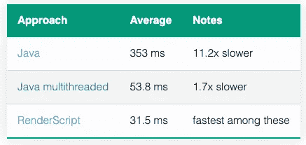
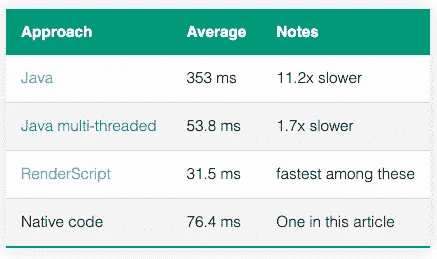

# 利用 Android 中的原生代码快速处理图像

> 原文：<https://betterprogramming.pub/processing-images-fast-with-native-code-in-android-db8b21001fa9>

## 了解本机代码如何更好地提升应用的性能


丹尼尔·罗梅罗在 Unsplash[拍摄的照片](https://unsplash.com?utm_source=medium&utm_medium=referral)

性能是大多数软件产品的一个特性，但是很少有程序比其他程序对性能更敏感。我开发了一款安卓相机应用，我的团队非常重视性能。

> *【谷歌发现】有 10 个结果的页面生成耗时 0.4 秒。有 30 个结果的页面用了 0.9 秒。半秒钟的延迟导致 20%的流量下降。半秒的延迟扼杀了用户满意度。*

我不需要向我的经理或你夸大`performance`的重要性，但是我看到了这个片段，它强化了**性能是一个特性**构造——了解事实很好。

如果您正在编写应用程序来处理用相机捕获的大图像或设备上的现有图像，您需要格外小心。如今，手机上的相机很容易配备高分辨率传感器。现在在 Android 设备上很容易找到 1300 万像素、2400 万像素、4800 万像素甚至 108 万像素的相机。

我们来看一张 1300 万的图片。它有 1300 万像素。如果你想在图像上做一个简单的计算，比如说增加图像的曝光度，也就是说增加每个像素的曝光度

```
image(x, y) = std::clamp(alpha * image(x, y) + beta, 0, 255);
```

你需要做 1300 万次。

如今的智能手机也配备了多核、支持 SIMD 的 CPU，因此有一些方法可以比串行的 1300 万次迭代更快，但与此同时，我们想要运行的算法类型通常比我刚才所说的复杂得多。

根据我的经验，用本机代码处理这些复杂的图像处理操作更容易也更好，特别是为了保持它的高性能。

这是一篇非常基础的文章，演示了如何在 Android 中用原生代码进行图像处理。我还将通过一个例子来说明，对于相同的问题陈述，一个非常简单且未优化的 C++代码的性能非常接近于相当优化的 Java 代码。如果你正在寻找“在 Android 中使用 Java 原生接口或 JNI 的快速图像处理”——我相信你来对了地方，这篇文章同样会帮助你。

# 问题陈述示例:YUV 到 RGB 转换

问题陈述是将具有一个平面`Y`通道和两个半平面子采样`UV`通道的名为 [YUV_420_888](https://developer.android.com/reference/android/graphics/ImageFormat#YUV_420_888) 的特定格式的 8MP (3264x2448)图像转换为 Android 中的[位图](https://developer.android.com/reference/android/graphics/Bitmap)通常支持的 [ARGB_8888](https://developer.android.com/reference/android/graphics/Bitmap.Config#ARGB_8888) 格式。你可以在维基百科上阅读更多关于 [YUV 格式的内容。此外，下面的文章对问题陈述有更好的描述。](https://en.wikipedia.org/wiki/YUV)

我之所以选择这个作为问题陈述，是因为`YUV_420_888`是 Android 相机 API 支持的最常见的输出格式之一，图像通常在 Android 中作为`Bitmap`使用——因此这是一个需要解决的相当常见的问题陈述。

我一直在试验不同框架或技术的性能，以了解 Android 中图像处理的性能，并以此作为问题陈述。下面是一些我测试过的使用其他技术的例子:

*   [如何使用 RenderScript 将 YUV_420_888 YUV 图像转换为位图](https://blog.minhazav.dev/how-to-use-renderscript-to-convert-YUV_420_888-yuv-image-to-bitmap/)
*   [使用多线程技术加快 Android Java 中的图像处理速度](https://blog.minhazav.dev/faster-image-processing-in-android-java-using-multi-threading/)

我计划写一篇完整的系列文章，解释不同方法的性能。以下是迄今为止公布的方法的数量:



*表 1:在 Pixel 4a 设备*上将 `*8MP (3264x2448)*` *YUV 图像转换为位图的性能延迟。*

# 使用本机代码进行图像处理

如果我们直接在本机空间中操作，基本的框架程序将如下所示:

该函数获取某个像素的`y`、`u`和`v`通道值，并返回相应的`RGBA_8888`值。

默认情况下，Android 程序是用 Java 或 Kotlin 语言编写的，但 Android 工具链附带了一个名为 Android NDK 的[本地开发工具包，让你使用 C 和 C++等语言实现应用程序的各个部分。Android 文档描述 NDK 在两种情况下有用:](https://developer.android.com/ndk)

> 充分利用设备的额外性能来实现低延迟或运行计算密集型应用，如游戏或物理模拟。
> 
> 重用您自己或其他开发人员的 C 或 C++库。

在接下来的几节中，我将尝试简要解释如何使用本机代码集成将 [YUV_420_888](https://developer.android.com/reference/android/graphics/ImageFormat#YUV_420_888) 格式的 Java [图像](https://developer.android.com/reference/android/media/Image)转换为 Java 对象[位图](https://developer.android.com/reference/android/graphics/Bitmap)。

所以基本上我们必须填写这个 Java 函数框架:

在我深入之前，我想给你介绍一下 JNI。

# JNI

JNI 代表 Java 本地接口。它定义了从 Java 或 Kotlin 代码编译的字节码与用 C 或 C++编写的本机代码交互的方式。顾名思义，它帮助我们将 Java 代码与本地代码连接起来。

如果你最终更多地与 JNI 合作，我推荐你阅读安卓在 JNI 的提示——[JNI 提示](https://developer.android.com/training/articles/perf-jni)。

# NDK 和 JNI 入门

为了避免重复，我建议你看看下面的文章，并尝试安装你的第一个基于 JNI 的 Android 应用。这些文章还将帮助您建立编译 Android 应用程序以及 NDK 和本机代码所需的工具链。

*   [样本:hello-jni](https://developer.android.com/ndk/samples/sample_hellojni)
*   [使用 NDK 的安卓 JNI 应用](https://www.journaldev.com/28972/android-jni-application-ndk)

如果这些文章不够清楚，请在评论中告诉我。如果您已经成功创建并运行了您的 JNI 应用程序，或者已经了解这些结构，请继续下一部分。

# YUV 到位图转换的本机代码

在`app/src/main/cpp`中创建一个库和源文件`yuv2rgb.h/cc`。

## 头文件

## 源文件

理想情况下，您还应该为此编写一个单元测试，但是这超出了本文的范围。你可以在 Android 文档中阅读更多关于[添加原生测试的内容。](https://source.android.com/compatibility/tests/development/native)

接下来，我们将编写一个 JNI 层，将它与我们开始时使用的 Java 框架连接起来。

# Java + JNI 集成

现在，您需要一个 JNI 文件来将 Java 库连接到本地库。让我们在`app/src/main/cpp`里加上`yuv2rgb-jni.cc`。

同样，让我们假设我们的 Java 框架函数在包`com.example.myproject`中，在一个名为`YuvConvertor`的静态类下，你的 JNI 文件应该是这样的。

> ***重要提示*** *:包名、类名和本机方法名在这里很重要，因为它们被运行时用来调用正确的本机函数。请参见下面 JNI 代码中的方法名，以获得更多上下文信息。*

最后，从 Java 库中调用它

这里需要注意的一些要点是:

*   使用 NDK API，我们可以直接访问本机代码中[字节缓冲区](https://docs.oracle.com/javase/7/docs/api/java/nio/ByteBuffer.html)的内容，如果处理不当，这既非常有用又非常危险。
*   在这种情况下，可以直接使用用于位图的[NDK API](https://developer.android.com/ndk/reference/group/bitmap)，这有助于减少额外的内存分配，我们可以直接从本机代码更新位图的内存。

这样，您就有了调用 JNI 的 Java 代码，它检索指向本机格式的输入和输出数据的指针，并将其传递给本机库进行处理。原生库是相当常见的 C++代码，也可以在 Android 之外使用。

您的 make 文件(在这种情况下应该在`app/src/main/cpp/CMakeLists.txt`中)应该正确配置，以支持使用 Android APK 构建本机代码。对于这个例子，它至少应该有这些定义。

# 表演

在考虑性能时，请记住这是一种相当简单的 C++代码形式，它没有明确利用可以在 Android 设备上运行的多线程或 SIMD 指令集。最好的情况是，部分代码被编译器优化了(例如，主 for 循环可以自动矢量化)。代码是用`-O3`优化标志编译的。

对于一幅`8MP`图像(3264x2448 ),该代码在同一参考设备上大约需要`76.4ms`。



*表 2:在 Pixel 4a 设备*上将 `*8MP (3264x2448)*` *YUV 图像转换为位图的性能延迟。*

您可以在这里看到，这个版本的本机代码的性能比经过高度优化的多线程 Java 代码慢 1.4 倍，这不是一个坏消息。starter Java 代码使用了`353 ms`来运行相同的算法(尽管它可能有复杂的原因`ByteBuffer`不提供直接数组访问- [阅读更多信息](https://blog.minhazav.dev/faster-image-processing-in-android-java-using-multi-threading/#java-bytebuffer-vs-native-byte))。要了解更多关于编写更优化的本机代码或利用编译器的语言结构的信息，我推荐阅读本文— [指导 C++编译器自动向量化代码](https://blog.minhazav.dev/guide-compiler-to-auto-vectorise/)

# 结束语

我要重申，本机代码对于在 Android 上运行计算密集型算法非常有用。并且大多数图像处理算法通常属于这一类别，这可能是因为需要处理大量像素，因此需要大量迭代。

在同一个系列的实验中，通过利用多线程、NEON API(SIMD)和一些汇编代码，我能够将延迟降低到`12.1 ms`，这是这个系列的赢家(剧透警告)。然而，编写和维护都相当复杂，基于`Halide`的解决方案对于相同的问题陈述需要大约`28ms`的时间，在性能、维护和编写的便利性方面，这甚至是完美的解决方案。

我将在我的下一组文章中写这两个问题，感谢您的阅读。敬请期待！！

```
**Want to Connect With the Author?**This article was originally published at [https://blog.minhazav.dev](https://blog.minhazav.dev/processing-images-fast-with-native-code-in-android/). 
```