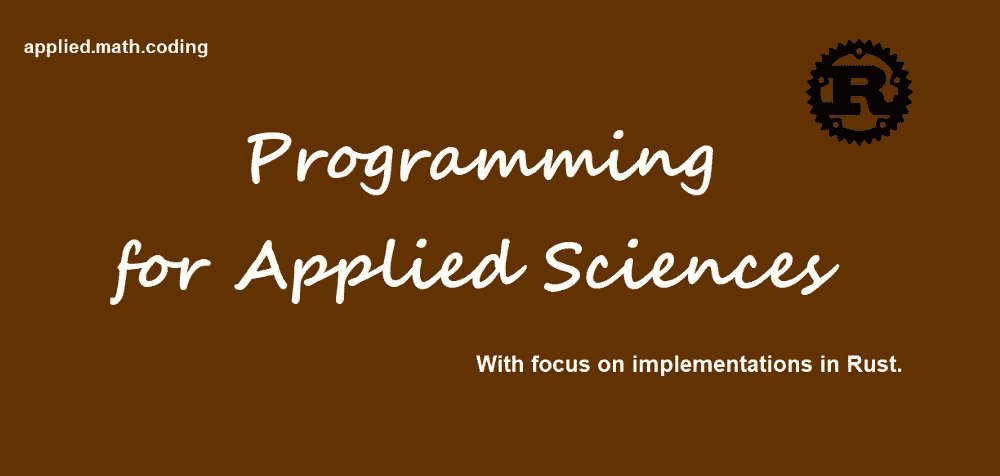
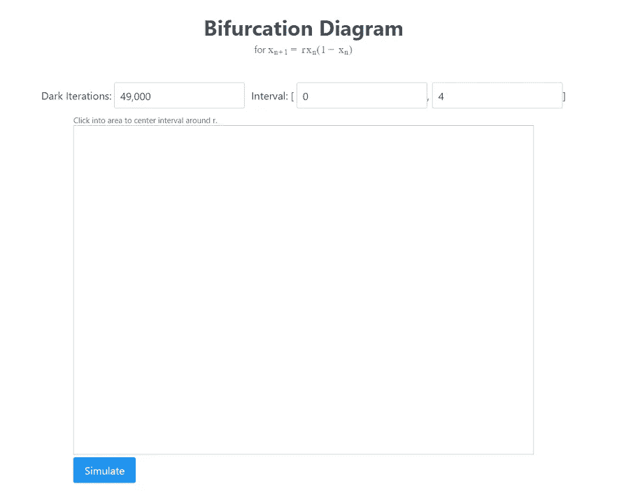
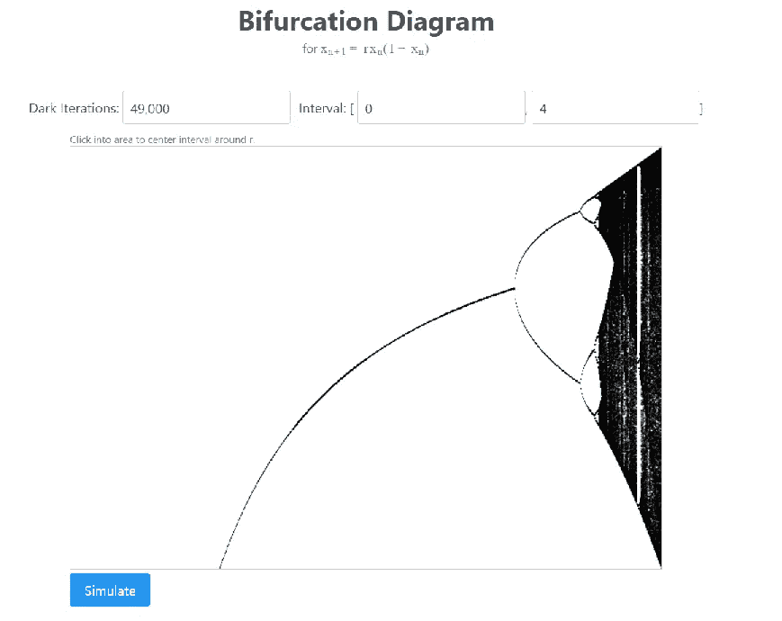
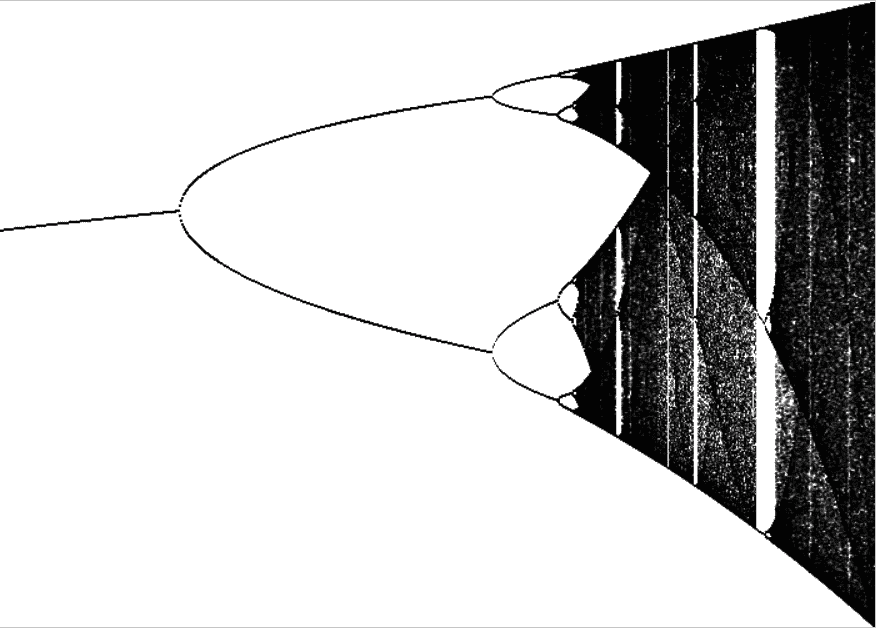

# 如何使用 Rust 在 Tauri 中生成可缩放的分叉图

> 原文：<https://betterprogramming.pub/producing-a-zoom-able-bifurcation-diagram-in-tauri-rust-d2867ff1387f>

## 这一神奇功能的简要指南



作者图片

[](https://medium.com/@applied-math-coding/membership) [## 通过我的推荐链接加入 Medium-applied . math . coding

### 获得我所有的故事，以及其他作家在媒体上发表的成千上万的故事。我坚信，媒介是…

medium.com](https://medium.com/@applied-math-coding/membership) 

Rust 可能是科学计算和机器学习中最有前途的编程语言之一。这两门学科都要求我们不时地进行精确的计算机实验和模拟。

在我之前的一篇文章中(参见[这里](/building-a-desktop-app-with-tauri-8e281b8c4f64)，我已经简单介绍了如何快速建立一个基于 [Tauri](https://tauri.app/) 的桌面应用程序，它能够绘制来自 Rust 函数调用的数据。

本文将采用这种方法来为逻辑映射生成一个可缩放的分叉图。对于事情背后的理论方面，你给[这篇文章读一读](https://medium.com/@applied-math-coding/chaos-from-the-logistic-map-part-1-periodic-points-4f579b713055)，但不是这篇文章所要求的。

注意，在以下几个组件和功能的名称中有术语`feigenbaum`。这并不是偶然的，而是为了帮助第一个开始查看这种特定图表的人(参见[这里的](https://en.wikipedia.org/wiki/Mitchell_Feigenbaum))。

Tauri 应用程序本身是通过使用`npm create tauri-app`中的`vue-ts`选项创建的。而且 UI 使用组件库 [PrimeVue](https://www.primefaces.org/primevue/setup) 和 [Sass](https://sass-lang.com/) 作为 CSS 扩展。两者都可以集成到应用程序中，就像对普通的 web 应用程序一样。

这里描述的所有代码都可以在这个[库](https://github.com/applied-math-coding/feigenbaum)中找到。你可以随意克隆它，随便玩玩。请注意，当您克隆它时，您必须从其根目录中运行以下命令，以便获取客户端依赖项:

```
npm i
```

当然，这都假设你已经安装了这里所列的用 Tauri 开发的需求。

# 实现模拟

在本节中，您将需要一些关于 Rust 的基本知识。如果你需要一个总结，你可以在这里找到一个简单的介绍。

分叉图基于以下技术。对于给定区间`[a, b]`内`r`(分叉参数)的几个值，我们选择一个随机的起始值`x_0`，并迭代下面的动态系统几次:

```
x_{n+1} = r * x_n * (1 - x_n)
```

这给出了一个我们称之为暗迭代的值列表。在分叉图中，我们感兴趣的是一个系统的长期行为。也就是说，我们问它是否收敛，例如，收敛到某些周期轨道或不变集。因此，我们再次迭代系统`m`次，但是现在我们存储值的列表，以便以后绘制它们。

换句话说，如果`(v_1, v_2, ..., v_m)`是这些值，我们为特定的`r`绘图:

```
{(r, v_1), (r, v_2), ..., (r, v_m)}
```

进行上述模拟的部分是:

注意，这也允许你在多个初始点`x_0`上操作。

我们用一个传递随机初始点的函数来包装对上述函数的调用。看起来是这样的:

我在这里使用奇妙的 crate [rand](https://crates.io/crates/rand) 来产生随机值。

如我所说，这必须在间隔`[a,b]`内对`r`的几个值进行。下面的方法就是这样做的，它收集所有的迭代结果作为返回值。代码如下:

`delta`是我们在`[a, b]`中选择数值的步骤。

最后，由于所有这一切可能需要相当长的时间，明智的做法是将这种计算分布在可用的 CPU 上。我们通过将区间`[a,b]`分割成尽可能多的可用内核来实现这一点(注意，这利用了板条箱`[num_cpus](https://crates.io/crates/num_cpus)`)。代码如下:

Rust 出色的通道通信实现了派生线程之间的同步。

为了使所有这些在用户界面中都可以访问，我们在`main.rs`中注册了下面的 Tauri 命令:

# 可视化模拟

尽管在我们的场景中有像 [plotly](https://plotly.com/javascript/) 这样非常强大的绘图库，但最好还是使用普通的 HTML5 canvas 元素。这是非常高性能的，可以很容易地处理大量的点。

进行绘图的代码位于`Feigenbaum.vue`。模板中有一个类似如下的`canvas`:

```
<canvas ref="canvas" width="700" height="500"
      [@mousemove](http://twitter.com/mousemove)="!state.simulating && handleMouseMove($event)"
      [@mouseleave](http://twitter.com/mouseleave)="state.hoveredR=undefined"    
      [@click](http://twitter.com/click)="!state.simulating && handleCanvasClick()">
</canvas>
```

这个`canvas`引用自 JavaScript 代码

```
const canvas = ref<HTMLCanvasElement | null>(null);
```

并用于在新数据到达时绘图。请求数据然后绘制数据的部分是这样的:

让 Tauri 调用我们同名的 Rust 函数。数据将存储在变量`x, y`中。因此，`x`是一个列表，其中包含对应迭代的`r`和`y`的值。本质上，这些值被迭代(`forEach`)，然后作为一个点绘制到画布中(宽度/高度的填充矩形`1`)。

不过，在将这些值绘制到`canvas`之前，我们必须记住`canvas`使用不同的缩放坐标，而且`y`轴是镜像的。为了处理这个问题，我们首先通过将所有的`(r, v)`对转换成`canvas`坐标来对它们进行`map`。方法`transfCoords`如下:

# 构建和运行应用程序

如果您运行以下命令:

```
npm run tauri build
```

Tauri 将完成所有的构建步骤以生成一个发布版本。根据您的系统，您会在文件夹`src-tauri/target/release`中找到一个可执行文件。对我来说，是文件`feigenbaum.exe`。点击后，出现如下界面:



按下模拟按钮会产生:



此外，如果您单击图表，间隔将被调整为围绕该点并应用缩放因子。例如，我们可以缩放`r = 3.74`的区域以获得下图:



现在，你可以自由实验了！

感谢阅读！