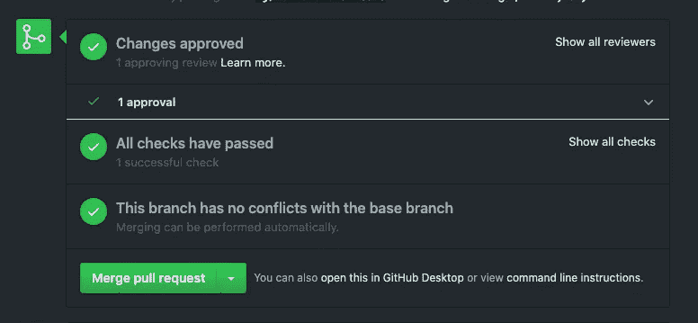

# 产品天堂:持续部署

> 原文：<https://betterprogramming.pub/product-nirvana-continous-deployment-3a5763768cf8>

## 你真的应该在每次合并时部署你的应用吗？

鲁本·华雷斯在 [Unsplash](/s/photos/continue?utm_source=unsplash&utm_medium=referral&utm_content=creditCopyText) 上的照片。

似乎持续部署是所有 DevOps 团队的目标。每一次合并到 master 都应该直接送到客户手中。代码应该经过大量的冒烟测试、单元测试和集成测试，通过测试环境，然后用一个神奇的管道发布出去。

在 GameChanger，这就是我们的后端。在每次推送 Git 时，我们都有一套针对代码运行的测试，以测试其部署的可行性。我们在 CI 服务器上编译和运行应用程序。然后，如果代码被同行认可并通过了所有的测试，你就可以点击绿色的大按钮:

很满足。但这真的是你想要的吗？

然后在另一个自动部署过程之后，客户实际上开始使用你的代码*。*仔细想想还是蛮野的。

如果你与十年前的开发人员交谈，持续部署只适用于拥有庞大、专注的开发团队的大型公司。现在，只需一些专门的人员和工具，如 GitLab、Docker 和 Jenkins，您就可以让整个部署流程自动化。工具已经走过了漫长的道路。看看[这篇关于为你的 Android 应用程序设置 CD 的文章](https://medium.com/the-telegraph-engineering/android-continuous-delivery-fb41da63176)。

工具本身非常酷——这是不可否认的。但是正如发展中的许多事情一样，仅仅因为你*能*做某事并不意味着你*应该*。

那么，持续部署适合您吗？这是好的，坏的，破碎的。

# 好人

## 停止决定何时释放

你参加过关于何时发布代码的会议吗？他们太可怕了。

*   "我们应该等待下一个特性加入这个版本吗？"
*   “这是一个大发布…我们需要更多的测试吗？”
*   “乔不是在圣帕特里克节不穿绿色吗？我对他写的代码感到紧张。”

这些都是非常令人讨厌的观点，尤其是当你把这些问题带给那些构建和测试产品的人的时候。

“是的，它准备好了，”我们说。事实上，我们来证明一下。让我们停止这些愚蠢的会议，当我们，产品团队，说它准备好了，它就准备好了，它就要给客户了。

产品经理和商业利益相关者可能会有点动摇，但是如果你真的信任你的工程团队(你应该信任，或者你应该找一个新的)，你永远都不需要考虑什么时候再部署。

## 开始快速释放

现在，您可以快速部署。想象一下，如果有一个全球性的疫情影响到我们生活的方方面面，请和我一起呆在这里。它改变了许多公司的进程，改变了你的公司需要做的事情。

为了生存和保持业务的相关性，你必须发布社交远程约会 API。有点拗口，但却是有用的产品，而且可能是非常有利可图的产品。

有了持续部署，你就不用找人坐下来经历一个艰苦的部署过程了。你只需点击绿色按钮，并开始寻找那些相距 6 英尺的匹配(这听起来比它需要的更令人毛骨悚然)。

# 坏事

## 你的测试和同行评审的好坏决定了你的水平

现在，仅仅因为您有了所有这些测试、检查和代码审查，您的代码仍然可能无法按预期工作。

例如，我在持续部署的后端上写的第一件事就是一个新的端点。我把`authentication`和`authorization`搞混了，部署了一个没有认证配置的端点。端点不需要`authorization`(您需要什么用户角色来访问这个端点？)，但它确实需要`authentication`(这个端点调用来自合法来源吗？).

它通过了测试，通过了代码审查，并被部署。直到几天后，我才意识到自己的错误，并回去将身份验证添加到端点。但是有几天，任何人——实际上是任何有浏览器或`curl`的人——都可以访问那个端点，从我们的后端获取合法数据。挺吓人的。也许我们应该在我们的 CI 中建立一个检查…

当然，如果你写了新的代码，但是没有用它写新的测试，你的 CI 怎么能测试它呢？代码不能像为客户设计的那样运行，但仍然通过了测试。

长话短说，三个复选标记并不意味着你的代码可以工作，甚至在逻辑上是正确的。你还是要小心。

## 如果你的代码对人的生命负责呢？

猎鹰 9 号的代码应该因为一名实习生在 SpaceX 按下绿色按钮而在发射中途改变吗？

上面有代码和人。照片来自 SpaceX via [The Verge](https://www.theverge.com/2018/5/24/17388680/spacex-falcon-9-rocket-block-5-commercial-crew-nasa-copv]) 。

# 破碎者

但是持续部署真正闪光的地方是当狗屎击中风扇的时候。如果你曾经做过网站可靠性或者随叫随到，那么可能发生的最糟糕的事情之一就是修复了一个问题，但是却不能让用户得到修复。您找到了让客户恢复工作状态的根本原因或解决方法，但是修复程序必须留在您的本地机器上，因为您不知道如何快速将修复程序提供给客户。

随着持续部署，只需点击绿色按钮！在我们公司，如果您现在真的需要在您的客户手中进行修复，您甚至可以绕过我们的许多测试和检查。这就是修补程序的定义，它已经挽救了我公司的许多事故。

但是 GameChanger 也有客户端应用，也就是我们的 iOS 和 Android 应用。我们不会持续部署这些应用，因为它们必须通过各自的应用商店。它们需要人工审查，而且周转时间很长。

这意味着当用户发现一个边缘案例或 bug 时，我们就有点麻烦了。我们通常可以快速修复这些问题，但实际上直到一周左右之后我们才能为这些用户提供修复。告诉客户他们需要等待才能做他们想做的事情是非常令人沮丧的。

# 但我要我的代码现在就部署！

好的，那么您应该持续部署您的后端吗？

不知道…大概吧？人们似乎喜欢它。我仍然夜不能寐，担心是否有人意外部署了不工作的东西，而我们的监控或检查没有发现它。但是，无论如何，批量部署可能会发生这种情况…

我还担心，由于代码部署的周转时间很短，而且代码部署如此频繁，这是否意味着团队对我们现在正在做的事情思考得更少，因为我们可以“稍后再部署一个修补程序”？

但是就像工程中的所有事情一样，为你的项目权衡利弊。权衡构建和维护 CD 管道的成本，权衡 CD 是否适合您的应用程序的利弊。

只是不要随意部署。感谢阅读！