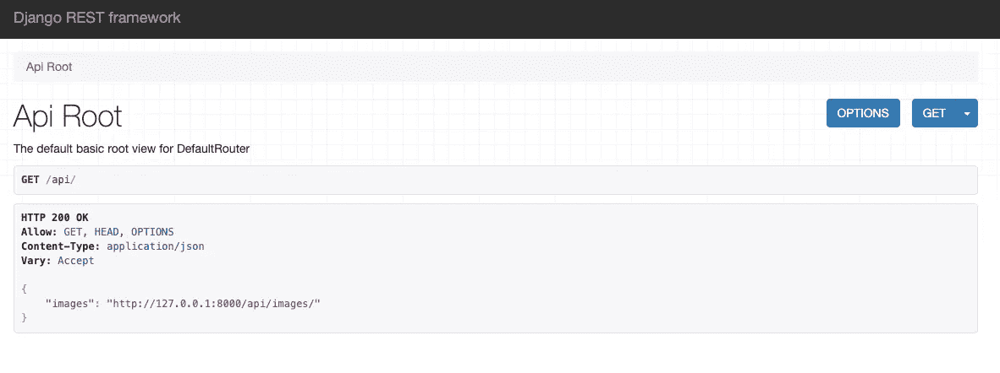
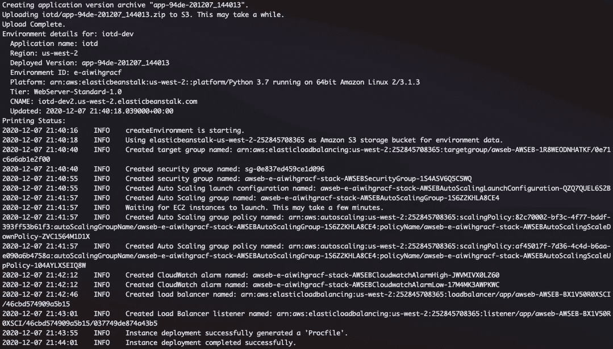
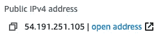
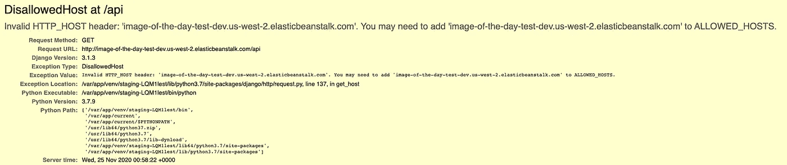
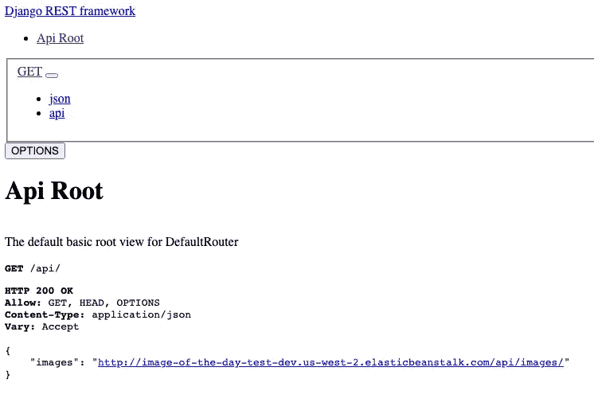

# 使用 Elastic Beanstalk 部署一个生产 Django 应用程序(第 1 部分)

> 原文：<https://betterprogramming.pub/production-django-elastic-beanstalk-part1-6632c0d4956a>

## 使用 Django 3.1.3、Python 3.7.9 和 Amazon Linux 2


布兰迪·里德在 [Unsplash](https://unsplash.com?utm_source=medium&utm_medium=referral) 上拍摄的照片

在本教程中，我们将创建一个简单的 Django Rest 框架(DRF)应用程序，并将其与 Beanstalk 一起部署，以使我们的端点在 web 上可用。我们将做一切事情，从创建我们的虚拟环境和让 Django 应用程序在本地运行，到在 Beanstalk 上部署代码并将其连接到 Postgresql RDS 数据库。我们走吧！

*如果你已经熟悉这里涵盖的所有内容，或者你正在寻找处理生产静态和媒体文件、数据库设置或环境变量的帮助——不如看看* [***第 2 部分***](https://medium.com/@zackcpetersen/production-django-elastic-beanstalk-part2-4501caf7d8fb) *！*

# 目录

1.  [**为什么要用弹性豆茎**](#d874)
2.  [**安装 Pyenv 和 Pipenv**](#a8cf)
3.  [**克隆回购**](#a53e)
4.  [**准备豆茎**](#504c) **—** [下载 EB CLI](#9261)
    — [初始化弹性豆茎](#82d7)
    — [创建豆茎环境](#9cbc)
    — [添加。ebextensions](#1fe6)
5.  [**SSH 进入服务器**](#c66f) **(调试)** ——[抓取你的 EC2 实例公共 IP](#f439)
    ——[检查日志文件](#3ff5)
6.  [**添加你的。ebextensions 目录并部署**和](#16a4)

# 为什么要用弹性豆茎？

EBS (Elastic Beanstalk)是一个平台即服务，用于部署 web 应用程序，而无需创建自己的 EC2 实例、负载平衡器、自动伸缩、健康监控等。这是一种快速且相对简单的方法来将您的应用程序发布到网络上。尽管一切都由 AWS 管理，但它仍然给开发人员留下了相当多的控制和可见性。

首先，我们将使用 Pipenv 和 Pyenv 来帮助管理我们的依赖项和 Python 版本。

# 安装 Pyenv 和 Pipenv

如果您使用的是 Mac，您可以 brew 安装这两个要求(如下所示)。如果你不在 mac 上，按照这些说明安装 Pipenv ，而 Pyenv 按照这些说明安装。

```
brew install pipenv
brew install pyenv
```

为了与 Pyenv 一起使用，如果使用 zsh，您还需要将它添加到您的`~/.zprofile` | `~/.zshrc`中，或者如果使用 bash，您需要将它添加到`~/.bashrc` | `~/.bash_profile`中。

```
export PYENV_ROOT="$HOME/.pyenv"
export PATH="$PYENV_ROOT/bin:$PATH"
if command -v pyenv 1>/dev/null 2>&1; then
  eval "$(pyenv init -)"
fi
```

对您的`~/.zshrc`或`~/.zprofile`进行更改后，请务必重启您的 shell:

```
exec "$SHELL"
```

现在我们都安装好了，让我们下载 Python 3.7.9:

```
pyenv install 3.7.9
```

这需要一分钟，但是一旦完成，python 3.7.9 就可以在您的`pyenv`路径上使用了。

# 克隆回购

现在，让我们用 pipenv 创建项目和虚拟环境。克隆我的轻量级[日回购](https://github.com/zackcpetersen/iotd)的形象(与 DRF 一起建造)跟随教程:

```
git clone git@github.com:zackcpetersen/iotd.git
cd iotd
pipenv install --python ~/.pyenv/versions/3.7.9/bin/python
```

*注意:如果你没有正确的 python 版本，试试这个:*

```
~/.pyenv/shims/versions/3.7.9/bin/python
```

这将把虚拟环境中的 Python 版本设置为 3.7.9，并安装来自`Pipfile`的所有需求。

*Pro 提示:如果你已经有一个 requirements.txt 文件，使用* `*pipenv install -r requirements.txt*` *从那里安装所有东西。*

项目目录应该如下所示:

```
├── Pipfile
├── Pipfile.lock
├── db.sqlite3
├── images
│   ├── __init__.py
│   ├── admin.py
│   ├── api
│   ├── apps.py
│   ├── management
│   ├── migrations
│   ├── models.py
│   ├── tests.py
│   └── views.py
├── iotd
│   ├── __init__.py
│   ├── asgi.py
│   ├── settings.py
│   ├── urls.py
│   └── wsgi.py
├── manage.py
├── media
└── static
    ├── admin
    └── rest_framework
```

在一个终端中，运行`pipenv shell`，如果您还没有运行的话，我们将生成`migrations`、`migrate`和`createsuperuser`。此时，我们的本地服务器应该已经准备好了！

*`*createsu*`*命令是一个* [*django-admin 自定义命令*](https://docs.djangoproject.com/en/3.1/howto/custom-management-commands/) *你可以在* `*images/management/commands/createsu.py*`中找到:*

```
*python manage.py makemigrations
python manage.py migrate
python manage.py createsu
python manage.py runserver*
```

*导航到 [127.0.0.1:8000/api/](http://127.0.0.1:8000/api/) ，您将看到一个如下所示的页面:*

**

*点击[http://127 . 0 . 0 . 1:8000/API/images/](http://127.0.0.1:8000/api/images/)进入 DRF 图片页面。从这里，添加一个图像并给它命名。上传完成后，点击图像链接，您的图像将从您的本地文件系统加载，URL: `http://127.0.0.1:8000/media/<img_name>`。*

*恭喜你！您已经成功地设置了本地环境，并准备好部署到 Beanstalk。*

# *准备豆茎*

*在使用 Beanstalk 之前，您需要一个 AWS 帐户。如果您还没有帐户，请[在这里](https://portal.aws.amazon.com/billing/signup#/start)创建一个。*

## *下载 EB CLI*

*让我们返回到终端窗口，安装 Beanstalk CLI(如果您克隆了 repo，则安装`pipenv install --dev`)。一定要先运行`pipenv` shell:*

```
*pipenv install awsebcli --dev*
```

*我在这里安装到`dev`,因为我们很可能不需要在生产服务器上使用 CLI，所以最好把它留给开发人员。*

*确认你已经安装了`eb --version`。*

```
*❯ eb --version
EB CLI 3.19.2 (Python 3.7.9)*
```

## *初始化弹性豆茎*

*既然我们已经设置了 AWS 和 Beanstalk CLI，那么让我们开始吧！*

```
*eb init*
```

*这将提示您设置 Beanstalk 并配置默认的应用程序选项。*

*   ***默认区域**:beanstalk 的默认 AWS 区域*
*   ***凭证**:您的 AWS IAM 用户凭证。如果您还没有，请按照本指南[创建一个](https://docs.aws.amazon.com/IAM/latest/UserGuide/id_users_create.html)*
*   ***应用名称**:您的应用将被命名为什么*
*   ***Python 版本**:在撰写本文时，您可以从 Python 3.6 和 Python 3.7 中进行选择。他们是根本不同的，本教程涵盖了 3.7 与 Gunicorn。*
*   ***代码提交**:超出本教程的范围—选择否*
*   ***SSH** :选择`create_new_keypair`。按照提示创建并记住名称(默认为`aws-eb`)。在我看来，跟踪服务器日志是解决部署问题最简单的方法。*
*   ***Keypair** :您可能想要生成一个新的 Keypair，它将作为登录到服务器的 SSH 命令的一部分被传递。*

*一旦完成设置，您会注意到项目中有一个新的隐藏目录，名为`.elasticbeanstalk`。*

*那里有一个`config.yml`文件，它是你设置的所有东西，保存到你的本地目录以备将来使用。*

**Pro 提示:如果您出于某种原因需要在这个项目上重新开始使用 Beanstalk，请删除这个目录并再次运行* `*eb init*` *来更改任何默认值。**

## *创造豆茎环境*

*现在我们已经在 Beanstalk 上创建了一个应用程序，让我们来创建我们的环境:*

```
*eb create*
```

*同样，您会被提示关于您想要创建什么的问题。*

*   ***Env Name** :你的环境将被命名为什么。*
*   ***DNS CNAME 前缀**:保留默认值。*
*   ***负载平衡器类型**:选择应用。*
*   ***现场车队请求**:超出范围，选择否*

*完成设置后，它将开始为您创建环境，并尝试将其部署到 Beanstalk。这需要几分钟的时间，但是请随时关注事件，看看幕后发生了什么。*

**

## *添加中。ebextensions*

*一旦部署完成，它应该说它是成功的。然而，如果你运行`eb open`，当网页打开时，你会得到一个 502 错误。这可能很难调试，因为没有足够的挖掘，就没有办法找到原因。提示:这是你的 WSGI 路径。*

**

*为了解决这个问题，我们将创建一个名为`.ebextensions`的新目录。在里面，我们创建了一个名为`django.config`的文件。对于这些命令，请确保您位于项目根目录下。*

**注意:如果您克隆了 repo，该文件已经存在，您只需取消对配置设置的注释。**

```
*mkdir .ebextensions
touch .ebextensions/django.config*
```

*创建目录和文件后，我们的项目应该是这样的:*

```
*├── Pipfile
├── Pipfile.lock
├── db.sqlite3
**├── .ebextensions
│   ├── django.config**
├── images
│   ├── __init__.py
│   ├── admin.py
│   ├── api
│   ├── apps.py
│   ├── management
│   ├── migrations
│   ├── models.py
│   ├── tests.py
│   └── views.py
├── iotd
│   ├── __init__.py
│   ├── asgi.py
│   ├── settings.py
│   ├── urls.py
│   └── wsgi.py
├── manage.py
├── media
└── static
    ├── admin
    └── rest_framework*
```

*在 django.config 文件中，添加以下内容:*

```
*option_settings:
  aws:elasticbeanstalk:application:environment:
    DJANGO_SETTINGS_MODULE: "iotd.settings"
    PYTHONPATH: "/var/app/current:$PYTHONPATH"
  aws:elasticbeanstalk:container:python:
    WSGIPath: "iotd.wsgi:application"
  aws:elasticbeanstalk:environment:process:default:
    HealthCheckPath: "/api"
    MatcherHTTPCode: "200-499"

container_commands:
  01_makemigrations:
    command: "source /var/app/venv/*/bin/activate && python3 manage.py makemigrations --noinput"
    leader_only: true
  02_migrate:
    command: "source /var/app/venv/*/bin/activate && python3 manage.py migrate --noinput"
    leader_only: true
  03_createsu:
    command: "source /var/app/venv/*/bin/activate && python3 manage.py createsu"
  04_collectstatic:
    command: "source /var/app/venv/*/bin/activate && python3 manage.py collectstatic --noinput"
    leader_only: true*
```

*这里发生了很多事情，但是这个配置文件包含了在服务器上设置并让 Django 应用程序正常运行的所有命令，包括设置 WSGI 路径。*

*由于这些配置设置，我第一次用 Amazon Linux 2 部署到 Elastic Beanstalk 时很有挑战性。在撰写本文时，没有文档说明您需要在手动激活虚拟环境后运行迁移命令*([参见此处的文档](https://docs.aws.amazon.com/elasticbeanstalk/latest/dg/create-deploy-python-django.html#python-django-migrate-site))。他们告诉你运行`django-admin.py migrate`，这给我抛出了各种各样的错误，很难找出是什么错了。**

*经过反复试验，我发现应用服务器上的虚拟环境位于`/var/app/venv/`。所以在配置命令中，我首先`source`(激活)`virtualenv`，然后像平常一样运行我的迁移命令。*

```
*### To run a command during deployment
**source /var/app/venv/*/bin/activate** && python manage.py migrate*
```

*我在制作我的第一个 Beanstalk 环境时发现的另一个“问题”是，您需要将所有想要部署到应用服务器的文件提交给 git。例如，如果您不提交`.ebextensions`目录，它就不会作为文件添加到部署中，并且里面的命令都不会运行。这同样适用于您的 Pipfile 和 Beanstalk 设置应用程序所需的任何其他东西。*

# *SSH 进入服务器*

*让我们通过 SSH 进入服务器，观察应用程序部署时我们的定制命令输出。(这是可选的，但是如果您的部署有问题，这有助于调试)。*

## *获取您的 EC2 实例公共 IP*

*您之前用`eb init`创建的新密钥对应该存储在您的`~/.ssh`目录中。记住这一点，导航到您的 [AWS EC2 实例](http://console.aws.amazon.com/ec2/v2/home#Instances:)并找到创建的实例的公共 IPv4 地址。如果您没有看到您的实例，请检查您所在的地区！*

*如果您不确定是哪个实例，请检查实例上的标签，找到与您的 Beanstalk 名称对应的实例。*

**

*复制地址并运行:*

```
*ssh -i ~/.ssh/<keypair_name> ec2-user@<public_ipv4_address>
## Example
ssh -i ~/.ssh/aws-eb ec2-user@34.216.119.130*
```

*键入`yes`将主机添加到您的已知主机中。我们进去了。*

*现在检查日志文件。您可以通过从 Beanstalk 控制台下载日志来完成类似的事情，但是这让我很烦，并且需要太多额外的步骤。在这里，我们将在日志文件填充时跟踪它们，看看我们是否会实时遇到问题。*

## *检查日志文件*

*用`cd /var/log/`导航到日志目录:*

```
*[ec2-user@ip-172-31-21-105 ~]$ cd /var/log/*
```

*在这个目录中，如果你点击`ls`，你会看到一大堆日志文件。在我使用 Beanstalk 的经验中，有三个问题最能说明部署问题:*

```
*eb-engine.log
cfn-init.log
cfn-init-cmd.log*
```

*当我在部署上遇到问题时，我会按照这个顺序检查日志，并且能够准确地指出问题。对于此示例，让我们跟踪最细粒度的日志，并查看其部署时的输出:*

```
*tail -n 100 -f cfn-init-cmd.log*
```

*这个命令中的`-f`表示 follow，因此您将能够看到更新的日志。先把这个放在这里，我们回头再谈。*

# *添加您的。ebextensions 目录和部署*

*在一个单独的终端窗口中，导航回`iotd`项目根目录，并将所有内容添加到 git 中(包括`db.sqlite3`)。*注意:您不需要推进任何东西，您只需要提交您想要部署的文件。**

```
*git add .
git commit -m "adding .ebextension config file"*
```

*一旦您的更改被提交，就该再次部署了——这一次，我们将观察日志以了解发生了什么。确保在运行任何命令之前运行`pipenv shell`。*

*专业提示:如果你是认真的，你可以打开三个终端窗口，同时查看所有三个日志文件。*

```
*eb deploy*
```

*如果一切顺利，随着部署的运行，您应该会看到如下所示的输出:*

```
 *Command 01_makemigrations
 -----------------------Command Output-----------------------
  Migrations for 'images':
    images/migrations/0002_auto_20201125_0049.py
      - Alter field image on image
 ------------------------------------------------------------
 Completed successfully.*
```

*现在，如果你回到你的项目根文件夹，再次运行`eb open`，你应该会看到这样一个页面:*

**

*进步！这比我们之前遇到的 502 错误好多了。要解决这个问题，请转到 iotd/settings.py 文件，将您的 beanstalk URL 添加到`ALLOWED_HOSTS`设置中。将您的更改提交到 git 并再次运行`eb deploy`。*

**提示:用* `*eb status*` *找到你的豆茎网址，找 CNAME。**

*运行`eb open`并在你的 URL 末尾添加“/api/”。这一次，成功！除了…*

**

*没有造型！这是因为，即使我们在部署中运行了`collectstatic`，我们还没有配置生产静态和媒体设置，所以 Django 不知道在哪里可以找到静态文件。*

# *结论*

*我们在这里已经讨论了很多，您应该更熟悉 Elastic Beanstalk 中的部署过程和调试。*

*我们将在[第 2 部分](https://medium.com/@zackcpetersen/production-django-elastic-beanstalk-part2-4501caf7d8fb)中继续与 S3 讨论生产静态和媒体存储！*