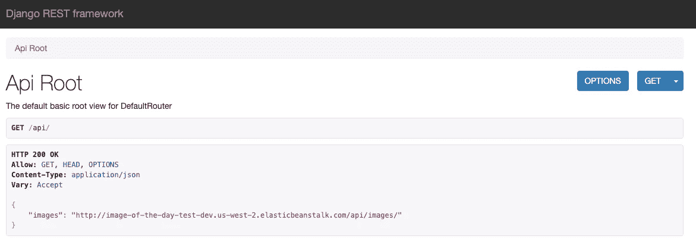
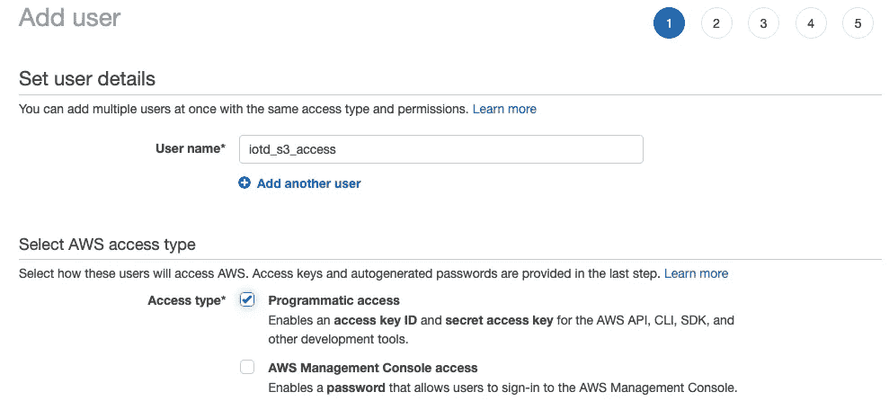
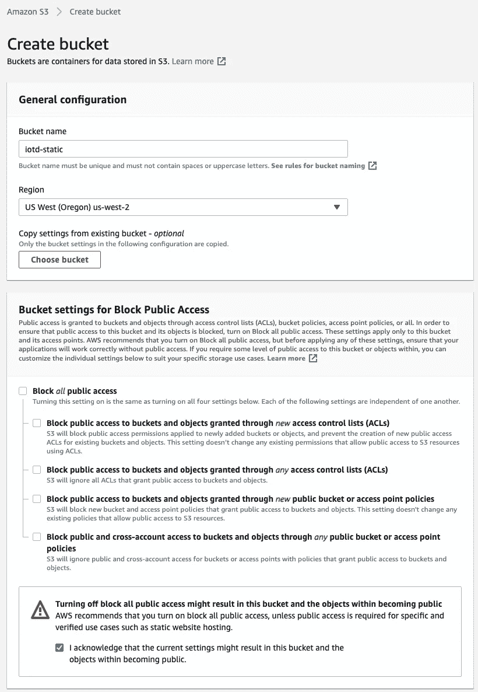
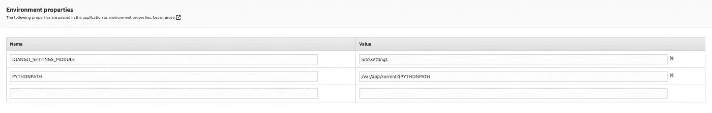
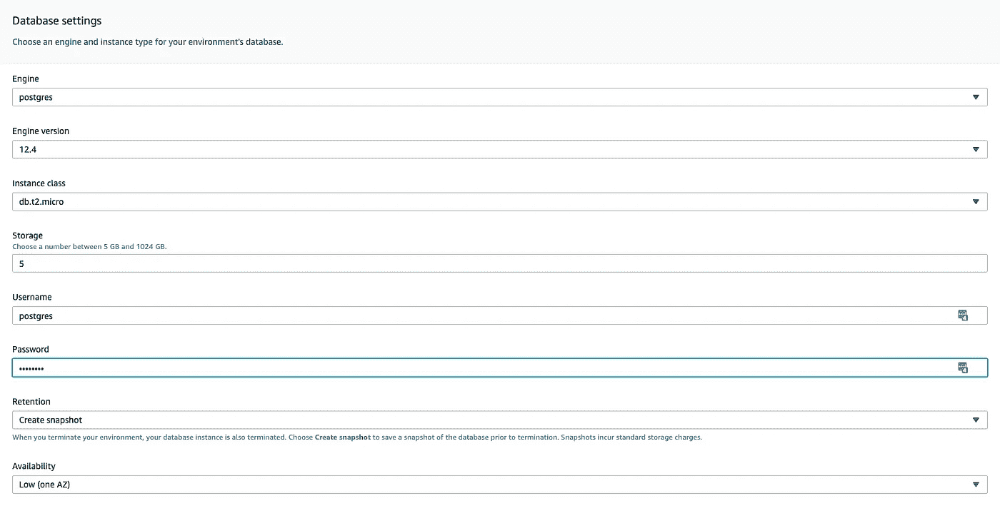

# 使用 Elastic Beanstalk 部署一个生产 Django 应用程序(第 2 部分)

> 原文：<https://betterprogramming.pub/production-django-elastic-beanstalk-part2-4501caf7d8fb>

## 生产静态和媒体设置、环境变量和数据库设置


[乔](https://unsplash.com/@affiliatejoe?utm_source=medium&utm_medium=referral)在 [Unsplash](https://unsplash.com?utm_source=medium&utm_medium=referral) 上拍照

*如果你在登陆这里之前已经阅读了* [*第一部分*](https://medium.com/@zackcpetersen/production-django-elastic-beanstalk-part1-6632c0d4956a) ***，*** *你可能想先回去读一下！如果没有上一篇文章给出的基础，这篇文章的某些部分将无法工作或没有意义。*



# 目录

1.  [**设置 S3 —静态和媒体存储**](#8f6c)— [创建组和用户](#7b79)
    — [创建存储桶](#1c5a)
2.  [**django-storages 和 boto3**](#fa4f)
3.  [**环境变量—控制台 vs CLI**](#2db7)
4.  [**配置您的数据库使用 Beanstalk 的 Postgres**](#8ff7)
    —[创建 Beanstalk 数据库](#ad42)
    — [更新数据库设置](#4ac6)
    — [本地 PostgreS](#1606) QL
5.  [**清理**](#1504)
6.  [**结论**](#955d)

# 设置 S3 —静态和媒体存储

到目前为止，我们已经在 Elastic Beanstalk Amazon Linux 2 上部署了一个正常工作的 Django 应用程序。恭喜你！然而，我们仍然需要设置 S3，以便网站显示风格，我们可以上传图片-这将是很好的，考虑到它是一个每日图片应用程序！

## 创建组和用户

首先:我们需要创建一个具有编程访问权限的 IAM 用户，这样我们的应用程序就可以访问我们接下来要创建的 S3 桶。这里的最佳实践是创建一个附加了适当策略的组，并向该组添加一个新用户。*注意:我强烈建议为应用程序的 S3 访问创建一个新用户。使用管理员用户会带来各种安全风险。*

在 AWS 服务搜索栏中，查找 IAM。导航到 IAM →组→创建新组。将组名设置为类似于“ *S3FullAccess* 的名称，然后进入下一步。在这里，搜索“S3”并选择`AmazonS3FullAccess`。单击下一步，创建该组。

现在，我们将导航到“用户”并添加一个新用户。您可以随意命名用户，我会选择“ *iotd-s3-access* ”并选择“*程序化访问*”



单击权限，将该用户添加到我们创建的组中。点击并创建用户。

创建用户后，您将收到成功通知，并能够保存访问密钥 ID 和秘密访问密钥。*重要提示:如果您不在此处保存这些凭据，您将无法再次看到它们。您必须删除此用户并创建一个新用户才能再次获取凭据。*

下载。csv 文件，并返回到 iotd 项目设置文件。在 iotd/settings.py 的末尾添加两个新设置——我们不打算添加键，而是添加对它们的引用:

```
if 'AWS_ACCESS_KEY_ID' in os.environ:
    AWS_ACCESS_KEY_ID = os.environ['AWS_ACCESS_KEY_ID']
    AWS_SECRET_ACCESS_KEY = os.environ['AWS_SECRET_ACCESS_KEY']
```

在设置文件中提交实际的键是一个危险的想法。如果有人能够访问您的项目代码(GitHub 或其他)，就会造成安全漏洞。我们不是将它们保存在设置文件中，而是将它们作为环境变量添加，并安全地将它们放入设置文件中。[此处单据](https://docs.aws.amazon.com/elasticbeanstalk/latest/dg/create-deploy-python-container.html#create-deploy-python-custom-container-envprop)。

## 创建一个桶

在我们进入环境变量之前，导航到 S3，并创建一个新的 bucket。确保关闭*阻止公共访问*。我们将需要存储在这里的图像是公开的，以在 API 中显示它们，并在以后访问它们。你想给你的桶取什么名字都行。我通常建议启用版本控制，但这是可选的。点击“创建存储桶”,我们就都准备好了。



# django-storages 和 boto3

现在谈谈 Django 的存储设置。在项目目录的根目录下，运行以下命令:

```
pipenv install django-storages
pipenv install boto3
```

这安装了两个库来完成处理 S3 的所有繁重工作。安装好之后，一定要将`'storages'`添加到你的`INSTALLED_APPS`中——可以在 settings.py 中找到

```
INSTALLED_APPS = [
    'django.contrib.admin',
    'django.contrib.auth',
    'django.contrib.contenttypes',
    'django.contrib.sessions',
    'django.contrib.messages',
    'django.contrib.staticfiles', 'rest_framework',

    **'storages',** 'images'
]
```

现在，我们已经拥有了在 S3 上设置静态和媒体存储所需的所有组件。转到 iotd/settings.py 文件，我们将添加一些设置来完成设置。

```
STATIC_URL = '/static/'
STATIC_ROOT = os.path.join(BASE_DIR, "static")### Django storages - use this for production
STATICFILES_STORAGE = 'storages.backends.s3boto3.S3Boto3Storage'MEDIA_URL = '/media/'
MEDIA_ROOT = os.path.join(BASE_DIR, 'media')### Django storages - use in production
DEFAULT_FILE_STORAGE = 'storages.backends.s3boto3.S3Boto3Storage'
```

如果你在本地运行，不想每次都把改变推给 S3，在运行`collectstatic`或上传本地媒体文件之前，注释掉`STATICFILES_STORAGE`和`DEFAULT_FILE_STORAGE`。

# 环境变量—控制台与 CLI

我们需要添加环境变量，以便`os.environ`可以填充我们需要的值。有几种方法可以做到这一点。最直接的方法是导航到你的豆茎→ <你的环境> →配置→软件→环境变量。你可以在这里手动添加它们，但是在我看来，这需要太多的时间。



我更喜欢使用`eb setenv`命令。您可以在一个命令中设置任意数量的环境变量。[此处文档](https://docs.aws.amazon.com/elasticbeanstalk/latest/dg/eb3-setenv.html)。

```
eb setenv \
AWS_S3_REGION_NAME='us-west-2' \
AWS_STORAGE_BUCKET_NAME='iotd-static'
```

如果到目前为止您已经完成了所有工作，那么您将希望通过命令行或控制台添加以下环境变量:

```
AWS_ACCESS_KEY_ID
AWS_SECRET_ACCESS_KEY
AWS_STORAGE_BUCKET_NAME
AWS_S3_REGION_NAME
```

从获取您的访问密钥和秘密访问密钥。你之前下载的 csv。存储桶名称是您命名的 S3 存储桶的名称，区域名称是您的 Beanstalk 环境所在的区域——我的是`us-west-2`。

一旦添加了这些，确保您已经将更改提交给 Git 并运行`eb deploy`。如果有任何问题，首先检查本文前面提到的三个日志文件，以找到错误消息。否则，尝试`eb open`并导航至`/api/`。

既然我们现在有了样式，让我们测试媒体上传。上传一张图片并给它命名，点击发布。当页面重新加载时，单击图像链接，您应该会看到您的图像。请注意，图像 URL 来自您的 S3 桶。

恭喜你！我们现在已经将我们的应用程序部署到 Beanstalk，并设置了生产静态和媒体文件。只剩下一件事要做了。

# 将您的数据库配置为在 Beanstalk 中使用 Postgres

到目前为止，我们的数据库是一个本地 db.sqlite3，它与其他文件一起位于我们的项目目录中。这在开发环境中工作得很好，但是在生产环境中却不是一个好主意。本教程的最后一步是在 beanstalk 中建立一个 Postgresql 数据库，并配置 Django 来做所有与数据库相关的事情。

## 创建一个 Beanstalk 数据库

首先，用`eb console`打开控制台设置并导航至配置。滚动到底部，直到找到“数据库”，然后单击“编辑”应用以下设置:

*   **引擎** : Postgres
*   **引擎版本**:默认
*   **实例类**:我推荐免费层 db.t2.micro
*   **存储**:我推荐 5 GB，但选择有意义的
*   **用户名/密码**:随意设置
*   **保留**:如果希望数据库在环境终止时创建快照，请选择创建快照。否则，选择删除。



完成所有设置后，单击 Apply，Beanstalk 将为您创建数据库。在创建过程中，让我们配置设置以查看新的数据库。

## 更新数据库设置

首先，我们需要安装`psycopg2`:

```
pipenv install pyscopg2-binary
```

将以下内容添加到 settings.py 文件中，并删除默认的`DATABASE`配置:

```
*if* 'RDS_DB_NAME' *in* os.environ:
    DATABASES = {
        'default': {
            'ENGINE': 'django.db.backends.postgresql_psycopg2',
            'NAME': os.environ['RDS_DB_NAME'],
            'USER': os.environ['RDS_USERNAME'],
            'PASSWORD': os.environ['RDS_PASSWORD'],
            'HOST': os.environ['RDS_HOSTNAME'],
            'PORT': os.environ['RDS_PORT'],
        }
    }
*else*:
    DATABASES = {
        'default': {
            'ENGINE': 'django.db.backends.postgresql_psycopg2',
            'NAME': 'iotd',
            'USER': 'iotd',
            'PASSWORD': 'iotd',
            'HOST': 'localhost',
            'PORT': '5432',
        }
    }
```

提交您的更改并再次运行`eb deploy`，这将把您的数据库从 MySQL 交换到 Postgresql！*注意:您在上一步中所做的数据库更改需要一分钟的时间来完成——在完成之前，您将无法部署。*

## 本地 PostgreSQL

如果您已经从本教程开头提到的 repo 中克隆了，那么其中包含了一个 *docker-compose.yml* ，它将作为本地 PostgreSQL 数据库进行开发。确保您已经安装并运行了 Docker，并在项目的根目录下运行以下命令:

```
docker-compose up -d
```

这将使用`iotd.settings.base`中的数据库设置自动启动 PostgreSQL 容器。这将允许您轻松地在本地使用 PostgreSQL！

# 清除

要删除您的 beanstalk 环境，您需要做的就是运行`eb terminate`，aws 将为您清理！

# 结论

惊人的工作！我们在本教程中讨论了很多，并通过 Beanstalk 在 web 上获得了我们的应用程序。很快，我将使用 Vue.js 构建一个前端，并使用这个 API 作为后端——请留意！