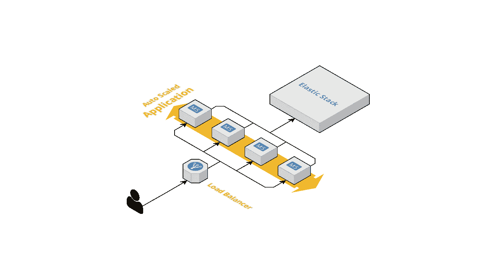

# Rust 应用中的生产级测井

> 原文：<https://betterprogramming.pub/production-grade-logging-in-rust-applications-2c7fffd108a6>

## 强大的应用程序是日志记录良好的应用程序


马丁·比约克在 [Unsplash](https://unsplash.com/s/photos/footstep-sand?utm_source=unsplash&utm_medium=referral&utm_content=creditCopyText) 上的照片

您的应用程序每天为数百名客户提供服务。有一天，一些客户打电话给你，抱怨他们无法继续工作，因为功能被破坏了。然后，您查看数据库，发现来自其他客户的新数据非常好。接下来你会怎么做来解决这个问题？

当您的应用程序被部署到生产环境中时，日志记录是必不可少的。没有记录，你就是盲目飞行。在上面的场景中，下一个合乎逻辑的事情是检查应用程序日志。其中必须记录一些错误，您可以使用这些信息来了解导致问题的原因。

然而，仅仅记录应用程序中发生的事情是不够的。关于记录什么和如何记录，需要考虑一些因素。信息太多或太少都会使日志不可用。

在本文中，我们将了解日志记录的最佳实践，以及如何在 Rust 应用程序中实现它们。

# 典型生产部署

最佳实践因为上下文而成为最佳实践。为了最佳实践是公认的最佳实践而应用它们是不明智的。理解应用程序如何部署以及日志将如何使用的背景很重要。

您的应用程序通常部署在多台机器上，通常是为了实现[高可用性](https://www.digitalocean.com/community/tutorials/what-is-high-availability)。负载平衡器通常放在它们前面，用于将请求分发到应用程序。当应用程序处理一个请求时，它通常会生成日志来告诉服务请求时发生了什么。除此之外，您的应用程序在系统中可能不是孤立的。在同一个系统中还部署了其他应用程序来满足不同的业务需求。其他应用程序也有自己的日志。

来自系统内所有应用程序的日志将被传输到一个集中的日志记录系统，例如[弹性堆栈](https://www.elastic.co/elastic-stack)。集中式日志记录系统有助于高效地读取从多个来源生成的日志。因此，您不需要登录到十个节点中的每一个节点并逐一查看那里的日志，而是登录到一个位置并在那里查找日志。效率更高，对吧？

Elastic Stack 使用的存储是 [Elasticsearch](https://github.com/elastic/elasticsearch) ，一个开源的分布式搜索和分析引擎。这项技术允许您进行全文搜索，这使您能够更快地在日志中搜索特定的内容。



典型的生产部署图，其中日志作为集中式日志记录解决方案导出到弹性堆栈

# 记录最佳实践

现在我们已经了解了我们的应用程序运行的上下文以及如何使用日志，让我们来理解到底需要记录什么来使我们的日志有效。

下面的片段是一个有效日志的例子。在接下来的几节中，我们将解构它，以理解是什么使它有效。

有效日志的一个例子

## 一致且结构化的格式

日志应该具有一致的结构化格式。有一个结构化的格式是有帮助的，因为它将很容易被机器阅读。该机器可以是弹性堆栈或简单的一行 shell 命令。结构化格式的一个用例是，当我们想要按特定字段(如用户 ID)过滤日志时。

结构化日志还需要保持一致。相同的信息应该存储在相同的字段名中。如果我们在一个日志中使用`uid`而在另一个日志中使用`user_id`来存储用户 ID 信息，将会造成混乱。过滤时，我们可能会错过一些日志，因为我们只查看了其中一个字段，而忘记了另一个字段。

## 不要记录敏感信息

日志通常被视为非敏感数据。让日志易于访问以帮助快速解决问题非常重要。对敏感数据的谨慎处理通常是不存在的。敏感信息的一些例子是密码和访问令牌。

## 放更多的上下文

您的应用程序同时服务于多个请求。想象一下查看日志，看到下面几行:

那不会很有帮助，不是吗？你最终会有更多的问题:这是什么时候发生的？哪个请求或用户受此影响？没有上下文，日志将几乎毫无用处。

如果附加到您的日志中，以下是一些有用的上下文:

1.  **时间** 这是一个显而易见的。没有关于时间的信息，您将不会知道记录的事件何时发生。时间信息是必不可少的，因为这使得集中式日志记录系统能够按时间顺序对来自多个源的日志进行排序。除此之外，您可以将时间与日志之外的其他事件关联起来(例如，“哦，在那个时间，我们有一个数据库问题，因此数据库读取失败”)。需要注意的一点是用 RFC3339 格式和 UTC 记录时间，因为这是大多数系统都理解的标准。
2.  **严重性级别**
    该信息可用于根据严重性快速查找日志。常用的级别有信息、警告和错误。对它们的含义没有严格的共识；但是，我将信息用于与业务相关的事件(例如，客户下了订单)，警告不紧急的问题(例如，与外部系统的连接暂时失败)，错误用于紧急的问题(例如，数据库关闭)。使用此信息的一个例子是过滤错误日志，以找到需要立即解决的紧迫问题。
3.  **请求 ID
    也称为*关联 ID* 或*跟踪 ID* 。您的应用程序同时处理多个请求。一个请求可能会产生多个日志。通过在日志中包含这些信息，您可以通过过滤请求 ID 轻松地找到与一个请求相关的所有日志。**
4.  **用户 ID**
    一个常见的日志用例是解决用户投诉。此信息有助于找到用户在系统中执行的所有操作。一旦您发现用户抱怨的特定操作或请求，那么您可以通过请求 ID 进行过滤，并最终查看在该特定请求中发生了什么。
5.  **应用程序实例 ID** 当应用程序被部署到多个节点时，您需要识别应用程序的哪个实例产生了这个日志。该信息可以从应用程序名称、应用程序版本、主机名和进程 ID 的组合中推断出来。在错误配置的节点上运行的应用程序实例可能会抛出许多错误。如果您手头有这些信息，您将能够识别出，嘿，原来所有的错误都来自特定的应用程序实例。您可能会猜测应用程序实例运行的环境有问题，而不是应用程序本身有问题。

# Rust 应用中的日志记录

在上一节中，我们已经学习了通过有效的日志来实现什么。在这一节中，我们将把遵循上述最佳实践的日志记录放到 Rust 应用程序中。我们要修改的应用程序是我为另一篇文章构建的认证模块。我们将在以下情况下写一些日志:

1.  用户成功登录系统
2.  用户无法登录系统
3.  从数据库读取数据失败

## Rust 日志库简介

有很多库可以登录 Rust。然而，我们将使用的是`[tracing](https://docs.rs/tracing/0.1.21/tracing/)`。这个库的文档对理解如何使用它非常有帮助。我鼓励你读一读，因为我不会在这里详述图书馆。

`tracing`库的核心概念是*跨度*、*事件*、以及*订阅者*。跨度代表事件发生的一段时间。一个平移可以嵌套在另一个跨度内。我们可以将数据作为跨度的上下文放入跨度中。与该跨度相关的事件将共享上下文。一个实际的例子是将请求 ID 放在范围的上下文中，并在该范围内产生各种事件。这样，事件可以使用请求 ID 关联在一起，因为它们共享相同的跨度。

每当发生事件或进入或退出跨度时，都会通知订阅者。然后，订阅者可以对这些通知做他们想做的任何事情。显然，主要的用例是将这些通知作为日志写在某个地方。`tracing`图书馆本身没有订户。这是为了让库作者可以使用`tracing`编写日志，同时让库用户决定如何处理日志。不用担心，基本用户可以作为另一个库使用，您只需要导入并使用它。

除了跟踪，我们还将使用这些库:

1.  `[tracing-appender](https://crates.io/crates/tracing-appender)`该库提供了一个进行非阻塞写入的订阅者。将日志写入 stdout 或文件是一个 I/O 操作。如果我们阻塞输入/输出操作，我们的 CPU 将闲置。通过将它作为非阻塞操作，我们的 CPU 可以做其他事情。这将导致更好的应用程序吞吐量。
2.  `[tracing-futures](https://crates.io/crates/tracing-futures)`
    该库提供与异步/等待的兼容性。
3.  `[tracing-subscriber](https://crates.io/crates/tracing-subscriber)`
    该库提供了一些构建订阅者的辅助功能。
4.  `[tracing-actix-web](https://docs.rs/tracing-actix-web/0.2.1/tracing_actix_web/)`
    这个库提供了与 [Actix web](https://github.com/actix/actix-web) 的集成，Actix web 是 Rust 中构建 web 服务器的领先库之一。这个库做的重要事情之一是为每个请求生成一个请求 ID。
5.  `[tracing-bunyan-formatter](https://crates.io/crates/tracing-bunyan-formatter)`
    该库根据[班扬格式](https://github.com/trentm/node-bunyan)将日志格式化为 JSON。`tracing-subscriber`实际上能够将日志格式化为 JSON。但是，我发现 Bunyan 格式更好，在 Elastic Stack 中更容易查询。
6.  `[tracing-log](https://crates.io/crates/tracing-log)`
    `tracing`并不是唯一处理日志记录的库。Rust 有自己的官方日志库，名为`[log](https://docs.rs/log/0.4.11/log/)`。然而，它有一些限制，使得生成我们想要的日志很困难，因此我们不使用它。不过很多库都在用`log`。`tracing-log`允许将来自`log`的日志转发给`tracing`的订户。

## 写日志

现在让我们开始实现。如果你没有读过我上面提到的另一篇文章，为了方便起见，我在这里写了一些重要的结构和特征。

接下来，我们在`AuthServiceImpl`上实施如下测井:

关于记录的重要部分在`login`功能的实现上。我们看到我们添加了`#[instrument(skip(self, credential), fields(username = %credential.username))]`。

1.  创建一个新的 span，将函数名(本例中为“login”)作为 span 名称。
2.  不要将`self`和`credential`参数放入 span 的上下文中。显然，我们不希望`credential`中的密码被记录。
3.  将值为`credential.username`的新字段`username`添加到 span 的上下文中。在这种情况下，我们将使用`username`作为用户 ID。

接下来，我们看到使用了`info!`和`error!`宏。它们所做的是分别产生带有信息和错误严重性级别的事件，并将给定的字符串作为日志消息。因为修饰这个函数的`#[instrument]`产生了一个跨度，这些宏产生的事件将与这个跨度相关。实际上，这意味着事件可以与跨度中的`username`字段相关联。这就是我们不把`username`放在日志消息中的原因。

接下来，我们将日志放入`PostgresCredentialRepo`。我们主要想知道数据库查询何时因某种原因失败。

同样，我们这里也有`#[instrument]`和`error!`。注意我们如何通过使用`{}`并传递任何实现`Display`特征的类型来显示消息中的错误。

最后，我们需要配置订户。如果没有订阅者，日志记录将什么也不做。我们要做的是用 JSON 格式打印到 stdout。我们在`main.rs`中对此进行了配置。

`main`功能从`LogTracer::init()`开始。这来自于`tracing-log`库。这个一行程序基本上将日志从`log`库重定向到`tracing`的订户。

接下来，我们设置订户。这是一个多步骤的过程。

接下来，我们设置`BunyanFormattingLayer`。这张来自`tracing-bunyan-formatter`图书馆。它需要应用程序名称和编写器。对于 app 名称，我们通过结合`Cargo.toml`中定义的包名和包版本来构建。对于编写器，我们使用`tracing_appener::non_blocking`函数设置了一个非阻塞的 stdout 编写器。这个函数来自`tracing-appender`库。

然后通过创建`Registry`(从`tracing-subscriber`库中)来创建订户。我们在这个注册表中注册了多层功能。首先，我们创建一个`EnvFilter`。这一层的目的是过滤掉严重级别低于 INFO 的日志。在下一层，我们添加了刚刚设置好的`JsonStorageLayer`和`bunyan_formatting_layer`。这两层使得日志能够被写成 JSON。

最后，全局默认订户被设置为我们刚刚创建的订户。设置好订阅者后，我们将能够看到日志以 JSON 格式输出到 stdout。

另外很重要的一点是`TracingLogger`的使用。这来自于`tracing-actix-web`。它支持请求 ID 生成和日志记录，以及附带的其他有用的东西。

## 查看运行中的日志

当我们运行应用程序并发送登录请求时，我们会看到以下日志(格式便于人们阅读):

类似地，当我们有目的地关闭 mySQL 数据库并发送登录请求时，我们将获得以下日志:

**提示:**如果您发现上面的日志过于冗长，因为它记录了进入和退出 span 的情况，您可以将 span 严重性级别配置为 DEBUG，如下所示:

```
#[instrument(level = "debug")]
```

因为我们已经配置为过滤掉低于 INFO 的日志，所以不会打印这些日志。

让我们仔细检查这些日志是否符合上述最佳实践:

1.  ✅ **一致的结构化格式**
    我们使用 JSON 并且字段名是一致的。
2.  ✅ **不记录敏感信息**
    我们不记录密码和令牌。
3.  在`time`字段中找到✅ **时间信息**
    。
4.  在`level`字段中发现✅ **严重级别**
    ，尽管它被翻译成数字而不是信息、错误等。
5.  在`request_id`字段中找到的✅ **请求 ID**
    对于每个请求都是唯一的。
6.  在`username`字段中找到✅ **用户 ID** 和
    。在这种情况下，我们使用`username`作为用户标识符。
7.  ✅ **申请 ID**
    是`name`、`hostname`和`pid`的组合。

# 结论

在本文中，我们已经了解了日志的重要性，什么是好的日志，以及如何在 Rust 应用程序中实现它。

日志对于理解生产应用程序中发生的事情和解决问题非常重要。仅仅记录是不够的。日志需要一致、结构化，并填充有用的上下文。没有这些品质，原木几乎毫无用处。Rust 的生态系统在这一领域相当成熟，因为我们有好的、有竞争力的日志库，可以用来实现我们想要的那种日志记录。

希望这篇文章对你有用。你有什么让登录生产更好的小技巧？