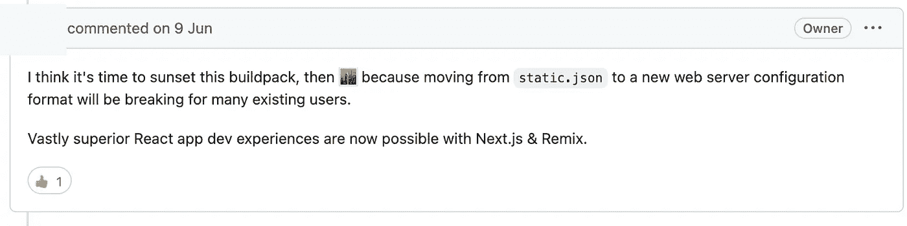
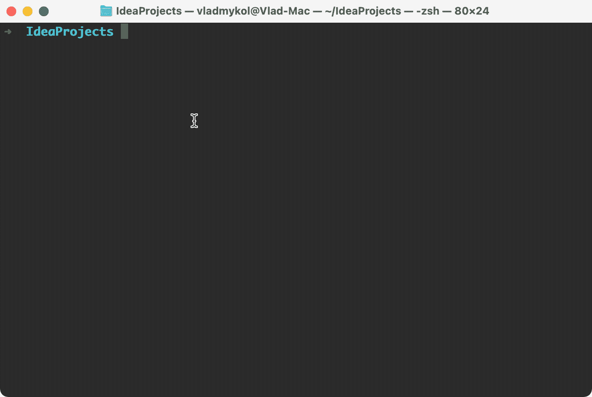
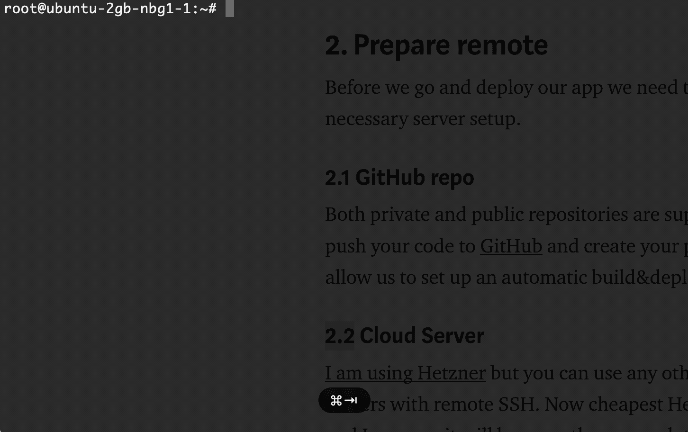
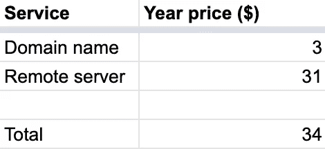

# 使用 Next.js 和 Dokku 进行生产就绪型 React 应用设置

> 原文：<https://betterprogramming.pub/production-ready-react-app-setup-with-next-js-and-dokku-555fb08cb188>

## 这就是我如何用口袋里最少的预算创建并推出一个实时的 React 应用程序


作者创造的形象

在这篇文章中，我将谈论我的网站。到写这个故事的时候，在功能性方面几乎什么都没有。在这之前，我更专注于一个稳定的应用程序框架，但我计划对它进行改进，并在未来的帖子中分享我的经验。

我今天的目标是以最低预算为起点，并选择在未来扩展。此外，我愿意完全控制基础设施，并有权在未来将其用作商业项目，所以我选择了自我托管的解决方案，而不是 SaaS 服务或网站建设者。

# 先决条件

*   基础编程知识
*   至少 34 美元在你的口袋里买一个域名，并激活一个主机
*   Node.js 12.22.0 或更高版本

# 应用程序框架

你可以跳过这一章，克隆我的准系统 [GitHub 库](https://github.com/vladmykol/biolink-clone)，用你的细节修改它，或者继续阅读，看看我是怎么做的。

有时很难开始一个新项目，因为需要大量的初始设置才能让所有的东西都很好地协同工作。为了克服这一点，我决定使用 [create-react-app](https://create-react-app.dev/) ，它将为我的应用程序提供最新的 webpack、Babel、ESLint 和其他惊人的功能。

一天后，当我到达部署部分时，我意识到有一种更现代的方式来引导新的 React 应用程序，而 Create React App 中使用的一些方法已经被否决了。



GitHub 的随机评论

很可能，你可以为你的下一个 React 应用程序使用 [Next JS](https://nextjs.org/docs#setup) 来节省一些时间和跳过那个错误。



使用终端新建下一个 JS 应用程序

# 准备遥控器

在部署我们的应用程序之前，我们需要创建一些帐户，并进行必要的服务器设置。

## GitHub 回购

私有和公共存储库都是支持和免费的，所以把你的代码推送到 [GitHub](https://github.com/) 并创建你的个人[访问令牌](https://docs.github.com/en/authentication/keeping-your-account-and-data-secure/creating-a-personal-access-token#creating-a-token)。这将允许我们稍后建立一个自动构建&部署工作流。

## 云服务器

我正在使用 Hetzner ，但是你可以使用任何其他的云提供商，直到他们有远程 SSH 的服务器。现在最便宜的 Hetzner 服务器花费€4.15 英镑/月，我相信一旦你的流量增加，它将足够启动并快速扩展。

为了让它更便宜，你可以使用我的[推荐链接](https://hetzner.cloud/?ref=Pte4144d9gtB)，只需支付第一年剩余的€30 英镑，而不是€50 英镑。

我们将使用 Dokku 来管理我们的服务器。这里需要一点设置，但它将允许我们在同一台服务器上托管多个 React 应用程序，并且不需要额外的费用，所以值得一试。

[](/host-your-app-in-the-cloud-for-less-than-5-a-month-cba15cdb6cd8) [## 以每月不到 5 美元的价格在云中托管您的应用程序

### 这是一种在云中部署和托管 NodeJs、Python、Java 或 Ruby 应用程序的简单而廉价的方式，几乎不需要任何成本…

better 编程. pub](/host-your-app-in-the-cloud-for-less-than-5-a-month-cba15cdb6cd8) 

要完成 Hetzner/Dokky 的设置，你可以按照我上一篇文章中的步骤找到<your_cloud_server_ip>。</your_cloud_server_ip>

## 新的 Dokku 应用程序

现在我们需要用 SSH 连接到我们的服务器，并创建一个 Dokku 应用程序。

```
ssh root@<your_cloud_server_IP>dokku apps:create <app_name>
dokku proxy:ports-set <app_name> http:80:5000
```

由于 Dokku 会自动识别、安装所有依赖项，并在 [heroku-buildpack](https://github.com/heroku/heroku-buildpack-nodejs) 的帮助下构建我们的应用程序，因此无需更多。

# 域名

我用的是 Namecheap，但是你可以选择任何其他支持自定义 DNS 记录的域名提供商。

> 在您的域名 DNS 记录中，您需要添加[一条记录](https://www.cloudflare.com/learning/dns/dns-records/dns-a-record/#:~:text=What%20is%20a%20DNS%20A,210.9.)指向< your_cloud_server_IP >

找到一个好的域名可能需要几天或几周的时间，但不要在这上面花太多时间或金钱，尤其是如果这是你的试点项目。将来总是有可能改变的。


来自 [Namecheap](https://www.namecheap.com/domains/registration/results/?domain=codonator) 的近似域名价格

截止到写这篇文章的时候，我最喜欢的“[codonator](https://www.namecheap.com/domains/registration/results/?domain=codonator)”**域名一年 1.79 美元起。**

# **释放它**

**我们终于可以发布我们的应用程序，看着 Dokku 施展它的魔法了。**

```
ssh root@<your_cloud_server_IP>dokku git:allow-host github.com
dokku git:auth github.com <username> <github_access_token>
dokku git:sync --build <app_name> <github_repo_link>
```

****

**Dokku 应用程序构建**

**一旦我们的应用程序被部署，我们可以分配一个域名，并通过生成一个免费的 Letsencrypt SSL 证书来启用 HTTPS。**

```
dokku domains:add <app_name> <domain_name>
dokku config:set <app_name> DOKKU_LETSENCRYPT_EMAIL=<your_email>
dokku letsencrypt:enable vladmykol-app
dokku letsencrypt:cron-job --add
```

# **接下来呢？**

**下次我想在我的 React 应用程序中添加一些新功能时，我会将它推送到 GitHub，并运行以下命令来发布它:**

```
ssh root@<your_cloud_server_IP>
dokku git:sync --build <app_name> <github_repo_link>
```

**不再有本地版本和到服务器的 FTP 连接。这是一个漂亮而稳定的类似 prod 的设置。**

**仍然有一些安全特性需要配置。不建议使用 root 帐户。然而，为了简单起见，在我的例子中仍然是这种情况，而不是房间 ssh 和服务器防火墙设置。**

# **最后的想法**

**我使用上述方法来托管五个不同的应用程序，但只支付一个域名和一个远程服务器。这就是 Dokku(码头集装箱化)的魅力所在。**

****

**第一年的估计价格**

**第一次安装需要 34 美元，但是在服务器有足够的容量之前，下一次安装都是零价格。我估计下一个非促销年度的成本在 63 美元左右，这仍然是其他 SaaS 解决方案中最好的价格，我将在 [Hetzner](https://hetzner.cloud/?ref=Pte4144d9gtB) 上推荐这种与 Next.js 和 Dokku 一起托管 React App 的方式。**

**布里尔。如果你读到这里，你确实是一个好奇的读者。现在，拍拍自己的背，下一轮见。**

```
**Want to see a full source code?**Here's my GitHub repo: [https://github.com/vladmykol/biolink-clone](https://github.com/vladmykol/biolink-clone)
```