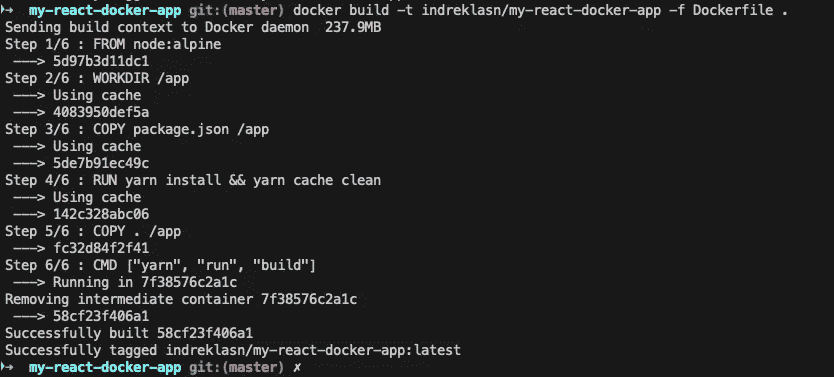
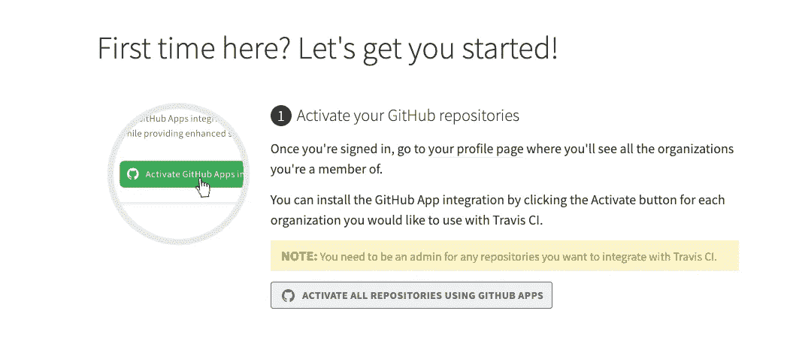
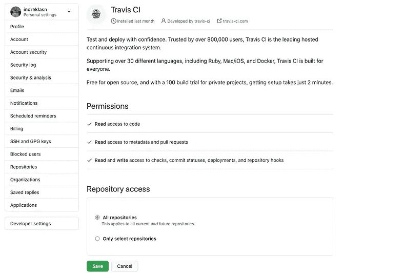
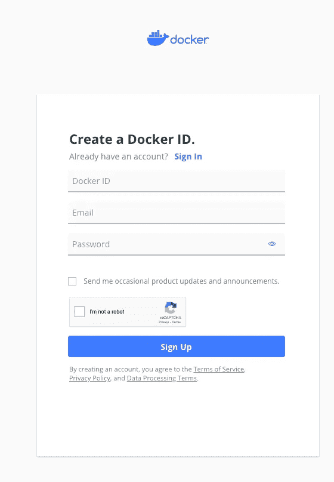
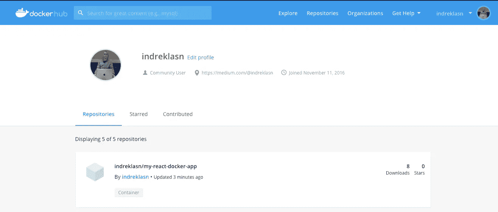
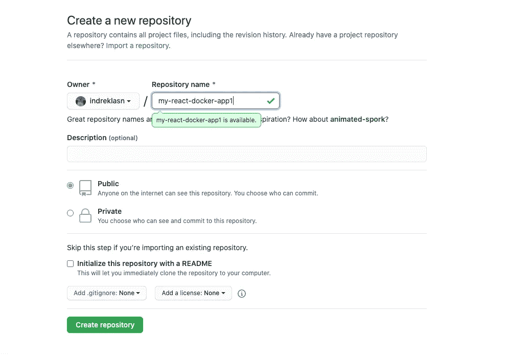
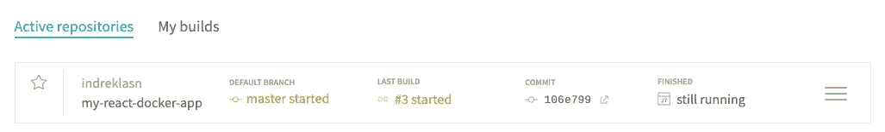
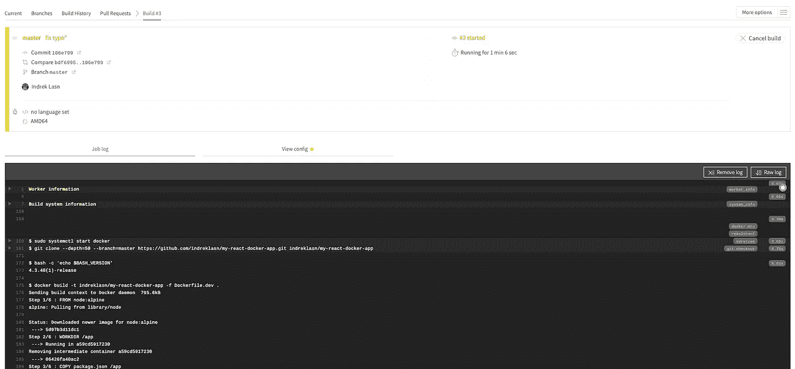
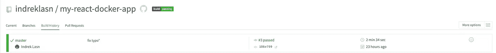

# 与 Docker 和 Travis CI 进行生产就绪型互动

> 原文：<https://betterprogramming.pub/production-ready-react-with-docker-and-travis-ci-8e2ae559f26c>

## 与 React、Docker 和 Travis CI 一起从零到生产英雄


以前，我们在开发阶段通过设置 React 与 Docker 一起工作。但是，当我们已经完成了我们的整洁的应用程序，并希望与世界分享它呢？这篇文章将解释如何做到这一点。

注意:我强烈建议你在阅读本文之前先看看第一部分。前一章解释了许多概念以及 Docker 是如何工作的:“[这里是你如何使用 Docker 和 React”](https://medium.com/better-programming/heres-how-you-can-use-docker-with-create-react-app-3ee3a972b04e)

# 为生产设置 Docker

截至目前，我们有一个`Dockerfile`用于开发，但生产呢？要解决这个问题，我们需要的是另一个 Docker 文件，一个针对生产版本的文件。

## 创建生产文档文件

继续创建一个名为`Dockerfile`的文件，其内容如下:

Docker 文件与开发文件非常相似，不是吗？生产和开发的主要区别是最后一个命令，我们指定运行`build`脚本。

注意:如果`Dockerfile`看起来让你感到困惑，[看看第一章](https://medium.com/better-programming/heres-how-you-can-use-docker-with-create-react-app-3ee3a972b04e)，在那里我们一步一步地检查一个类似的文件。

`build`脚本将生产应用程序构建到`build`文件夹中。它正确地捆绑了生产模式中的 React，并优化了构建以获得最佳性能。

构建被缩小，并且文件名包括散列。如果需要，可以启用类名和函数名来进行分析。更多信息参见[生产制造](https://create-react-app.dev/docs/production-build)部分。

## 测试生产文档文件

在我们将 Docker 映像部署到 Travis CI 之前，让我们确保 Docker 成功构建了生产映像。像这样构建生产 Docker 映像:



建立生产码头形象

如果一切按预期进行，您应该会看到以下消息:

```
Successfully tagged indreklasn/my-react-docker-app:latest
```

不要忘记用你自己的名字替换 docker 图像标签。例如，代替`indreklasn/my-react-docker-app`，你可以做`yourname/my-react-docker-app`或者类似的事情。

# 设置 Travis CI(持续集成)

在我们开始之前，让我们探索一下为什么持续集成是一个好主意。

## 什么是持续集成(CI)？

持续集成是经常合并小的代码变更的实践——而不是在开发周期结束时合并大的变更。目标是通过以较小的增量开发和测试来构建更健康的软件。这就是 Travis CI 的用武之地。

## CI 构建和自动化:构建、测试、部署

当您运行构建时，Travis CI 将您的 GitHub 存储库克隆到一个全新的虚拟环境中，并执行一系列任务来构建和测试您的代码。如果这些任务中的一个或多个失败，那么构建就被认为是 [*中断*](https://docs.travis-ci.com/user/for-beginners/#breaking-the-build) 。如果没有一个任务失败，构建就被认为通过了[](https://docs.travis-ci.com/user/for-beginners/#breaking-the-build)*，Travis CI 可以将您的代码部署到 web 服务器或应用程序主机上。*

*CI 构建还可以自动化交付工作流的其他部分。这意味着您可以让作业与[构建阶段](https://docs.travis-ci.com/user/build-stages/)相互依赖，设置[通知](https://docs.travis-ci.com/user/notifications/)，在构建之后准备[部署](https://docs.travis-ci.com/user/deployment/)以及许多其他任务。*

*我选择 Travis CI 的原因如下:*

*   *它与 Github 配合得很好。*
*   *使用简单，个人免费。*

*前往 Travis CI 官方网站注册。*

****

*https://travis-ci.org/getting_started 崔维斯·CI 入门*

*一旦你点击“使用 Github 应用程序激活所有库”按钮，你应该会看到一个 Github 库列表出现。*

## *正在创建. travis.yml*

*Travis CI 上的构建主要是通过存储在存储库中的文件`.travis.yml`中的构建配置来配置的。这允许您的配置受版本控制且灵活。继续在项目的根目录下创建一个名为`.travis.yml`的文件:*

*在您继续之前，您将需要一个 Dockerhub 帐户！请在继续之前在此处创建一个:*

**

*注册 Dockerhub 账户—【https://hub.docker.com/signup *

*`.travis.yml`文件里面发生的事情:*

*   *特拉维斯使用 Docker 作为我们的环境。*
*   *它构建了开发 Docker 映像。*
*   *接下来，我们运行开发映像中的所有测试。这与在我们的项目中运行`npm run test`是一样的。在我们继续之前，我们要确保所有的测试都通过了。*

## *`npm test`*

*在交互式观察模式下启动测试运行程序。详见[运行测试](https://create-react-app.dev/docs/running-tests)章节。*

*您的应用程序已准备好进行部署！请参阅关于[部署](https://create-react-app.dev/docs/deployment)的部分，了解更多关于将您的应用程序部署到流行的主机提供商的信息。*

*   *一旦测试通过，我们就构建生产 Docker 映像。完成后，我们登录我们的 Docker 帐户，将图像推送到 Dockerhub。如果你感到好奇，[请随意探索我们在这里建立的 Docker 形象](https://hub.docker.com/r/indreklasn/my-react-docker-app)。*

**

*https://hub.docker.com/u/indreklasn*

# *将代码推送到 Github*

*继续创建一个 Github 存储库，并将代码推送到存储库。*

**

*为我们的 React 项目创建 Github 存储库。*

*一旦您将代码推送到 Github，Travis 将自动获取存储库并查看`.travis.yml`文件。*

****

*Travis 构建管道日志*

## *祝贺你——你坚持到了最后！*

**

*成功通过构建*

*如果您遇到任何问题，[请查看 Github 资源库中的任何拼写错误](https://github.com/indreklasn/my-react-docker-app)。*

# *包扎*

*感谢阅读！快乐的编码，并随时拍摄我任何问题。*

*了解我最新内容的最好方式是通过我的[时事通讯](https://wholesomedev.substack.com/welcome)。成为第一个得到通知的人。*

**

*我的[简讯](https://wholesomedev.substack.com/welcome)。成为第一个得到通知的人。*