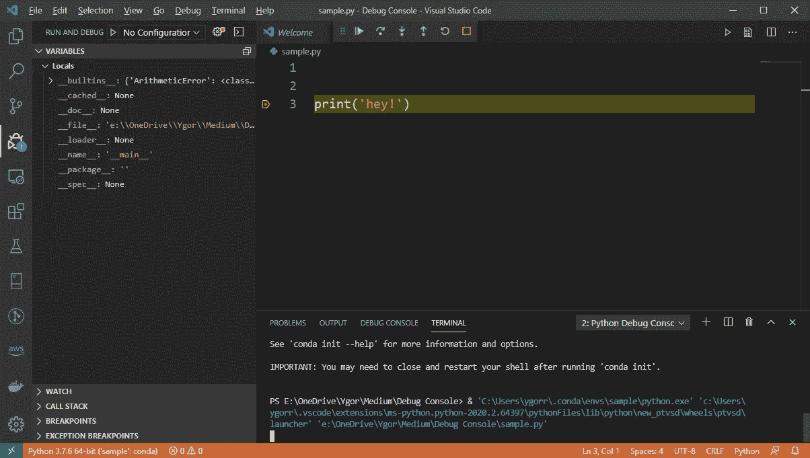
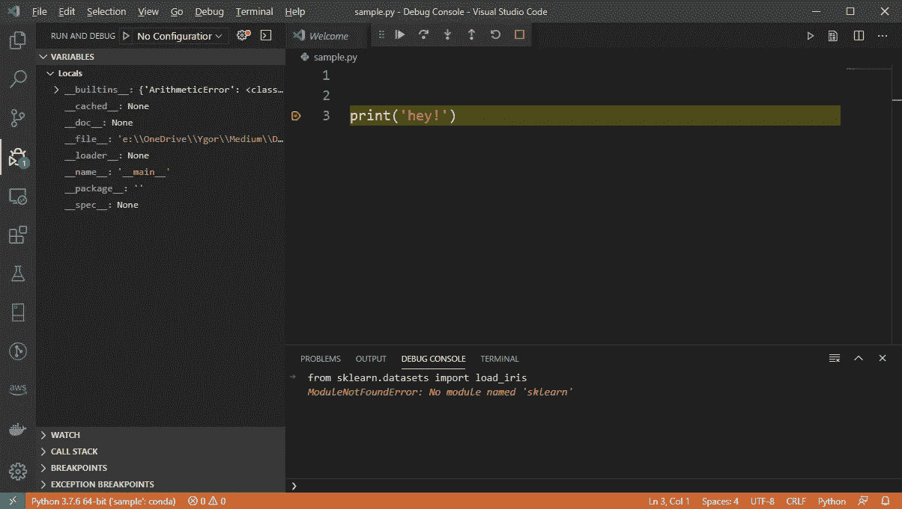
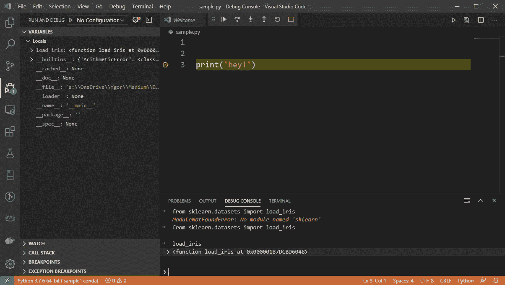
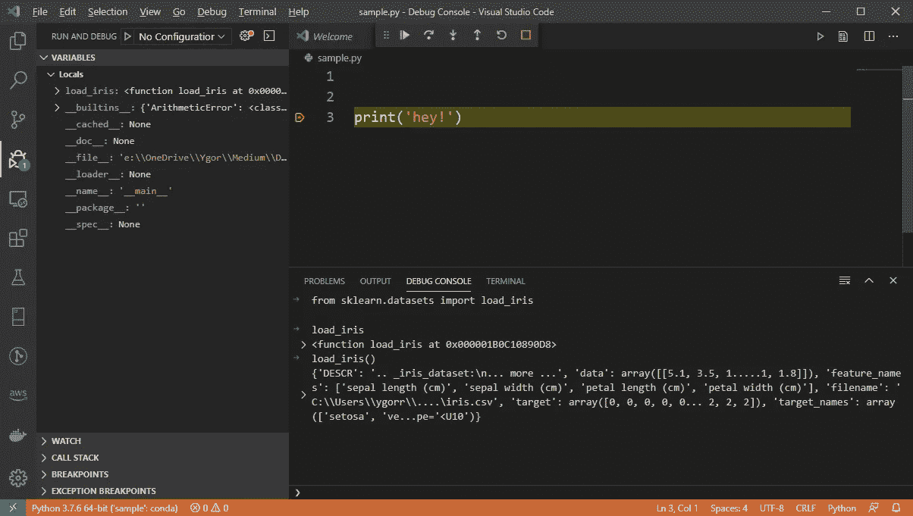
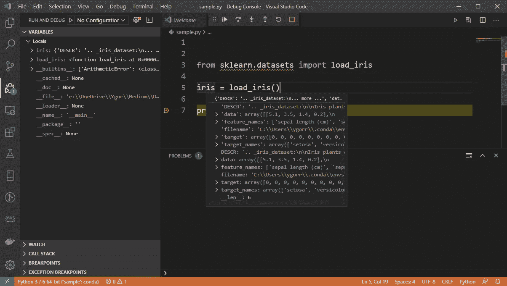
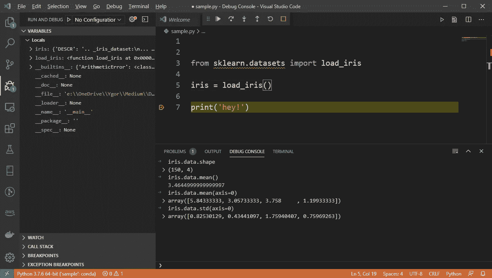
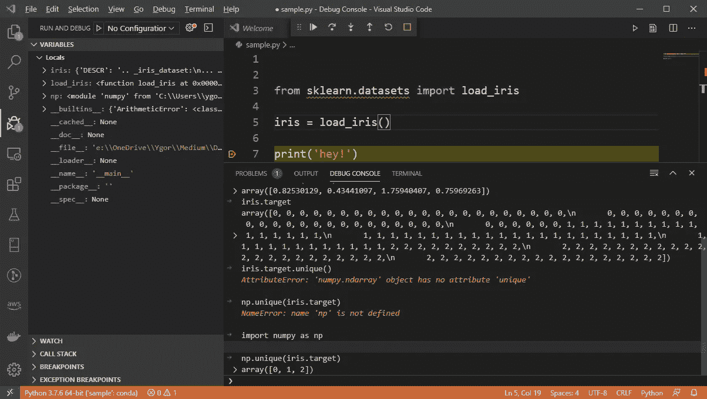

# 掌握控制台+断点组合

> 原文：<https://betterprogramming.pub/productive-programming-mastering-the-debug-console-and-breakpoint-combo-4364902603fc>

## 使用 IDE 的集成控制台和断点完成更多工作


照片由 [Max Duzij](https://unsplash.com/@max_duz?utm_source=medium&utm_medium=referral) 在 [Unsplash](https://unsplash.com?utm_source=medium&utm_medium=referral) 上拍摄

作为程序员，我们每天都必须设法通过大型代码库。我们解决难以跟踪的错误，并实现重要的新功能。当使用弱类型语言(如 Python 和 Javascript)时，不了解对象并记住几个函数是很常见的。难怪有这么多像 [NumPy](https://s3.amazonaws.com/assets.datacamp.com/blog_assets/Numpy_Python_Cheat_Sheet.pdf) 和 [Pandas](http://datacamp-community-prod.s3.amazonaws.com/dbed353d-2757-4617-8206-8767ab379ab3) 这样的小抄，也难怪像 [TypeScript](https://www.typescriptlang.org/) 这样的语言在社区中如此受欢迎。

在实践中，我们经常不得不固定接收`a`和`b`作为参数的函数。它们是什么？找出答案的一个方法是`print(a)`和`print(b)`，看看你会得到什么。幸运的是，这将为您指出可以在堆栈溢出中搜索的内容。如果没有，你可以试试`print(type(a))`，在网上搜索一下。如果这是一个内部库，你最好的办法可能是给一个高级开发人员打电话，希望他们知道它们是什么。在一般情况下，你可能会运行“戳代码”一到十几次，直到你觉得足够舒服可以继续下去。

为了解决这个问题，许多开发人员使用调试控制台和断点组合。这种技术允许您在执行过程中与对象进行交互，从而有助于最大限度地减少“戳代码”所花费的时间。调试控制台是你的游乐场，断点帮助你定义游戏时间。

在本文中，我将使用 Python 和 Visual Studio 代码 IDE 来说明这个概念。然而，如果你使用另一种语言或其他环境，所有概念都同样适用的可能性很高。拥有断点很容易——任何有价值的 IDE 都有断点。至于调试窗口，它们经常出现，但是有很多名字。JetBrain 的人将其称为“表达式求值器”，而 Visual Studio 团队将其称为“即时窗口”。在 Eclipse 中，可以在名称“表达式”下找到它。请注意，这些 ide 跨越了一组广泛且相关的语言。

# 用 Python 做:Iris 数据集练习

我们的任务是获取虹膜数据集，并对其进行一些机器学习。如果你不喜欢机器学习，没问题，这不是关于机器学习的。

假设您有 Visual Studio 代码 IDE、Python 插件和有效的 Python 安装，创建一个简单的`sample.py`文件，编写一个打印语句，为它设置一个断点，然后运行。您应该会看到以下屏幕:



请注意，出现了一个新窗口，其中激活了 Terminal 选项卡。转到调试控制台选项卡并尝试一下——编写`print("hey!")`。如果你切换回终端标签，会有你的“嘿。”

现在，我们谷歌“python get iris dataset”，它显示 Scikit 包中有[函数来加载它。](https://scikit-learn.org/stable/modules/generated/sklearn.datasets.load_iris.html)使用我们的调试控制台，我们可以检查是否有 Scikit 包。尝试运行以下命令:

```
**from** **sklearn.datasets** **import** load_iris
```



在我当前的环境中没有 Scikit 包。让我们谷歌一下。第一个链接[告诉我运行`pip install -U scikit-learn`。以管理员权限打开一个终端窗口，并运行代码片段:](https://scikit-learn.org/stable/install.html)


现在我们不仅有 Scikit-Learn，还有 Joblib、NumPy 和 SciPy。切换回调试窗口—让我们再试一次:



有用！请记住，我没有重新运行任何东西。第二行，我调用`load_iris`看看会弹出什么，它告诉我这是一个函数。*戳代码不用重新运行任何东西。*

咱们跑吧`load_iris()`:



似乎我们现在有了数据集。在这一点上，巩固我们在脚本中所做的是有用的。这样，我们可以更容易地检查我们刚刚下载的数据。



编辑完脚本后，我重新运行了代码。该脚本现在导入`load_iris`函数，调用它，并将结果保存到一个变量中。使用我们 IDE 的检查机制，我们可以查看`iris`对象的内部，看看它包含了什么。作为优秀的数据科学家，我们应该稍微探索一下我们的数据，以便对它有所了解——让我们检查一下这个`data`属性:



无需重新运行任何东西，我们就可以检查数据的形状、平均值、每个特征的平均值、标准偏差(std)等等。现在，让我们来看看`target`属性:



真是一团糟！我尝试直接在一个`NumPy`数组上运行`unique()`。我忘记了这个方法只能通过直接调用`NumPy`来访问。然后，调用它失败了，因为我还没有导入 NumPy。导入后终于可以让这个调用工作了。现在，我看到目标变量只有三个值。

至此，应该清楚这种技术是如何工作的了。这个脚本就像一个记事本，存储所有有效的东西，调试控制台是我们“尝试一切”的地方。脚本会不时地增长，我们会重新运行它来清理我们的全局名称空间。修补是在现场完成的，必要时使用 IDE 检查工具。此外，我们看到这容忍安装包和运行不正确的代码，这大大提高了我们的生产力。

# 断点

到目前为止，亮点是调试控制台。有了它，我们可以在执行过程中运行任何代码，戳中任何我们好奇的东西。另一方面，断点定义了我们何时可以使用控制台。到目前为止，断点仅仅设置在脚本末尾的一个伪 print 语句上。在较大的脚本中，它们是窥视执行流程任何一点的无价工具。

当试图理解别人的代码时，很容易迷失在 Python 一行程序的神奇世界和从未见过的 pip 包的丛林中。使用断点和调试控制台可能是真正了解正在发生的事情的最快方法之一。特别是在使用`NumPy`数组的情况下，可以方便地设置断点来检查数组的形状和统计数据，比如平均值、标准偏差、最小值和最大值。熊猫的数据帧也是如此——运行`head()`和`describe()`命令来跟踪数据帧在执行过程中的变化是很有用的。

# 结束语

使用调试控制台和断点可以显著增加每小时编写的工作代码量。这里已经用 Python 语言和 VS 代码 IDE 展示了这种技术，但是它并不局限于这些工具。我在几种语言中使用过这种思想，比如 C#、Matlab，在某种程度上还有 Prolog。

对于 Jupyter 笔记本用户(及其衍生产品)的特殊情况，使用这种技术似乎是多余的，因为代码块已经提供了一种“想试就试”的空间。然而，这种技术更通用，因为它可以应用于 Jupyter 项目(和 Python 本身)之外。它不仅限于笔记本电脑。把它想象成能够在非笔记本环境中像笔记本一样工作。此外，当从原型转移到产品时，团队通常会从笔记本切换到实际的脚本。在这种情况下，知道如何使用调试控制台可以减轻很多痛苦。