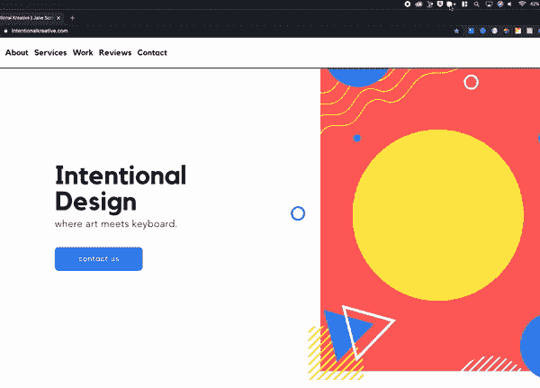
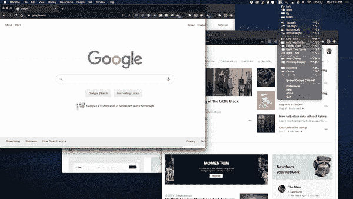
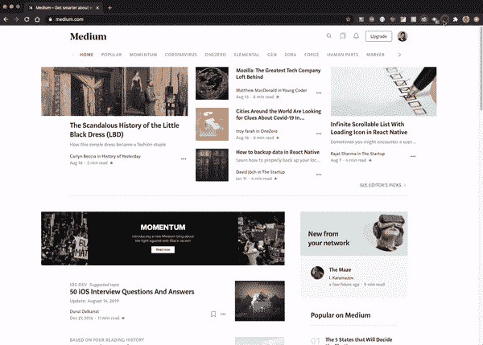
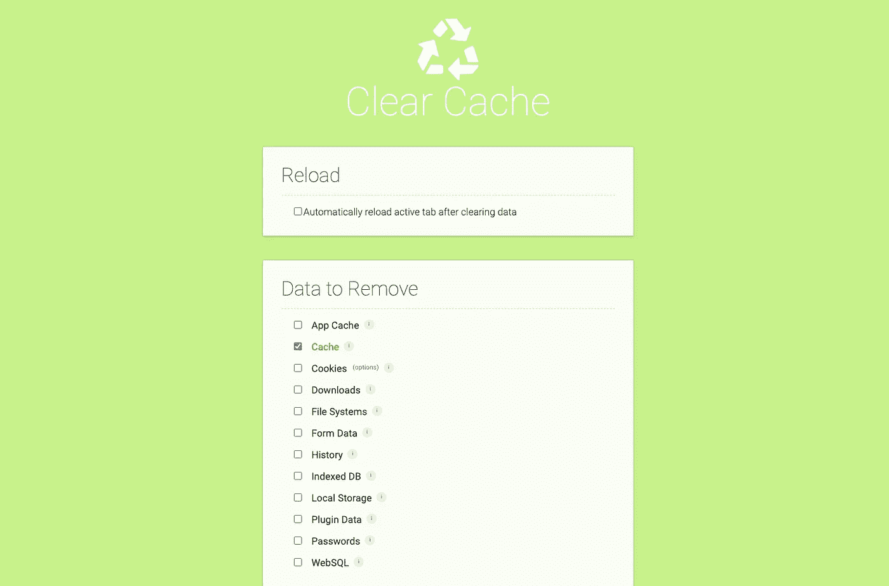
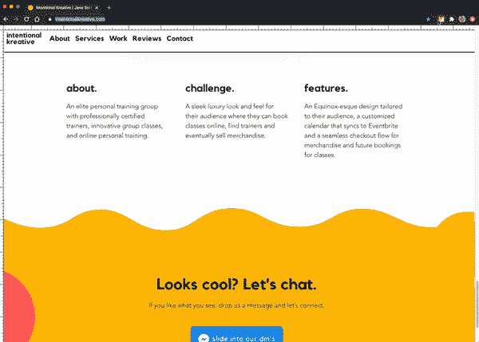
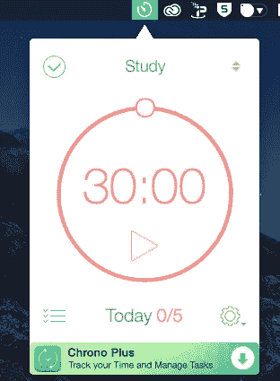
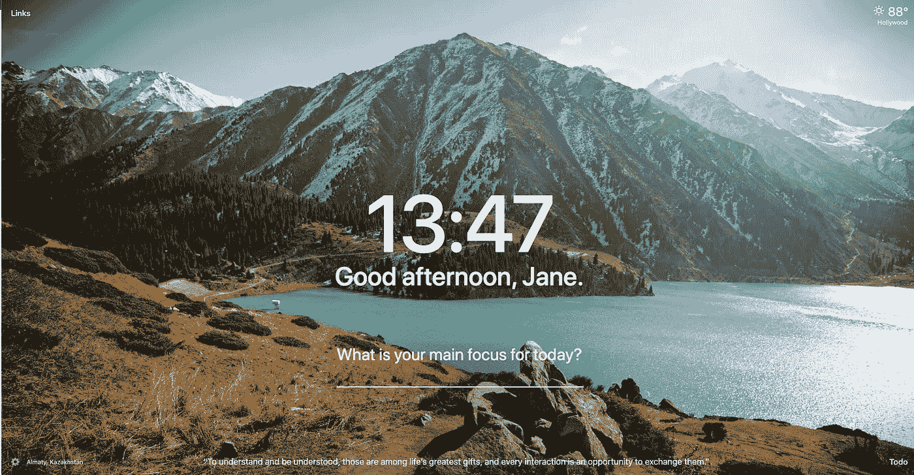
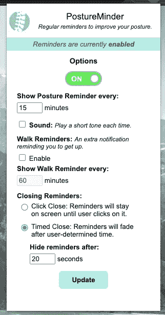

# 您可能不知道的针对设计人员和开发人员的 8 种生产力扩展

> 原文：<https://betterprogramming.pub/productivity-extensions-for-designers-and-developers-you-may-not-know-about-edb121caeb4b>

## 窗口大小调整、颜色采样等等

最佳生产力(作者拍摄)。

从 Chrome 到 Apple App Store，再到 Mac 的扩展，我会一一列出。作为一名设计师和开发人员，我发现下面的工具是我日常工作中必不可少的。我非常注重效率，可以称我为 Flash 2.0。

开始了。

*附言:我没有得到任何推广这些扩展的报酬*

*…尽管那样会很好。*

# 1.啜饮

啜饮在行动🎬

所以看…我要从一个花钱的应用开始，但是我已经使用这个应用很多年了，它每次都出现在离合器*中*。作为开发人员和设计人员，这个工具是必备的。

## **什么**

允许您收集、组织和编辑颜色的颜色选择器。

## **为什么**

*   这东西挺厉害的。它不是你在 Chrome 扩展上得到的一些故障十六进制代码抓取器。它真的可以从任何地方抓取任何颜色，并自动复制十六进制代码(或基于您的配置的任何格式)。
*   它很快。无需从控制台抓取十六进制代码。不需要使用你的不擅长抓取颜色的 Chrome 扩展。
*   很简单。

## 价格

*   免费 15 天。
*   10 美元/台的一次性费用。

 [## 用于 Mac 的 Sip 颜色

### 为设计人员和开发人员设计的现代颜色选择器，允许您收集、组织和编辑颜色。它…

sipapp.io](https://sipapp.io/) 

# 2.磁铁

磁铁在起作用🎬

## 什么

你曾经不得不连续拖动你的屏幕来锁定它的一半或分成三个或四个部分？整理你的工作空间开始变得挑剔了吗？我发现这在苹果电脑上尤其令人恼火。

## **为什么**

*   使用键盘快捷键或应用程序轻松分割屏幕，以提高工作效率。
*   点按或轻按并锁定屏幕面板。

## **价格**

*   2.99 美元(物有所值)
*   或者，还有一个类似的免费版本:[https://rectangleapp.com/](https://rectangleapp.com/)(我没试过)

 [## 磁铁

### 每当您将注意力从一个应用转移到另一个应用、并排比较数据或以任何其他方式进行多任务处理时，您…

apps.apple.com](https://apps.apple.com/us/app/magnet/id441258766?mt=12) 

# 3.一键整页截图

一键点击完整页面🎬

## **什么**

你不只是得到一整页的思考方式。它会自动向下滚动到页面底部，并拍摄整个页面的完整快照。

## 为什么

当你想分享你的整个网站设计时，这是很棒的。又或许，作为一个设计师，你想炫耀一个你喜欢但又不想四张截图就能得到整个网站的网站。

## **价格**

*   自由的

 [## 一键整页截图

### 只需一次点击，即可拍摄整个网站的精彩截图。不报名。超级简单快捷。

chrome.google.com](https://chrome.google.com/webstore/detail/one-click-full-page-scree/dchfhilphcokdhfmikknmgdbmklbnnle/related) 

# 4.清除缓存

清除缓存的设置

## **什么**

只需一次点击即可清除您的缓存和浏览数据。

## 为什么

在 Chrome 的设置中删除了清除缓存的多步过程。您可以轻松地配置要删除的数据，这样当您单击图标时，所有的缓存配置都会被清除。非常适合测试和故障排除。

## **价格**

*   自由的

 [## Chrome 网络商店

### 发现谷歌浏览器的优秀应用、游戏、扩展和主题。

chrome.google.com](https://chrome.google.com/webstore/detail/clear-cache/cppjkneekbjaeellbfkmgnhonkkjfpdn/RK%3D2/RS%3DzwqaryCReNAACSfd_oYYPpX0_tw-) 

# 5.网格标尺

网格标尺在运行🎬

## **什么**

在浏览器上创建垂直和水平网格。

## 为什么

当您检查网页上的项目是否对齐时，这是完美的选择。用你的眼睛很难检查。

## **价格**

*   自由的

 [## 网格标尺

### 创建网格并轻松测量它们的距离。

chrome.google.com](https://chrome.google.com/webstore/detail/grid-ruler/joadogiaiabhmggdifljlpkclnpfncmj?hl=en) 

# 其他值得拥有的东西

免费，免费，免费！

*   专注——发现很难进入工作流程？这是一个计时器，工作原理有点像番茄工作法。实际上我经常用这个。30 分钟的休息时间对你非常有帮助。

集中注意力

*   [Momentum](https://chrome.google.com/webstore/detail/momentum/laookkfknpbbblfpciffpaejjkokdgca?hl=en) —一个个人仪表盘，打开浏览器会让人耳目一新。我喜欢每天阅读励志名言，看到美丽的背景。

动力

*   整天坐在办公桌前让我这些天看起来更像一头骆驼。不可爱。我用这个提醒自己时不时地坐直一点。

姿势看护者

# 结论

你有什么问题吗？让我知道！