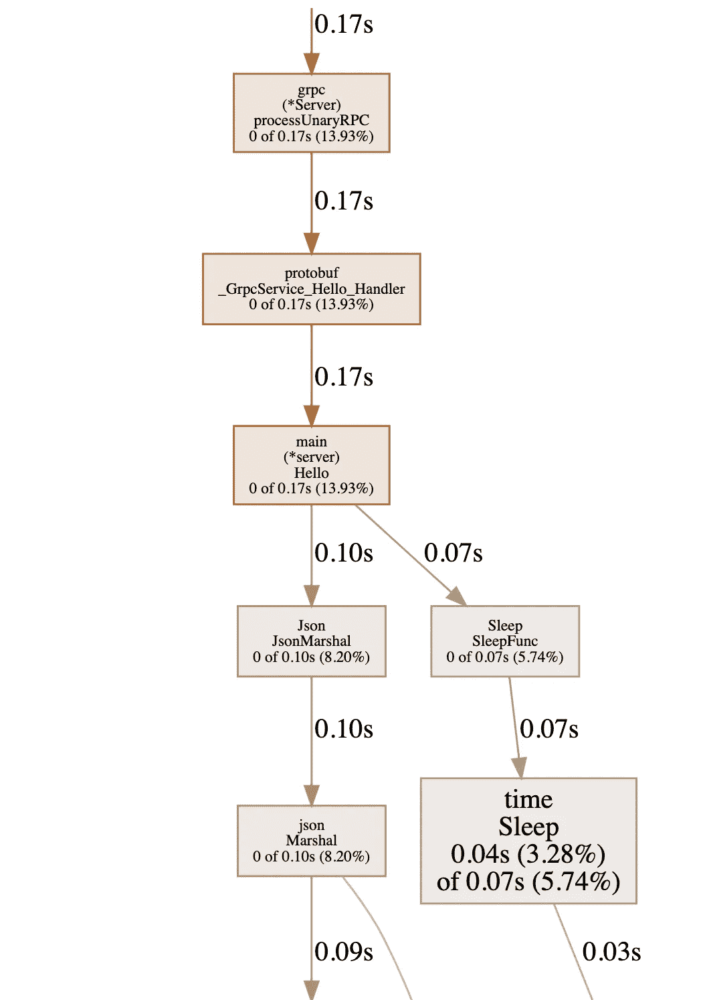
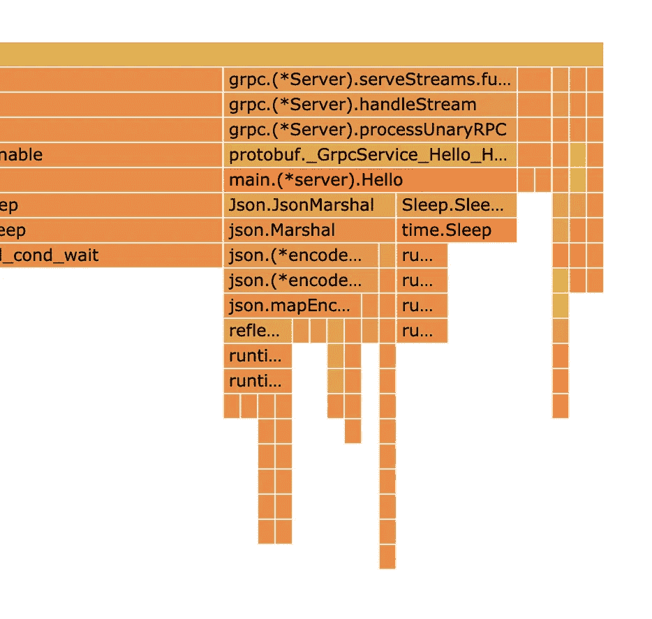

# 如何使用 pprof 分析 Golang gRPC 服务器

> 原文：<https://betterprogramming.pub/profiling-a-golang-grpc-server-using-pprof-b6de1371fdd>

## 找出你哪里快，哪里慢


照片由 [chuttersnap](https://unsplash.com/@chuttersnap?utm_source=unsplash&utm_medium=referral&utm_content=creditCopyText) 在 [Unsplash](https://unsplash.com/search/photos/speedometer?utm_source=unsplash&utm_medium=referral&utm_content=creditCopyText) 上拍摄

以提高服务器性能为目标的概要分析已经成为软件开发的一个重要部分。这篇文章讨论了使用`[pprof](https://golang.org/cmd/pprof/)`工具在 Golang 中分析 gRPC 服务器。如果您之前没有 Golang 或 gRPC 服务器的知识，请在阅读本文之前熟悉它们。

# pprof 是什么？

在深入了解如何使用 pprof 的细节之前，让我们先熟悉一下它。这是他们网站上自己的定义:

> pprof 是一个可视化和分析分析数据的工具。pprof 收集数据以生成报告，该报告可用于可视化和分析数据。它生成文本以及图形报告。

分析这些报告可以帮助您检测代码中运行缓慢的函数。一旦我们知道了系统中耗时的组件，我们就可以优化以提高整体性能。

让我们先看看安装，然后看看代码中需要的更改，然后我们将学习如何生成报告并审计它。

# 装置

为了安装和构建它，我们将使用`go get`工具:

```
go get -u github.com/google/pprof
```

# 代码集成

设置好 gRPC 服务器后，将这些导入添加到 gRPC 服务器的主文件中:

```
import(
    "runtime"
    "net/http"
    _ "net/http/pprof"
)
```

然后启动一个新的 HTTP 服务器和 gRPC 服务器:

```
go func() {
   http.ListenAndServe(":{http_port}", nil)
}()
```

在本例中，我们使用端口 8024。

最后，在 main 函数的顶部添加下面一行代码，以获得 goroutines 阻塞等待同步原语的位置:

```
runtime.SetBlockProfileRate(1)
```

如果要分析 HTTP 服务器，这不是必需的。

就这样，代码集成完成了 1

# 分析服务

启动 gRPC 服务器，使用 gRPC 客户端发出一些请求。gRPC 服务器收到请求后，运行以下命令生成代码报告:

```
go tool pprof [http://localhost:{http_port}/debug/pprof/profile\?seconds\=10](http://localhost:{http_port}/debug/pprof/profile\?seconds\=10)
```

我们用了 10 秒钟的服务器时间。这里的`http_port`是我们启动 HTTP 服务器的端口。在我们的情况下，它将是 8024。一旦该命令完成，一个`.pb.gz` 文件将被创建并且该文件的位置显示在终端上。

默认地点是:`/Users/{username}/pprof/`

生成报告后，您可以使用`pprof`工具在网络浏览器中将其可视化。要启动可视化，请运行以下命令:

```
pprof -http=localhost:{report_port} {server_binary} {file_path}.pb.gz
```

*注意:* `report_port` *必须不同于我们已经在使用的 Http 和* gRPC *服务器端口。*

您现在可以打开浏览器并转到以下 URL:

```
[http://localhost:{report_port}/ui/](http://localhost:{report_port}/ui/)
```

您可以查看各种图表，了解代码的哪些部分占用了更多的处理时间。下面是两种最方便的图表:



这是由示例项目生成的图表。



同一示例项目的火焰图

# 结论

只需几行代码，您就可以获得对服务器的有用分析。快乐优化！

你可以在 [Github](https://github.com/gurasissingh/grpc-pprof) 的这篇文章中找到完整的示例代码。