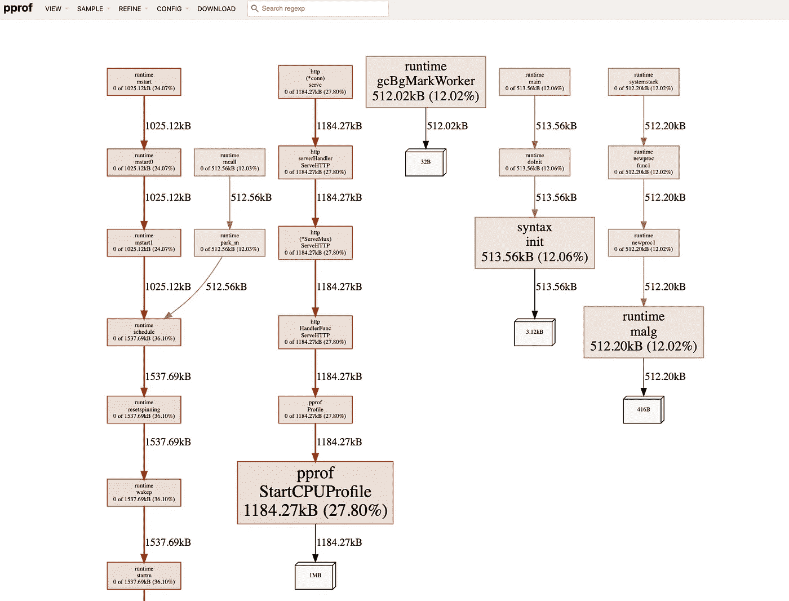

# Go 中的剖析

> 原文：<https://betterprogramming.pub/profiling-in-go-78cf71f81a07>

## 解释应用程序与 CPU 或内存的连接的简要指南


[Kai Dahms](https://unsplash.com/@dilucidus?utm_source=medium&utm_medium=referral) 在 [Unsplash](https://unsplash.com?utm_source=medium&utm_medium=referral) 上的照片

# 什么是剖析，为什么有用？

您是否曾经想深入了解一下为什么您的应用程序会增加内存或 CPU 峰值？虽然监控工具告诉你它正在发生，但你不知道为什么。

这是侧写非常棒的时候。通过性能分析，可以更好地了解应用程序如何与 CPU 或内存交互。它允许更容易地对您的代码行为进行优化。

Go 附带了一个名为 pprof 的原生分析工具。它提供了大量可以分析的组件，比如内存分配(当前和过去)、CPU、goroutines 的堆栈跟踪和各种其他选项。

# 基本设置

pprof 的入门相当简单。在最基本的例子中，它要求您将`net/http/pprof`作为空白标识符导入。这触发了一个`init`功能，该功能将配置 pprof 端点。

**注意**:我们正在使用来自`net/http`的 HTTP 处理程序，这取决于你正在使用的 HTTP 处理程序。配置 pprof 的方式可能会有所不同。

```
package mainimport ( 
 “log” 
 “net/http” 
 _ “net/http/pprof” 
)func main() { 
 log.Println(“booting on localhost:8080”) 
 log.Fatal(http.ListenAndServe(“:8080”, nil)) 
}
```

有了这个基本设置，pprof 将在运行时公开端点，您可以与这些端点进行交互，开始收集应用程序的概要文件。

# Pprof 端点

那么 pprof 向我们公开和提供了什么来进行概要分析，我如何访问它呢？

pprof 终点可在`[http://localhost:8080/debug/pprof](http://localhost:8080/debug/pprof`)`到达。至于哪些端点是可用的，下面列出了每个端点的简短描述:

`/debug/pprof/allocs`:所有过去内存分配的抽样

`/debug/pprof/block`:导致同步原语阻塞的堆栈跟踪

`/debug/pprof/cmdline`:当前程序的命令行调用

`/debug/pprof/goroutine`:堆叠当前所有 goroutines 的踪迹

`/debug/pprof/heap`:活动对象的内存分配抽样。在获取堆样本之前，可以指定`gc GET`参数来运行 GC。

`/debug/pprof/mutex`:竞争互斥体持有者的堆栈跟踪

`/debug/pprof/profile` : CPU 配置文件。您可以在 seconds GET 参数中指定持续时间。获得配置文件后，使用 go tool pprof 命令研究配置文件。

`/debug/pprof/threadcreate`:导致创建新操作系统线程的堆栈跟踪

`/debug/pprof/trace`:当前程序执行的痕迹。您可以在 seconds GET 参数中指定持续时间。获取跟踪文件后，使用 go 工具 trace 命令来调查跟踪。

# 与 pprof 交互

为了与 pprof 交互，我们可以使用下面的命令`go tool pprof`。使用该命令有两种方式。第一种方法是在 CLI 中使用它，第二种方法是通过 web 界面将其可视化。您知道 pprof 将呈现在一段时间内捕获的数据吗？以下命令的默认值是 30 秒。您可以通过将`?seconds=`添加到您的查询中来调整这一点，这将告诉 pprof 在显示结果之前需要多长时间进行分析。

以下是该命令的详细内容:

`go tool pprof [http://localhost:{APP](http://localhost:{APP) PORT}/{pprof endpoint}`

app 端口将是 pprof 运行的端口。在我们的例子中，应该是`8080`。至于 pprof 端点，这是上面列出的您希望分析的任何端点。

命令行交互的完整示例如下:

`go tool pprof -[http://localhost:8080/debug/pprof/](http://localhost:8080/debug/pprof/)heap`

而 web 交互的完整示例如下，只是稍微添加了一个`http`标志:

`go tool pprof --http=:8081 [http://localhost:8080/debug/pprof/](http://localhost:8080/debug/pprof/)heap`

**注意:**这里提供的端口可以是你喜欢的任何东西，只要端口没有被使用。

如果我们要运行下面的命令`go tool pprof — http=:8081 [http://localhost:8080/debug/heap/](http://localhost:8080/debug/heap/`)` ，pprof 将对我们的应用程序内存进行 30 秒的分析。然后它会打开一个看起来像这样的网页:



这里我们有一个应用程序内存使用的分类。盒子越大，总是与其用途相对应，无论这是 CPU、内存等。，所以在这个例子中，我们看到`StartCPUProfile`是用`1185.27kB`消耗内存最多的。

# 最终想法

而使用 Prometheus 和 Grafana 等工具来监控和掌握您的应用程序是很好的(也是必要的)。Pprof 在处理 go 应用程序中可能在您的监控中弹出的任何奇怪的尖峰信号方面进行了扩展。

希望这篇文章能够揭示 pprof 这样的工具在微调或调试 Go 应用程序中的棘手问题时有多么强大。