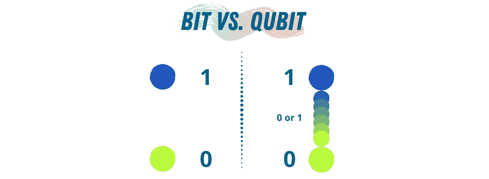
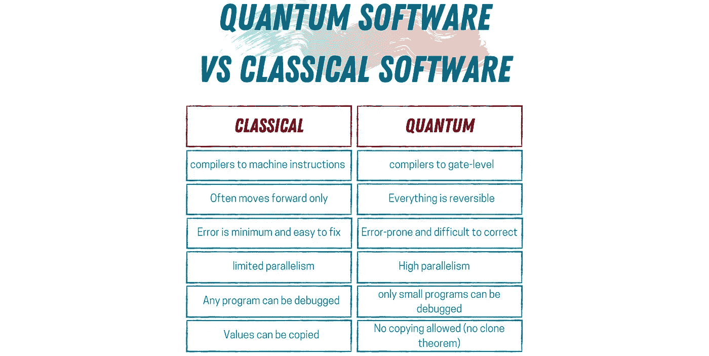
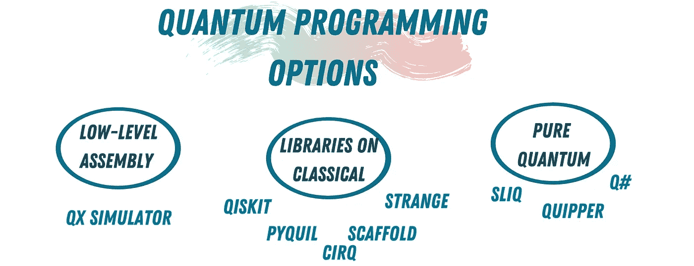
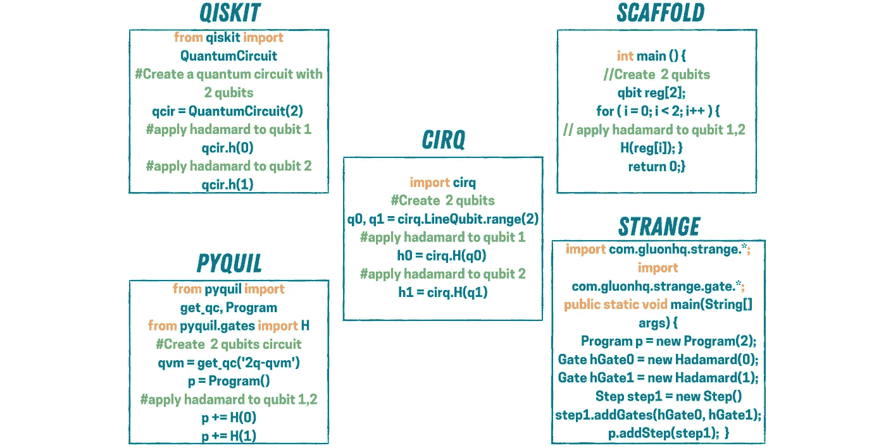
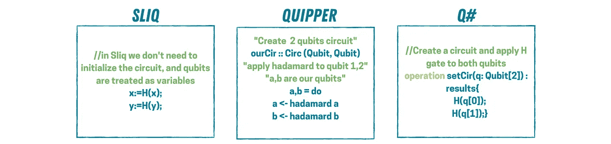

# 今天就给量子计算机编程

> 原文：<https://betterprogramming.pub/program-a-quantum-computer-today-a62de23268f0>

## 你对如何开始使用今天的量子计算机的选择

亨特·哈里特在 [Unsplash](https://unsplash.com?utm_source=medium&utm_medium=referral) 上拍摄的照片。

量子计算是发展最快的技术之一。许多公司和研究实验室都在竞相尽快向市场推出功能性量子硬件。在这一领域，每一点点的进步都是重大的进步。

目前，没有完美的量子计算机能够运行有前途的算法，如肖尔和格罗弗的算法。但是，现在的量子机器进步很快。IBM 推测，在接下来的十年里，量子计算机将通过解决许多在经典计算机上无法解决的问题来提供不可否认的优势。

2019 年，IBM 提出了一个度量标准来衡量量子计算机的能力和效率(在硬件方面)，他们称之为量子体积(QV)。QV 是一个基于不同因素计算的数字，如计算机中量子位的数量，它们的连接性和测量误差概率。为了让我们在真实的硬件上运行真实大小的算法，我们需要一个大的 QV。作为参考，IBM 目前拥有的最高 QV 设备是 32。

在软件方面，一些研究人员预测，未来十年，市场对量子程序员的需求将呈指数增长。谷歌、IBM 和微软等公司正在投入大量精力和资金来培养下一代量子研究人员/程序员。

要给量子计算机编程，你不需要物理学或数学的高等学位。在我看来，你只需要一个好的想象力。

# 经典编程与量子编程

作者照片(使用 [Canva](https://www.canva.com/) 制作)。

量子计算机基于与经典计算机完全不同的范式运行。这里有一个简单的方法来思考这种区别:在经典计算机中，你有 0 和 1。然而，在量子计算机上，你有 0、1 和“可能是 0 或 1”，这也被称为叠加。所有的量子算法都利用“可能”状态来展示量子计算机的全部能力。今天给量子计算机编程有点像 20 世纪 50 年代给经典计算机编程——以一种接近汇编语言的方式，但有更好的语法。

这听起来很有挑战性，因为汇编语言一点也不容易。事实是，如果你知道量子比特和叠加态的含义，你就可以开始给量子计算机编程了。开始编写像样的量子代码并不需要深入物理学。

作者照片(使用 [Canva](https://www.canva.com/) 制作)。

# 量子计算机编程的选择

两家公司和研究实验室都在努力开发一种高级量子编程语言，这种语言不需要程序员非常熟悉量子物理和量子力学。现在，独立的量子编程语言和经典编程语言的量子库比你想象的要多。

所以，你的选择将是要么在量子汇编水平上编程，通过经典编程语言使用量子计算的库，要么使用纯量子编程语言。我将为每个类别列出最知名/最活跃的选项。

作者照片(使用 [Canva](https://www.canva.com/) 制作)。

## 汇编级量子编程

*   QX 模拟器:这个模拟器是用来模拟通用量子计算机的行为。它允许程序员设计和模拟他们的量子算法。使用 QX 模拟器实现一个算法，程序员需要用[量子汇编语言](https://arxiv.org/pdf/1707.03429.pdf) (QASM)描述算法的流程。

## 带有量子库的经典语言

使用经典编程语言编写量子代码有很多选择。我会把它们从最受欢迎到最不受欢迎排序。

*   [Qiskit:](https://qiskit.org/) Qiskit(量子信息科学工具包)是 IBM Research 于 2017 年开发并维护的 Python 库构建。它是最流行和最广泛使用的量子编程库。Qiskit 受欢迎的原因之一是它非常活跃和繁荣的社区。此外，您可以在实际的 IBM quantum 计算机上运行用 Python 编写的代码。
*   [Cirq](https://github.com/quantumlib/Cirq) :这是一个非官方的 Python 库，由谷歌开发者开发，用于在谷歌的量子计算机上编写和运行测试。可以用 Cirq 来编写和模拟量子算法。然而，谷歌不允许任何人在他们的设备上运行代码。
*   [Pyquil](https://github.com/rigetti/pyquil):**一个由 Rigetti 构建的 Python 库，使用一种叫做 [Quil](https://arxiv.org/abs/1608.03355) (也是由 Rigetti 开发)的量子指令语言在 Rigetti 机器上编写和实现量子算法。Quil 在语法上类似于 QASM。**
*   [Scaffold](https://www.cs.princeton.edu/research/techreps/TR-934-12) : 从 Python 开始，Scaffold 是一个 C++库，可以用来在经典机器上编写和运行量子算法。
*   [奇怪](https://github.com/qcjava/strange) : 这是一个用来编写和运行量子算法的 Java API。Strange 是通过传统的 Java 发行渠道发行的，这使得利用 Maven 或 Gradle 很容易使用。

还有更多基于经典编程语言的量子库，但其中许多已经过时，或者在某个时候停止了开发。

## 量子编程语言

为了摆脱经典编程语言，建立独立的量子语言，研究人员已经开发了语法上接近著名经典语言的量子编程语言。这简化了从经典编程到量子编程的过程。这些语言包括:

*   [Q#](https://docs.microsoft.com/en-us/quantum/overview/what-is-qsharp-and-qdk?view=qsharp-preview) :这是微软开发的一种量子编程语言，用来编写和执行量子代码。它是微软量子开发工具包(QDK)的一部分。QDK 包括一个独立的模拟器和电路优化器。
*   [Quipper](https://www.mathstat.dal.ca/~selinger/quipper/) : 这是一种嵌入式量子编程语言，支持函数式量子编程，允许程序员在比汇编语言更高的层次上描述他们的算法。Quipper 还包括来自当前理论研究的七个实现的量子算法。
*   Sliq :这是最新的量子编程语言，今年早些时候发布，由苏黎世联邦理工学院的研究人员开发。Sliq 提供了量子算法的高级表示，语法类似于 Python 和 C++。

# 如何开始

有这么多的选择，当你试图选择从哪里开始你的量子之旅时，你可能会不知所措。我的建议是:从一个构建在你熟悉的经典编程语言上的库开始。一旦你熟悉了量子逻辑和思维方法，就转向纯粹的量子编程语言。

如果我想更深入地研究量子计算机如何工作以及门之间的动力学，我只会考虑使用低级语言(例如 QX 模拟器)。

我从 Qiskit 开始，现在仍在广泛使用它——不仅因为它是用 Python 编写的，还因为我可以在真正的量子计算机上运行我的代码。是的，现在的结果很糟糕，但你实际上可以在量子计算机上运行代码，这仍然是一个有趣的事实。

为了使事情变得简单一点，让我们使用上面提到的所有九种方法来实现相同的量子代码。您可以检查电路实现的不同方式，并决定从哪种方式开始看起来更有趣。

在现在大多数量子编程中，你使用量子门建立一个应用你的算法的电路，量子门相当于经典门。让我们尝试实现一个量子电路，在两个量子位之间产生叠加。要做到这一点，你需要知道魔法门——创造叠加的那个。它被称为*哈达玛门。*你给它 0 或 1，它返回 0 和 1 的等量叠加。

1.  使用 QX 模拟器:

作者照片(使用 [Canva](https://www.canva.com/) 制作)。

2.在经典编程语言上使用库:

作者照片(使用 [Canva](https://www.canva.com/) 制作)。

3.使用纯量子编程语言:

作者照片(使用 [Canva](https://www.canva.com/) 制作)。

# 结论

我喜欢学习和探索新事物，但我也知道，当我们一次专注于学习一件事情时，我们会表现得更好。

这就是为什么我建议你从基于经典编程语言的量子库开始。这样做，你只是专注于习惯量子思维方式，而不是学习如何使用特定的编程语言。一旦你熟悉了量子逻辑，继续学习量子编程语言。一旦你适应了这一点，并想进一步拓展你的知识面，那就下去探索 QASM 吧。

# 参考

1.  A.用随机模型电路验证量子计算机。
2.  理查德·韦克塞尔布拉特，编辑。编程语言的历史。学术出版社，2014。