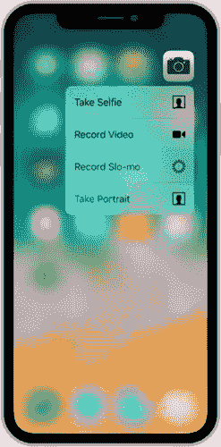
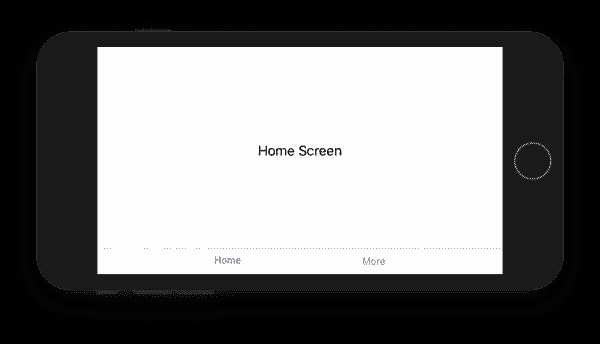
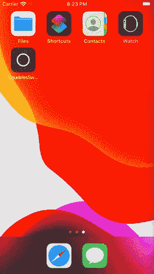

# SwiftUI 中的程序化深度链接导航

> 原文：<https://betterprogramming.pub/programmatic-navigation-in-swiftui-project-81200f35150>

## 深层链接、通知、快速操作、快捷方式等


由[亚历克斯·金](https://unsplash.com/@stagfoo?utm_source=medium&utm_medium=referral)在 [Unsplash](https://unsplash.com?utm_source=medium&utm_medium=referral) 上拍摄的照片

在这个竞争激烈的市场中，开发人员尽最大努力在他们的移动应用程序中实现引人注目的用户体验。这不仅包括在其应用程序中构建令人惊叹的功能，还包括与 iOS 系统的原生集成。

在这些集成中，有一些技术允许启动带有指令的应用程序，以显示特定的应用程序页面，而不是默认的登录屏幕:



[主屏幕快速操作](https://developer.apple.com/design/human-interface-guidelines/ios/extensions/home-screen-actions/)

*   使用[通用链接](https://developer.apple.com/ios/universal-links/)或[自定义 URL 方案](https://developer.apple.com/documentation/uikit/inter-process_communication/allowing_apps_and_websites_to_link_to_your_content/defining_a_custom_url_scheme_for_your_app)进行深度链接
*   本地和远程[通知](https://developer.apple.com/documentation/usernotifications/)
*   [Siri 快捷键](https://developer.apple.com/design/human-interface-guidelines/sirikit/overview/siri-shortcuts/)
*   [聚光灯搜索](https://developer.apple.com/ios/search/)
*   [主屏幕快速操作](https://developer.apple.com/design/human-interface-guidelines/ios/extensions/home-screen-actions/)
*   [换手](https://developer.apple.com/handoff/)

虽然您可以很容易地找到这些特性的教程，但是有一个主题我还没有考虑到:

> *按照深度链接说明，我们如何以编程方式导航到 SwiftUI 应用程序中的自定义内容屏幕？*

在 UIKit 中有很多方法可以实现这一点(大多数都很难看)，但是 SwiftUI 引入了一个全新的范例，用它自己的方式来构建屏幕导航的 UI。

SwiftUI 应用程序中`AppDelegate`的功能继承者是`SceneDelegate`，它继承了为应用程序提供导航指令的两种方法:

```
func scene(_ scene: UIScene, continue userActivity: NSUserActivity)func scene(_ scene: UIScene, openURLContexts URLContexts: Set<UIOpenURLContext>)
```

这里的挑战是将这个指令转发到 SwiftUI 的视图层次结构，以显示正确的内容。

默认情况下，我们拥有的是在`scene(_:, willConnectTo:, options:)`中创建的`ContentView`，无法访问底层视图。

我们切换显示内容的唯一方法是改变视图的状态。

`View`可以绑定到两种不同类型的状态:

*   本地`@State`变量
*   在外部`ObservableObject`上定义的变量(有或没有`@Published`属性)

让我们以一个`TabView`(替代`UITabBarController`)作为实验对象，构建一个简单的 app，看起来像这样:



切换选项卡的视图状态绑定可以使用`@State`构建:

…并使用`ObservableObject`:

当我们在带有属性`@State`、`@ObservedObject`或`@EnvironmentObject`的变量名前键入`$`时，我们检索到一个类型为`Binding`的特殊实体。

`Binding`是可以传递的访问令牌，用于提供对值的直接读写访问，而无需授予所有权(就保留引用类型而言)或复制(就值类型而言)。

当用户选择`TabView`中的一个选项卡时，它通过`Binding`单方面改变值，并将关联的`.tag(...)`赋给`selectedTab`变量。这对于`@State`和`ObservableObject`都是一样的

程序员也可以随时给那个`selectedTab`变量赋值——而`TabView`会立即切换显示的选项卡。

这是 SwiftUI 中程序化导航的关键。

每个切换显示层次的视图，无论是`TabView`、`NavigationView`还是`.sheet()`，现在都使用`Binding`来控制显示的内容。

因此，如果我们能够访问`SceneDelegate`中的`Binding`(或实际的底层状态)，我们将能够告诉 SwiftUI 视图显示我们想要的屏幕，而不是默认的屏幕。

解决这个问题有两种方法。

# 1.将导航变量存储在集中式 AppState 中

第一种方法意味着创建一个共享的应用程序状态，通过根视图上的`.environmentObject(...)`方法注入到视图层次结构中:

# 2.通过外部发布者广播导航参数

第二种方法是使用 Combine 的`Publisher`来传递导航状态更新:

这实际上取决于您使用哪种方法，但是存在概念上的差异。

第一种方法确保所选择的导航参数保持被选择，即使内容视图还不能选择它。沿途的一些视图可能会显示一个加载指示器，但是一旦它完成并显示最终的子视图层次结构，其中一个子视图最终会选择导航参数并相应地进行操作。

这在第二种方法中根本行不通，除非您将`PassthroughSubject`改为`CurrentValueSubject`以始终保持导航状态。但是在这种情况下，一旦导航完成，您需要手动重置该值。

对于第一种方法，您不需要重置导航状态，因为保存导航参数的应用状态是整个程序的唯一来源，当用户继续在应用中导航时，SwiftUI 将更新这些值。

# 通过多个视图导航

使用上述方法之一，您可以通过编程导航到任意深度的屏幕。

唯一的要求是:对于每一个“可导航的”视图，沿着到深层链接的目标视图的路径，您需要在 AppState 或广播的消息中分配一个单独的导航参数。

然后，在`scene(_ scene, openURLContexts:)`中，你需要一次切换所有的导航参数，SwiftUI 视图层次结构将一步转移到目标屏幕。

# `List`不支持程序化导航

当我在[示例项目](https://github.com/nalexn/clean-architecture-swiftui)中实现深层链接时，我发现了一个通过`List`编程导航的隐藏陷阱

考虑这个简单的设置:

该应用程序只显示 100 个文本项目的列表。让我们假设，我们实现了一个深度链接，为带有指定的`id`的条目打开`ItemDetailsView`。我们用 URL 试试，如下所示:

```
https://www.100items.com/details?id=5
```

..这很有效。该应用程序启动并解析 URL 以将`5`分配给`appState.selectedItemId`，并立即显示在`List`顶部推送的`ItemDetailsView`。

到目前为止一切顺利。但是一旦你尝试了另一个`id`，比如说`75`:

```
[https://www.100items.com/details?id=75](https://www.100items.com/details?id=75)
```

代码以同样的方式工作，但是`List` **没有**推动`ItemDetailsView`。

这是怎么回事？我们知道 id 为 75 的项目存在于列表中，但出于某种原因，详细信息屏幕没有被推送。

结果是，我们推送到**的列表项必须在`List`中可见**，这样程序导航才能工作。

一旦您滚动列表使目标项目可见，您将看到一个不吸引人的效果:滚动突然停止，详细信息视图在导航堆栈上没有动画地出现:



Github[上 SwiftUI 的干净架构](https://github.com/nalexn/clean-architecture-swiftui)

`List`的优化方式与`UITableView`相同，因此它跟踪显示的项目，而**根据需要缓慢地加载内容。**

因此，`List`不知道带有`id=75`的条目，所以它什么也不做，直到它知道它实际上在数组中。

如果我们可以访问`List`的滚动偏移量来调整它以适应这种边缘情况，这个 bug 就可以被修复，但是我们不能:没有 API 来改变`List`的偏移量。

我现在看到的这个问题的修补程序是将目标项目移动到数组中的第一个位置，这样`List`就可以正确地拾取`NavigationLink`。或者我们可以简单地不依赖`List`中的程序导航

支持深层链接的示例项目可以在 Github 上找到:

 [## nalexn/clean-architecture-swift ui

### 一个展示 SwiftUI 应用程序的干净架构设置的演示项目。该应用程序使用 restcountries.eu REST…

github.com](https://github.com/nalexn/clean-architecture-swiftui) 

它最初是为了说明文章[swift ui 的干净架构](https://medium.com/swlh/clean-architecture-for-swiftui-6d6c4eb1cf6a)而创建的，我建议您也去看看:

在 Twitter 上关注我，关注即将发布的帖子！

```
**Want to Stay Updated With My Latest Articles?**Here’s the [RSS](https://nalexn.github.io/feed.xml) feed of my blog.
```